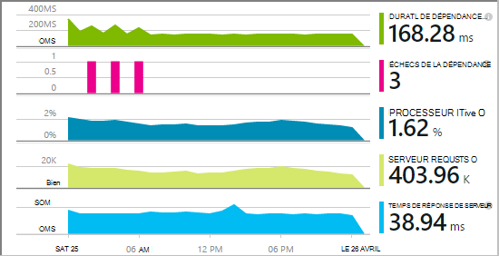

<properties 
    pageTitle="Dépendance de suivi dans les perspectives de l’Application" 
    description="Analyser l’utilisation, la disponibilité et les performances de vos locaux ou une application web de Microsoft Azure avec aperçus de l’Application." 
    services="application-insights" 
    documentationCenter=".net"
    authors="alancameronwills" 
    manager="douge"/>

<tags 
    ms.service="application-insights" 
    ms.workload="tbd" 
    ms.tgt_pltfrm="ibiza" 
    ms.devlang="na" 
    ms.topic="article" 
    ms.date="10/24/2016" 
    ms.author="awills"/>


# <a name="set-up-application-insights-dependency-tracking"></a>Définir des perspectives d’Application : suivi de dépendance


[AZURE.INCLUDE [app-insights-selector-get-started-dotnet](../../includes/app-insights-selector-get-started-dotnet.md)]


Une *dépendance* est un composant externe qui est appelé par votre application. Il s’agit d’un service appelé à l’aide de HTTP, ou une base de données ou un système de fichiers. Dans les perspectives d’Application Visual Studio, vous pouvez voir facilement la durée d’attente pour les dépendances de votre application et de la fréquence à laquelle un appel de dépendance échoue.



Le moniteur de l’emploi de dépendance signale actuellement les appels à ces types de dépendances :

* ASP.NET
 * Bases de données SQL
 * ASP.NET web et les services WCF qui utilisent des liaisons de basés sur HTTP
 * Appels HTTP locales ou distants
 * DocumentDb, table, stockage blob Azure et file d’attente
* Java
 * Appels à une base de données via un pilote [JDBC](http://docs.oracle.com/javase/7/docs/technotes/guides/jdbc/) , telles que SQL Server, MySQL, PostgreSQL ou de SQLite.
* JavaScript dans les pages web - la [web page Kit de développement logiciel](app-insights-javascript.md) enregistre automatiquement les appels Ajax en tant que dépendances.

Vous pouvez écrire vos propres appels SDK pour surveiller d’autres dépendances à l’aide de l' [API de TrackDependency](app-insights-api-custom-events-metrics.md#track-dependency).


## <a name="to-set-up-dependency-monitoring"></a>Pour configurer l’analyse de dépendance

Vous avez besoin d’un abonnement [Microsoft Azure](http://azure.com) .

### <a name="if-your-app-runs-on-your-iis-server"></a>Si votre application s’exécute sur votre serveur IIS

Si votre application web s’exécute sur .NET 4.6 ou version ultérieure, vous pouvez soit [installer le SDK de perspectives d’Application](app-insights-asp-net.md) dans votre application, ou installer le moniteur d’état Application perspectives. Vous n’avez pas besoin à la fois.

Dans le cas contraire, installer le moniteur d’état Application perspectives sur le serveur :

1. Sur votre serveur web IIS, ouverture de session en tant qu’administrateur.
2. Téléchargez et exécutez [programme d’installation de l’Analyseur de l’état](http://go.microsoft.com/fwlink/?LinkId=506648).
4. Dans l’Assistant d’installation, vous connecter à Microsoft Azure.

    

    *Erreurs de connexion ? Consultez [résolution des problèmes](#troubleshooting).*

5. Choisissez l’application web installés ou un site Web que vous souhaitez surveiller, puis configurez la ressource dans laquelle vous souhaitez afficher les résultats dans le portail de perspectives de l’Application.

    

    En règle générale, vous choisissez de configurer une nouvelle ressource et le [groupe de ressources][roles].

    Sinon, utilisez une ressource existante si vous déjà configuré des [tests web] [ availability] pour votre site, ou la [Surveillance du client web][client].

6. Redémarrer les services IIS.

    

    Votre service web est interrompu pendant un court moment.

6. Notez que ApplicationInsights.config a été inséré dans les applications web que vous souhaitez surveiller.

    

   Il existe également quelques modifications au fichier web.config.

#### <a name="want-to-reconfigure-later"></a>Vous souhaitez configurer ultérieurement (re) ?

Après avoir terminé l’Assistant, vous pouvez reconfigurer l’agent chaque fois que vous le souhaitez. Vous pouvez également utiliser si vous avez installé l’agent, mais il y a des difficultés avec la configuration initiale.


### <a name="if-your-app-runs-as-an-azure-web-app"></a>Si votre application s’exécute comme une application Web de Azure

Dans le panneau de configuration de votre application Web de Azure, ajouter l’extension des perspectives de l’Application.


### <a name="if-its-an-azure-cloud-services-project"></a>S’il s’agit d’un projet de services cloud Azure

[Ajouter des scripts à des rôles web et worker](app-insights-cloudservices.md#dependencies). Ou [installez le .NET framework version 4.6 ou ultérieure](../cloud-services/cloud-services-dotnet-install-dotnet.md).

## <a name="diagnosis"></a>Diagnostic des problèmes de performances de dépendance

Pour évaluer les performances des requêtes sur votre serveur, ouvrez la carte de Performance et faites défiler jusqu'à un coup de œil à la grille de demandes :


Celui supérieur est très longue. Voyons si nous pouvons savoir où le temps est passé.

Cliquez sur cette ligne pour afficher les événements de demande individuelle :


Cliquez sur n’importe quelle instance de longue pour l’inspecter plus.

Faites défiler vers le bas pour les appels distants de dépendance liées à cette demande :


Il ressemble à la plupart de la maintenance de temps que cette demande a été consacrée à un appel à un service local. 


Sélectionnez cette ligne pour obtenir plus d’informations :


Le détail comprend des informations suffisantes pour diagnostiquer le problème.


Dans un autre cas, aucun appel de dépendance n’est long, mais en passant à la vue de la chronologie, nous pouvons voir où le délai s’est produite dans notre traitement interne :


## <a name="failures"></a>Échecs

S’il existe des demandes ayant échoué, cliquez sur le graphique.


Cliquez sur un type et l’instance de requête, de rechercher un appel a échoué pour une dépendance à distance.


## <a name="custom-dependency-tracking"></a>Suivi de dépendance personnalisée

Le suivi des dépendances de module standard découvre automatiquement les dépendances externes telles que des bases de données et d’autres API. Mais vous pouvez certains composants supplémentaires devant être traitée de la même manière. 

Vous pouvez écrire du code qui envoie des informations sur les dépendances, à l’aide de la même [API de TrackDependency](app-insights-api-custom-events-metrics.md#track-dependency) qui est utilisée par les modules standard.

Par exemple, si vous générez votre code avec un assembly que vous n’avez pas écrire vous-même, temps tous les appels, à savoir quelle contribution aux votre temps de réponse. Pour que les données affichées dans les graphiques de dépendance dans les perspectives de l’Application, l’envoyer à l’aide de `TrackDependency`.

```C#

            var startTime = DateTime.UtcNow;
            var timer = System.Diagnostics.Stopwatch.StartNew();
            try
            {
                success = dependency.Call();
            }
            finally
            {
                timer.Stop();
                telemetry.TrackDependency("myDependency", "myCall", startTime, timer.Elapsed, success);
            }
```

Si vous souhaitez désactiver le module de suivi de dépendance standard, supprimez la référence à DependencyTrackingTelemetryModule dans [ApplicationInsights.config](app-insights-configuration-with-applicationinsights-config.md).

## <a name="troubleshooting"></a>Résolution des problèmes

*Réussite de la dépendance indicateur toujours affiche true ou false.*

* Mise à niveau vers la dernière version du Kit de développement. Si votre version de .NET est inférieure à 4.6, installez le [Moniteur d’état](app-insights-monitor-performance-live-website-now.md).

## <a name="next-steps"></a>Étapes suivantes

- [Exceptions](app-insights-asp-net-exceptions.md)
- [Données utilisateur & page][client]
- [Disponibilité](app-insights-monitor-web-app-availability.md)


<!--Link references-->

[api]: app-insights-api-custom-events-metrics.md
[apikey]: app-insights-api-custom-events-metrics.md#ikey
[availability]: app-insights-monitor-web-app-availability.md
[azure]: ../insights-perf-analytics.md
[client]: app-insights-javascript.md
[diagnostic]: app-insights-diagnostic-search.md
[metrics]: app-insights-metrics-explorer.md
[netlogs]: app-insights-asp-net-trace-logs.md
[portal]: http://portal.azure.com/
[qna]: app-insights-troubleshoot-faq.md
[redfield]: app-insights-asp-net-dependencies.md
[roles]: app-insights-resources-roles-access-control.md

 
