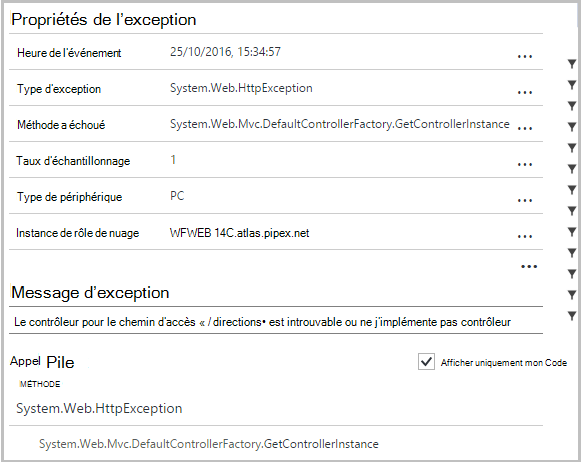
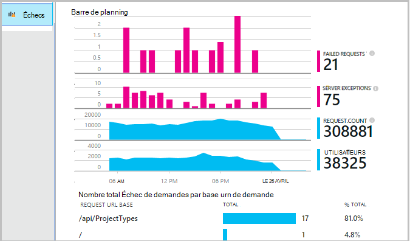
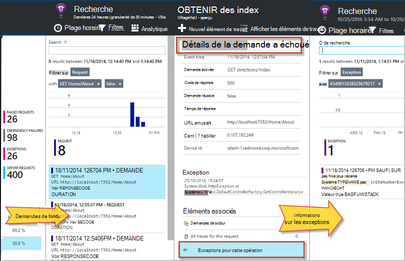
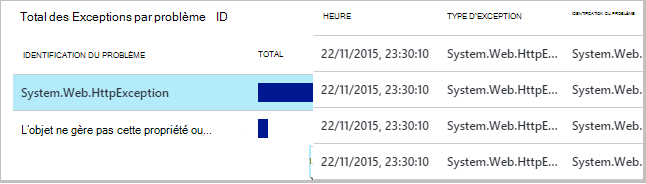
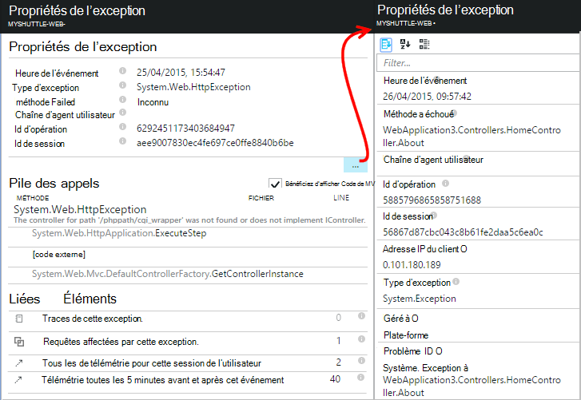
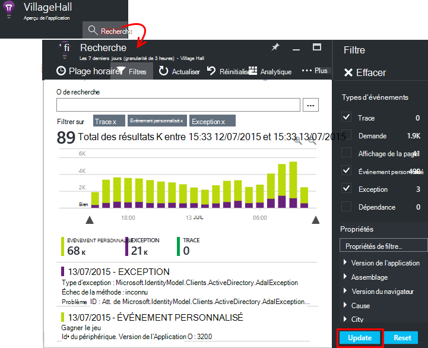
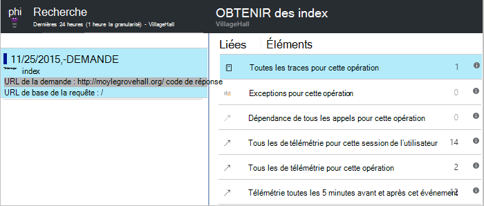

<properties 
    pageTitle="Diagnostiquer les défaillances et les exceptions dans les applications ASP.NET avec les perspectives de l’Application" 
    description="Capturer les exceptions dans les applications ASP.NET ainsi que de télémétrie de demande." 
    services="application-insights" 
    documentationCenter=".net"
    authors="alancameronwills" 
    manager="douge"/>

<tags 
    ms.service="application-insights" 
    ms.workload="tbd" 
    ms.tgt_pltfrm="ibiza" 
    ms.devlang="na" 
    ms.topic="article" 
    ms.date="10/27/2016" 
    ms.author="awills"/>


# <a name="set-up-application-insights-diagnose-exceptions"></a>Définir des perspectives d’Application : diagnostiquer les exceptions

[AZURE.INCLUDE [app-insights-selector-get-started-dotnet](../../includes/app-insights-selector-get-started-dotnet.md)]


En surveillant votre application avec les [Informations d’Application Visual Studio][start], vous pouvez corréler les demandes ayant échoué avec les exceptions et les autres événements sur le client et le serveur, afin que vous pouvez diagnostiquer rapidement les causes.

Pour surveiller une application ASP.NET, vous devez [Ajouter l’Application aperçu SDK] [ greenbrown] pour votre application, ou [installer le moniteur de statut sur votre serveur IIS][redfield], ou, si votre application est une application Web de Azure, ajouter l' [Extension des perspectives d’Application](app-insights-azure-web-apps.md).

## <a name="diagnosing-exceptions-using-visual-studio"></a>Diagnostic des exceptions à l’aide de Visual Studio

Ouvrez la solution d’application dans Visual Studio pour faciliter le débogage.

Exécutez l’application, sur votre serveur ou sur votre ordinateur de développement à l’aide de F5.

Ouvrez la fenêtre de recherche de perspectives d’Application dans Visual Studio et définies pour afficher les événements de votre application. Pendant que vous déboguez, vous pouvez pour cela simplement en cliquant sur le bouton Aperçu de l’Application.


Notez que vous pouvez filtrer le rapport pour afficher uniquement les exceptions. 

*Aucune exceptions affichant ? Voir [Capture des exceptions](#exceptions).*

Cliquez sur un rapport pour afficher la trace de la pile d’exception.



Cliquez sur une référence de ligne dans la trace de la pile, pour ouvrir le fichier approprié.  

## <a name="diagnosing-failures-using-the-azure-portal"></a>Diagnostiquer les défaillances d’utilisation du portail Azure

À partir de la vue d’ensemble de l’aperçu de l’Application de votre application, la mosaïque de défaillances affiche les graphiques des exceptions et échec des demandes HTTP, ainsi que la liste de la demande URL provoquent des défaillances les plus fréquentes.



Cliquez sur un des types de demandes qui ont échoué dans la liste pour accéder à des occurrences individuelles de l’échec. À partir de là, cliquez pour les exceptions ou les données de trace associées :




**Sinon,** vous pouvez démarrer à partir de la liste des exceptions que vous trouverez plus bas la blade d’échecs. Conserver en cliquant sur jusqu'à finalement d’exceptions individuelles.




*Aucune exceptions affichant ? Voir [Capture des exceptions](#exceptions).*

À partir de là, vous pouvez consulter la trace de la pile et les propriétés détaillées de chaque exception et rechercher la trace du journal associés ou autres événements.




[En savoir plus sur la recherche de Diagnostic][diagnostic].


## <a name="dependency-failures"></a>Échecs de la dépendance

Une *dépendance* est un service que votre application appelle, généralement via une connexion de base de données ou d’autres API. [Moniteur d’état application idées] [ redfield] surveille automatiquement les divers types d’appel de dépendance, mesure de la durée des appels et de réussite ou d’échec. 

Pour obtenir des données de dépendance, vous devez [installer le moniteur d’état] [ redfield] sur votre serveur IIS, ou si votre application est une application Web de Azure, utilisez l' [Extension des perspectives d’Application](app-insights-azure-web-apps.md). 

Échec des appels aux dépendances sont répertoriés sur la blade d’échecs, et vous trouverez également les sous les éléments associés dans les détails de la demande et les détails de l’exception.

*Aucun problème de dépendance ? Bien. Mais pour vérifier que vous recevez des données de la dépendance, ouvrez la carte de Performance et observez le graphique de la durée de la dépendance.*

 

## <a name="custom-tracing-and-log-data"></a>Traçage personnalisés et les données du journal

Pour obtenir des données de diagnostic spécifiques à votre application, vous pouvez insérer du code pour envoyer vos propres données de télémétrie. Cela affiche dans diagnostic recherche à côté de la demande, d’une vue de page et d’autres données collectées automatiquement. 

Vous disposez de plusieurs options :

* [TrackEvent()](app-insights-api-custom-events-metrics.md#track-event) est généralement utilisé pour l’analyse des modèles d’utilisation, mais les données qu’il envoie également apparaissent sous les événements personnalisés dans la recherche de diagnostic. Les événements sont nommés et peut contenir des propriétés de type chaîne et numérique métriques sur lequel vous pouvez [Filtrer vos recherches de diagnostics][diagnostic].
* [TrackTrace()](app-insights-api-custom-events-metrics.md#track-trace) vous permet d’envoyer des données telles que les informations de publication.
* [TrackException()](#exceptions) envoie des traces de la pile. [En savoir plus sur les exceptions](#exceptions).
* Si vous utilisez déjà une infrastructure d’enregistrement tels que Log4Net ou NLog, vous pouvez [capturer ces journaux de] [ netlogs] et les voir en diagnostic recherche à côté des données de demande et de l’exception.

Pour afficher ces événements, ouvrez la [recherche][diagnostic], Ouvrir filtre et choisissez Custom Event, Trace ou une Exception.





> [AZURE.NOTE] Si votre application génère un grand nombre de télémétrie, le module d’échantillonnage adapté réduit automatiquement le volume qui est envoyé sur le portail en envoyant uniquement une fraction représentative des événements. Les événements qui font partie de la même opération va être activés ou désactivées en tant que groupe, afin que vous pouvez naviguer entre les événements connexes. [Obtenir des informations sur l’échantillonnage.](app-insights-sampling.md)

### <a name="how-to-see-request-post-data"></a>Comment afficher les données de la demande POST

Détails de la demande ne comprennent pas les données envoyées à votre application dans un appel POST. Pour que ces données signalées :

* [Installer le Kit de développement logiciel] [ greenbrown] dans votre projet d’application.
* Insérer du code dans votre application d’appeler [Microsoft.ApplicationInsights.TrackTrace()][api]. Envoyer les données de publication dans le paramètre de message. Il existe une limite à la taille autorisée, donc vous devez essayer d’envoyer uniquement les données essentielles.
* Lorsque vous recherchez une demande ayant échoué, trouver les traces associés.  




## <a name="exceptions"></a>Capturer les exceptions et les données de diagnostic associées

Dans un premier temps, vous ne verrez dans le portail toutes les exceptions des dysfonctionnements de votre application. Vous verrez les exceptions du navigateur (si vous utilisez le [Kit de développement logiciel JavaScript] [ client] dans vos pages web). Mais la plupart des exceptions de serveur sont interceptées par IIS et que vous devez écrire un peu de code pour les afficher.

Vous pouvez :

* **Enregistrer explicitement des exceptions** en insérant du code dans les gestionnaires d’exceptions pour signaler les exceptions.
* **Capturer automatiquement des exceptions** en configurant votre infrastructure ASP.NET. Les ajouts nécessaires sont différentes pour les différents types de framework.

## <a name="reporting-exceptions-explicitly"></a>Rapport d’exceptions explicitement

Le moyen le plus simple est d’insérer un appel à TrackException() dans un gestionnaire d’exceptions.

JavaScript

    try 
    { ...
    }
    catch (ex)
    {
      appInsights.trackException(ex, "handler loc",
        {Game: currentGame.Name, 
         State: currentGame.State.ToString()});
    }

C#

    var telemetry = new TelemetryClient();
    ...
    try 
    { ...
    }
    catch (Exception ex)
    {
       // Set up some properties:
       var properties = new Dictionary <string, string> 
         {{"Game", currentGame.Name}};

       var measurements = new Dictionary <string, double>
         {{"Users", currentGame.Users.Count}};

       // Send the exception telemetry:
       telemetry.TrackException(ex, properties, measurements);
    }

VB

    Dim telemetry = New TelemetryClient
    ...
    Try
      ...
    Catch ex as Exception
      ' Set up some properties:
      Dim properties = New Dictionary (Of String, String)
      properties.Add("Game", currentGame.Name)

      Dim measurements = New Dictionary (Of String, Double)
      measurements.Add("Users", currentGame.Users.Count)
  
      ' Send the exception telemetry:
      telemetry.TrackException(ex, properties, measurements)
    End Try

Les paramètres des propriétés et des mesures sont facultatifs, mais sont utiles pour le [filtrage et l’ajout de] [ diagnostic] des informations supplémentaires. Par exemple, si vous avez une application qui peut exécuter plusieurs jeux, vous pouvez rechercher tous les rapports d’exception liés à un jeu particulier. Vous pouvez ajouter autant d’éléments que vous le souhaitez à chaque dictionnaire.

## <a name="browser-exceptions"></a>Exceptions du navigateur

La plupart des exceptions du navigateur sont signalées.

Si votre page web inclut des fichiers de script à partir d’autres domaines ou de réseaux de distribution de contenu, assurez-vous que votre balise script a l’attribut ```crossorigin="anonymous"```, et que le serveur envoie [les en-têtes CORS](http://enable-cors.org/). Cela vous permettra d’obtenir une trace de la pile et le détail des exceptions non gérées de JavaScript à partir de ces ressources.

## <a name="web-forms"></a>Formulaires Web

Pour les web forms, le HTTP Module sera en mesure de collecter les exceptions lorsqu’il n’y a pas de redirection configurés avec CustomErrors.

Mais si vous avez des redirections actives, ajoutez les lignes suivantes à la fonction Application_Error dans Global.asax.cs. (Ajouter un fichier Global.asax si vous n’en avez pas déjà).

*C#*

    void Application_Error(object sender, EventArgs e)
    {
      if (HttpContext.Current.IsCustomErrorEnabled && Server.GetLastError  () != null)
      {
         var ai = new TelemetryClient(); // or re-use an existing instance

         ai.TrackException(Server.GetLastError());
      }
    }


## <a name="mvc"></a>MVC

Si la configuration [CustomErrors](https://msdn.microsoft.com/library/h0hfz6fc.aspx) est `Off`, puis les exceptions seront disponibles pour le [HTTP Module](https://msdn.microsoft.com/library/ms178468.aspx) collecter. Toutefois, s’il est `RemoteOnly` (par défaut), ou `On`, l’exception est alors désactivée et non disponible pour l’Application des idées collecter automatiquement. Vous pouvez résoudre qui en substitution de la [classe de System.Web.Mvc.HandleErrorAttribute](http://msdn.microsoft.com/library/system.web.mvc.handleerrorattribute.aspx)et en appliquant la classe substituée comme indiqué pour les différentes versions MVC ci-dessous ([source de github](https://github.com/AppInsightsSamples/Mvc2UnhandledExceptions/blob/master/MVC2App/Controllers/AiHandleErrorAttribute.cs)) :

    using System;
    using System.Web.Mvc;
    using Microsoft.ApplicationInsights;

    namespace MVC2App.Controllers
    {
      [AttributeUsage(AttributeTargets.Class | AttributeTargets.Method, Inherited = true, AllowMultiple = true)] 
      public class AiHandleErrorAttribute : HandleErrorAttribute
      {
        public override void OnException(ExceptionContext filterContext)
        {
            if (filterContext != null && filterContext.HttpContext != null && filterContext.Exception != null)
            {
                //If customError is Off, then AI HTTPModule will report the exception
                if (filterContext.HttpContext.IsCustomErrorEnabled)
                {   //or reuse instance (recommended!). see note above  
                    var ai = new TelemetryClient();
                    ai.TrackException(filterContext.Exception);
                } 
            }
            base.OnException(filterContext);
        }
      }
    }

#### <a name="mvc-2"></a>MVC 2

Remplacer l’attribut HandleError avec votre nouvel attribut sur vos contrôleurs.

    namespace MVC2App.Controllers
    {
       [AiHandleError]
       public class HomeController : Controller
       {
    ...

[Exemple](https://github.com/AppInsightsSamples/Mvc2UnhandledExceptions)

#### <a name="mvc-3"></a>MVC 3

Livre de `AiHandleErrorAttribute` comme un filtre global dans Global.asax.cs :

    public class MyMvcApplication : System.Web.HttpApplication
    {
      public static void RegisterGlobalFilters(GlobalFilterCollection filters)
      {
         filters.Add(new AiHandleErrorAttribute());
      }
     ...

[Exemple](https://github.com/AppInsightsSamples/Mvc3UnhandledExceptionTelemetry)


#### <a name="mvc-4-mvc5"></a>MVC 4, MVC5

AiHandleErrorAttribute de Registre comme un filtre global dans FilterConfig.cs :

    public class FilterConfig
    {
      public static void RegisterGlobalFilters(GlobalFilterCollection filters)
      {
        // Default replaced with the override to track unhandled exceptions
        filters.Add(new AiHandleErrorAttribute());
      }
    }

[Exemple](https://github.com/AppInsightsSamples/Mvc5UnhandledExceptionTelemetry)

## <a name="web-api-1x"></a>API de Web 1.x


Remplacer System.Web.Http.Filters.ExceptionFilterAttribute :

    using System.Web.Http.Filters;
    using Microsoft.ApplicationInsights;

    namespace WebAPI.App_Start
    {
      public class AiExceptionFilterAttribute : ExceptionFilterAttribute
      {
        public override void OnException(HttpActionExecutedContext actionExecutedContext)
        {
            if (actionExecutedContext != null && actionExecutedContext.Exception != null)
            {  //or reuse instance (recommended!). see note above 
                var ai = new TelemetryClient();
                ai.TrackException(actionExecutedContext.Exception);    
            }
            base.OnException(actionExecutedContext);
        }
      }
    }

Vous a pu ajouter cet attribut substitué à certains contrôleurs ou l’ajouter à la configuration du filtre global dans la classe WebApiConfig : 

    using System.Web.Http;
    using WebApi1.x.App_Start;

    namespace WebApi1.x
    {
      public static class WebApiConfig
      {
        public static void Register(HttpConfiguration config)
        {
            config.Routes.MapHttpRoute(name: "DefaultApi", routeTemplate: "api/{controller}/{id}",
                defaults: new { id = RouteParameter.Optional });
            ...
            config.EnableSystemDiagnosticsTracing();

            // Capture exceptions for Application Insights:
            config.Filters.Add(new AiExceptionFilterAttribute());
        }
      }
    }

[Exemple](https://github.com/AppInsightsSamples/WebApi_1.x_UnhandledExceptions)

Il existe un certain nombre de cas que les filtres d’exception ne peut pas gérer. Par exemple :

* Exceptions levées à partir des constructeurs de contrôleur. 
* Exceptions levées par les gestionnaires de messages. 
* Exceptions levées pendant le routage. 
* Exceptions levées pendant la sérialisation de contenu de réponse. 

## <a name="web-api-2x"></a>API de Web 2.x

Ajout d’une implémentation de IExceptionLogger :

    using System.Web.Http.ExceptionHandling;
    using Microsoft.ApplicationInsights;

    namespace ProductsAppPureWebAPI.App_Start
    {
      public class AiExceptionLogger : ExceptionLogger
      {
        public override void Log(ExceptionLoggerContext context)
        {
            if (context !=null && context.Exception != null)
            {//or reuse instance (recommended!). see note above 
                var ai = new TelemetryClient();
                ai.TrackException(context.Exception);
            }
            base.Log(context);
        }
      }
    }

Ajouter les services WebApiConfig :

    using System.Web.Http;
    using System.Web.Http.ExceptionHandling;
    using ProductsAppPureWebAPI.App_Start;

    namespace WebApi2WithMVC
    {
      public static class WebApiConfig
      {
        public static void Register(HttpConfiguration config)
        {
            // Web API configuration and services

            // Web API routes
            config.MapHttpAttributeRoutes();

            config.Routes.MapHttpRoute(
                name: "DefaultApi",
                routeTemplate: "api/{controller}/{id}",
                defaults: new { id = RouteParameter.Optional }
            );
            config.Services.Add(typeof(IExceptionLogger), new AiExceptionLogger()); 
        }
      }
  }

[Exemple](https://github.com/AppInsightsSamples/WebApi_2.x_UnhandledExceptions)

Comme solutions de rechange, vous pouvez :

2. Remplacez le ExceptionHandler uniquement par une implémentation personnalisée de IExceptionHandler. Ceci est uniquement appelée lorsque le cadre est toujours en mesure de choisir le message de réponse à envoyer (pas lorsque la connexion est abandonnée par exemple) 
3. Filtres d’exception (comme décrit dans la section sur les contrôleurs de 1.x API Web ci-dessus) - ne pas appelées dans tous les cas.


## <a name="wcf"></a>WCF

Ajouter une classe qui étend l’attribut et implémente IServiceBehavior et IErrorHandler.

    using System;
    using System.Collections.Generic;
    using System.Linq;
    using System.ServiceModel.Description;
    using System.ServiceModel.Dispatcher;
    using System.Web;
    using Microsoft.ApplicationInsights;

    namespace WcfService4.ErrorHandling
    {
      public class AiLogExceptionAttribute : Attribute, IErrorHandler, IServiceBehavior
      {
        public void AddBindingParameters(ServiceDescription serviceDescription,
            System.ServiceModel.ServiceHostBase serviceHostBase,
            System.Collections.ObjectModel.Collection<ServiceEndpoint> endpoints,
            System.ServiceModel.Channels.BindingParameterCollection bindingParameters)
        {
        }

        public void ApplyDispatchBehavior(ServiceDescription serviceDescription, 
            System.ServiceModel.ServiceHostBase serviceHostBase)
        {
            foreach (ChannelDispatcher disp in serviceHostBase.ChannelDispatchers)
            {
                disp.ErrorHandlers.Add(this);
            }
        }

        public void Validate(ServiceDescription serviceDescription, 
            System.ServiceModel.ServiceHostBase serviceHostBase)
        {
        }

        bool IErrorHandler.HandleError(Exception error)
        {//or reuse instance (recommended!). see note above 
            var ai = new TelemetryClient();

            ai.TrackException(error);
            return false;
        }

        void IErrorHandler.ProvideFault(Exception error, 
            System.ServiceModel.Channels.MessageVersion version, 
            ref System.ServiceModel.Channels.Message fault)
        {
        }
      }
    }

Ajoutez l’attribut pour les implémentations de service :

    namespace WcfService4
    {
        [AiLogException]
        public class Service1 : IService1 
        { 
         ...

[Exemple](https://github.com/AppInsightsSamples/WCFUnhandledExceptions)

## <a name="exception-performance-counters"></a>Compteurs de performance d’exception

Si vous avez [installé le moniteur d’état] [ redfield] sur votre serveur, vous pouvez obtenir un graphique du taux d’exceptions, mesuré par .NET. Cela inclut les exceptions .NET gérées et non gérées.

Ouvrez une lame de mesure de l’Explorateur, ajouter un nouveau graphique et sélectionnez **votre taux d’Exception**, répertorié sous les compteurs de Performance. 

Le .NET framework calcule le taux de compter le nombre d’exceptions dans un intervalle en divisant le résultat par la longueur de l’intervalle. 

Notez qu’il sera différent du nombre de « Exceptions » calculé par le portail d’idées d’Application à partir de rapports de TrackException. Les intervalles d’échantillonnage sont différents, et le Kit de développement logiciel n’envoie pas TrackException des rapports pour toutes les gérée et les exceptions non gérées.

<!--Link references-->

[api]: app-insights-api-custom-events-metrics.md
[client]: app-insights-javascript.md
[diagnostic]: app-insights-diagnostic-search.md
[greenbrown]: app-insights-asp-net.md
[netlogs]: app-insights-asp-net-trace-logs.md
[redfield]: app-insights-monitor-performance-live-website-now.md
[start]: app-insights-overview.md

 
