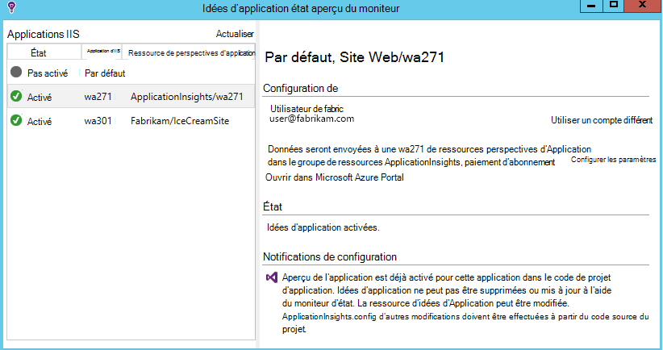
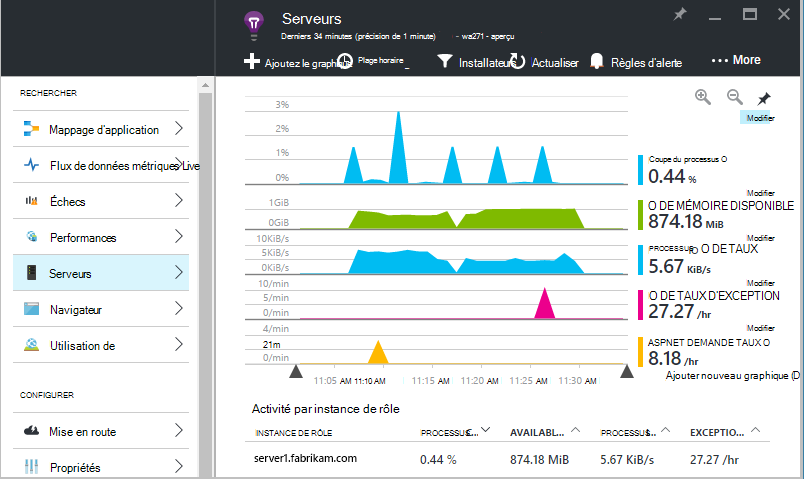
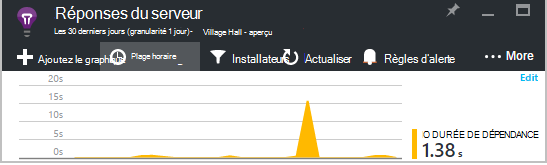
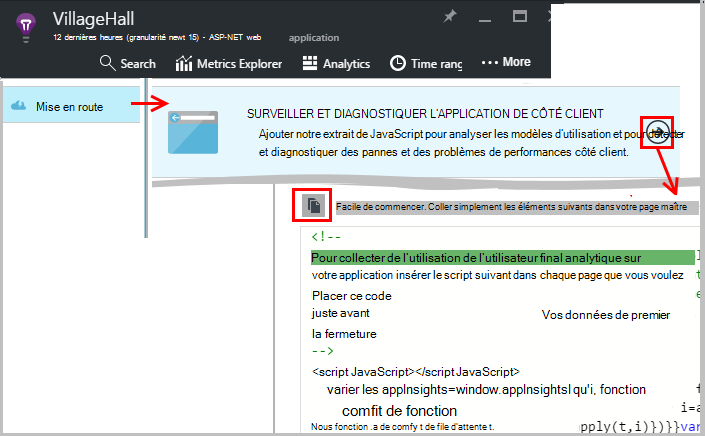
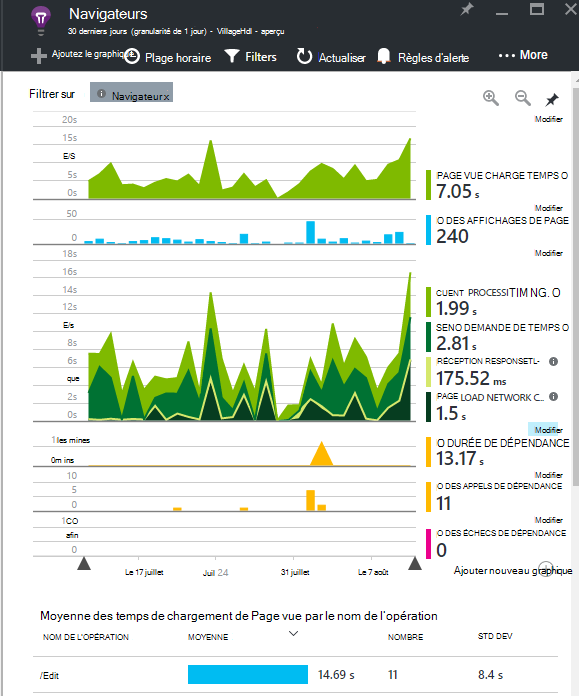
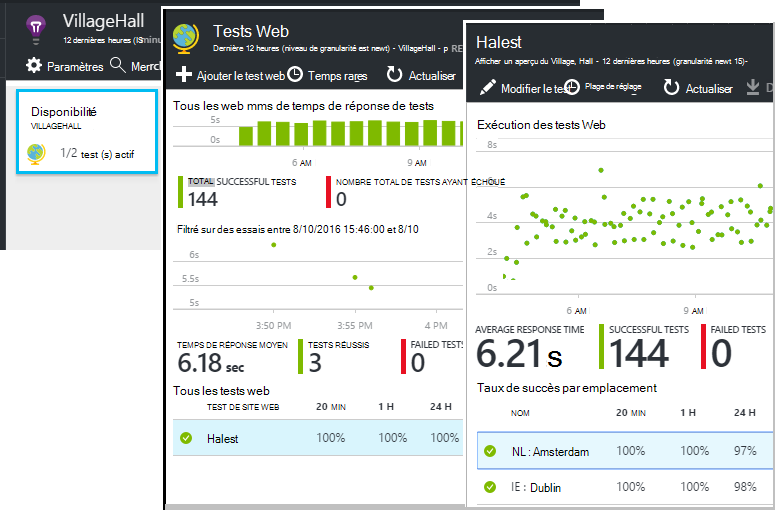
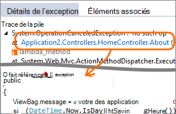
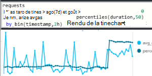
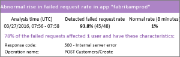
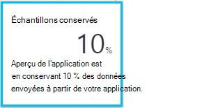

<properties 
    pageTitle="Tirer le meilleur parti des perspectives d’Application | Microsoft Azure" 
    description="Après la mise en route avec Application Insights, Voici un résumé des fonctionnalités que vous pouvez Explorer." 
    services="application-insights" 
    documentationCenter=".net"
    authors="alancameronwills" 
    manager="douge"/>

<tags 
    ms.service="application-insights" 
    ms.workload="tbd" 
    ms.tgt_pltfrm="ibiza" 
    ms.devlang="na" 
    ms.topic="article" 
    ms.date="10/27/2016" 
    ms.author="awills"/>

# <a name="more-telemetry-from-application-insights"></a>Télémétrie plus de perspectives de l’Application

Après avoir [ajouté les perspectives d’Application à votre code ASP.NET](app-insights-asp-net.md), il existe quelques possibilités pour obtenir davantage de télémétrie. 

## <a name="if-your-app-runs-on-your-iis-server-"></a>Si votre application s’exécute sur votre serveur IIS en cours...

Si votre application est hébergée sur les serveurs IIS dans votre contrôle, installez le moniteur d’état Application perspectives sur les serveurs. S’il est déjà installé, vous n’avez pas besoin de faire quoi que ce soit.

1. Sur chaque serveur web IIS, connectez-vous avec les informations d’identification d’administrateur.
2. Téléchargez et exécutez [programme d’installation de l’Analyseur de l’état](http://go.microsoft.com/fwlink/?LinkId=506648).
3. Dans l’Assistant d’installation, vous connecter à Microsoft Azure.

Vous n’avez pas besoin de faire quoi que ce soit d’autre, mais vous pouvez vérifier que le contrôle est activé pour votre application.



(Vous pouvez également utiliser moniteur d’état pour [Activer l’analyse lors de l’exécution](app-insights-monitor-performance-live-website-now.md), même si vous n’avez pas instrumenter vos applications dans Visual Studio.)

### <a name="what-do-you-get"></a>Qu’obtenez-vous ?

Si le contrôle d’état est installé sur vos ordinateurs de serveur, vous obtenez certaines télémétrie supplémentaire :

* TELEMETRIE de dépendance (SQL des appels et reste effectuées par votre application) pour les applications .NET 4.5. (Pour les versions ultérieures de .NET, moniteur d’état n’est pas nécessaire de télémétrie de dépendance.) 
* Traces de pile d’exception afficher plus de détails.
* Compteurs de performance. Dans les analyses de l’Application, ces compteurs apparaissent dans la lame de serveurs. 



Pour afficher les compteurs de plus ou moins, [Modifier les graphiques](app-insights-metrics-explorer.md). Si vous souhaitez que le compteur de performance n’est pas dans l’ensemble disponible, vous pouvez [l’ajouter à l’ensemble collectée par le module de compteur de performance](app-insights-performance-counters.md).

## <a name="if-its-an-azure-web-app-"></a>S’il s’agit d’une application web Azure...

Si votre application s’exécute comme une application web d’Azure, allez dans le panneau Azure pour l’application ou de la machine virtuelle et ouvrez la lame de perspectives de l’Application. 

### <a name="what-do-you-get"></a>Qu’obtenez-vous ?

* Traces de pile d’exception afficher plus de détails.
* TELEMETRIE de dépendance (SQL des appels et reste effectuées par votre application) pour les applications .NET 4.5. (Pour les versions ultérieures de .NET, l’extension n’est pas nécessaire de télémétrie de dépendance.) 



(Vous pouvez également utiliser cette méthode pour [Activer l’analyse lors de l’exécution des performances](app-insights-monitor-performance-live-website-now.md), même si vous n’avez pas instrumenter votre application dans Visual Studio.)

## <a name="client-side-monitoring"></a>Analyse côté client

Vous avez installé le Kit de développement logiciel qui envoie des données de télémétrie à partir du serveur (back-end) de votre application. Vous pouvez maintenant ajouter analyse côté client. Vous fournit des données sur les utilisateurs, les sessions, vues de la page et les exceptions ou les incidents qui se produisent dans le navigateur. Vous pourrez également écrire votre propre code pour effectuer le suivi du fonctionnement de vos utilisateurs avec votre application, droite le niveau détaillé de clics et frappes de touches.

Ajouter l’extrait de code JavaScript de perspectives d’Application à chaque page web, pour obtenir de télémétrie de navigateurs clients.

1. Dans Azure, ouvrez la ressource d’informations d’Application pour votre application.
2. Ouvrir la mise en route, Moniteur du côté Client et copier l’extrait de code.
3. Coller afin qu’il apparaisse dans l’en-tête de chaque page web - généralement que cela en la collant dans la page maître.



Notez que le code contienne la clé d’instrumentation qui identifie les ressources de votre application.

### <a name="what-do-you-get"></a>Qu’obtenez-vous ?

* Vous pouvez écrire du code JavaScript pour envoyer de [télémétrie personnalisé à partir de vos pages web](app-insights-api-custom-events-metrics.md), par exemple pour effectuer le suivi des clics de bouton.
* Dans [Analytique](app-insights-analytics.md), données de `pageViews` et données AJAX dans `dependencies`. 
* [Les données d’utilisation et les performances du client](app-insights-javascript.md) dans la lame de navigateurs.




[Pour en savoir plus sur la page web suivi.](app-insights-web-track-usage.md)


## <a name="track-application-version"></a>Version de l’Application de suivi

Assurez-vous que `buildinfo.config` est généré par votre processus de MSBuild. Dans votre fichier .csproj, ajoutez :  

```XML

    <PropertyGroup>
      <GenerateBuildInfoConfigFile>true</GenerateBuildInfoConfigFile>    <IncludeServerNameInBuildInfo>true</IncludeServerNameInBuildInfo>
    </PropertyGroup> 
```

Lorsqu’il a les infos sur la version, le module web de perspectives d’Application ajoute automatiquement les **version de l’Application** sous la forme d’une propriété pour chaque élément de télémétrie. Qui vous permet de filtrer par version lors de l’exécution de [recherches de diagnostics](app-insights-diagnostic-search.md) ou lors de [l’exploration des mesures](app-insights-metrics-explorer.md). 

Toutefois, notez que le numéro de build est généré uniquement par MS Build, pas par la génération de developer dans Visual Studio.


## <a name="availability-web-tests"></a>Disponibilité des tests web

Envoyer des requêtes HTTP de votre application web à intervalles réguliers à partir de partout dans le monde. Nous vous alerte si la réponse est lente ou peu fiable.

Dans la ressource d’idées d’Application pour votre application, cliquez sur la mosaïque de disponibilité pour ajouter, modifier et afficher des tests web.

Vous pouvez ajouter plusieurs tests à plusieurs emplacements.



[Pour en savoir plus](app-insights-monitor-web-app-availability.md)

## <a name="custom-telemetry-and-logging"></a>Journalisation et télémétrie personnalisé

Les packages de perspectives de l’Application que vous avez ajoutés à votre code fournissent une API que vous pouvez appeler à partir de votre application.

* [Générer vos propres événements et des mesures](app-insights-api-custom-events-metrics.md), par exemple pour les événements commerciaux de nombre ou de surveiller les performances.
* [Traces de journal capture](app-insights-asp-net-trace-logs.md) à partir de Log4Net, NLog ou System.Diagnostics.Trace.
* [Filtre, modifier, ou augmenter](app-insights-api-filtering-sampling.md) la télémétrie standard envoyé à partir de votre application en écrivant des processeurs de télémétrie. 


## <a name="powerful-analysis-and-presentation"></a>Présentation et analyse puissante

Il existe de nombreuses façons de découvrir vos données. Si vous avez récemment démarré avec aperçus de l’Application, consultez ces articles :

||
|---|---
|[**Recherche de diagnostic par exemple de données**](app-insights-visual-studio.md)<br/>Recherche et filtrage des événements tels que les demandes, exceptions, appels de dépendance, journal des traces et des affichages de page. Dans Visual Studio, accédez au code de traces de la pile.|
|[**Explorer des métriques de données agrégées**](app-insights-metrics-explorer.md)<br/>Explorer, filtrer et segmenter les données agrégées, comme les taux des demandes, les défaillances et les exceptions ; temps de réponse, le temps de chargement de page.|
|[**Tableaux de bord**](app-insights-dashboards.md#dashboards)<br/>Modifier les données provenant de plusieurs ressources et les partager avec d’autres personnes. Idéal pour les applications à composants multiples et d’affichage en continu dans la salle de réunion.  |
|[**Flux de données métriques Live**](app-insights-metrics-explorer.md#live-metrics-stream)<br/>Lorsque vous déployez une nouvelle version, regarder ces indicateurs de performances de près en temps réel pour vous assurer que tout fonctionne comme prévu.|
|[**Analytique**](app-insights-analytics.md)<br/>Répondre à des questions difficiles sur les performances et l’utilisation de votre application à l’aide de ce langage de requête puissantes.|
|[**Alertes automatiques et manuelles**](app-insights-alerts.md)<br/>Des alertes automatiques s’adapter aux modèles de normal de votre application de télémétrie et de déclencheur lorsqu’il existe un élément extérieur à schéma habituel. Vous pouvez également définir des alertes sur les niveaux particuliers de mesures standard ou personnalisées.|

## <a name="data-management"></a>Gestion des données

|||
|---|---|
|[**Exportation en continu**](app-insights-export-telemetry.md)<br/>Copiez tous vos télémétrie dans stockage afin que vous pouvez les analyser votre propre système.|
|**API d’accès aux données**<br/>À venir.|
|[**Échantillonnage**](app-insights-sampling.md)<br/>Réduit le débit de données et vous permet de rester dans la limite de votre niveau de tarification.|