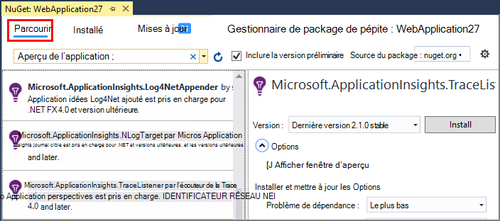
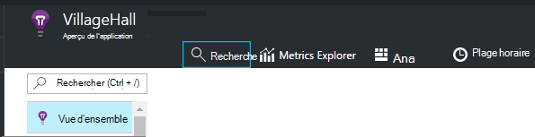
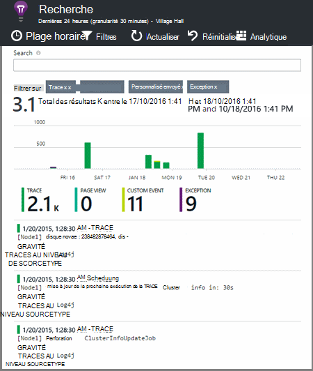

<properties 
    pageTitle="Explorez les journaux de suivi de .NET dans les perspectives de l’Application" 
    description="Rechercher les journaux générés avec Trace, NLog ou Log4Net." 
    services="application-insights" 
    documentationCenter=".net"
    authors="alancameronwills" 
    manager="douge"/>

<tags 
    ms.service="application-insights" 
    ms.workload="tbd" 
    ms.tgt_pltfrm="ibiza" 
    ms.devlang="na" 
    ms.topic="article" 
    ms.date="07/21/2016" 
    ms.author="awills"/>
 
# <a name="explore-net-trace-logs-in-application-insights"></a>Explorez les journaux de suivi de .NET dans les perspectives de l’Application  

Si vous utilisez NLog, log4Net ou System.Diagnostics.Trace suivi de diagnostic dans votre application ASP.NET, vous pouvez avoir des journaux envoyés aux [Analyses d’Application Visual Studio][start], où vous pouvez les Explorer et les rechercher. Les journaux sont fusionnées avec l’autre télémétrie en provenance de votre application, de sorte que vous pouvez identifier les traces associées à chaque demande de l’utilisateur et les mettre en corrélation avec d’autres événements et les rapports d’exception.


> [AZURE.NOTE] Vous avez besoin d’un module journal capture ? Il s’agit d’une carte utile pour les journaux de 3 rd-party, mais si vous n’êtes pas déjà à l’aide de NLog, log4Net ou System.Diagnostics.Trace, envisager de simplement l’appeler directement [TrackTrace() de perspectives d’Application](app-insights-api-custom-events-metrics.md#track-trace) .


## <a name="install-logging-on-your-app"></a>Installation d’ouverture de session de votre application

Installez votre structure de l’enregistrement sélectionné dans votre projet. Cela devrait générer une entrée dans le fichier app.config ou web.config.

Si vous utilisez System.Diagnostics.Trace, vous devez ajouter une entrée au fichier web.config :

```XML

    <configuration>
     <system.diagnostics>
       <trace autoflush="false" indentsize="4">
         <listeners>
           <add name="myListener" 
             type="System.Diagnostics.TextWriterTraceListener" 
             initializeData="TextWriterOutput.log" />
           <remove name="Default" />
         </listeners>
       </trace>
     </system.diagnostics>
   </configuration>
```

## <a name="configure-application-insights-to-collect-logs"></a>Configurer les perspectives d’Application pour collecter des journaux

**[Idées d’Application ajouter à votre projet](app-insights-asp-net.md)** si vous n’avez pas fait. Vous verrez une option permettant d’inclure le collecteur de journal.

Ou **Configurer les perspectives sur l’Application** en cliquant sur votre projet dans l’Explorateur de solutions. Sélectionnez l’option pour la **collection de configurer la trace**.

*Aucune option de collecteur de perspectives d’Application journal ou du menu ?* Essayez de [résoudre](#troubleshooting).


## <a name="manual-installation"></a>Installation manuelle

Utilisez cette méthode si votre type de projet n’est pas pris en charge par le programme d’installation de perspectives de l’Application (par exemple un bureau projet Windows). 

1. Si vous prévoyez d’utiliser des log4Net ou NLog, installez-le dans votre projet. 
2. Dans l’Explorateur de solutions, avec le bouton droit de votre projet et sélectionnez **Manage NuGet Packages**.
3. Recherche « Considérations sur les applications »

    

4. Sélectionnez le package approprié - un des :
  + Microsoft.ApplicationInsights.TraceListener (pour capturer les appels System.Diagnostics.Trace)
  + Microsoft.ApplicationInsights.NLogTarget
  + Microsoft.ApplicationInsights.Log4NetAppender

Le package NuGet installe les assemblys nécessaires et modifie également le web.config ou app.config.

## <a name="insert-diagnostic-log-calls"></a>Insérer les appels de journaux de diagnostic

Si vous utilisez System.Diagnostics.Trace, un appel typique serait :

    System.Diagnostics.Trace.TraceWarning("Slow response - database01");

Si vous préférez log4net ou NLog :

    logger.Warn("Slow response - database01");


## <a name="using-the-trace-api-directly"></a>À l’aide de l’API de suivi directement

Vous pouvez appeler la trace d’idées d’Application API directement. Les cartes d’enregistrement utilisant cette API. 

Par exemple :

    var telemetry = new Microsoft.ApplicationInsights.TelemetryClient();
    telemetry.TrackTrace("Slow response - database01");

Un avantage de TrackTrace, que vous pouvez placer des données relativement longues dans le message. Par exemple, vous pourriez coder les données POST. 

En outre, vous pouvez ajouter un niveau de gravité à votre message. Et, comme autre télémétrie, vous pouvez ajouter des valeurs de propriété que vous pouvez utiliser pour filtrer ou rechercher des jeux différents de traces. Par exemple :


    var telemetry = new Microsoft.ApplicationInsights.TelemetryClient();
    telemetry.TrackTrace("Slow database response",
                   SeverityLevel.Warning,
                   new Dictionary<string,string> { {"database", db.ID} });

Cela vous permettrait, dans une [recherche][diagnostic], facilement filtrer tous les messages d’une gravité particulière relative à une base de données particulière.

## <a name="explore-your-logs"></a>Explorez vos journaux

Exécutez votre application, soit en mode débogage ou déployer live.

De lames de vue d’ensemble de votre application dans [le portail d’idées d’Application][portal], choisissez la [recherche][diagnostic].





Vous pouvez, par exemple :

* Filtrer sur les traces de journal, ou sur les éléments avec des propriétés spécifiques
* Vérifiez si un élément spécifique en détail.
* Rechercher d’autre télémétrie se rapportant à la même demande de l’utilisateur (autrement dit, avec la même OperationId) 
* Enregistrer la configuration de cette page en tant que favori

> [AZURE.NOTE] **Prélèvement d’échantillons.** Si votre application envoie un lot de données et que vous utilisez le Kit de développement du perspectives d’Application pour ASP.NET version 2.0.0-beta3 ou version ultérieure, la fonctionnalité d’échantillonnage adapté peut fonctionner et envoyer uniquement un pourcentage de votre télémétrie. [Pour en savoir plus sur l’échantillonnage.](app-insights-sampling.md)

## <a name="next-steps"></a>Étapes suivantes

[Diagnostiquer les défaillances et les exceptions dans ASP.NET][exceptions]

[En savoir plus sur la recherche][diagnostic].


## <a name="troubleshooting"></a>Résolution des problèmes

### <a name="how-do-i-do-this-for-java"></a>Comment dois-je procéder pour Java ?

Utilisez les [cartes de journal de Java](app-insights-java-trace-logs.md).

### <a name="theres-no-application-insights-option-on-the-project-context-menu"></a>Il n’y a aucune option d’idées d’Application dans le menu contextuel du projet

* Outils de perspectives de l’Application est installée sur cet ordinateur de développement. Dans le menu Outils de Visual Studio, les Extensions et les mises à jour, recherchez des outils d’analyses de Application. Si elle n’est pas dans l’onglet installé, ouvrez l’onglet en ligne et l’installer.
* Il peut s’agir d’un type de projet non pris en charge par les outils de l’aperçu de l’Application. Utilisez [une installation manuelle](#manual-installation).

### <a name="no-log-adapter-option-in-the-configuration-tool"></a>Aucune option de carte de journal dans l’outil de configuration

* Vous devez d’abord installer l’infrastructure de journalisation.
* Si vous utilisez System.Diagnostics.Trace, assurez-vous que vous [configuré dans `web.config` ](https://msdn.microsoft.com/library/system.diagnostics.eventlogtracelistener.aspx).
* Avez-vous la version la plus récente des outils d’analyses de l’Application ? Dans le menu **d’Outils** de Visual Studio, choisissez les **mises à jour et des Extensions**et cliquez sur l’onglet **mises à jour** . Si les outils analyses d’Application existe, cliquez sur pour mettre à jour.


### <a name="emptykey"></a>J’obtiens une erreur « clé de l’Instrumentation ne peut pas être vide »

Il semble que vous avez installé le package Nuget de carte journalisation sans installer les perspectives de l’Application.

Dans l’Explorateur de solutions, cliquez sur `ApplicationInsights.config` et choisissez les **Perspectives d’Application de mise à jour**. Vous obtiendrez une boîte de dialogue qui vous invite à vous connecter à Azure et créer une ressource d’Application Insights, ou réutilisez un existant. Qui doit le résoudre.

### <a name="i-can-see-traces-in-diagnostic-search-but-not-the-other-events"></a>Je peux voir les traces dans la recherche de diagnostic, mais pas les autres événements

Il peut parfois prendre un certain temps pour tous les événements et les demandes pour obtenir via le pipeline.

### <a name="limits"></a>La quantité de données est conservée ?

Événements jusqu'à 500 par seconde à partir de chaque application. Les événements sont conservés pendant sept jours.

### <a name="im-not-seeing-some-of-the-log-entries-that-i-expect"></a>Je ne vois pas certains des entrées du journal que je pensais

Si votre application envoie un lot de données et que vous utilisez le Kit de développement du perspectives d’Application pour ASP.NET version 2.0.0-beta3 ou version ultérieure, la fonctionnalité d’échantillonnage adapté peut fonctionner et envoyer uniquement un pourcentage de votre télémétrie. [Pour en savoir plus sur l’échantillonnage.](app-insights-sampling.md)

## <a name="add"></a>Étapes suivantes

* [Configurer les tests de la réactivité et de disponibilité][availability]
* [Résolution des problèmes][qna]


<!--Link references-->

[availability]: app-insights-monitor-web-app-availability.md
[diagnostic]: app-insights-diagnostic-search.md
[exceptions]: app-insights-asp-net-exceptions.md
[portal]: https://portal.azure.com/
[qna]: app-insights-troubleshoot-faq.md
[start]: app-insights-overview.md

 
