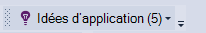

<properties 
    pageTitle="Configurer analytique d’application web d’ASP.NET avec les perspectives d’Application | Microsoft Azure" 
    description="Configurer les performances, la disponibilité et analytique de l’utilisation de votre site Web ASP.NET, hébergé sur site ou dans Azure." 
    services="application-insights" 
    documentationCenter=".net"
    authors="NumberByColors" 
    manager="douge"/>

<tags 
    ms.service="application-insights" 
    ms.workload="tbd" 
    ms.tgt_pltfrm="ibiza" 
    ms.devlang="na" 
    ms.topic="get-started-article" 
    ms.date="10/13/2016" 
    ms.author="awills"/>


# <a name="set-up-application-insights-for-aspnet"></a>Définir des perspectives d’Application pour ASP.NET

[Idées d’Application Visual Studio](app-insights-overview.md) surveille vos applications en ligne pour vous aider à [détecter et diagnostiquer les problèmes de performances et les exceptions](app-insights-detect-triage-diagnose.md)et [Découvrez comment votre application est utilisée](app-insights-overview-usage.md).  Il fonctionne pour les applications qui sont hébergées sur vos propres serveurs d’IIS en local ou sur le nuage VMs, ainsi que les applications web Azure.


## <a name="before-you-start"></a>Avant de commencer

Tu as besoin de :

* Visual Studio 2013 mise à jour 3 ou version ultérieure. Une version ultérieure est préférable.
* Un abonnement à [Microsoft Azure](http://azure.com). Si votre équipe ou votre organisation possède un abonnement Azure, le propriétaire peut vous ajouter, à l’aide de votre [compte Microsoft](http://live.com). 

Il existe des autres articles à examiner si vous êtes intéressé par :

* [L’instrumentation d’une application web au moment de l’exécution](app-insights-monitor-performance-live-website-now.md)
* [Services en nuage Azure](app-insights-cloudservices.md)

## <a name="ide"></a>1. Ajout d’idées d’Application SDK


### <a name="if-its-a-new-project"></a>S’il s’agit d’un nouveau projet...

Assurez-vous que les perspectives de l’Application est activée lorsque vous créez un nouveau projet dans Visual Studio. 


### <a name="-or-if-its-an-existing-project"></a>... ou s’il s’agit d’un projet existant

Droit sur le projet dans l’Explorateur de solutions et choisissez **Ajouter de télémétrie de perspectives Application** ou **Configurer les perspectives sur l’Application**.


* Projet de base de ASP.NET ? - [Suivez ces instructions pour résoudre les quelques lignes de code](https://github.com/Microsoft/ApplicationInsights-aspnetcore/wiki/Getting-Started#add-application-insights-instrumentation-code-to-startupcs). 


## <a name="run"></a>2. Lancez votre application

Exécutez votre application en appuyant sur F5 et faites un essai : ouvrir les différentes pages pour générer certains télémétrie.

Dans Visual Studio, vous voyez un décompte des événements qui ont été enregistrés. 



## <a name="3-see-your-telemetry"></a>3. consultez votre télémétrie...

### <a name="-in-visual-studio"></a>dans Visual Studio

Ouvrez la fenêtre Aperçu de l’Application dans Visual Studio : cliquez sur le bouton Aperçu de l’Application, ou droit sur votre projet dans l’Explorateur de solutions :


Cette vue affiche télémétriques générées dans le côté serveur de votre application. Faites des essais avec les filtres, puis cliquez sur n’importe quel événement pour afficher plus de détails.

[En savoir plus sur les outils d’analyses de l’Application dans Visual Studio](app-insights-visual-studio.md).

<a name="monitor"></a> 
### <a name="-in-the-portal"></a>dans le portail

Sauf si vous avez choisi *d’Installer le SDK,* vous pouvez également voir la télémétrie sur le portail web de perspectives de l’Application. 

Le portail a plus des graphiques, des outils d’analyse et des tableaux de bord à Visual Studio. 


Ouvrez votre ressource d’idées d’Application dans [Azure portal](https://portal.azure.com/).


Le portail s’ouvre sur une vue de la télémétrie à partir de votre application :

* La première télémétrie apparaît dans [des mesures de flux](app-insights-metrics-explorer.md#live-metrics-stream).
* Différents événements s’affichent dans la **recherche** (1). Données peuvent prendre quelques minutes pour s’affichent. Cliquez sur un événement pour afficher ses propriétés. 
* Mesures agrégées s’affichent dans les graphiques (2). Il peut prendre une minute ou deux pour voir s’afficher ici. Cliquez sur n’importe quel graphique pour ouvrir une lame avec plus de détails.

[En savoir plus sur l’utilisation d’idées d’Application dans Azure portal](app-insights-dashboards.md).

## <a name="4-publish-your-app"></a>4. publier votre application

Publier votre application sur votre serveur IIS ou sur Azure. Regardez les [métriques de flux](app-insights-metrics-explorer.md#live-metrics-stream) pour vous assurer que tout fonctionne correctement.

Vous verrez votre établissement dans le portail d’idées d’Application, où vous pouvez surveiller les mesures, rechercher votre télémétrie et définir des [tableaux de bord](app-insights-dashboards.md)de télémétrie. Vous pouvez également utiliser puissant [langage de requête Analytique](app-insights-analytics.md) pour analyser les performances et l’utilisation ou de rechercher des événements spécifiques. 

Vous pouvez également continuer à analyser votre télémétrie dans [Visual Studio](app-insights-visual-studio.md) avec des outils de recherche de diagnostic et [des tendances](app-insights-visual-studio-trends.md).

> [AZURE.NOTE] Si votre application envoie suffisamment télémétrie d’aborder les [limites](app-insights-pricing.md#limits-summary), l' [échantillonnage](app-insights-sampling.md) automatique bascule. Prélèvement réduit la quantité de télémétrie envoyé à partir de votre application, tout en préservant les données mises en corrélation à des fins de Diagnostics.


##<a name="land"></a>« Ajouter des idées Application » quoi ?

Idées d’application envoie télémétrie à partir de votre application sur le portail de perspectives de l’Application (ce qui est hébergé dans Microsoft Azure) :


La commande a trois choses :

1. Ajoutez le package NuGet de kit de développement logiciel Web Application perspectives à votre projet. Dans Visual Studio, avec le bouton droit de votre projet et sélectionnez Manage NuGet Packages.
2. Création d’une ressource d’idées d’Application dans [Azure portal](https://portal.azure.com/). Voici où vous pouvez afficher vos données. Elle récupère la *clé de l’instrumentation,* qui identifie la ressource.
3. Insère la clé de l’instrumentation dans `ApplicationInsights.config`, de sorte que le Kit de développement peut envoyer de télémétrie au portail.

Si vous le souhaitez, vous pouvez réaliser ces étapes manuellement pour [ASP.NET 4](app-insights-windows-services.md) ou sur [ASP.NET](https://github.com/Microsoft/ApplicationInsights-aspnetcore/wiki/Getting-Started).

### <a name="to-upgrade-to-future-sdk-versions"></a>Mise à niveau vers les versions ultérieures du Kit de développement logiciel

Pour mettre à niveau vers une [nouvelle version du Kit de développement](https://github.com/Microsoft/ApplicationInsights-dotnet-server/releases), ouvrez le Gestionnaire de package NuGet à nouveau et filtrer sur les packages installés. Sélectionnez Microsoft.ApplicationInsights.Web et cliquez sur mise à niveau.

Si vous avez apporté des personnalisations à ApplicationInsights.config, enregistrer une copie avant de mettre à niveau et ensuite de fusionner vos modifications dans la nouvelle version.

## <a name="add-more-telemetry"></a>Ajouter plus de télémétrie

### <a name="web-pages-and-single-page-apps"></a>Pages Web et les applications de la page unique

1. [Ajouter l’extrait de code JavaScript](app-insights-javascript.md) à vos pages web pour les lames de navigateur et de l’utilisation des données sur les vues de page, les temps de chargement, les exceptions du navigateur, performances des appels AJAX, allumer des comptes utilisateur et de session.
2. [Événements personnalisés de code](app-insights-api-custom-events-metrics.md) à un nombre, d’heure ou de mesure des actions utilisateur.

### <a name="dependencies-exceptions-and-performance-counters"></a>Dépendances, les exceptions et les compteurs de performance

[Moniteur d’état installer](app-insights-monitor-performance-live-website-now.md) sur chaque ordinateur de votre serveur, pour obtenir la télémétrie supplémentaire sur votre application. C’est ce que vous obtenez :

* [Les compteurs de performance](app-insights-performance-counters.md) - 
du processeur, mémoire, disques et autres compteurs de performance relatifs à votre application. 
* [Exceptions](app-insights-asp-net-exceptions.md) - plus de télémétrie pour certaines exceptions.
* [Dépendances](app-insights-asp-net-dependencies.md) - les appels à l’API REST ou SQL services. Déterminez si des réponses lentes par les composants externes sont à l’origine des problèmes de performances dans votre application. (Si votre application s’exécute sur .NET 4.6, vous n’avez pas besoin pour obtenir cette télémétrie moniteur d’état.)

### <a name="diagnostic-code"></a>Code de diagnostic

Vous avez un problème ? Si vous souhaitez insérer le code dans votre application pour vous aider à diagnostiquer il, vous disposez de plusieurs options :

* [Traces de journal capture](app-insights-asp-net-trace-logs.md): Si vous utilisez déjà System.Diagnostics.Trace, NLog ou Log4N pour enregistrer les événements de la trace, la sortie peut être envoyée aux analyses d’Application afin que vous pouvez la mettre en corrélation avec les demandes, rechercher par son intermédiaire et à les analyser. 
* [Les mesures et les événements personnalisés](app-insights-api-custom-events-metrics.md): utilisez TrackEvent() et TrackMetric() dans le serveur ou le code de la page web.
* [TELEMETRIE de balise avec des propriétés supplémentaires](app-insights-api-filtering-sampling.md#add-properties)

[Recherche](app-insights-diagnostic-search.md) permet de rechercher et de mettre en corrélation des événements spécifiques et [Analytique](app-insights-analytics.md) pour effectuer des requêtes plus puissantes.

## <a name="alerts"></a>Alertes

Soyez le premier à savoir si votre application rencontre des problèmes. (N’attendez pas jusqu'à ce que vos utilisateurs vous dire !) 

* [Créer des tests web](app-insights-monitor-web-app-availability.md) pour vous assurer que votre site est visible sur le web.
* [Diagnostics proactifs](app-insights-proactive-diagnostics.md) exécuter automatiquement (si votre application a un certain montant minimal du trafic). Vous n’avez rien à faire pour les configurer. Ils vous indiquent si votre application a un taux d’inhabituel de demandes ayant échoué.
* [Définir les métriques alertes](app-insights-alerts.md) pour vous avertir si un métrique dépasse un seuil. Vous pouvez définir les mesures personnalisées que vous le code dans votre application.

Par défaut, les notifications d’alerte sont envoyées au propriétaire de l’abonnement Azure. 


## <a name="version-and-release-tracking"></a>Suivi de version et d’édition

### <a name="track-application-version"></a>Version de l’application de suivi

Assurez-vous que `buildinfo.config` est généré par votre processus de MSBuild. Dans votre fichier .csproj, ajoutez :  

```XML

    <PropertyGroup>
      <GenerateBuildInfoConfigFile>true</GenerateBuildInfoConfigFile>    <IncludeServerNameInBuildInfo>true</IncludeServerNameInBuildInfo>
    </PropertyGroup> 
```

Lorsqu’il a les infos sur la version, le module web de perspectives d’Application ajoute automatiquement les **version de l’Application** sous la forme d’une propriété pour chaque élément de télémétrie. Qui vous permet de filtrer par version lors de l’exécution de [recherches de diagnostics](app-insights-diagnostic-search.md) ou lors de [l’exploration des mesures](app-insights-metrics-explorer.md). 

Toutefois, notez que le numéro de build est généré uniquement par MS Build, pas par la génération de developer dans Visual Studio.

### <a name="release-annotations"></a>Annotations de version

Si vous utilisez Visual Studio Team Services, vous pouvez [obtenir un marqueur d’annotation](app-insights-annotations.md) ajoutée à vos graphiques lorsque vous publiez une nouvelle version.


## <a name="next-steps"></a>Étapes suivantes

| | 
|---|---
|**[Utilisation des perspectives d’Application dans Visual Studio](app-insights-visual-studio.md)**<br/>Débogage à l’aide de télémétrie, diagnostic, de recherche, l’extraction de code.|
|**[Utilisez le portail d’idées d’Application](app-insights-dashboards.md)**<br/>Exporter des tableaux de bord, des outils de diagnostics et d’analyse puissants, alertes, un mappage direct de dépendance de votre application et télémétrie. |
|**[Ajoutez davantage de données](app-insights-asp-net-more.md)**<br/>Surveiller l’utilisation, disponibilité, dépendances, exceptions. Intégrer des traces à partir des frameworks de journalisation. Écrire la télémétrie personnalisé. | 


