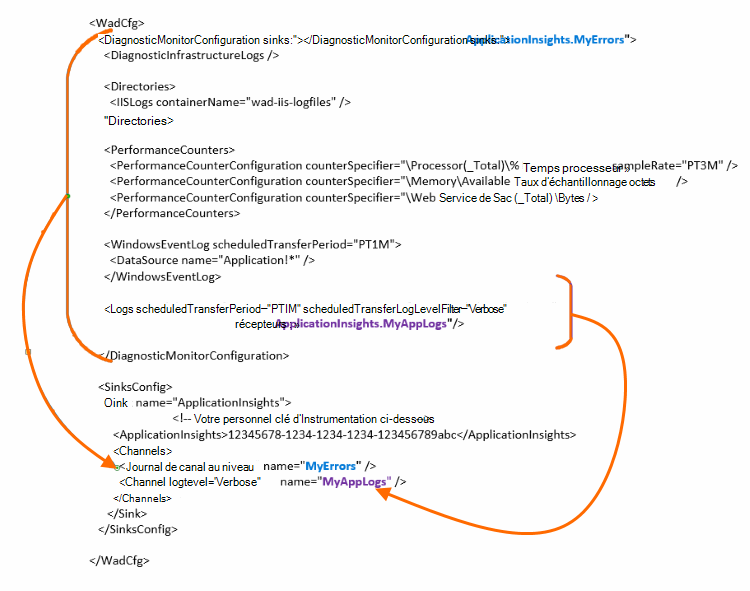

<properties
    pageTitle="Envoyer les journaux de Diagnostic Azure aux analyses de l’Application"
    description="Configurez les détails des journaux de diagnostic Azure Cloud Services qui sont envoyés vers le portail de perspectives de l’Application."
    services="application-insights"
    documentationCenter=".net"
    authors="sbtron"
    manager="douge"/>

<tags
    ms.service="application-insights"
    ms.workload="tbd"
    ms.tgt_pltfrm="ibiza"
    ms.devlang="na"
    ms.topic="article"
    ms.date="11/17/2015"
    ms.author="awills"/>

# <a name="configure-azure-diagnostic-logging-to-application-insights"></a>Configurer l’enregistrement des diagnostics Azure aux analyses de l’Application

Lorsque vous configurez un projet de Services Cloud ou une Machine virtuelle de Microsoft Azure, [Azure peut générer un journal de diagnostic](../vs-azure-tools-diagnostics-for-cloud-services-and-virtual-machines.md). Vous pouvez avoir est envoyé aux analyses de l’Application de sorte que vous pouvez les analyser ainsi que l’utilisation de diagnostic et de télémétrie envoyé depuis l’application par le SDK de perspectives d’Application. Le journal Azure inclut les événements dans la gestion de l’application de démarrer, arrêter, tombe en panne, ainsi que les compteurs de performance. Le journal comporte également des appels dans l’application System.Diagnostics.Trace.

Cet article décrit la configuration de la capture de diagnostic en détail.

Vous devez Azure SDK 2.8 est installé dans Visual Studio.

## <a name="get-an-application-insights-resource"></a>Obtenir une ressource d’informations d’Application

Pour la meilleure expérience, [Ajouter le Kit de développement de perspectives Application à chaque rôle de votre application de Services en nuage](app-insights-cloudservices.md)ou [pour toute application que vous allez exécuter dans votre machine virtuelle](app-insights-overview.md). Vous pouvez envoyer les données de diagnostic pour analyser et affiche la même ressource de perspectives de l’Application.

Ou bien, si vous ne souhaitez pas utiliser le SDK - par exemple, si l’application est déjà en ligne - vous pouvez simplement [créer une nouvelle ressource d’idées d’Application](app-insights-create-new-resource.md) dans Azure portal. Choisissez le type d’application **Azure Diagnostics** .


## <a name="send-azure-diagnostics-to-application-insights"></a>Envoyer les diagnostics de Windows Azure pour les perspectives de l’Application

Si vous êtes en mesure de mettre à jour votre projet d’application, puis dans Visual Studio sélectionnez chaque rôle, choisissez ses propriétés et dans l’onglet Configuration, sélectionnez **Envoyer des diagnostics pour les perspectives de l’Application**.

Si votre application est déjà en ligne, utilisez l’Explorateur de serveurs ou l’Explorateur de Services de Cloud de Visual Studio pour ouvrir les propriétés de l’application. Sélectionnez **Envoyer des diagnostics pour les perspectives de l’Application**.

Dans chaque cas, vous serez invité pour plus de détails de la ressource de perspectives d’Application que vous avez créé.

[En savoir plus sur la configuration des informations d’Application pour une application de Services en nuage](app-insights-cloudservices.md).

## <a name="configuring-the-azure-diagnostics-adapter"></a>Configuration de l’adaptateur de diagnostics de Windows Azure

Lu uniquement si vous souhaitez sélectionner les parties du journal que vous envoyez aux analyses de l’Application. Par défaut, tout ce qui est envoyé, y compris : les événements Microsoft Azure ; compteurs de performance ; trace des appels à partir de l’application de System.Diagnostics.Trace.

Diagnostics de Windows Azure stocke les données dans les tables de stockage Azure. Toutefois, vous pouvez également tuyau tous ou un sous-ensemble des données pour les analyses de l’Application en configurant des « récepteurs » et les « canaux » dans votre configuration lors de l’utilisation d’extension de Diagnostics d’Azure 1.5 ou version ultérieure.

### <a name="configure-application-insights-as-a-sink"></a>Configurer les perspectives d’Application sous la forme d’un récepteur

Lorsque vous utilisez les propriétés de rôle pour définir « Envoyer des données aux analyses de l’Application », la Azure SDK (version 2.8 ou ultérieure) ajoute un `<SinksConfig>` élément dans le [fichier de configuration de Diagnostics d’Azure](https://msdn.microsoft.com/library/azure/dn782207.aspx) de public du rôle.

`<SinksConfig>`définit le récepteur supplémentaire dans lequel les données de diagnostics de Windows Azure peuvent être envoyées.  Un exemple `SinksConfig` ressemble à ceci :

```xml

    <SinksConfig>
     <Sink name="ApplicationInsights">
      <ApplicationInsights>{Insert InstrumentationKey}</ApplicationInsights>
      <Channels>
        <Channel logLevel="Error" name="MyTopDiagData"  />
        <Channel logLevel="Verbose" name="MyLogData"  />
      </Channels>
     </Sink>
    </SinksConfig>

```

Le `ApplicationInsights` élément spécifie la clé d’instrumentation qui identifie la ressource de perspectives de l’Application à laquelle les données de diagnostic Azure seront envoyées. Lorsque vous sélectionnez la ressource, il est automatiquement rempli avec le `APPINSIGHTS_INSTRUMENTATIONKEY` configuration du service. (Si vous voulez définir manuellement les paramètres, obtenir la clé dans la liste déroulante Essentials de la ressource).

`Channels`définir les données qui seront envoyées au récepteur. Le canal agit comme un filtre. Le `loglevel` attribut vous permet de spécifier le niveau de journalisation qui envoie le canal. Les valeurs disponibles sont : `{Verbose, Information, Warning, Error, Critical}`.

### <a name="send-data-to-the-sink"></a>Envoyer des données vers le récepteur

Envoyer le récepteur de données pour les analyses de l’Application en ajoutant l’attribut récepteurs sous le nœud DiagnosticMonitorConfiguration. Ajout de l’élément de récepteurs à chaque nœud Spécifie que les données collectées à partir de ce nœud et de n’importe quel nœud sous celui-ci à envoyer au récepteur spécifié.

Par exemple, la valeur par défaut créé par le Kit de développement Azure est d’envoyer toutes les données de diagnostics Azure :

```xml

    <DiagnosticMonitorConfiguration overallQuotaInMB="4096" sinks="ApplicationInsights">
```

Mais si vous souhaitez envoyer uniquement les journaux d’erreurs, qualifiez le nom de récepteur avec un nom de canal :

```xml

    <DiagnosticMonitorConfiguration overallQuotaInMB="4096" sinks="ApplicationInsights.MyTopDiagdata">
```

Notez que nous utilisons le nom du récepteur que nous avons défini, ainsi que le nom d’un canal que nous avons défini ci-dessus.

Si vous souhaitez uniquement envoyer les journaux d’application détaillé aux analyses de l’Application, puis vous devez ajouter l’attribut de récepteurs à la `Logs` nœud.

```xml

    <Logs scheduledTransferPeriod="PT1M" scheduledTransferLogLevelFilter="Verbose" sinks="ApplicationInsights.MyLogData"/>
```

Vous pouvez également inclure plusieurs récepteurs dans la configuration à différents niveaux dans la hiérarchie. Dans ce cas le récepteur spécifié au niveau supérieur de la hiérarchie joue un paramètre global et celui spécifié à l’élément individuel élément actes comme une substitution de paramètre global.

Ici est un exemple complet du fichier de configuration publics qui envoie toutes les erreurs aux analyses de l’Application (spécifiées à le la `DiagnosticMonitorConfiguration` nœud) et niveau de détail en outre ouvre pour les journaux des applications (spécifié à la `Logs` nœud).

```xml

    <WadCfg>
     <DiagnosticMonitorConfiguration overallQuotaInMB="4096"
       sinks="ApplicationInsights.MyTopDiagData"> <!-- All info below sent to this channel -->
      <DiagnosticInfrastructureLogs />
      <PerformanceCounters>
        <PerformanceCounterConfiguration counterSpecifier="\Processor(_Total)\% Processor Time" sampleRate="PT3M" sinks="ApplicationInsights.MyLogData/>
        <PerformanceCounterConfiguration counterSpecifier="\Memory\Available MBytes" sampleRate="PT3M" />
        <PerformanceCounterConfiguration counterSpecifier="\Web Service(_Total)\Bytes Total/Sec" sampleRate="PT3M" />
      </PerformanceCounters>
      <WindowsEventLog scheduledTransferPeriod="PT1M">
        <DataSource name="Application!*" />
      </WindowsEventLog>
      <Logs scheduledTransferPeriod="PT1M" scheduledTransferLogLevelFilter="Verbose"
            sinks="ApplicationInsights.MyLogData"/>
       <!-- This specific info sent to this channel -->
     </DiagnosticMonitorConfiguration>

     <SinksConfig>
      <Sink name="ApplicationInsights">
        <ApplicationInsights>{Insert InstrumentationKey}</ApplicationInsights>
        <Channels>
          <Channel logLevel="Error" name="MyTopDiagData"  />
          <Channel logLevel="Verbose" name="MyLogData"  />
        </Channels>
      </Sink>
     </SinksConfig>
    </WadCfg>
```



Il existe certaines limites à être conscient de cette fonctionnalité :

* Les canaux sont uniquement destinés à fonctionner avec le type de journal et pas les compteurs de performance. Si vous spécifiez un canal avec un élément de compteur de performance, il sera ignoré.
* Le niveau de journalisation pour un canal ne peut pas dépasser le niveau de journalisation pour ce qui est collecté par les diagnostics de Windows Azure. Par exemple : vous ne peut pas collecter les erreurs dans le journal d’Application dans l’élément de journaux et essayez d’envoyer des commentaires journaux à la synchronisation de l’Application Insight. L’attribut scheduledTransferLogLevelFilter doit collecter toujours égal ou plus de journaux que les journaux que vous essayez d’envoyer à un récepteur.
* Impossible d’envoyer des données blob collectées par extension de diagnostics de Windows Azure pour les perspectives de l’Application. Par exemple, quoi que ce soit spécifié sous le nœud de répertoires. Pour les vidages sur incident le vidage sur incident réel continuera d’être envoyé au stockage blob et uniquement une notification que le vidage sur incident a été généré sera envoyée aux analyses de l’Application.

## <a name="related-topics"></a>Rubriques connexes

* [Surveillance des Services Cloud Azure avec aperçus de l’Application](app-insights-cloudservices.md)
* [Utilisation de PowerShell pour envoyer les diagnostics de Windows Azure pour les perspectives de l’Application](app-insights-powershell-azure-diagnostics.md)
* [Fichier de Configuration de Diagnostics Azure](https://msdn.microsoft.com/library/azure/dn782207.aspx)
