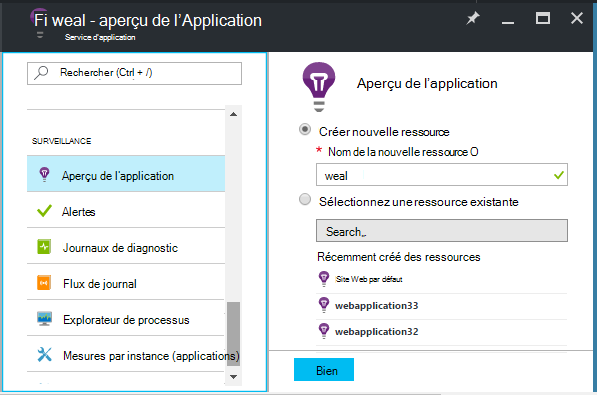
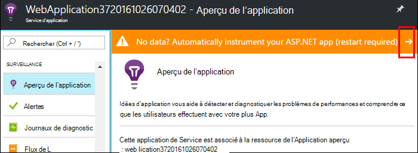
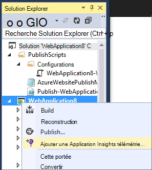
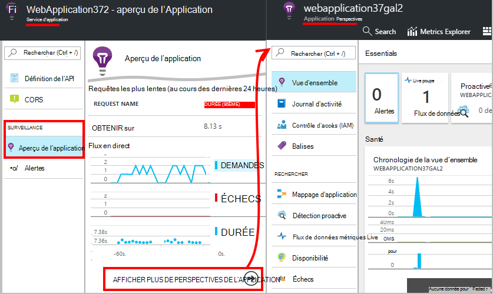
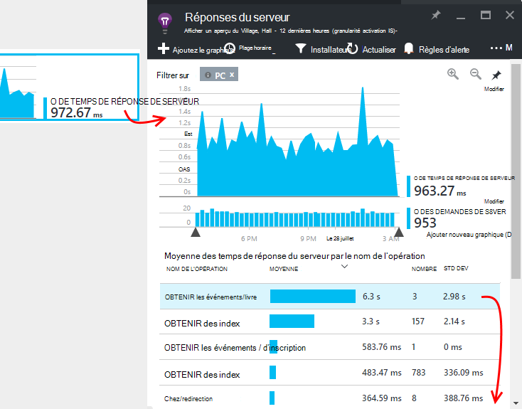
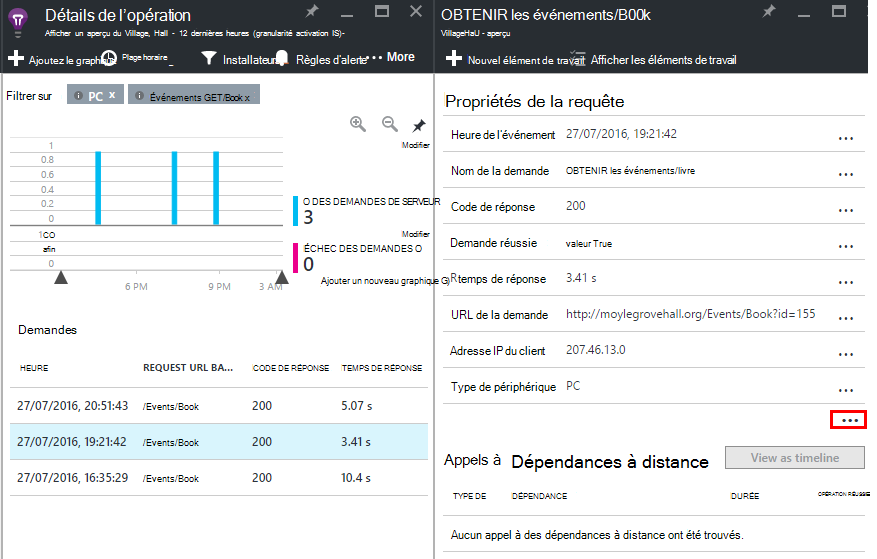

<properties
    pageTitle="Surveiller les performances des applications web Azure | Microsoft Azure"
    description="Application analyse des performances pour les applications web Azure. Graphique de charge et temps de réponse, des informations sur les dépendances et définir des alertes sur les performances."
    services="application-insights"
    documentationCenter=".net"
    authors="alancameronwills"
    manager="douge"/>

<tags
    ms.service="azure-portal"
    ms.workload="na"
    ms.tgt_pltfrm="na"
    ms.devlang="na"
    ms.topic="article"
    ms.date="10/24/2016"
    ms.author="awills"/>

# Surveiller les performances des applications web Azure

Dans le [Portail Azure](https://portal.azure.com) , vous pouvez configurer application analyse des performances de vos [applications web Azure](../app-service-web/app-service-web-overview.md). [Idées d’Application Visual Studio](app-insights-overview.md) instrumente votre application pour envoyer la télémétrie sur ses activités, au service de perspectives de l’Application, où il est stocké et analysée. Métriques graphiques et outils de recherche peuvent servir à diagnostiquer les problèmes, améliorer les performances et évaluer l’utilisation de l’aide.

## Moment de l’exécution ou l’heure de création

Vous pouvez configurer une surveillance par l’instrumentation de l’application de deux manières :

* **Lors de l’exécution** , vous pouvez sélectionner une extension de performance lorsque votre application web est déjà en ligne. Il n’est pas nécessaire de recréer ou de réinstaller votre application. Vous obtenez un ensemble standard de packages qui surveillent les temps de réponse, les taux de réussite, exceptions, dépendances et ainsi de suite. 
 
* **Heure de création** - vous pouvez installer un package de votre application en cours de développement. Cette option est plus souple. Outre les packages standard, vous pouvez écrire du code pour personnaliser la télémétrie ou pour envoyer vos propres télémétrie. Vous pouvez connecter des activités spécifiques ou consigner les événements en fonction de la sémantique de votre domaine d’application. 

## Exécuter l’instrumentation de temps avec les perspectives de l’Application

Si vous exécutez déjà une application web dans Azure, vous profitez déjà certains surveillance : taux d’erreur et de la demande. Ajouter les perspectives d’Application plus, tels que les temps de réponse, la surveillance des appels à des dépendances, des détection intelligente et l’Analytique puissant langage de requête. 

1. **Sélectionner les perspectives sur l’Application** dans le panneau de contrôle Azure pour votre application web.

    

 * Choisissez de créer une nouvelle ressource, sauf si vous déjà paramétré une ressource d’informations d’Application pour cette application par une autre voie.

2. **Instrument de votre application web** une fois les perspectives d’Application a été installée. 

    

3. **Moniteur de votre application**.  [Expore les données](#explore-the-data).

Par la suite, vous pouvez générer et redéployer l’application avec les informations d’Application si vous le souhaitez.

*Comment supprimer les informations d’Application, ou passer à l’envoi à une autre ressource ?*

* Ouvrir la lame de contrôle de web application dans Azure et sous Outils de développement, ouvrez **les Extensions**. Supprimez l’extension de l’Application aperçu. Puis sous surveillance, cliquez sur Aperçu de l’Application et créez ou sélectionnez la ressource souhaitée.

## Générez l’application avec les informations d’Application

Idées d’application peuvent fournir plus de télémétrie par l’installation d’un kit de développement logiciel dans votre application. En particulier, vous pouvez collecter les journaux de suivi, [écriture de télémétrie personnalisé](../application-insights/app-insights-api-custom-events-metrics.md)et obtenir des rapports d’exception plus détaillées.

1. **Dans Visual Studio** (2013 mise à jour 2 ou version ultérieure), ajoutez le SDK de perspectives d’Application à votre projet.

    

    Si vous êtes invité à vous connecter, utilisez les informations d’identification de votre compte Azure.

    L’opération a deux effets :

 1. Crée une ressource de perspectives d’Application dans Azure, où télémétrie est stocké, analysé et affiché.
 2. Ajoute le package NuGet de perspectives d’Application à votre code et la configure pour envoyer de télémétrie pour la ressource Azure.

2. **Test de la télémétrie** par l’application en cours d’exécution sur votre ordinateur de développement (F5).

3. **Publier l’application** Azure de la manière habituelle. 

*Passage à l’envoi à une autre ressource d’idées d’Application ?*

* Dans Visual Studio, le projet avec le bouton droit, choisissez **perspectives d’Application > configurer** et cliquez sur la ressource souhaitée. Vous obtenez la possibilité de créer une nouvelle ressource. Régénérer et redéployer.

## Explorer les données

1. Sur la blade d’idées d’Application de votre Panneau de configuration web app, vous consultez Live métriques, qui affiche les demandes et les échecs en une seconde ou deux d'entre eux se produisant. Il s’agit d’affichage très utile lorsque vous êtes republier votre application, vous pouvez voir immédiatement les problèmes.

2. Cliquez pour la ressource d’idées d’Application complète.

    
    

    Vous pouvez également y accéder directement à partir de la navigation de ressource Azure.

2. Cliquez sur n’importe quel graphique pour obtenir plus de détails :

    

    Vous pouvez [Personnaliser des lames de mesures](../application-insights/app-insights-metrics-explorer.md).

3. Cliquez sur à voir des événements individuels et à leurs propriétés :

    

    «... », Notez toutes les propriétés s’ouvre.

    Vous pouvez [Personnaliser les recherches](../application-insights/app-insights-diagnostic-search.md).

Pour effectuer des recherches plus puissantes sur votre télémétrie, utilisez [langage de requête Analytique](../application-insights/app-insights-analytics-tour.md).

## Étapes suivantes

* [Activer les Azure diagnostics](app-insights-azure-diagnostics.md) à envoyer aux analyses de l’Application.
* [Mesures de fonctionnement du service Moniteur](../monitoring-and-diagnostics/insights-how-to-customize-monitoring.md) pour vous assurer que votre service est disponible et la réactivité.
* [Recevoir des notifications alertes](../monitoring-and-diagnostics/insights-receive-alert-notifications.md) chaque fois que se produisent les événements opérationnels ou métriques traverser un seuil.
* [Perspectives d’Application pour les applications de JavaScript et des pages web](app-insights-web-track-usage.md) permet d’obtenir de télémétrie de client dans les navigateurs que vous visitez une page web.
* [Configurer des tests web de disponibilité](app-insights-monitor-web-app-availability.md) pour être alerté si votre site est hors service.
