<properties
   pageTitle="Idées d’application pour les Services en nuage Azure"
   description="Surveiller vos rôles web et worker efficacement avec les perspectives de l’Application"
   services="application-insights"
   documentationCenter=""
   authors="soubhagyadash"
   manager="douge"
   editor="alancameronwills"/>

<tags
   ms.service="application-insights"
   ms.devlang="na"
   ms.tgt_pltfrm="ibiza"
   ms.topic="article"
   ms.workload="tbd"
   ms.date="03/02/2016"
   ms.author="sdash"/>

# <a name="application-insights-for-azure-cloud-services"></a>Idées d’application pour les Services en nuage Azure


*Aperçu de l’application est en mode Aperçu*

[Les applications de service Cloud de Microsoft Azure](https://azure.microsoft.com/services/cloud-services/) peuvent être surveillés par les [Perspectives d’Application Visual Studio] [ start] pour la disponibilité, les performances, les échecs et l’utilisation. Avec les commentaires que vous obtenez sur les performances et l’efficacité de votre application dans la nature, vous pouvez effectuer des choix éclairés sur la direction de la conception dans chaque cycle de développement.

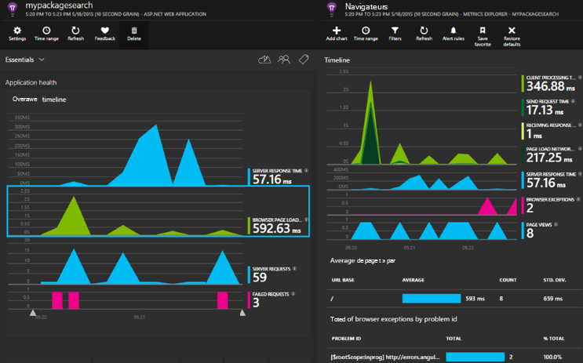

Vous aurez besoin d’un abonnement avec [Microsoft Azure](http://azure.com). Connectez-vous avec un compte Microsoft, qui peut avoir pour Windows, XBox Live ou d’autres services de cloud de Microsoft. 


#### <a name="sample-application-instrumented-with-application-insights"></a>Exemple d’Application instrumentée avec aperçus de l’Application

Examinons cet [exemple d’application](https://github.com/Microsoft/ApplicationInsights-Home/tree/master/Samples/AzureEmailService) dans lequel les perspectives d’Application est ajouté à un service cloud avec deux rôles de travail hébergés dans Azure. 

Ce qui suit vous indique comment adapter votre propre projet de service cloud de la même manière.

## <a name="create-an-application-insights-resource-for-each-role"></a>Créer une ressource d’informations d’Application pour chaque rôle

Une ressource de l’Application aperçu est où vos données de télémétrie seront analysées et affichées.  

1.  Dans le [portail Azure][portal], créez une nouvelle ressource de perspectives de l’Application. Pour le type d’application, choisissez ASP.NET app. 

    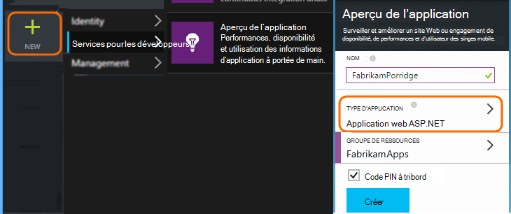

2.  Effectuer une copie de la clé de l’Instrumentation. Vous aurez besoin de peu de temps pour configurer le Kit de développement.

    


Il est généralement [préférable de créer une ressource séparée pour les données à partir de chaque rôle web et worker](app-insights-separate-resources.md). 

Comme alternative, vous pouvez envoyer des données à partir de tous les rôles à une seule ressource, mais la valeur d’une [propriété par défaut] [ apidefaults] afin que vous pouvez filtrer ou regrouper les résultats de chaque rôle.

## <a name="sdk"></a>Installer le Kit de développement de chaque projet.


1. Dans Visual Studio, modifier les packages NuGet de votre projet d’application de nuage.

    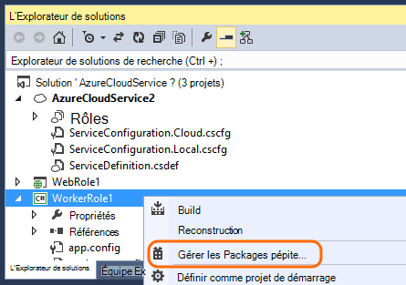


2. Pour les rôles de web, ajoutez le package NuGet [Perspectives d’Application pour le Web](http://www.nuget.org/packages/Microsoft.ApplicationInsights.Web) . Cette version du Kit de développement inclut des modules qui ajouter le contexte de serveur telles que les informations de rôle. Pour les rôles de travail, utilisez [Application les perspectives pour serveurs Windows](https://www.nuget.org/packages/Microsoft.ApplicationInsights.WindowsServer/).

    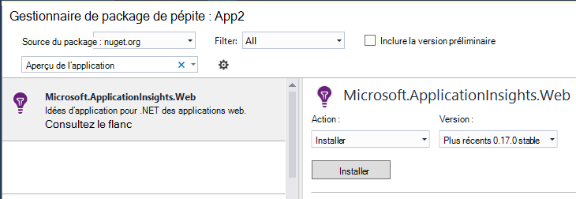


3. Configurer le Kit de développement logiciel pour envoyer des données à la ressource de perspectives de l’Application.

    La valeur de la clé de l’instrumentation sous la forme d’un paramètre de configuration dans le fichier `ServiceConfiguration.Cloud.cscfg`. ([L’exemple de code](https://github.com/Microsoft/ApplicationInsights-Home/blob/master/Samples/AzureEmailService/AzureEmailService/ServiceConfiguration.Cloud.cscfg)).
 
    ```XML
     <Role name="WorkerRoleA"> 
      <Setting name="APPINSIGHTS_INSTRUMENTATIONKEY" value="YOUR IKEY" /> 
     </Role>
    ```
 
    Dans une fonction de démarrage approprié, définissez la clé d’instrumentation à partir du paramètre de configuration :

    ```C#
     TelemetryConfiguration.Active.InstrumentationKey = RoleEnvironment.GetConfigurationSettingValue("APPINSIGHTS_INSTRUMENTATIONKEY");
    ```

    Remarque, le même nom de `APPINSIGHTS_INSTRUMENTATIONKEY` de la configuration du paramètre sera utilisé par les tests de diagnostic Azure reporting. 


    Cette opération pour chaque rôle dans votre application. Consultez les exemples :
 
 * [Rôle du Web](https://github.com/Microsoft/ApplicationInsights-Home/blob/master/Samples/AzureEmailService/MvcWebRole/Global.asax.cs#L27)
 * [Rôle de travail](https://github.com/Microsoft/ApplicationInsights-Home/blob/master/Samples/AzureEmailService/WorkerRoleA/WorkerRoleA.cs#L232)
 * [Pour les pages web](https://github.com/Microsoft/ApplicationInsights-Home/blob/master/Samples/AzureEmailService/MvcWebRole/Views/Shared/_Layout.cshtml#L13)   

4. Définissez le fichier ApplicationInsights.config pour toujours copié dans le répertoire de sortie. 

    (Dans le fichier .config, vous verrez les messages vous demandant de placer la clé instrumentation il. Toutefois, pour les applications en nuage, il est préférable de définir à partir du fichier .cscfg. Cela garantit que le rôle est correctement identifié dans le portail du.)


#### <a name="run-and-publish-the-app"></a>Exécuter et publier l’application

Exécuter votre application et vous connecter à Azure. Ouvrir les ressources de perspectives d’Application que vous avez créé et vous verrez apparaître dans la [recherche](app-insights-diagnostic-search.md)de points de données individuels et les données agrégées dans la [Mesure de l’Explorateur](app-insights-metrics-explorer.md). 

Ajouter plus de télémétrie - consultez les sections ci-dessous - et publier votre application pour obtenir des commentaires de diagnostic et de l’utilisation de live. 


#### <a name="no-data"></a>Aucune donnée ?

* Ouvrir la [recherche] [ diagnostic] carré, pour voir les événements individuels.
* Utilisez l’application, ouvrez les différentes pages afin qu’il génère certains télémétrie.
* Attendez quelques secondes et cliquez sur Actualiser.
* Voir [Dépannage de le][qna].


## <a name="more-telemetry"></a>Plus de télémétrie

Les sections suivantes montrent comment obtenir des télémétrie supplémentaire à partir de différents aspects de votre application.


## <a name="track-requests-from-worker-roles"></a>Suivre les demandes de rôles Worker

Dans rôles de web, le module de demandes recueille automatiquement les données sur les demandes HTTP. Consultez l' [exemple MVCWebRole](https://github.com/Microsoft/ApplicationInsights-Home/tree/master/Samples/AzureEmailService/MvcWebRole) pour obtenir des exemples de la façon dont vous pouvez substituer le comportement de la collection par défaut. 

Vous pouvez capturer les performances des appels à des rôles de travail de suivi de la même façon que les demandes HTTP. Dans les analyses de l’Application, le type de demande de télémétrie mesure une unité de travail de côté serveur nommé qui peut être programmé et pouvez indépendamment réussissent ou échouent. Alors que les requêtes HTTP sont capturées automatiquement par le SDK, vous pouvez insérer votre propre code pour effectuer le suivi des demandes de rôles worker.

Consultez les deux rôles de travail exemple instrumentés pour les demandes de rapport : [WorkerRoleA](https://github.com/Microsoft/ApplicationInsights-Home/tree/master/Samples/AzureEmailService/WorkerRoleA) et [WorkerRoleB](https://github.com/Microsoft/ApplicationInsights-Home/tree/master/Samples/AzureEmailService/WorkerRoleB)

## <a name="azure-diagnostics"></a>Diagnostics de Windows Azure

Les données de [Diagnostic d’Azure](../vs-azure-tools-diagnostics-for-cloud-services-and-virtual-machines.md) incluent les événements de gestion des rôles, des compteurs de performance et les journaux de l’application. Vous pouvez avoir ces envoyés aux analyses d’Application afin que vous puissiez voir les avec le reste de votre télémétrie, rendant plus facile à diagnostiquer les problèmes.

Diagnostics de Windows Azure sont particulièrement utiles si un rôle échoue de manière inattendue ou ne parvient pas à démarrer.

1. Bouton droit le rôle (et non le projet !) pour ouvrir ses propriétés et sélectionnez **Activer les tests de diagnostic**, **envoi de diagnostic pour les perspectives de l’Application**.

    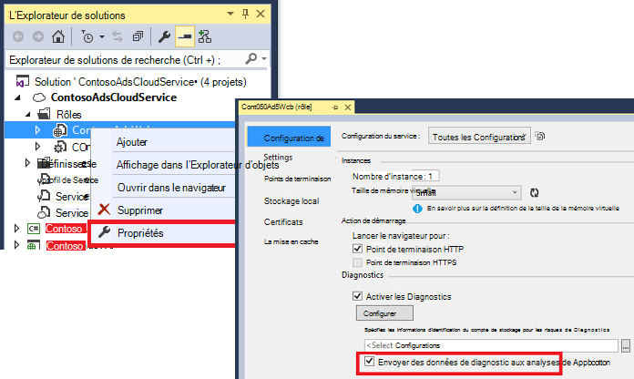

    **Ou si votre application est déjà publiée et en cours d’exécution**, ouvrir Explorateur de serveurs Cloud Explorer, avec le bouton droit de votre application et sélectionner la même option.

3.  Sélectionnez la même ressource de perspectives de l’Application en tant que vos autre télémétrie.

    Si vous le souhaitez, vous pouvez définir une autre ressource dans les configurations de services différentes (Cloud, Local) afin de séparer les données de développement à partir de données en temps réel.

3. Le cas échéant, [exclure certains des tests de diagnostic Azure](app-insights-azure-diagnostics.md) que vous souhaitez transmis aux analyses de l’Application. La valeur par défaut est tous les éléments.

### <a name="view-azure-diagnostic-events"></a>Afficher les événements de diagnostics Azure

Où trouver les tests de diagnostic :

* Les compteurs de performance sont affichés en tant que mesures personnalisées. 
* Journaux d’événements Windows sont affichées sous forme de traces et des événements personnalisés.
* Journaux d’application, les journaux ETW et des journaux d’infrastructure de diagnostic apparaissent sous forme de traces.

Pour afficher les compteurs de performance et le nombre d’événements, ouvrez [L’Explorateur métriques](app-insights-metrics-explorer.md) et ajouter un nouveau graphique :


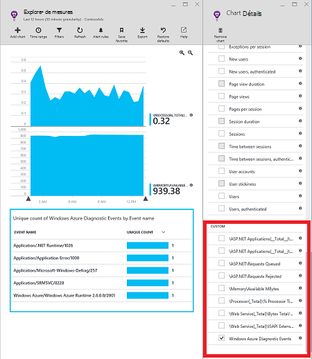

Utilisez [recherche](app-insights-diagnostic-search.md) pour rechercher dans les différents journaux de trace envoyées par les tests de diagnostic Azure. Par exemple, si vous aviez une exception unhanded dans un rôle qui a causé le rôle à se bloquer et de recyclage, que des informations seraient inscrive dans le canal de Windows journal des événements applications. Vous pouvez utiliser la fonctionnalité de recherche de rechercher l’erreur du journal des événements Windows et d’obtenir la trace de la pile de l’exception, ce qui vous permet de déterminer la cause du problème.


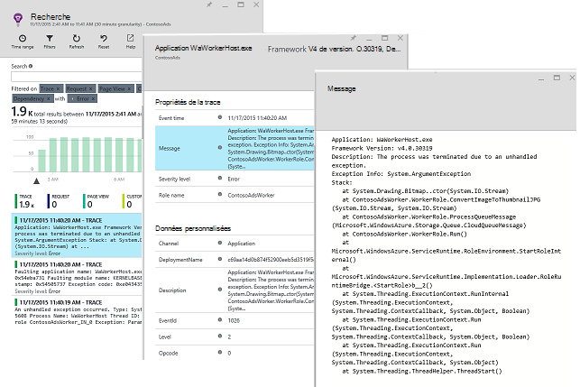

## <a name="app-diagnostics"></a>Diagnostic de l’application

Diagnostics de Windows Azure inclut automatiquement des entrées de journal qui génère de votre application à l’aide de System.Diagnostics.Trace. 

Mais si vous utilisez déjà les structures Log4N ou NLog, vous pouvez également [capturer leur journal][netlogs].

[Effectuer le suivi des événements personnalisés et les mesures de] [ api] de client serveur ou les deux, pour en savoir plus sur les performances et d’utilisation de votre application.

## <a name="dependencies"></a>Dépendances

SDK de perspectives d’application peut signaler les appels passés par votre application pour les dépendances externes telles que les serveurs SQL et les API du reste. Cela vous permet de voir si une dépendance particulière est à l’origine de réponses lentes ou des défaillances.

Si votre application utilise le .NET framework version 4.6 ou ultérieure, vous n’avez pas besoin de rien d’autre. 

Sinon, configurez le rôle web/travailleur avec l' [Agent de perspectives d’Application](app-insights-monitor-performance-live-website-now.md) également connu sous le nom « moniteur d’état ».

Pour utiliser l’Agent de perspectives d’Application avec vos rôles web/travailleur :

* Ajouter le dossier [AppInsightsAgent](https://github.com/Microsoft/ApplicationInsights-Home/tree/master/Samples/AzureEmailService/WorkerRoleA/AppInsightsAgent) et les deux fichiers qu’il contient pour vos projets de rôle web/travailleur. Veillez à définir leurs propriétés de build afin qu’ils sont toujours copiés dans le répertoire de sortie. Ces fichiers installent l’agent.
* Ajouter la tâche de démarrage dans le fichier CSDEF comme indiqué [ici](https://github.com/Microsoft/ApplicationInsights-Home/tree/master/Samples/AzureEmailService/AzureEmailService/ServiceDefinition.csdef#L18).
* Remarque : Les *rôles Worker* nécessitent trois variables d’environnement comme indiqué [ici](https://github.com/Microsoft/ApplicationInsights-Home/tree/master/Samples/AzureEmailService/AzureEmailService/ServiceDefinition.csdef#L44). Ce n’est pas requis pour les rôles web.

### <a name="dependency-reports"></a>Rapports sur les dépendances

Voici un exemple de ce que vous voyez sur le portail d’idées d’Application :

* Tests de diagnostic enrichi avec des dépendances et des demandes automatiquement en corrélation :

    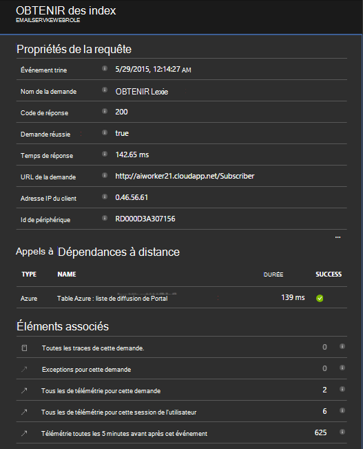

* Performances du rôle web, avec les informations de dépendance :

    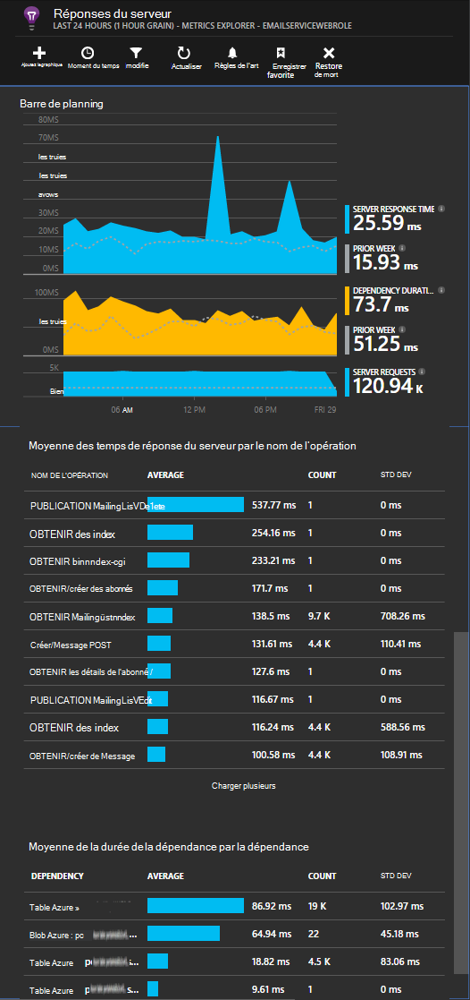

* Voici une capture d’écran sur les demandes et les informations de dépendance pour un rôle de travail :

    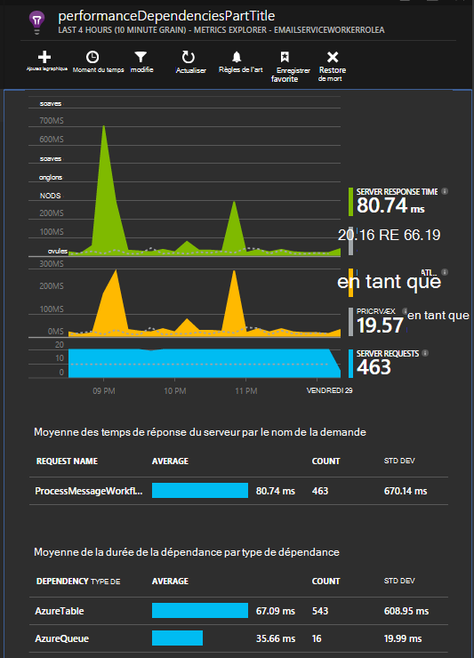

## <a name="exceptions"></a>Exceptions

Pour plus d’informations sur comment vous pouvez recueillir les exceptions non gérées à partir de types d’applications web différents, consultez [Surveillance des Exceptions dans les perspectives de l’Application](app-insights-asp-net-exceptions.md) .

Le rôle web exemple possède des contrôleurs de MVC5 et les API de Web 2. Les exceptions non gérées à partir de 2 sont capturées avec les éléments suivants :

* [AiHandleErrorAttribute](https://github.com/Microsoft/ApplicationInsights-Home/blob/master/Samples/AzureEmailService/MvcWebRole/Telemetry/AiHandleErrorAttribute.cs) configurer [ici](https://github.com/Microsoft/ApplicationInsights-Home/blob/master/Samples/AzureEmailService/MvcWebRole/App_Start/FilterConfig.cs#L12) pour les contrôleurs de MVC5
* [AiWebApiExceptionLogger](https://github.com/Microsoft/ApplicationInsights-Home/blob/master/Samples/AzureEmailService/MvcWebRole/Telemetry/AiWebApiExceptionLogger.cs) configurer [ici](https://github.com/Microsoft/ApplicationInsights-Home/blob/master/Samples/AzureEmailService/MvcWebRole/App_Start/WebApiConfig.cs#L25) pour les contrôleurs de l’API de Web 2

Pour les rôles de travail, il existe deux façons d’effectuer le suivi des exceptions.

* TrackException(ex)
* Si vous avez ajouté le package NuGet de perspectives d’Application trace écouteur, vous pouvez utiliser System.Diagnostics.Trace pour enregistrer les exceptions. [Exemple de code.](https://github.com/Microsoft/ApplicationInsights-Home/blob/master/Samples/AzureEmailService/WorkerRoleA/WorkerRoleA.cs#L107)

## <a name="performance-counters"></a>Compteurs de performance

Les compteurs suivants sont collectés par défaut :

    * \Process(??APP_WIN32_PROC??)\% temps processeur
    * \Memory\Available octets
    * \.NET CLR Exceptions(??APP_CLR_PROC??)\# d’exceptions levées / s
    * \Processus ( ??. APP_WIN32_PROC ??) \Private octets
    * \Processus ( ??. APP_WIN32_PROC ??) \IO octets de données par seconde
    * \Processor(_Total)\% temps processeur

En outre, les éléments suivants sont également collectés pour les rôles web :

    * \ASP.NET applications ( ??. APP_W3SVC_PROC ??) \Requests/sec    
    * \ASP.NET applications ( ??. APP_W3SVC_PROC ??) Temps d’exécution \Request
    * \ASP.NET applications ( ??. APP_W3SVC_PROC ??) \Requests dans la file d’attente de l’Application

Vous pouvez spécifier personnalisés supplémentaires ou autres compteurs de performance windows comme indiqué [ici](https://github.com/Microsoft/ApplicationInsights-Home/blob/master/Samples/AzureEmailService/WorkerRoleA/ApplicationInsights.config#L14)

  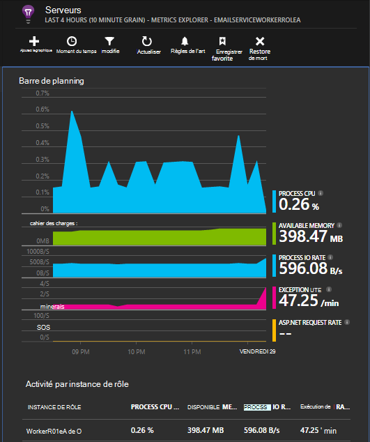

## <a name="correlated-telemetry-for-worker-roles"></a>Corrélation de télémétrie pour les rôles de travail

Il s’agit d’une riche expérience de diagnostic, lorsque vous pouvez voir ce qui a conduit à une demande ayant échoué ou à forte latence. Grâce aux rôles de web, le Kit de développement logiciel configure automatiquement la corrélation entre la télémétrie connexe. Pour les rôles de travail, vous pouvez utiliser un initialiseur de télémétrie personnalisé pour définir un attribut de contexte Operation.Id commun pour tous les la télémétrie pour y parvenir. Cela vous permettra de voir si le problème de latence ou l’échec a été provoqué en raison d’une dépendance ou votre code, en un clin de œil ! 

Voici comment :

* Définir l’Id de corrélation dans un objet CallContext comme indiqué [ici](https://github.com/Microsoft/ApplicationInsights-Home/blob/master/Samples/AzureEmailService/WorkerRoleA/WorkerRoleA.cs#L36). Dans ce cas, nous utilisons l’ID de demande comme l’id de corrélation
* Ajouter une implémentation personnalisée de la TelemetryInitializer, qui définira la Operation.Id à l’identificateur de corrélation ci-dessus. Exemple : [ItemCorrelationTelemetryInitializer](https://github.com/Microsoft/ApplicationInsights-Home/blob/master/Samples/AzureEmailService/WorkerRoleA/Telemetry/ItemCorrelationTelemetryInitializer.cs#L13)
* Ajouter l’initialiseur de télémétrie personnalisé. Vous pourriez le faire dans le fichier ApplicationInsights.config ou dans le code comme indiqué [ici](https://github.com/Microsoft/ApplicationInsights-Home/blob/master/Samples/AzureEmailService/WorkerRoleA/WorkerRoleA.cs#L233)

Voilà ! L’utilisation du portail est déjà intégrée pour vous aider à voir les télémétrie en un clin de œil :

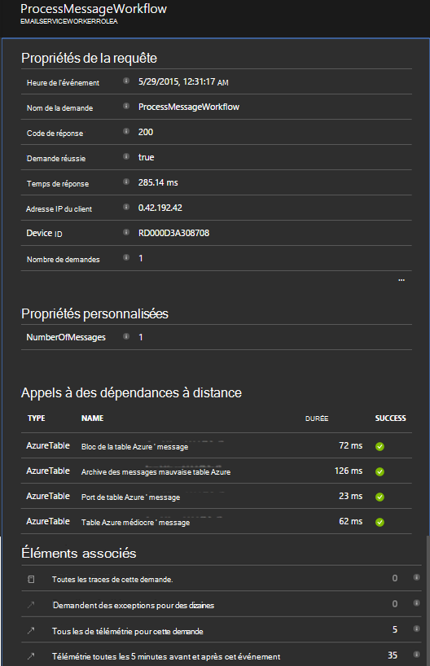


## <a name="client-telemetry"></a>TELEMETRIE de client

[Ajouter le SDK JavaScript à vos pages web] [ client] pour obtenir basée sur navigateur de télémétrie, tels que les comptes d’affichages de page, les temps de chargement de page, les exceptions de script et vous permettent d’écrire de télémétrie personnalisée dans vos scripts de la page.

## <a name="availability-tests"></a>Tests de disponibilité

[Paramétrer des tests web] [ availability] pour vous assurer que votre application reste réactive et en temps réel.


## <a name="example"></a>Exemple

[L’exemple](https://github.com/Microsoft/ApplicationInsights-Home/tree/master/Samples/AzureEmailService) analyse un service qui a un rôle web et deux rôles de travail.

## <a name="exception-method-not-found-on-running-in-azure-cloud-services"></a>Exception « méthode introuvable » sur l’exécution de Services Cloud Azure

Vous n’avez généré pour .NET 4.6 ? 4.6 n’est pas pris en charge dans les rôles d’Azure Cloud Services automatiquement. [4.6 d’installer sur chaque rôle](../cloud-services/cloud-services-dotnet-install-dotnet.md) avant d’exécuter votre application.

## <a name="related-topics"></a>Rubriques connexes

* [Configurer l’envoi des Diagnostics d’Azure aux analyses de l’Application](app-insights-azure-diagnostics.md)
* [Utilisation de PowerShell pour envoyer les diagnostics de Windows Azure pour les perspectives de l’Application](app-insights-powershell-azure-diagnostics.md)


[api]: app-insights-api-custom-events-metrics.md
[apidefaults]: app-insights-api-custom-events-metrics.md#default-properties
[apidynamicikey]: app-insights-separate-resources.md#dynamic-ikey
[availability]: app-insights-monitor-web-app-availability.md
[azure]: app-insights-azure.md
[client]: app-insights-javascript.md
[diagnostic]: app-insights-diagnostic-search.md
[netlogs]: app-insights-asp-net-trace-logs.md
[portal]: http://portal.azure.com/
[qna]: app-insights-troubleshoot-faq.md
[redfield]: app-insights-monitor-performance-live-website-now.md
[start]: app-insights-overview.md 
