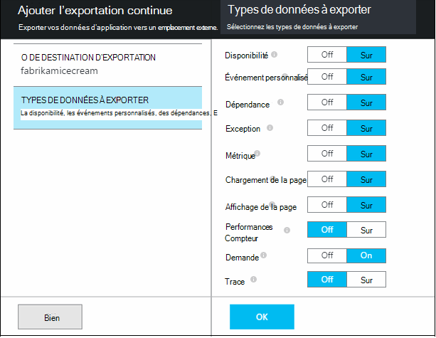
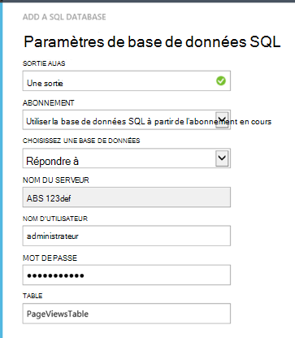

<properties 
    pageTitle="Procédure pas à pas : exporter télémétrie à SQL de base de données à partir de l’aperçu de l’Application" 
    description="En continu Exporter données d’idées d’Application vers SQL à l’aide de flux de données Analytique." 
    services="application-insights" 
    documentationCenter=""
    authors="noamben" 
    manager="douge"/>

<tags 
    ms.service="application-insights" 
    ms.workload="tbd" 
    ms.tgt_pltfrm="ibiza" 
    ms.devlang="na" 
    ms.topic="article" 
    ms.date="03/06/2015" 
    ms.author="awills"/>
 
# <a name="walkthrough-export-to-sql-from-application-insights-using-stream-analytics"></a>Procédure pas à pas : Exportation vers SQL à partir de perspectives d’Application à l’aide de flux de données Analytique

Cet article explique comment déplacer vos données de télémétrie [d’Idées d’Application Visual Studio] [ start] dans une base de données Azure SQL à l’aide [d’Exporter Continuous] [ export] et [Azure flux Analytique](https://azure.microsoft.com/services/stream-analytics/). 

Exporter Continuous déplace les données de télémétrie dans le stockage Azure au format JSON. Nous analyser les objets JSON à l’aide d’Azure flux Analytique et créer des lignes dans une table de base de données.

(En règle générale, exporter Continuous est la façon d’effectuer votre propre analyse de la télémétrie vos applications envoyer aux analyses de l’Application. Vous pouvez adapter cet exemple de code pour effectuer d’autres opérations avec la télémétrie exporté, telles que l’agrégation de données.)

Nous allons commencer en partant du principe que vous avez déjà l’application que vous souhaitez surveiller.


Dans cet exemple, nous allons utiliser les données d’affichage de page, mais le même modèle peut facilement être étendu à d’autres types de données tels que les événements personnalisés et les exceptions. 


## <a name="add-application-insights-to-your-application"></a>Ajouter des informations d’Application à votre application


Mise en route :

1. [Configurer les informations d’Application pour vos pages web](app-insights-javascript.md). 

    (Dans cet exemple, nous allons nous concentrer sur le traitement des données de la page Afficher les navigateurs clients, mais vous pouvez également configurer perspectives d’Application pour le côté serveur de votre application [ASP.NET](app-insights-asp-net.md) ou de [Java](app-insights-java-get-started.md) et traiter la demande, dépendance et autre télémétrie server.)


5. Publier votre application et de surveiller les données de télémétrie figurant dans votre ressource de perspectives de l’Application.


## <a name="create-storage-in-azure"></a>Créer un espace de stockage dans Azure

Exporter Continuous retourne toujours les données dans un compte de stockage Azure, vous devez d’abord créer le stockage.

1. Créer un compte de stockage de votre abonnement [Azure portal][portal].

    

2. Créer un conteneur

    

3. Copiez la clé d’accès de stockage

    Vous en aurez besoin ultérieurement pour définir l’entrée pour le service d’analytique de flux de données.

    

## <a name="start-continuous-export-to-azure-storage"></a>Démarrer l’exportation continue au stockage Azure

1. Dans le portail Azure, accédez à la ressource de perspectives d’Application que vous avez créé pour votre application.

    

2. Créer une exportation continue.

    


    Sélectionnez le compte de stockage que vous avez créé précédemment :

    
    
    Définir les types d’événements que vous souhaitez afficher :

    


3. Laisser certaines données s’accumulent. Détendez-vous et laissez les personnes à utiliser votre application pendant un certain temps. Télémétrie arriveront et vous verrez des graphiques statistiques dans [l’Explorateur de métriques](app-insights-metrics-explorer.md) et événements individuels dans la [recherche de diagnostic](app-insights-diagnostic-search.md). 

    Et, également, d’exportation de données à votre système de stockage. 

4. Inspecter le contenu exporté des données, soit dans le portail - cliquez sur **Parcourir**, sélectionnez votre compte de stockage et **les conteneurs** - ou, dans Visual Studio. Dans Visual Studio, choisissez **Afficher / Cloud Explorer**, ouvrez Azure / stockage. (Si vous n’avez pas cette option de menu, vous devez installer le SDK Azure : ouvrir la boîte de dialogue Nouveau projet, puis ouvrez Visual C# / Cloud / obtenir Microsoft Azure SDK .NET.)

    

    Prenez note de la partie commune du nom de chemin d’accès, qui est dérivée de la clé de nom et d’instrumentation d’application. 

Les événements sont écrits dans le blob de fichiers au format JSON. Chaque fichier peut contenir un ou plusieurs événements. Nous souhaitons donc lire les données d’événement et de filtrer les champs. Il existe toutes sortes de choses que nous pouvons faire avec les données, mais notre plan aujourd'hui est d’utiliser des flux de données Analytique pour déplacer les données vers une base de données SQL. Qui rend facile à exécuter beaucoup de questions intéressantes.

## <a name="create-an-azure-sql-database"></a>Créer une base de données SQL Azure

Encore une fois à partir de votre abonnement dans [Azure portal][portal], créer la base de données (et un nouveau serveur, sauf si vous avez déjà un) à laquelle vous allez écrire les données.


Assurez-vous que le serveur de base de données permet d’accéder aux services Azure :


## <a name="create-a-table-in-azure-sql-db"></a>Créer une table dans la base de données SQL Azure

Se connecter à la base de données créée dans la section précédente avec votre outil de gestion par défaut. Dans cette procédure pas à pas, nous allons utiliser [Des outils de gestion SQL Server](https://msdn.microsoft.com/ms174173.aspx) (SSMS).


Créez une nouvelle requête et exécuter le T-SQL suivant :

```SQL

CREATE TABLE [dbo].[PageViewsTable](
    [pageName] [nvarchar](max) NOT NULL,
    [viewCount] [int] NOT NULL,
    [url] [nvarchar](max) NULL,
    [urlDataPort] [int] NULL,
    [urlDataprotocol] [nvarchar](50) NULL,
    [urlDataHost] [nvarchar](50) NULL,
    [urlDataBase] [nvarchar](50) NULL,
    [urlDataHashTag] [nvarchar](max) NULL,
    [eventTime] [datetime] NOT NULL,
    [isSynthetic] [nvarchar](50) NULL,
    [deviceId] [nvarchar](50) NULL,
    [deviceType] [nvarchar](50) NULL,
    [os] [nvarchar](50) NULL,
    [osVersion] [nvarchar](50) NULL,
    [locale] [nvarchar](50) NULL,
    [userAgent] [nvarchar](max) NULL,
    [browser] [nvarchar](50) NULL,
    [browserVersion] [nvarchar](50) NULL,
    [screenResolution] [nvarchar](50) NULL,
    [sessionId] [nvarchar](max) NULL,
    [sessionIsFirst] [nvarchar](50) NULL,
    [clientIp] [nvarchar](50) NULL,
    [continent] [nvarchar](50) NULL,
    [country] [nvarchar](50) NULL,
    [province] [nvarchar](50) NULL,
    [city] [nvarchar](50) NULL
)

CREATE CLUSTERED INDEX [pvTblIdx] ON [dbo].[PageViewsTable]
(
    [eventTime] ASC
)WITH (PAD_INDEX = OFF, STATISTICS_NORECOMPUTE = OFF, SORT_IN_TEMPDB = OFF, DROP_EXISTING = OFF, ONLINE = OFF, ALLOW_ROW_LOCKS = ON, ALLOW_PAGE_LOCKS = ON)

```


Dans cet exemple, nous utilisons les données à partir de vues de page. Pour afficher les données disponibles, inspecter votre sortie JSON et voir l' [exportation du modèle de données](app-insights-export-data-model.md).

## <a name="create-an-azure-stream-analytics-instance"></a>Créer une instance d’Azure flux Analytique

À partir du [Portail d’Azure classique](https://manage.windowsazure.com/), sélectionnez le service Analytique de flux d’Azure et créer une nouvelle tâche de flux de données Analytique :


Lors de la création du nouveau projet, développez les détails :


#### <a name="set-blob-location"></a>Définir un emplacement blob

Définir à partir du blob exporter Continuous :


Vous devez maintenant la clé primaire de l’accès à partir de votre compte de stockage, vous avez noté précédemment. Définir en tant que la clé de compte de stockage.


#### <a name="set-path-prefix-pattern"></a>Modèle de préfixe de chemin d’accès défini 


Veillez à définir le Format de Date au **Format AAAA-MM-JJ** (avec les **tirets**).

Le modèle du préfixe de chemin d’accès spécifie comment les flux Analytique recherche les fichiers d’entrée dans le stockage. Vous devez définir pour le correspond à exporter Continuous le stockage des données. Définissez-le comme suit :

    webapplication27_12345678123412341234123456789abcdef0/PageViews/{date}/{time}

Dans cet exemple :

* `webapplication27`est le nom de la ressource de perspectives de l’Application, **tout en minuscules**. 
* `1234...`est la clé de l’instrumentation de l’Application Insights ressource **avec tirets supprimés**. 
* `PageViews`est le type de données que vous souhaitez analyser. Les types disponibles varient en fonction du filtre que vous définissez dans exporter Continuous. Examinez les données exportées pour voir d’autres types disponibles et voir l' [exportation du modèle de données](app-insights-export-data-model.md).
* `/{date}/{time}`un modèle est écrit littéralement.

Pour obtenir le nom et l’iKey de votre ressource de perspectives de l’Application, ouvrez Essentials sur sa page de vue d’ensemble, ou paramètres.

#### <a name="finish-initial-setup"></a>Terminer l’installation initiale

Vérifiez le format de sérialisation :


Fermer l’Assistant et attendez que l’installation se termine.

>[AZURE.TIP] L’exemple de fonction permet de vérifier que vous avez défini le chemin d’accès d’entrée correctement. En cas d’échec : Vérifiez qu’il existe des données dans le stockage pour la plage de temps échantillon que vous avez choisi. Modifier la définition d’entrée et définir le compte de stockage, le préfixe de chemin d’accès et de la date format correctement.

## <a name="set-query"></a>Requête de jeu

Ouvrez la section de la requête :


Remplacer la requête par défaut avec :

```SQL

    SELECT flat.ArrayValue.name as pageName
    , flat.ArrayValue.count as viewCount
    , flat.ArrayValue.url as url
    , flat.ArrayValue.urlData.port as urlDataPort
    , flat.ArrayValue.urlData.protocol as urlDataprotocol
    , flat.ArrayValue.urlData.host as urlDataHost
    , flat.ArrayValue.urlData.base as urlDataBase
    , flat.ArrayValue.urlData.hashTag as urlDataHashTag
      ,A.context.data.eventTime as eventTime
      ,A.context.data.isSynthetic as isSynthetic
      ,A.context.device.id as deviceId
      ,A.context.device.type as deviceType
      ,A.context.device.os as os
      ,A.context.device.osVersion as osVersion
      ,A.context.device.locale as locale
      ,A.context.device.userAgent as userAgent
      ,A.context.device.browser as browser
      ,A.context.device.browserVersion as browserVersion
      ,A.context.device.screenResolution.value as screenResolution
      ,A.context.session.id as sessionId
      ,A.context.session.isFirst as sessionIsFirst
      ,A.context.location.clientip as clientIp
      ,A.context.location.continent as continent
      ,A.context.location.country as country
      ,A.context.location.province as province
      ,A.context.location.city as city
    INTO
      AIOutput
    FROM AIinput A
    CROSS APPLY GetElements(A.[view]) as flat


```

Notez que les propriétés de quelques premier sont spécifiques aux données d’affichage de page. Les exportations d’autres types de télémétrie possède des propriétés différentes. Consultez le [détaillées de référence de modèle de données pour les valeurs et les types de propriété.](app-insights-export-data-model.md)

## <a name="set-up-output-to-database"></a>Configurer la sortie à la base de données

Sélectionnez SQL comme sortie.


Spécifiez la base de données SQL.




Fermer l’Assistant et attendre une notification indiquant que la sortie a été définie.

## <a name="start-processing"></a>Démarrer le traitement

Démarrer le travail à partir de la barre d’action :


Vous pouvez choisir lancer le traitement des données à partir de maintenant, ou sur des données antérieures commence. Ce dernier est utile si vous avez eu continue exportation déjà en cours d’exécution pendant un certain temps.


Après quelques minutes, retournez aux outils de gestion SQL Server et surveiller les données transitant dans. Par exemple, utiliser une requête comme suit :

    SELECT TOP 100 *
    FROM [dbo].[PageViewsTable]


## <a name="related-articles"></a>Articles connexes

* [Exporter vers SQL à l’aide d’un rôle de collaborateur](app-insights-code-sample-export-telemetry-sql-database.md)
* [Exporter vers PowerBI à l’aide de flux de données Analytique](app-insights-export-power-bi.md)
* [Données détaillées du modèle de référence pour les types de propriété et les valeurs.](app-insights-export-data-model.md)
* [Exportation en continu dans les perspectives de l’Application](app-insights-export-telemetry.md)
* [Aperçu de l’application](https://azure.microsoft.com/services/application-insights/)

<!--Link references-->

[diagnostic]: app-insights-diagnostic-search.md
[export]: app-insights-export-telemetry.md
[metrics]: app-insights-metrics-explorer.md
[portal]: http://portal.azure.com/
[start]: app-insights-overview.md

 