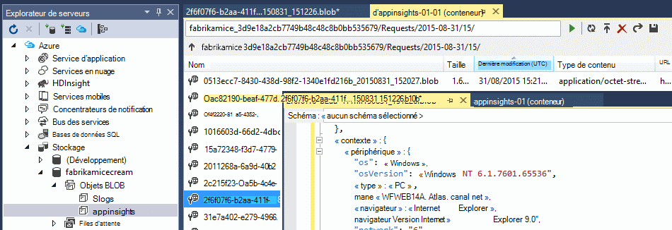
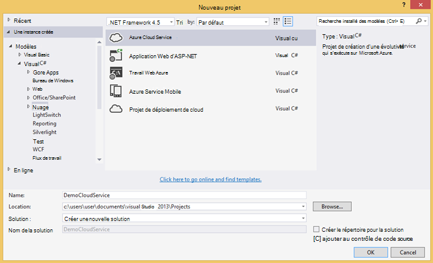

<properties 
    pageTitle="Exemple de code : analyser les données exportées à partir de l’aperçu de l’Application" 
    description="Votre propre analyse de télémétrie dans les perspectives de l’Application du code à l’aide de la fonctionnalité d’exportation continue. Enregistrer les données dans SQL." 
    services="application-insights" 
    documentationCenter=""
    authors="mazharmicrosoft" 
    manager="douge"/>

<tags 
    ms.service="application-insights" 
    ms.workload="tbd" 
    ms.tgt_pltfrm="ibiza" 
    ms.devlang="na" 
    ms.topic="article" 
    ms.date="01/05/2016" 
    ms.author="awills"/>
 
# Exemple de code : analyser les données exportées à partir de l’aperçu de l’Application

Cet article explique comment traiter les données JSON exportées à partir de perspectives de l’Application. Par exemple, nous allons écrire le code pour déplacer vos données de télémétrie [d’Idées d’Application Visual Studio] [ start] dans une base de données Azure SQL à l’aide [d’Exporter Continuous][export]. (Vous pouvez également obtenir ce [à l’aide de flux de données Analytique](app-insights-code-sample-export-sql-stream-analytics.md), mais notre objectif ici est de vous montrer du code). 

Exporter Continuous déplace votre télémétrie dans le stockage Azure au format JSON, donc nous allons écrire du code pour analyser les objets JSON et à créer des lignes dans une table de base de données.

Plus généralement, exporter Continuous est la façon d’effectuer votre propre analyse de la télémétrie vos applications envoyer aux analyses de l’Application. Vous pourriez adapter cet exemple de code pour effectuer d’autres opérations avec la télémétrie exporté.

Nous allons commencer en partant du principe que vous avez déjà l’application que vous souhaitez surveiller.

## Ajouter les perspectives d’Application SDK

Pour analyser votre application, de vous [Ajouter un kit de développement de perspectives Application] [ start] à votre application. Il existe différents kits de développement de logiciel et outils d’assistance pour les différentes plates-formes, les langues et IDE. Vous pouvez surveiller des pages web, des serveurs web Java ou ASP.NET et les périphériques mobiles de plusieurs types. Tous les kits de développement logiciel envoyer de télémétrie pour le [portail d’idées d’Application][portal], où vous pouvez utiliser nos outils de diagnostic et d’analyse puissante et exporter les données vers le stockage.

Mise en route :

1. Obtenir un [compte dans Microsoft Azure](https://azure.microsoft.com/pricing/).
2. Dans le [portail Azure][portal], ajouter une nouvelle ressource d’idées d’Application pour votre application :

    

    (Le type d’application et votre abonnement peuvent être différents.)
3. Ouvrez le démarrage rapide pour savoir comment configurer le Kit de développement pour votre type d’application.

    

    Si le type de votre application n’est pas répertorié, examinons la [Mise en route] [ start] page.

4. Dans cet exemple, nous surveillons une application web, afin de pouvoir utiliser les outils Azure dans Visual Studio pour installer le Kit de développement logiciel. Nous lui indiquer le nom de ressource de nos perspectives d’Application :

    

## Créer un espace de stockage dans Azure

Les données à partir de l’aperçu de l’Application sont toujours exportées vers un compte de stockage Azure au format JSON. Il est à partir de ce système de stockage que votre code lit les données.

1. Créer un compte de stockage « classique » dans votre abonnement [Azure portal][portal].

    

2. Créer un conteneur

    

## Démarrer l’exportation continue au stockage Azure

1. Dans le portail Azure, accédez à la ressource de perspectives d’Application que vous avez créé pour votre application.

    

2. Créer une exportation continue.

    

    Sélectionnez le compte de stockage que vous avez créé précédemment :

    
    
    Définir les types d’événements que vous souhaitez afficher :

    

3. Laisser certaines données s’accumulent. Détendez-vous et laissez les personnes à utiliser votre application pendant un certain temps. Télémétrie arriveront et vous verrez des graphiques statistiques dans [l’Explorateur de métriques](app-insights-metrics-explorer.md) et événements individuels dans la [recherche de diagnostic](app-insights-diagnostic-search.md). 

    Et, également, d’exportation de données à votre système de stockage. 

4. Vérifiez que les données exportées. Dans Visual Studio, choisissez **Afficher / Cloud Explorer**, ouvrez Azure / stockage. (Si vous n’avez pas cette option de menu, vous devez installer le SDK Azure : ouvrir la boîte de dialogue Nouveau projet, puis ouvrez Visual C# / Cloud / obtenir Microsoft Azure SDK .NET.)

    

    Prenez note de la partie commune du nom de chemin d’accès, qui est dérivée de la clé de nom et d’instrumentation d’application. 

Les événements sont écrits dans le blob de fichiers au format JSON. Chaque fichier peut contenir un ou plusieurs événements. Nous souhaitons donc lire les données d’événement et de filtrer les champs. Il existe toutes sortes de choses que nous pouvons faire avec les données, mais notre plan d’aujourd'hui est d’écrire du code pour déplacer les données vers une base de données SQL. Qui rend facile à exécuter beaucoup de questions intéressantes.

## Créer une base de données SQL Azure

Pour cet exemple, nous allons écrire le code pour envoyer les données dans une base de données.

Encore une fois à partir de votre abonnement dans [Azure portal][portal], créer la base de données (et un nouveau serveur, sauf si vous avez déjà un) à laquelle vous allez écrire les données.

Assurez-vous que le serveur de base de données permet d’accéder aux services Azure :

## Créer un rôle de collaborateur 

Maintenant enfin nous pouvons écrire [du code](https://sesitai.codeplex.com/) pour analyser le JSON dans les blobs exportés et créer des enregistrements dans la base de données. Étant donné que la banque d’exportation et de la base de données sont à la fois dans Azure, nous allons exécuter le code dans un rôle de collaborateur Azure.

Ce code extrait automatiquement les propriétés sont présentes dans le JSON. Pour obtenir une description des propriétés, consultez [exportation de modèle de données](app-insights-export-data-model.md).

#### Créer le projet de rôle de travail

Dans Visual Studio, créez un nouveau projet pour le rôle de travail :

#### Se connecter sur le compte de stockage

Dans Azure, obtenir la chaîne de connexion de votre compte de stockage :

Dans Visual Studio, configurez les paramètres de rôle de travail avec la chaîne de connexion de compte de stockage :

#### Packages

Dans l’Explorateur de solutions, avec le bouton droit de votre projet de rôle de travail et choisissez Gérer les Packages NuGet.
Recherchez et installez ces packages : 

 * EntityFramework 6.1.2 ou plus tard, nous allons utiliser cela pour générer le schéma de table de base de données à la volée, en fonction du contenu de la JSON dans le blob.
 * JsonFx - nous utiliserons ce pour aplatir le JSON aux propriétés de la classe C#.

Cet outil permet de générer la classe C# notre document JSON unique. Il nécessite des modifications mineures, telles que la mise à plat des tableaux JSON en propriété C# unique d’activer une seule colonne dans la table de base de données (ex. urlData_port) 

 * [Générateur de classe C# de JSON](http://jsonclassgenerator.codeplex.com/)

## Code 

Vous pouvez placer ce code `WorkerRole.cs`.

#### Importations

    using Microsoft.WindowsAzure.Storage;

    using Microsoft.WindowsAzure.Storage.Blob;

#### Récupérer la chaîne de connexion de stockage

    private static string GetConnectionString()
    {
      return Microsoft.WindowsAzure.CloudConfigurationManager.GetSetting("StorageConnectionString");
    }

#### Exécuter le travail à intervalles réguliers

Remplacez la méthode d’exécution existante et choisissez l’intervalle souhaité. Il doit être au moins d’une heure, car la fonctionnalité d’exportation termine un objet JSON en une heure.

    public override void Run()
    {
      Trace.TraceInformation("WorkerRole1 is running");

      while (true)
      {
        Trace.WriteLine("Sleeping", "Information");

        Thread.Sleep(86400000); //86400000=24 hours //1 hour=3600000
                
        Trace.WriteLine("Awake", "Information");

        ImportBlobtoDB();
      }
    }

#### Insérez chaque objet JSON sous la forme d’une ligne de tableau

    public void ImportBlobtoDB()
    {
      try
      {
        CloudStorageAccount account = CloudStorageAccount.Parse(GetConnectionString());

        var blobClient = account.CreateCloudBlobClient();
        var container = blobClient.GetContainerReference(FilterContainer);

        foreach (CloudBlobDirectory directory in container.ListBlobs())//Parent directory
        {
          foreach (CloudBlobDirectory subDirectory in directory.ListBlobs())//PageViewPerformance
          {
            foreach (CloudBlobDirectory dir in subDirectory.ListBlobs())//2015-01-31
            {
              foreach (CloudBlobDirectory subdir in dir.ListBlobs())//22
              {
                foreach (IListBlobItem item in subdir.ListBlobs())//3IAwm6u3-0.blob
                {
                  itemname = item.Uri.ToString();
                  ParseEachBlob(container, item);
                  AuditBlob(container, directory, subDirectory, dir, subdir, item);
                } //item loop
              } //subdir loop
            } //dir loop
          } //subDirectory loop
        } //directory loop
      }
      catch (Exception ex)
      {
        //handle exception
      }
    }

#### Analyser chaque blob

    private void ParseEachBlob(CloudBlobContainer container, IListBlobItem item)
    {
      try
      {
        var blob = container.GetBlockBlobReference(item.Parent.Prefix + item.Uri.Segments.Last());
    
        string json;
    
        using (var memoryStream = new MemoryStream())
        {
          blob.DownloadToStream(memoryStream);
          json = System.Text.Encoding.UTF8.GetString(memoryStream.ToArray());
    
          IEnumerable<string> entities = json.Split('\n').Where(s => !string.IsNullOrWhiteSpace(s));
    
          recCount = entities.Count();
          failureCount = 0; //resetting failure count
    
          foreach (var entity in entities)
          {
            var reader = new JsonFx.Json.JsonReader();
            dynamic output = reader.Read(entity);
    
            Dictionary<string, object> dict = new Dictionary<string, object>();
    
            GenerateDictionary((System.Dynamic.ExpandoObject)output, dict, "");
    
            switch (FilterType)
            {
              case "PageViewPerformance":
    
              if (dict.ContainsKey("clientPerformance"))
                {
                  GenerateDictionary(((System.Dynamic.ExpandoObject[])dict["clientPerformance"])[0], dict, "");
                }
    
              if (dict.ContainsKey("context_custom_dimensions"))
              {
                if (dict["context_custom_dimensions"].GetType() == typeof(System.Dynamic.ExpandoObject[]))
                {
                  GenerateDictionary(((System.Dynamic.ExpandoObject[])dict["context_custom_dimensions"])[0], dict, "");
                }
              }
    
            PageViewPerformance objPageViewPerformance = (PageViewPerformance)GetObject(dict);
    
            try
            {
              using (var db = new TelemetryContext())
              {
                db.PageViewPerformanceContext.Add(objPageViewPerformance);
                db.SaveChanges();
              }
            }
            catch (Exception ex)
            {
              failureCount++;
            }
            break;
    
            default:
            break;
          }
        }
      }
    }
    catch (Exception ex)
    {
      //handle exception 
    }
    }

#### Préparer un dictionnaire pour chaque document JSON

    private void GenerateDictionary(System.Dynamic.ExpandoObject output, Dictionary<string, object> dict, string parent)
        {
            try
            {
                foreach (var v in output)
                {
                    string key = parent + v.Key;
                    object o = v.Value;

                    if (o.GetType() == typeof(System.Dynamic.ExpandoObject))
                    {
                        GenerateDictionary((System.Dynamic.ExpandoObject)o, dict, key + "_");
                    }
                    else
                    {
                        if (!dict.ContainsKey(key))
                        {
                            dict.Add(key, o);
                        }
                    }
                }
            }
            catch (Exception ex)
            {
            //handle exception 
            }
        }

#### Effectuez un cast du document JSON dans C# classe télémétrie, objet-propriétés

     public object GetObject(IDictionary<string, object> d)
        {
            PropertyInfo[] props = null;
            object res = null;

            try
            {
                switch (FilterType)
                {
                    case "PageViewPerformance":

                        props = typeof(PageViewPerformance).GetProperties();
                        res = Activator.CreateInstance<PageViewPerformance>();
                        break;

                    default:
                        break;
                }

                for (int i = 0; i < props.Length; i++)
                {
                    if (props[i].CanWrite && d.ContainsKey(props[i].Name))
                    {
                        props[i].SetValue(res, d[props[i].Name], null);
                    }
                }
            }
            catch (Exception ex)
            {
            //handle exception 
            }

            return res;
        }

#### PageViewPerformance fichier de classe généré à partir de documents JSON

    public class PageViewPerformance
    {
        [DatabaseGenerated(DatabaseGeneratedOption.Identity)]
        public Guid Id { get; set; }

        public string url { get; set; }

        public int urlData_port { get; set; }

        public string urlData_protocol { get; set; }

        public string urlData_host { get; set; }

        public string urlData_base { get; set; }

        public string urlData_hashTag { get; set; }

        public double total_value { get; set; }

        public double networkConnection_value { get; set; }

        public double sendRequest_value { get; set; }

        public double receiveRequest_value { get; set; }

        public double clientProcess_value { get; set; }

        public string name { get; set; }

        public string internal_data_id { get; set; }

        public string internal_data_documentVersion { get; set; }

        public DateTime? context_data_eventTime { get; set; }

        public string context_device_id { get; set; }

        public string context_device_type { get; set; }

        public string context_device_os { get; set; }

        public string context_device_osVersion { get; set; }

        public string context_device_locale { get; set; }

        public string context_device_userAgent { get; set; }

        public string context_device_browser { get; set; }

        public string context_device_browserVersion { get; set; }

        public string context_device_screenResolution_value { get; set; }

        public string context_user_anonId { get; set; }

        public string context_user_anonAcquisitionDate { get; set; }

        public string context_user_authAcquisitionDate { get; set; }

        public string context_user_accountAcquisitionDate { get; set; }

        public string context_session_id { get; set; }

        public bool context_session_isFirst { get; set; }

        public string context_operation_id { get; set; }

        public double context_location_point_lat { get; set; }

        public double context_location_point_lon { get; set; }

        public string context_location_clientip { get; set; }

        public string context_location_continent { get; set; }

        public string context_location_country { get; set; }

        public string context_location_province { get; set; }

        public string context_location_city { get; set; }
    }

#### DBcontext pour l’interaction de SQL par Entity Framework

    public class TelemetryContext : DbContext
    {
        public DbSet<PageViewPerformance> PageViewPerformanceContext { get; set; }
        public TelemetryContext()
            : base("name=TelemetryContext")
        {
        }
    }

Ajouter votre chaîne de connexion de base de données avec le nom `TelemetryContext` dans `app.config`.

## Schéma (informations uniquement)

Ceci est le schéma de la table qui sera générée pour la page d’affichage.

> [AZURE.NOTE] Vous n’êtes pas obligé d’exécuter ce script. Les attributs dans le JSON déterminent les colonnes de la table.

    CREATE TABLE [dbo].[PageViewPerformances](
    [Id] [uniqueidentifier] NOT NULL,
    [url] [nvarchar](max) NULL,
    [urlData_port] [int] NOT NULL,
    [urlData_protocol] [nvarchar](max) NULL,
    [urlData_host] [nvarchar](max) NULL,
    [urlData_base] [nvarchar](max) NULL,
    [urlData_hashTag] [nvarchar](max) NULL,
    [total_value] [float] NOT NULL,
    [networkConnection_value] [float] NOT NULL,
    [sendRequest_value] [float] NOT NULL,
    [receiveRequest_value] [float] NOT NULL,
    [clientProcess_value] [float] NOT NULL,
    [name] [nvarchar](max) NULL,
    [User] [nvarchar](max) NULL,
    [internal_data_id] [nvarchar](max) NULL,
    [internal_data_documentVersion] [nvarchar](max) NULL,
    [context_data_eventTime] [datetime] NULL,
    [context_device_id] [nvarchar](max) NULL,
    [context_device_type] [nvarchar](max) NULL,
    [context_device_os] [nvarchar](max) NULL,
    [context_device_osVersion] [nvarchar](max) NULL,
    [context_device_locale] [nvarchar](max) NULL,
    [context_device_userAgent] [nvarchar](max) NULL,
    [context_device_browser] [nvarchar](max) NULL,
    [context_device_browserVersion] [nvarchar](max) NULL,
    [context_device_screenResolution_value] [nvarchar](max) NULL,
    [context_user_anonId] [nvarchar](max) NULL,
    [context_user_anonAcquisitionDate] [nvarchar](max) NULL,
    [context_user_authAcquisitionDate] [nvarchar](max) NULL,
    [context_user_accountAcquisitionDate] [nvarchar](max) NULL,
    [context_session_id] [nvarchar](max) NULL,
    [context_session_isFirst] [bit] NOT NULL,
    [context_operation_id] [nvarchar](max) NULL,
    [context_location_point_lat] [float] NOT NULL,
    [context_location_point_lon] [float] NOT NULL,
    [context_location_clientip] [nvarchar](max) NULL,
    [context_location_continent] [nvarchar](max) NULL,
    [context_location_country] [nvarchar](max) NULL,
    [context_location_province] [nvarchar](max) NULL,
    [context_location_city] [nvarchar](max) NULL,
    CONSTRAINT [PK_dbo.PageViewPerformances] PRIMARY KEY CLUSTERED 
    (
     [Id] ASC
    )WITH (PAD_INDEX = OFF, STATISTICS_NORECOMPUTE = OFF, IGNORE_DUP_KEY = OFF, ALLOW_ROW_LOCKS = ON, ALLOW_PAGE_LOCKS = ON) ON [PRIMARY]
    ) ON [PRIMARY] TEXTIMAGE_ON [PRIMARY]

    GO

    ALTER TABLE [dbo].[PageViewPerformances] ADD  DEFAULT (newsequentialid()) FOR [Id]
    GO

Pour voir cet exemple en action, [Télécharger](https://sesitai.codeplex.com/) le code de travail complet, vous devez modifier le `app.config` paramètres et publier le rôle de collaborateur pour Azure.

## Articles connexes

* [Exporter vers SQL à l’aide d’un rôle de collaborateur](app-insights-code-sample-export-telemetry-sql-database.md)
* [Exportation en continu dans les perspectives de l’Application](app-insights-export-telemetry.md)
* [Aperçu de l’application](https://azure.microsoft.com/services/application-insights/)
* [Exporter le modèle de données](app-insights-export-data-model.md)
* [Plus d’exemples et procédures pas à pas](app-insights-code-samples.md)

<!--Link references-->

[diagnostic]: app-insights-diagnostic-search.md
[export]: app-insights-export-telemetry.md
[metrics]: app-insights-metrics-explorer.md
[portal]: http://portal.azure.com/
[start]: app-insights-overview.md

 
