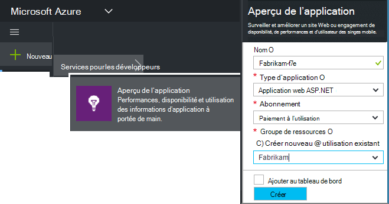
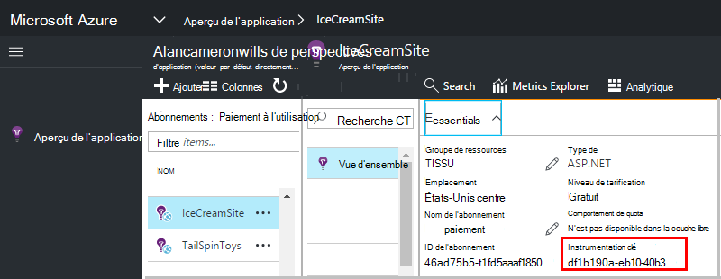

<properties 
    pageTitle="Créer une nouvelle ressource d’idées d’Application | Microsoft Azure" 
    description="Définir des perspectives de l’Application d’analyse d’une nouvelle application live. Approche basée sur le Web." 
    services="application-insights" 
    documentationCenter=""
    authors="alancameronwills" 
    manager="douge"/>

<tags 
    ms.service="application-insights" 
    ms.workload="tbd" 
    ms.tgt_pltfrm="ibiza" 
    ms.devlang="na" 
    ms.topic="article" 
    ms.date="08/26/2016" 
    ms.author="awills"/>

# Créer une ressource d’informations d’Application

Idées d’Application Visual Studio affiche les données relatives à votre application dans une *ressource*de Microsoft Azure. Création d’une ressource est par conséquent partie du [paramétrage des perspectives d’Application pour surveiller une application][start]. Dans de nombreux cas, cela automatiquement par l’IDE, et qui est la méthode recommandée, où elle est disponible. Mais dans certains cas, vous créez une ressource manuellement.

Après avoir créé la ressource, vous obtenez sa clé d’instrumentation et qui permet de configurer le Kit de développement de l’application. Envoie la télémétrie à la ressource.

## S’inscrire à Microsoft Azure

Si vous n’avez pas obtenu un [Microsoft compte, inscrivez-vous dès maintenant](http://live.com). (Si vous utilisez des services tels que Outlook.com, OneDrive, Windows Phone ou XBox Live, vous avez déjà un compte Microsoft.)

Vous aurez également besoin d’un abonnement à [Microsoft Azure](http://azure.com). Si votre équipe ou votre organisation possède un abonnement Azure, le propriétaire peut vous ajouter, à l’aide de votre ID Windows Live

Ou vous pouvez créer un nouvel abonnement. Le compte gratuit vous permet d’essayer tout dans Azure. Après l’expiration de la période d’évaluation, vous pouvez trouver l’abonnement de paiement approprié, comme vous ne sera débitée gratuitement les services. 

Lorsque vous avez obtenu l’accès à un abonnement, la connexion d’accès à [http://portal.azure.com](https://portal.azure.com), aux analyses de l’Application et que vous utilisez votre Live ID pour vous connecter.

## Créer une ressource d’informations d’Application
  

Dans la [portal.azure.com](https://portal.azure.com), ajouter une ressource de perspectives de l’Application :

* **Type d’application** a une incidence sur ce que vous voyez sur la lame de présentation et les propriétés disponibles dans [l’Explorateur de métriques][metrics]. Si vous ne voyez pas votre type d’application, choisissez ASP.NET.
* **Groupe de ressources** est pratique pour la gestion des propriétés telles que le contrôle d’accès. Si vous avez déjà créé des autres ressources Azure, vous pouvez choisir de placer cette nouvelle ressource dans le même groupe.
* **L’abonnement** est le compte de votre paiement dans Azure.
* **L’emplacement** est où nous conservons vos données. Actuellement il ne peut pas être modifié.
* **Ajouter startboard à la** place une mosaïque d’accès rapide pour votre ressource sur votre page d’accueil d’Azure. Recommandé.

Lorsque votre application a été créée, une nouvelle lame s’ouvre. Voici où vous pouvez afficher les données d’utilisation et de performances sur votre application. 

Pour obtenir arrière au prochain votre connexion à Azure, regardez de mosaïque du démarrage rapide de votre application sur la carte de début (écran d’accueil). Ou cliquez sur Parcourir pour le rechercher.

## Copiez la clé d’instrumentation

La clé de l’instrumentation identifie la ressource que vous avez créé. Vous aurez besoin de donner le Kit de développement SDK.

## Installer le Kit de développement de votre application

Installez l’Application d’idées SDK dans votre application. Cette étape dépend fortement du type de votre application. 

Utilisez la clé d’instrumentation à configurer [le Kit de développement logiciel que vous installez votre application][start].

Le SDK comprend des modules standard qui envoient de TELEMETRIE sans avoir à écrire de code. Pour suivre les actions de l’utilisateur ou de diagnostiquer les problèmes plus en détail, [Utilisez l’API] [ api] pour envoyer votre propre télémétrie.

## Consultez les données de télémétrie

Fermez la lame de démarrage rapide pour revenir à la lame de votre application dans Azure portal.

Cliquez sur la vignette de la recherche pour voir [Recherche de Diagnostic][diagnostic], où les premiers événements seront affiche. 

Si vous attendez plus de données, cliquez sur Actualiser après quelques secondes.

## Création automatique d’une ressource

Vous pouvez écrire un [script PowerShell](app-insights-powershell-script-create-resource.md) pour créer une ressource automatiquement.

## Étapes suivantes

* [Créer un tableau de bord](app-insights-dashboards.md)
* [Recherche de diagnostic](app-insights-diagnostic-search.md)
* [Explorez les métriques](app-insights-metrics-explorer.md)
* [Écrire des requêtes Analytique](app-insights-analytics.md)

<!--Link references-->

[api]: app-insights-api-custom-events-metrics.md
[diagnostic]: app-insights-diagnostic-search.md
[metrics]: app-insights-metrics-explorer.md
[start]: app-insights-overview.md

 