<properties
    pageTitle="Tableaux de bord et de la navigation dans le portail d’idées d’Application | Microsoft Azure"
    description="Créer des vues de votre clés graphiques APM et de requêtes."
    services="application-insights"
    documentationCenter=""
    authors="alancameronwills"
    manager="douge"/>

<tags
    ms.service="application-insights"
    ms.workload="tbd"
    ms.tgt_pltfrm="ibiza"
    ms.devlang="multiple"
    ms.topic="article" 
    ms.date="10/18/2016"
    ms.author="awills"/>

# Navigation et tableaux de bord dans le portail d’idées d’Application

Une fois que vous avez [défini des perspectives d’Application sur votre projet](app-insights-overview.md), données télémétriques sur les performances de votre application et d’utilisation seront affiche dans la ressource d’Application perspectives de votre projet dans [Azure portal](https://portal.azure.com).

## Rechercher votre télémétrie

Connectez-vous au [portail Azure](https://portal.azure.com) et accéder à la ressource de perspectives d’Application que vous avez créé pour votre application.

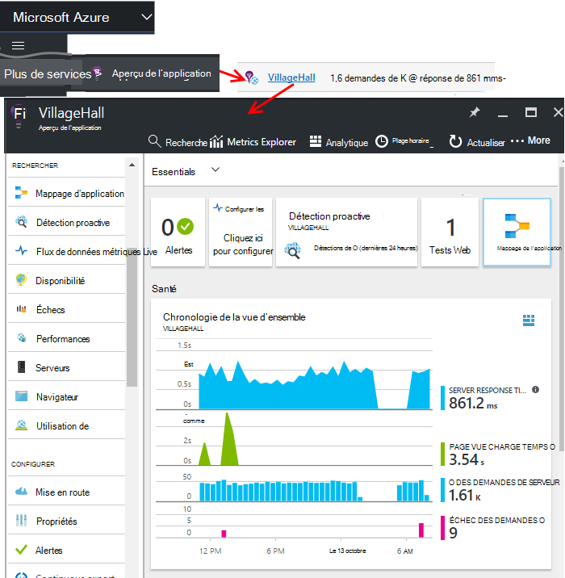

Affiche un résumé des mesures clés de Diagnostics de votre application et la lame de vue d’ensemble (page) pour votre application est une passerelle vers les autres fonctions du portail.

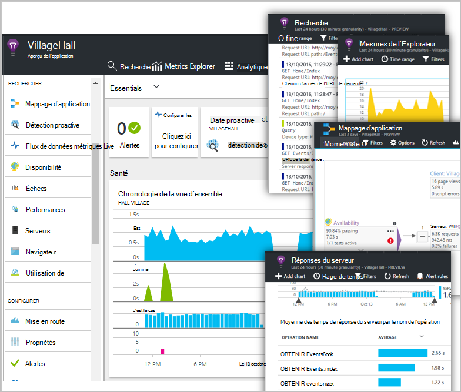

Vous pouvez personnaliser tous les autres graphiques et les intégrer à un tableau de bord. De cette façon, vous pouvez rassembler les graphiques de clé à partir de différentes applications.

## Tableaux de bord

La première chose que vous voyez après que vous être inscrit sur le [portail Microsoft Azure](https://portal.azure.com) est un tableau de bord. Ici vous pouvez réunir les graphiques sont plus importantes pour vous sur toutes vos ressources Azure, y compris des données télémétriques fournies par les [Perspectives d’Application Visual Studio](app-insights-overview.md).
 

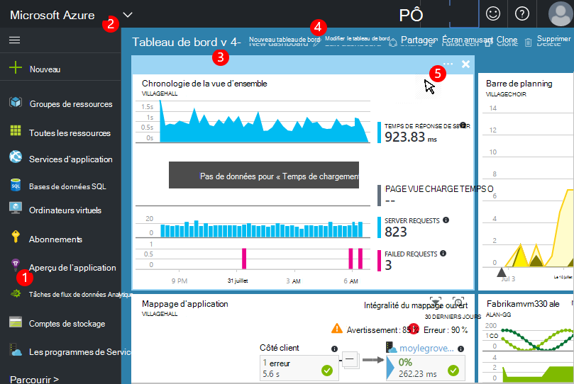

1. **Naviguer à des ressources spécifiques** , telles que votre application dans l’Application aperçu : utiliser la barre de gauche.
2. **Retour au tableau de bord actuel**, ou un commutateur à d’autres vues récents : utiliser le menu déroulant en haut à gauche.
3. **Tableaux de bord de commutateur**: utiliser le menu déroulant sur le titre du tableau de bord
4. **Créer, modifier et partager des tableaux de bord** dans la barre d’outils du tableau de bord.
5. **Modifier le tableau de bord**: placez le curseur sur une mosaïque, puis utilisez sa barre supérieure pour déplacer, personnaliser ou supprimer.

## Ajouter à un tableau de bord

Lorsque vous examinez une lame ou d’un ensemble de graphiques qui est particulièrement intéressant, vous pouvez épingler une copie au tableau de bord. Vous le verrez lorsque vous reviendrez il.

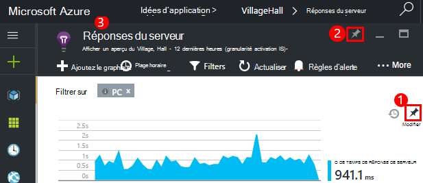

1. Graphique de code PIN au tableau de bord. Une copie du graphique s’affiche sur le tableau de bord.
2. Épingler l’ensemble lame au tableau de bord - il s’affiche sur le tableau de bord sous la forme d’une mosaïque qui vous pouvez cliquez sur via.
3. Cliquez sur le coin supérieur gauche pour revenir au tableau de bord actuel. Puis, vous pouvez utiliser le menu déroulant pour revenir à l’affichage actuel.

Notez que les graphiques sont regroupés en mosaïques : une mosaïque peut contenir plus d’un graphique. Vous épinglez la mosaïque ensemble au tableau de bord.

### Épingler n’importe quelle requête dans Analytique

Vous pouvez également graphiques [d’axe Analytique](app-insights-analytics-using.md#pin-to-dashboard) à un tableau de bord [partagés](#share-dashboards-with-your-team) . Cela vous permet d’ajouter des graphiques de toute requête arbitraire avec les mesures standard. (Il est une charge pour cette fonctionnalité).

## Ajuster une mosaïque sur le tableau de bord

Une fois une mosaïque sur le tableau de bord, vous pouvez la modifier.

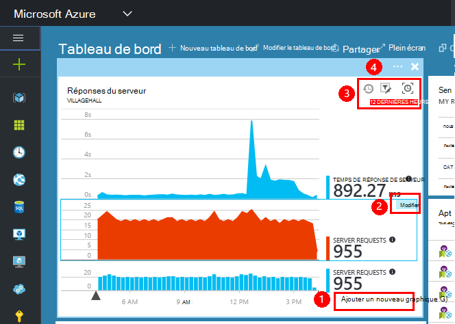

1. Ajouter un graphique à la mosaïque. 
2. Définir la métrique, par groupe de dimension et style (tableau, graphique) d’un graphique.
3. Faites glisser sur le diagramme pour effectuer un zoom Cliquez sur le bouton Annuler pour réinitialiser la période ; Définissez les propriétés de filtre pour les graphiques de la mosaïque.
4. Définir le titre de la mosaïque.

Mosaïques épinglés à partir de lames de métriques explorer ont davantage d’options édition que mosaïques épinglés à partir d’une lame de vue d’ensemble.

La mosaïque d’origine que vous épinglés n’est pas affectée par vos modifications.

## Basculer entre les tableaux de bord

Vous pouvez enregistrer plus d’un tableau de bord et basculer entre elles. Lorsque vous fixez un graphique ou une lame, elles sont ajoutées au tableau de bord actuel.

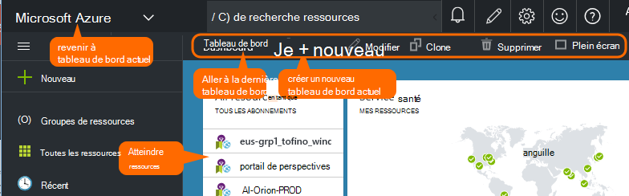

Par exemple, vous pouvez avoir un tableau de bord pour l’affichage plein écran dans la salle de réunion et l’autre pour du développement général.

Sur le tableau de bord, une blade s’affiche sous forme de mosaïque : cliquez dessus pour passer à la lame. Un graphique réplique le graphique dans son emplacement d’origine.

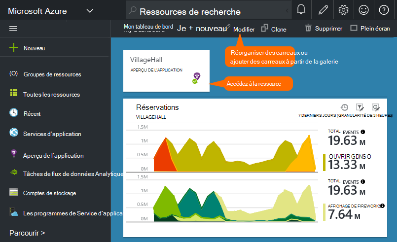

## Partager des tableaux de bord

Lorsque vous avez créé un tableau de bord, vous pouvez le partager avec d’autres utilisateurs.

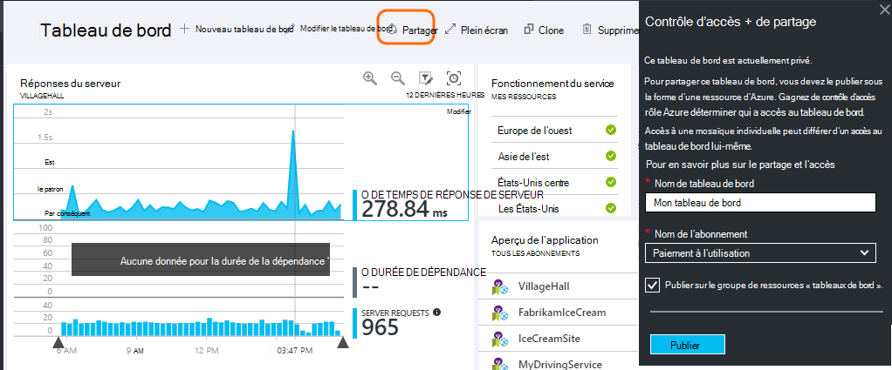

Obtenir des informations sur les [rôles et le contrôle d’accès](app-insights-resources-roles-access-control.md).

## Navigation de l’application

La lame de présentation est la passerelle pour plus d’informations sur votre application.

* Cliquez sur **n’importe quel graphique ou la mosaïque** - les disposer en mosaïque ou le graphique pour voir plus de détails sur ce qu’il affiche.

### Boutons de lame de vue d’ensemble

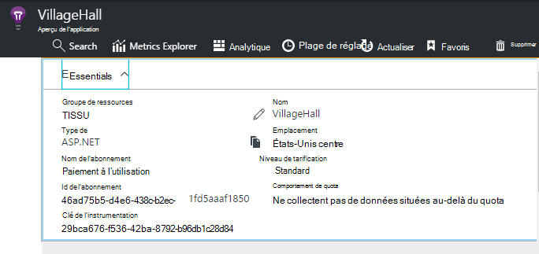

* [**Explorateur de mesures**](app-insights-metrics-explorer.md) - créer vos propres graphiques de performances et d’utilisation.
* [**Recherche**](app-insights-diagnostic-search.md) - rechercher des instances spécifiques d’événements tels que les demandes, les exceptions, ou le journal des traces.
* [**Analytique**](app-insights-analytics.md) - requêtes puissantes sur votre télémétrie.
* **Plage de temps** - ajuster la plage affichée par tous les graphiques de la lame.
* **Supprimer** : supprimer la ressource d’informations d’Application pour cette application. Vous devez également supprimer les packages d’idées d’Application à partir de votre code d’application, ou modifier la [clé de l’instrumentation](app-insights-create-new-resource.md#copy-the-instrumentation-key) de votre application pour diriger la télémétrie vers une autre ressource de perspectives de l’Application.

### Onglet d’Essentials

* [Clé de l’instrumentation](app-insights-create-new-resource.md#copy-the-instrumentation-key) - identifie la ressource de cette application. 
* Prix - que les fonctionnalités majuscules de volume disponible et défini.

### Barre de navigation d’application

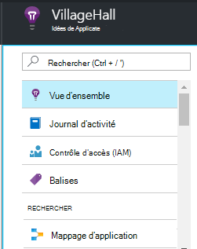

* **Vue d’ensemble** - retour à la blade de présentation d’application.
* **Journal d’activité** : les alertes et les événements d’administration Azure.
* [**Contrôle d’accès**](app-insights-resources-roles-access-control.md) - donner accès aux membres de l’équipe et d’autres.
* [**Balises**](../resource-group-using-tags.md) - utiliser des balises pour regrouper votre application avec d’autres personnes.

RECHERCHER

* [**Mappage d’application**](app-insights-app-map.md) - carte Active présentant les composants de votre application, dérivée des informations de dépendance.
* [**Diagnostics proactifs**](app-insights-proactive-diagnostics.md) - alertes de performances récentes de révision.
* [**Flux en direct**](app-insights-metrics-explorer.md#live-stream) - un ensemble de mesures quasi instantanée utiles lors du déploiement d’une nouvelle build fixe ou de débogage.
* [**Disponibilité / tests Web**](app-insights-monitor-web-app-availability.md) -envoyer des requêtes régulières à votre application web à partir de dans le monde.* 
* [**Échecs, performances**](app-insights-web-monitor-performance.md) - Exceptions, les taux de défaillance et les temps de réponse pour les requêtes à votre application et des requêtes à partir de votre application aux [dépendances](app-insights-asp-net-dependencies.md).
* [**Performances**](app-insights-web-monitor-performance.md) - délai de réponse, des temps de réponse de dépendance. 
* [Serveurs](app-insights-web-monitor-performance.md) - compteurs de Performance. Disponible si vous [installez le moniteur d’état](app-insights-monitor-performance-live-website-now.md).

* **Navigateur** - affichage de la Page et les performances d’AJAX. Disponible si vous [instrumenter vos pages web](app-insights-javascript.md).
* Compte **l’utilisation** - affichage Page, l’utilisateur et session. Disponible si vous [instrumenter vos pages web](app-insights-javascript.md).

CONFIGURER

* **Mise en route** - didacticiel d’inline.
* **Propriétés** - clé de l’instrumentation, abonnement et l’id de ressource.
* [Alertes](app-insights-alerts.md) - configuration d’alerte métrique.
* [Exportation de continu](app-insights-export-telemetry.md) - configurer l’exportation de télémétrie pour stockage Azure.
* [Les tests de performances](app-insights-monitor-web-app-availability.md#performance-tests) - définir une charge synthétique sur votre site Web.
* [Quota et le prix](app-insights-pricing.md) et [l’échantillonnage de l’ingestion](app-insights-sampling.md).
* **Accès à l’API** - créer des [annotations de version](app-insights-annotations.md) et de l’API d’accès aux données.
* [**Éléments de travail**](app-insights-diagnostic-search.md#create-work-item) - se connecter à un système de suivi afin que vous puissiez créer des bogues lors de l’inspection de télémétrie de travail.

Paramètres

* [**Verrous**](..\resource-group-lock-resources.md) : verrouiller les ressources Azure
* [**Script d’automation**](app-insights-powershell.md) - exportation d’une définition de la ressource Azure afin que vous pouvez l’utiliser comme modèle pour créer de nouvelles ressources.

PRISE EN CHARGE

* **Demande de support** - requiert un abonnement payant. Voir aussi [obtenir de l’aide](app-insights-get-dev-support.md).

## Quel est l’avenir ?

||
|---|---
|[Explorateur de mesures](app-insights-metrics-explorer.md) Mesures de filtre et de segment|
|[Recherche de diagnostic](app-insights-diagnostic-search.md) Rechercher et examiner les événements, les événements associés et créer des bogues |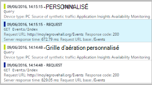
|[Analytique](app-insights-analytics.md) Langage de requête puissantes| 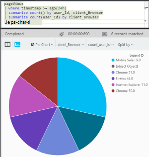

