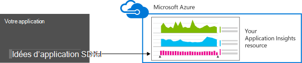
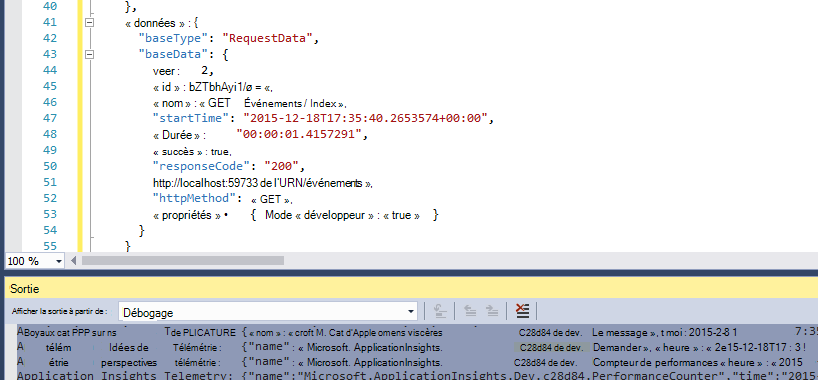
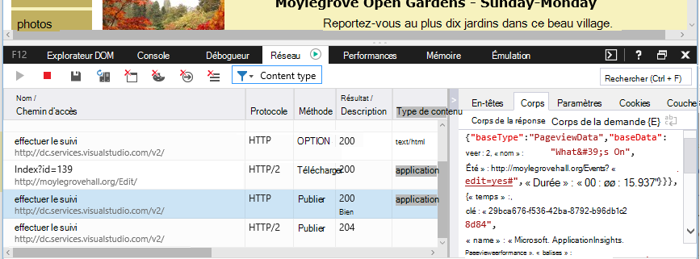

<properties 
    pageTitle="Rétention des données et stockage dans les perspectives de l’Application" 
    description="Instruction de stratégie de rétention et de la confidentialité" 
    services="application-insights" 
    documentationCenter=""
    authors="alancameronwills" 
    manager="douge"/>

<tags 
    ms.service="application-insights" 
    ms.workload="tbd" 
    ms.tgt_pltfrm="ibiza" 
    ms.devlang="na" 
    ms.topic="article" 
    ms.date="05/17/2016" 
    ms.author="awills"/>

# Collecte de données, de rétention et de stockage dans les perspectives de l’Application 

*Idées d’application est en mode Aperçu.*

Lorsque vous installez [Visual Studio perspectives d’Application] [ start] SDK dans votre application, il envoie la télémétrie sur votre application vers le nuage. Les développeurs responsables souhaitent connaître exactement les données envoyées, ce qui se passe pour les données, et comment ils peuvent conserver le contrôle. En particulier, les données sensibles peuvent être envoyées, où elle est stockée et la sécurisation s’agit-il ? 

Tout d’abord, la réponse :

* Les modules standard de télémétrie exécutent « prêts à l’emploi » sont peu susceptibles d’envoyer des données sensibles au service. La télémétrie est concernée par la charge, les métriques de performances et d’utilisation, les rapports d’exception et autres données de diagnostic. Les données utilisateur principale visibles dans les rapports de diagnostics sont des URL ; mais votre application ne doit pas mettre dans tous les cas de données sensibles en texte brut dans une URL.
* Vous pouvez écrire du code qui envoie de télémétrie de personnalisées supplémentaire pour vous aider dans le diagnostic et la surveillance de l’utilisation. (Cette extensibilité est une excellente fonctionnalité de perspectives de l’Application). Il est possible, par inadvertance, d’écrire ce code afin qu’il inclue les personnelles et d’autres données sensibles. Si votre application fonctionne avec ces données, vous devez appliquer un processus de révision fort à tout le code que vous écrivez.
* Lors du développement et de test de votre application, il est facile à examiner ce qui est envoyé par le SDK. Les données s’affichent dans les fenêtres de sortie de débogage de l’IDE et le navigateur. 
* Les données sont conservées dans les serveurs [Microsoft Azure](http://azure.com) aux États-Unis d’Amérique. (Mais anywhere peut être exécuté par votre application.) Azure a [une sécurité renforcée, traite et répond à un large éventail de normes de conformité](https://azure.microsoft.com/support/trust-center/). Seuls vous et votre équipe ont accès à vos données. Le personnel de Microsoft peut avoir restreint l’accès uniquement dans certaines circonstances limitées avec vos connaissances. Il est chiffré en transit, mais pas dans les serveurs.

Le reste de cet article aborde plus en détail sur ces réponses. Il est conçu pour être autonomes, afin que vous pouvez l’afficher à des collègues qui ne font pas partie de votre équipe.

## Ce qui est des idées d’Application ?

[Idées d’Application Visual Studio] [ start] est un service fourni par Microsoft qui vous aide à améliorer les performances et la facilité d’utilisation de vos applications en ligne. Il analyse votre application toutes les fois qu’il est en cours d’exécution, au cours des tests et une fois que vous avez publié ou déployé. Aperçu de l’application crée des graphiques et tableaux qui présentent, par exemple, les heures de la journée, vous obtenez la plupart des utilisateurs, la réactivité de l’application est et comment il est pris en charge par les services externes dont elle dépend. S’il y a des incidents, les échecs ou les problèmes de performances, vous pouvez rechercher les données de télémétrie en détail pour diagnostiquer la cause. Et le service vous enverra les e-mails si des modifications sont apportées dans la disponibilité et les performances de votre application.

Pour obtenir cette fonctionnalité, vous installez un kit de développement de perspectives Application dans votre application, ce qui devient partie intégrante de son code. Lorsque votre application s’exécute, le Kit de développement logiciel surveille son opération et envoie de télémétrie pour le service informations d’Application. Il s’agit d’un service en nuage hébergé par [Microsoft Azure](http://azure.com). (Mais perspectives d’Application fonctionne pour toutes les applications, pas uniquement ceux qui sont hébergés dans Azure).

Le service informations d’Application stocke et analyse de la télémétrie. Pour voir l’analyse ou la recherche par le biais de la télémétrie stockée, vous connectez à votre compte Azure et ouvrez la ressource d’informations d’Application pour votre application. Vous pouvez également partager l’accès aux données avec les autres membres de votre équipe ou avec des abonnés Azure spécifiés.

Vous pouvez avoir des données exportées depuis le service informations d’Application, par exemple à une base de données ou aux outils externes. Vous fournissez chaque outil avec une clé spéciale que vous obtenez à partir du service. La clé peut être révoquée, si nécessaire. 

SDK de perspectives d’application sont disponibles pour une gamme de types d’applications : web services hébergés dans vos propres serveurs J2EE ou ASP.NET ou dans Azure ; Web clients - c'est-à-dire que le code s’exécutant dans une page web ; applications de bureau et de services ; applications de périphérique, tels que Windows Phone, iOS et Android. Elles envoient toutes télémétrie au même service.

## Quelles sont les données collecte-t-elle ?

### Comment sont les données recueillies ?

Il existe trois sources de données :

* Le Kit de développement, vous intégrez à votre application [en cours de développement](app-insights-asp-net.md) ou [au moment de l’exécution](app-insights-monitor-performance-live-website-now.md). Il existe différents kits de développement logiciel pour les différents types d’applications. Il existe également un [SDK pour les pages web](app-insights-javascript.md), qui se charge dans le navigateur de l’utilisateur final ainsi que la page.

 * Chaque kit de développement logiciel a un certain nombre de [modules](app-insights-configuration-with-applicationinsights-config.md), utiliser différentes techniques pour recueillir les différents types de télémétrie.
 * Si vous installez le Kit de développement de logiciel en cours de développement, vous pouvez utiliser son API pour envoyer vos propres télémétrie, ainsi que les modules standard. Cette télémétrie personnalisé peut inclure des données que vous souhaitez envoyer.
* Sur certains serveurs web, il existe également des agents qui s’exécutent à côté de l’application et d’envoyer de télémétrie sur l’occupation du réseau, la mémoire et du processeur. Par exemple, Azure VM, hôtes de Docker et [J2EE serveurs](app-insights-java-agent.md) peuvent avoir à ces agents.
* [Les tests de disponibilité](app-insights-monitor-web-app-availability.md) sont les processus exécutés par Microsoft et qui envoient des requêtes à votre application web à intervalles réguliers. Les résultats sont envoyés vers le service informations d’Application.

### Les types de données sont recueillies ?

Les principales catégories sont les suivantes :

* [TELEMETRIE de serveur web](app-insights-asp-net.md) - demandes HTTP.  URI, le temps nécessaire pour traiter la demande, le code de réponse, l’adresse IP du client. Id de la session.
* [Pages Web](app-insights-javascript.md) - Page, utilisateur de session de compte. Temps de chargement de page. Exceptions. Appels AJAX.
* Performances des compteurs - mémoire, UC, d’e/s, occupation du réseau.
* Contexte client et serveur - OS, paramètres régionaux, le type de périphérique, navigateur, résolution d’écran.
* [Exceptions](app-insights-asp-net-exceptions.md) et défaillances - **dump de la pile**, générer des id, le type de processeur. 
* [Dépendances](app-insights-asp-net-dependencies.md) - appels aux services externes tels que les autres, SQL, AJAX. Chaîne de connexion ou d’URI, durée, réussite, commande.
* [Les tests de disponibilité](app-insights-monitor-web-app-availability.md) - durée de test et des étapes, des réponses.
* [Journaux de suivi](app-insights-search-diagnostic-logs.md) et de [télémétrie personnalisé](app-insights-api-custom-events-metrics.md) - **quoi que ce soit dans vos journaux ou de télémétrie de code**.

[Plus de détails](#data-sent-by-application-insights).

## Comment puis-je vérifier que sont collecté ?

Si vous développez l’application à l’aide de Visual Studio, exécutez l’application en mode de débogage (F5). La télémétrie s’affiche dans la fenêtre Sortie. À partir de là, vous pouvez copier et mettre en forme en tant que JSON pour inspection simple. 

Il existe également un affichage plus lisible dans la fenêtre de Diagnostics.

Pour les pages web, ouvrez la fenêtre de débogage de votre navigateur.

### Écrire le code pour filtrer la télémétrie avant d’être envoyé ?

Ceci est possible en écrivant un [plug-in du processeur de télémétrie](app-insights-api-filtering-sampling.md).

## La durée pendant laquelle les données sont conservées ? 

Points de données brutes (c'est-à-dire les éléments que vous pouvez inspecter dans recherche de Diagnostic) sont conservés pendant 7 jours. Si vous avez besoin conserver plus de données, vous pouvez utiliser [l’exportation continue](app-insights-export-telemetry.md) pour le copier dans un compte de stockage.

Les données agrégées (, nombres, moyennes et autres données statistiques que vous voyez dans l’Explorateur de mesure) sont conservées à chaque grain de 1 minute pendant 30 jours et 1 heure ou 1 jour (fonction de type) pendant au moins 90 jours.

## Qui peut accéder aux données ?

Les données sont visibles par vous et, si vous disposez d’un compte d’entreprise, les membres de votre équipe. 

Il peut être exporté par vous et les membres de l’équipe et peut être copié vers d’autres emplacements et transmis à d’autres personnes.

#### Que fait Microsoft ? avec les informations de que mon application envoie aux analyses de l’Application

Microsoft utilise les données que pour vous fournir le service.

## Où sont conservées les données ? 

* Aux États-Unis d’Amérique. 

#### Peut il être stocké quelque part ailleurs, par exemple en Europe ? 

* Pas à l’heure actuelle. 

#### Cela signifie-t-il que mon application doit être hébergés aux États-Unis ?

* N° Votre application peut exécuter n’importe où dans vos propres hôtes locaux ou dans le nuage.

## Mes données sont est-il sécurisées ?  

Idées d’application est un Service d’Azure dans l’aperçu. Alors que dans l’aperçu, nous travaillons pour trouver de la protection de vos données par les stratégies décrites dans le [livre blanc Azure sécurité, de confidentialité et de conformité](http://go.microsoft.com/fwlink/?linkid=392408).

Les données sont stockées dans les serveurs Microsoft Azure. Pour les comptes dans le portail d’Azure, les restrictions de compte sont décrites dans le [document de sécurité d’Azure, confidentialité et la conformité](http://go.microsoft.com/fwlink/?linkid=392408). Pour les comptes dans le portail de Services d’équipe Visual Studio, le document de [Visual Studio Team Services Data Protection](http://download.microsoft.com/download/8/E/E/8EE6A61C-44C2-4F81-B870-A267F1DF978C/MicrosoftVisualStudioOnlineDataProtection.pdf) s’applique. 

L’accès à vos données par le personnel de Microsoft est limité. Nous allons accéder à vos données uniquement avec votre autorisation, et s’il est nécessaire prendre en charge de l’utilisation de l’aperçu de l’Application. 

Données d’agrégation entre les applications de tous nos clients (par exemple, les débits de données et la taille moyenne des traces) sont utilisées pour améliorer les perspectives de l’Application.

#### TELEMETRIE de quelqu'un d’autre pourrait interférer avec mes données d’idées d’Application ?

Il pourraient envoyer télémétrie supplémentaire à votre compte à l’aide de la clé de l’instrumentation, qui se trouve dans le code de vos pages web. Avec suffisamment de données supplémentaires, vos mesures n'aurait pas correctement représentent des performances et utilisation de votre application.

Si vous partagez le code avec d’autres projets, n’oubliez pas de supprimer votre clé d’instrumentation.

## Les données sont cryptées ? 

Pas à l’intérieur les serveurs à l’heure actuelle.

Toutes les données sont cryptées lorsqu’il se déplace entre les centres de données.

#### Les données sont cryptées en transit depuis mon application sur les serveurs d’Application idées ?

Oui, nous utiliser https pour envoyer des données sur le portail à partir de presque tous les kits de développement logiciel, y compris les serveurs web, les périphériques et les pages web HTTPS. La seule exception concerne les données envoyées à partir des pages web HTTP brut. 

## Informations d’identification personnelle

#### Informations personnellement identifiables (PII) pu être envoyé aux analyses d’Application ? 

Oui, c’est possible. 

Comme des indications générales :

* Télémétrie plus standard (c'est-à-dire de télémétrie envoyé sans vous écrire du code) n’inclut pas PII explicite. Toutefois, il est parfois possible d’identifier les personnes par inférence à partir d’une collection d’événements.
* Messages d’exception et la trace peuvent contenir des informations personnelles
* Télémétrie personnalisé - c'est-à-dire les appels tels que les TrackEvent que vous écrivez dans le code à l’aide de l’API ou le journal des traces - peut contenir des données que vous choisissez.

Le tableau à la fin de ce document contient des descriptions plus détaillées des données collectées.

#### Je suis responsable pour se conformer aux lois et réglementations en matière d’informations d’identification personnelle ?

Oui. Il est de votre responsabilité de garantir que la collecte et l’utilisation des données est conforme aux lois et règlements et avec les termes de Microsoft Online Services.

Vous devez informer vos clients correctement les données collectées par votre application et la manière dont les données sont utilisées.

#### Mes utilisateurs désactiver perspectives d’Application ?

Pas directement. Nous ne fournissent pas un commutateur que vos utilisateurs peuvent faire fonctionner pour désactiver les aperçus de l’Application.

Toutefois, vous pouvez implémenter cette fonctionnalité dans votre application. Tous les kits de développement logiciel incluent un paramètre de l’API qui désactive la collection de télémétrie. 

#### Mon application collecte involontairement des informations sensibles. Idées d’Application peut éliminer ces données afin qu’il n’est pas conservée ?

Idées d’application ne pas filtrer ou supprimer vos données. Vous devez gérer les données de manière appropriée et éviter d’envoyer ces données aux analyses de l’Application.

## Données envoyées par les perspectives de l’Application

Les kits de développement varient entre plates-formes et il y a plusieurs composants que vous pouvez installer. (Reportez-vous à [commencer des analyses d’Application -][start].) Chaque composant envoie des données différentes.

#### Classes de données envoyées dans différents scénarios

Votre action  | Les classes de données collectées (voir tableau suivant)
---|---
[Ajouter les SDK de perspectives d’Application à un projet web .NET][greenbrown] | ServerContext Déduit Compteurs de performance Demandes **Exceptions** Session utilisateurs
[Installer le moniteur de statut sur IIS][redfield]|Dépendances ServerContext Déduit Compteurs de performance
[Ajouter les SDK de perspectives d’Application à une application web de Java][java]|ServerContext Déduit Demande Session utilisateurs
[Ajouter du JavaScript SDK à la page web][client]|ClientContext  Déduit Page ClientPerf AJAX
[Définir les propriétés par défaut][apiproperties]|**Propriétés** de tous les événements standard et personnalisés
[Appel de TrackMetric][api]|Valeurs numériques **Propriétés**
[Appel de suivi *][api]|Nom de l’événement **Propriétés**
[Appel de TrackException][api]|**Exceptions** Vidage de la pile **Propriétés**
Kit de développement logiciel ne peut pas collecter des données. Par exemple :   -Impossible d’accéder aux compteurs de performance  -exception dans l’initialiseur de télémétrie | Diagnostics du Kit de développement logiciel
 

Pour les [Kits de développement logiciel pour d’autres plates-formes][platforms], consultez leurs documents.

#### Les classes des données collectées

Classe des données collectées | Inclut (liste non exhaustive) 
---|---
**Propriétés**|**Toutes les données - déterminées par votre code.**
Élément DeviceContext |ID, IP, paramètres régionaux, modèle de périphérique, réseau, type de réseau, nom de l’OEM, résolution d’écran, Instance de rôle, de nom de rôle, de Type de périphérique
ClientContext |Système d’exploitation, la résolution de la fenêtre, la langue, le réseau, les paramètres régionaux
Session | id de session
ServerContext |Nom de l’ordinateur, les paramètres régionaux du système d’exploitation, périphériques, session de l’utilisateur, contexte de l’utilisateur, opération 
Déduit |emplacement géographique de l’adresse IP, timestamp, système d’exploitation, navigateur
Mesures | Valeur et le nom de mesure
Événements | Valeur et le nom de l’événement
PageViews | Nom d’URL et de la page ou le nom de l’écran
Performances du client | Nom de la page / l’URL, le temps de chargement de navigateur
AJAX | Appels HTTP à partir de la page web sur le serveur
Demandes |URL, la durée, le code de réponse
Dépendances|Type (SQL, HTTP,...), d’une chaîne de connexion ou d’URI, sync/async, durée, réussite, instruction SQL (avec le moniteur d’état)
**Exceptions** | Type de **message**, les piles d’appels, source fichier et numéro de ligne, id de thread
Se bloque | Id de processus, les id de processus parent, les id de thread de blocage ; correctif de l’application, id, génération ;  type d’exception, adresse, raison ; symboles masquées et registres, adresses binaires de début et de fin, nom du fichier binaire et chemin d’accès, le type d’unité centrale
Trace | Niveau de gravité et de **message**
Compteurs de performance | Temps processeur, la mémoire disponible, le taux de demande, votre taux d’exception, octets privés du processus, débit e/s, durée de la demande, demander la longueur de la file d’attente
Disponibilité | Code de réponse de test Web, la durée de chaque étape de test, test nom timestamp, réussite, temps de réponse, emplacement de test
Diagnostics du Kit de développement logiciel | Message de trace ou d’une Exception 

Vous pouvez [désactiver certaines données par édition ApplicationInsights.config][config]

## Crédits

Ce produit inclut des données GeoLite2 créées par MaxMind, disponible à partir de [http://www.maxmind.com](http://www.maxmind.com).

## Vidéos

#### Introduction

> [AZURE.VIDEO application-insights-introduction]

#### Mise en route

> [AZURE.VIDEO getting-started-with-application-insights]

<!--Link references-->

[api]: app-insights-api-custom-events-metrics.md
[apiproperties]: app-insights-api-custom-events-metrics.md#properties
[client]: app-insights-javascript.md
[config]: app-insights-configuration-with-applicationinsights-config.md
[greenbrown]: app-insights-asp-net.md
[java]: app-insights-java-get-started.md
[platforms]: app-insights-platforms.md
[pricing]: http://azure.microsoft.com/pricing/details/application-insights/
[redfield]: app-insights-monitor-performance-live-website-now.md
[start]: app-insights-overview.md

 