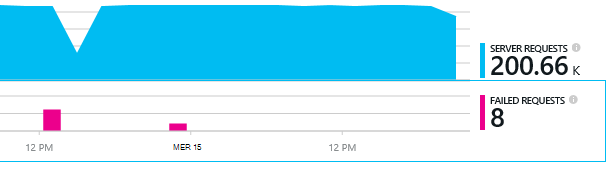

<properties 
    pageTitle="Diagnostic des problèmes avec les dépendances dans les perspectives de l’Application" 
    description="Rechercher les défaillances et ralentissement des performances dû aux dépendances" 
    services="application-insights" 
    documentationCenter=""
    authors="alancameronwills" 
    manager="douge"/>

<tags 
    ms.service="application-insights" 
    ms.workload="tbd" 
    ms.tgt_pltfrm="ibiza" 
    ms.devlang="na" 
    ms.topic="article" 
    ms.date="05/12/2016" 
    ms.author="awills"/>
 
# <a name="diagnosing-issues-with-dependencies-in-application-insights"></a>Diagnostic des problèmes avec les dépendances dans les perspectives de l’Application


Une *dépendance* est un composant externe qui est appelé par votre application. Il s’agit d’un service appelé à l’aide de HTTP, ou une base de données ou un système de fichiers. Ou, dans le script de votre page web, il peut être un appel AJAX sur le serveur. Dans les perspectives d’Application Visual Studio, vous pouvez voir facilement la durée d’attente pour les dépendances de votre application et de la fréquence à laquelle un appel de dépendance échoue.

## <a name="where-you-can-use-it"></a>Où vous pouvez l’utiliser

En dehors de la zone de surveillance des dépendances est actuellement disponible pour :

* Les applications web ASP.NET et les services qui s’exécutent sur un serveur IIS ou sur Azure
* [Applications web Java](app-insights-java-agent.md)
* [Pages Web](https://azure.microsoft.com/blog/ajax-collection-in-application-insights/)

Pour d’autres types, tels que les applications de périphérique, vous pouvez écrire votre propre moniteur à l’aide de l' [API de TrackDependency](app-insights-api-custom-events-metrics.md#track-dependency).

Le moniteur de l’emploi de dépendance signale actuellement les appels à ces types de dépendances :

* ASP.NET
 * Bases de données SQL
 * ASP.NET web et les services WCF qui utilisent des liaisons de basés sur HTTP
 * Appels HTTP locales ou distants
 * DocumentDb, table, stockage blob Azure et file d’attente
* Java
 * Appels à une base de données via un pilote [JDBC](http://docs.oracle.com/javase/7/docs/technotes/guides/jdbc/) , telles que SQL Server, MySQL, PostgreSQL ou de SQLite.
* Pages Web
 * [Appels AJAX](app-insights-javascript.md)

Là encore, vous pouvez écrire vos propres appels SDK pour surveiller d’autres dépendances.

## <a name="to-set-up-dependency-monitoring"></a>Pour configurer l’analyse de dépendance

Installer l’agent approprié pour le serveur hôte.

Plate-forme | Installer
---|---
Serveur IIS | Soit [installer le moniteur de statut sur votre serveur](app-insights-monitor-performance-live-website-now.md) ou [mettre à niveau votre application à .NET framework version 4.6 ou ultérieure](http://go.microsoft.com/fwlink/?LinkId=528259) et installer le [SDK de perspectives d’Application](app-insights-asp-net.md) dans votre application.
Application Web Azure | [Extension des perspectives d’application](app-insights-azure-web-apps.md)
Serveur web de Java | [Applications web Java](app-insights-java-agent.md)
Pages Web | [Moniteur de JavaScript](app-insights-javascript.md) (Aucune installation supplémentaire au-delà de l’analyse de page web)
Azure Cloud Service |  [Tâche de démarrage d’utiliser](app-insights-cloudservices.md#dependencies) ou [d’installer le .NET, framework 4.6 +](../cloud-services/cloud-services-dotnet-install-dotnet.md)  

Le moniteur de statut pour les serveurs IIS n’a pas besoin de vous permet de reconstruire votre projet source avec le SDK de perspectives d’Application. 

## <a name="application-map"></a>Mappage d’application

Mappage d’application agit comme une aide visuelle pour découvrir les dépendances entre les composants de votre application. 


Dans les zones, vous pouvez naviguer de dépendance pertinente et autres graphiques.

Cliquez sur la petite [x] pour réduire une sous-arborescence.

Code PIN de la carte pour le [tableau de bord](app-insights-dashboards.md), où il sera entièrement fonctionnel.

[En savoir plus](app-insights-app-map.md).

## <a name="diagnosis"></a>Diagnostic des problèmes de performances de dépendance dans le serveur web

Pour évaluer les performances des requêtes sur votre serveur :


Faites défiler jusqu'à un coup de œil à la grille de demandes :


Celui supérieur est très longue. Voyons si nous pouvons savoir où le temps est passé.

Cliquez sur cette ligne pour afficher les événements de demande individuelle :


Cliquez sur n’importe quelle instance de longue pour l’inspecter plus.

> [AZURE.NOTE] Faites défiler vers le bas pour choisir une instance. Temps de latence dans le pipeline peut signifier que les données pour les instances supérieur sont incomplètes.

Faites défiler vers le bas pour les appels distants de dépendance liées à cette demande :


Il ressemble à la plupart de la maintenance de temps que cette demande a été consacrée à un appel à un service local. 

Sélectionnez cette ligne pour obtenir plus d’informations :


Le détail comprend des informations suffisantes pour diagnostiquer le problème.


## <a name="failures"></a>Échecs

S’il existe des demandes ayant échoué, cliquez sur le graphique.



Cliquez sur un type et l’instance de requête, de rechercher un appel a échoué pour une dépendance à distance.


## <a name="custom-dependency-tracking"></a>Suivi de dépendance personnalisée

Le suivi des dépendances de module standard découvre automatiquement les dépendances externes telles que des bases de données et d’autres API. Mais vous pouvez certains composants supplémentaires devant être traitée de la même manière. 

Vous pouvez écrire du code qui envoie des informations sur les dépendances, à l’aide de la même [API de TrackDependency](app-insights-api-custom-events-metrics.md#track-dependency) qui est utilisée par les modules standard.

Par exemple, si vous générez votre code avec un assembly que vous n’avez pas écrire vous-même, temps tous les appels, à savoir quelle contribution aux votre temps de réponse. Pour que les données affichées dans les graphiques de dépendance dans les perspectives de l’Application, l’envoyer à l’aide de `TrackDependency`.

```C#

            var success = false;
            var startTime = DateTime.UtcNow;
            var timer = System.Diagnostics.Stopwatch.StartNew();
            try
            {
                success = dependency.Call();
            }
            finally
            {
                timer.Stop();
                telemetry.TrackDependency("myDependency", "myCall", startTime, timer.Elapsed, success);
            }
```

Si vous souhaitez désactiver le module de suivi de dépendance standard, supprimez la référence à DependencyTrackingTelemetryModule dans [ApplicationInsights.config](app-insights-configuration-with-applicationinsights-config.md).


## <a name="ajax"></a>AJAX

Consultez les [pages Web](app-insights-javascript.md).


 