<properties
    pageTitle="Détecter, de Triage, de diagnostiquer"
    description="Analyser les incidents et détecter et diagnostiquer les problèmes de performances dans vos applications"
    authors="alancameronwills"
    services="application-insights"
    documentationCenter=""
    manager="douge"/>

<tags
    ms.service="application-insights"
    ms.workload="tbd"
    ms.tgt_pltfrm="ibiza"
    ms.devlang="na"
    ms.topic="article" 
    ms.date="11/06/2015"
    ms.author="awills"/>

# Détecter, de Triage et de diagnostiquer avec aperçus de l’Application

*Idées d’application est en mode Aperçu.*

Permet de perspectives d’application vous découvrez comment votre application s’exécute et est utilisé lorsqu’il est en ligne. Et s’il y a un problème, il vous permet de savoir qu’il vous aide à vous évaluez l’impact et vous aide à déterminer la cause.

Voici un compte à partir d’une équipe qui développe des applications web :

* *« Quelques jours, nous avons déployé un correctif « secondaire ». Nous n’avez pas exécuter un test large, mais malheureusement une modification inattendue a été fusionnée dans la charge utile, à l’origine de l’incompatibilité entre le début et en fin. Immédiatement, les exceptions de serveur forcées, notre alerte déclenchée, et nous avons étés informés de la situation. Quelques clics de rangement sur le portail de perspectives de l’Application, nous avons obtenu suffisamment d’informations à partir de la pile des appels d’exception à cerner le problème. Nous restaurée immédiatement et limiter les dommages. Aperçu de l’application a effectué cette partie de la devops cycle très facilement et directement exploitables. »*

Nous allons voir comment une équipe de développement web typique utilise les perspectives d’Application pour surveiller les performances. Nous allons suivre l’équipe de Fabrikam banque qui développe le système d’opérations bancaires en ligne (OBS).

L’équipe travaille sur un cycle comme celui-ci :

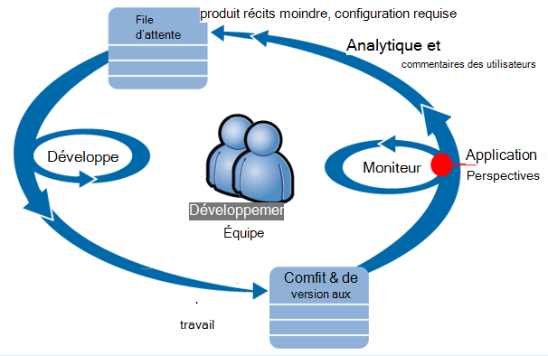

Configuration requise pour enrichir leur (liste des tâches) en retard de développement. Ils fonctionnent en bref sprints, qui fournissent souvent des logiciels de travail - généralement sous la forme d’améliorations et extensions à l’application existante. L’application direct est fréquemment mis à jour avec de nouvelles fonctionnalités. Bien qu’il soit direct, l’équipe de l’analyse de performances et d’utilisation à l’aide de l’aperçu de l’Application. Cette analyse les flux dans leur en retard de développement.

L’équipe utilise les perspectives d’Application pour contrôler l’application web en direct en étroite collaboration pour :
* Performances. Ils souhaitent comprendre comment des temps de réponse varient avec le nombre de demande ; quel processeur, réseau, disque et autres ressources sont utilisés ; et où les goulots d’étranglement.
* Échecs. S’il existe des exceptions ou de l’échec de la demande, ou si un compteur de performance est en dehors de sa plage confortable, l’équipe doit connaître rapidement afin de pouvoir prendre des mesures.
* Utilisation de. Lorsqu’une nouvelle fonctionnalité est disponible, l’équipe que de savoir dans quelle mesure il est utilisé, et si les utilisateurs ont des difficultés avec lui.

Penchons-nous sur la partie de l’évaluation du cycle :

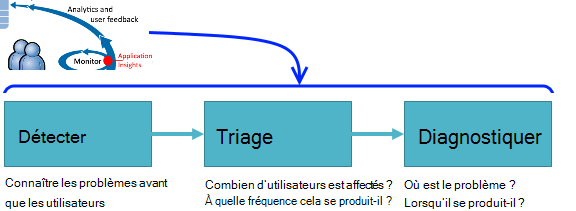

## Détecter la disponibilité d’une mauvaise

Marcela Markova est un développeur senior dans l’équipe de répartition et les responsables de la surveillance des performances en ligne. Elle définit plusieurs [tests web][availability]:

* Un test simple-URL de la page d’accueil de l’application, http://fabrikambank.com/onlinebanking/. Elle définit les critères du code HTTP 200 et le texte « Bienvenue ! ». Si ce test échoue, il existe un sérieux problème avec le réseau ou les serveurs ou peut-être un problème de déploiement. (Ou un utilisateur a modifié la bienvenue ! message sur la page sans en avertir son savoir).

* Un test à plusieurs étapes plus profond, se connecte et obtient un compte en cours en vérifiant quelques informations clées sur chaque page. Ce test vérifie que le lien vers la base de données de comptes fonctionne. Elle utilise un id client fictif : certaines d'entre elles sont conservées à des fins de test.

Grâce à ces tests, configurer, Marcela est sûr que l’équipe va connaître rapidement toute coupure de courant.  

Échecs s’affichent sous forme de points rouges dans le plan de test web :

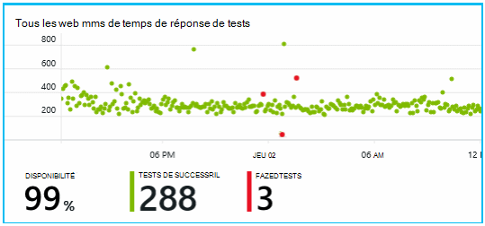

Mais, plus important encore, une alerte concernant tout échec est envoyée à l’équipe de développement. De cette façon, ils savent à propos avant de presque tous les clients.

## Moniteur de performances

Dans la page Vue d’ensemble dans les perspectives de l’Application, il est un graphique qui montre une variété de [critères d’évaluation clés][perf].

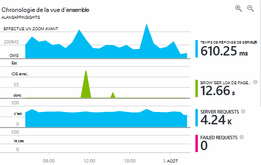

Temps de chargement de page de navigateur est dérivée de télémétrie envoyé directement à partir de pages web. Temps de réponse de serveur, nombre de demande de serveur et le nombre de demandes qui ont échoué sont tous mesurées sur le serveur web et envoyées aux analyses de l’Application à partir de là.

Marcela est légèrement concerné avec le graphique de réponse de serveur, qui affiche la durée moyenne entre lorsque le serveur reçoit une requête HTTP à partir du navigateur d’un utilisateur, et lorsqu’il retourne la réponse. Il n’est pas rare de voir une variation de ce graphique, comme varie en fonction de la charge sur le système. Mais dans ce cas, il semble être qu'une corrélation entre les petites augmente dans le nombre de demandes et grande augmente dans le temps de réponse. Cela peut indiquer que le système fonctionne uniquement à ses limites. 

Elle ouvre les graphiques de serveurs :

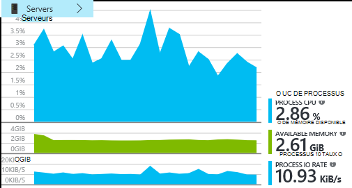

Il ne semble aucun signe de limitation de ressources, peut-être que les chocs dans les graphiques de réponse du serveur sont simplement une coïncidence.

## Alertes

Néanmoins, elle souhaite garder un œil sur les temps de réponse. S’ils se trop élevées, elle souhaite connaître immédiatement.

Afin qu’elle définit un [alertes][metrics], temps de réponse supérieurs à un seuil par défaut. Ainsi, sa confiance elle allez savoir si le temps de réponse sont lents.

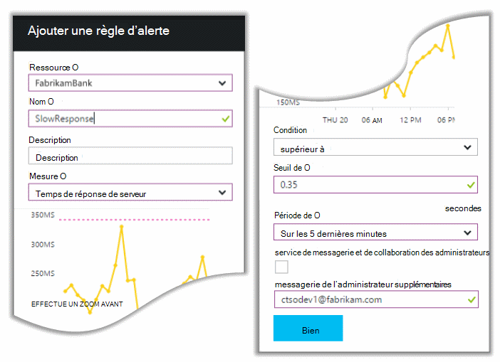

Alertes peuvent être définies sur une grande variété d’autres mesures. Par exemple, vous pouvez recevoir des e-mails si le nombre d’exceptions devient élevé ou si la mémoire disponible est insuffisante, ou s’il existe un pic dans les demandes des clients.

## Alertes de Diagnostics proactifs

Jour suivant, un e-mail d’alerte arrive à partir de l’aperçu de l’Application. Mais lorsqu’elle l’ouvre, she recherche n’est pas l’alerte de temps de réponse, elle créé. À la place, il indique à lui a été une augmentation soudaine de demandes ayant échoué - autrement dit, les requêtes qui ont renvoyé des codes d’erreur de 500 ou plus.

Demandes ayant échoué sont où les utilisateurs ont vu une erreur - fait généralement suite à une exception levée dans le code. Peut-être qu’ils voient un message indiquant « Désolé résultat n’a été mise à jour vos informations maintenant » ou, au absolue gênants le pire des cas, un vidage de pile sur l’écran de l’utilisateur par le serveur web.

Cette alerte est une surprise, car la dernière fois qu’elle a examiné, le nombre de demandes qui ont échoué a été approcher faible. Un petit nombre d’échecs doit être prévue pour un serveur occupé. 

Il était également un peu une surprise pour elle, car elle n’a pas obligé de configurer cette alerte. En fait, Diagnostics proactifs est fourni automatiquement avec les informations d’Application. Il automatiquement ajuste à motif de panne habituelle de votre application et les échecs « obtient utilisé pour » sur une page particulière, ou sous une charge élevée ou lié à d’autres mesures. Il déclenche l’alarme uniquement s’il existe une hausse au-dessus de ce qu’il s’agit d’attendre.

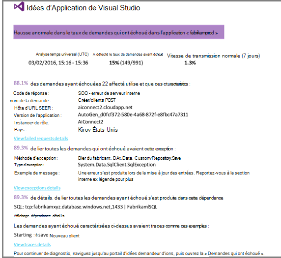

Il s’agit d’un message électronique très utile. Il ne provoquant pas simplement d’une alarme ; Il effectue la plupart du travail de diagnostic, triage et trop.

Il indique combien de clients est affectés et les pages web ou les opérations. Marcela pouvez décider si elle doit obtenir l’ensemble de l’équipe travaillant sur ce comme un exercice d’incendie, ou si elle peut être ignorée jusqu'à ce que la semaine prochaine.

Le courrier électronique indique également qu’une exception particulière s’est produite et - bien plus intéressant - que la défaillance est associée à des appels ayant échouées à une base de données particulière. Cela explique pourquoi l’erreur soudainement s’affiche même si l’équipe de Marcela n’a pas déployé des mises à jour récemment. 

Elle interroge le responsable de l’équipe de la base de données. Oui, ils publié un hot fix est dans la dernière heure de moitié ; et Oups, peut-être il peut y avoir un changement de schéma secondaire...

Le problème est donc sur le moyen de fixation, même avant l’examen des journaux et dans les 15 minutes de celui-ci résultant. Toutefois, Marcela clique sur le lien pour ouvrir les perspectives de l’Application. Il s’ouvre directement sur une demande ayant échoué, et qu’elle peut voir la base de données a échoué à appeler dans la liste associée des appels de dépendance. 

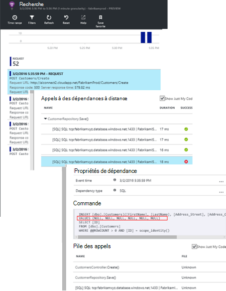

## Détection des exceptions

Avec un petit peu de l’installation, les [exceptions](app-insights-asp-net-exceptions.md) sont signalées à idées d’Application automatiquement. Ils peuvent également être capturées explicitement en insérant des appels à [TrackException()](app-insights-api-custom-events-metrics.md#track-exception) dans le code :  

    var telemetry = new TelemetryClient();
    ...
    try
    { ...
    }
    catch (Exception ex)
    {
       // Set up some properties:
       var properties = new Dictionary <string, string>
         {{"Game", currentGame.Name}};

       var measurements = new Dictionary <string, double>
         {{"Users", currentGame.Users.Count}};

       // Send the exception telemetry:
       telemetry.TrackException(ex, properties, measurements);
    }

L’équipe de Fabrikam bancaire a évolué de la pratique de toujours envoyer télémétrie sur une exception, sauf s’il existe une récupération évidente.  

En fait, leur stratégie est encore plus large que celle : ils envoient télémétrie dans tous les cas où le client est frustré dans leurs attentes à faire, si elle correspond à une exception dans le code ou non. Par exemple, si le système de transfert d’interbancaire externe renvoie un message « Impossible de terminer cette opération » pour une raison opérationnelle (aucune défaillance du client) puis ils suivent cet événement.

    var successCode = AttemptTransfer(transferAmount, ...);
    if (successCode < 0)
    {
       var properties = new Dictionary <string, string>
            {{ "Code", returnCode, ... }};
       var measurements = new Dictionary <string, double>
         {{"Value", transferAmount}};
       telemetry.TrackEvent("transfer failed", properties, measurements);
    }

TrackException est utilisée pour signaler les exceptions car elle envoie une copie de la pile ; TrackEvent est utilisé pour déclarer les autres événements. Vous pouvez joindre des propriétés qui peuvent être utiles dans le diagnostic.

Les événements et les exceptions apparaissent dans la [Recherche de Diagnostic] [ diagnostic] blade. Vous pouvez affiner les pour voir les propriétés supplémentaires et la trace de la pile.

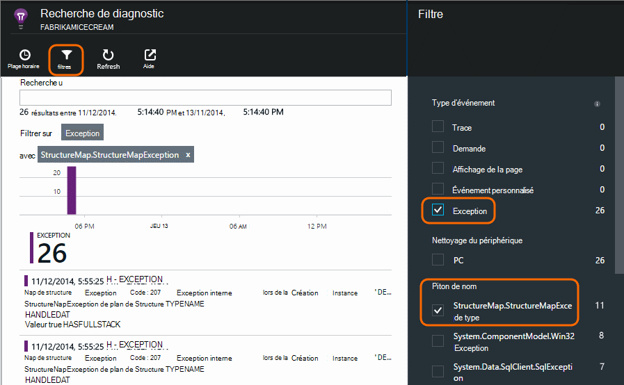

## Surveillance de l’activité de l’utilisateur

Lorsque le temps de réponse est généralement correcte et il existe quelques rares exceptions près, l’équipe dev peut penser comment améliorer l’expérience des utilisateurs et d’encourager les utilisateurs de plus pour atteindre les objectifs de votre choix.

Par exemple, un voyage d’utilisateur classique par le biais du site web a un entonnoir « effacer » : de nombreux clients considèrent les taux des différents types d’emprunt ; certaines d'entre elles remplissent le formulaire de soumission ; et de ceux qui reçoivent un devis, quelques continuez et contracter de prêt.

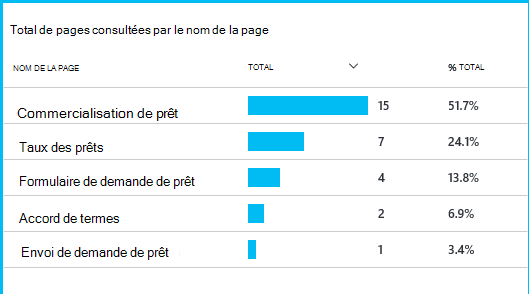

En prenant en compte où disparaître le plus grand nombre de clients, l’entreprise peut fonctionner comment attirer plus d’utilisateurs par le biais vers le bas de l’entonnoir. Dans certains cas il peut y avoir une défaillance d’expérience utilisateur - par exemple, le bouton « suivant » est difficile à trouver, ou les instructions ne sont pas évidentes. Plus probablement, il y a des raisons commerciales plus importantes pour le phénomène : peut-être que les taux des prêts est trop élevés.

Quel que soit les raisons, les données aident l’équipe à déterminer ce que font les utilisateurs. Plusieurs appels de suivi peuvent être insérées pour davantage de détails. TrackEvent() peut être utilisé pour compter les actions de l’utilisateur, dans les moindres détails de clics de bouton d’énormes telle que le paiement d’un prêt.

L’équipe de mise en route permet de présentant des informations sur l’activité de l’utilisateur. Aujourd'hui, chaque fois qu’ils conçoivent une nouvelle fonctionnalité, ils fonctionnent à comment obtenir des commentaires sur son utilisation. Ils conçoivent des appels de suivi dans la fonctionnalité à partir du début. Ils utilisent la rétroaction pour améliorer la fonctionnalité de chaque cycle de développement.

## Une surveillance proactive  

Ne restez pas Marcela autour d’attente pour les alertes. Peu de temps après chaque redéploiement, elle examine en [temps de réponse] [ perf] -à la fois la figure globale et la table de requêtes les plus lentes, ainsi que nombre d’exception.  

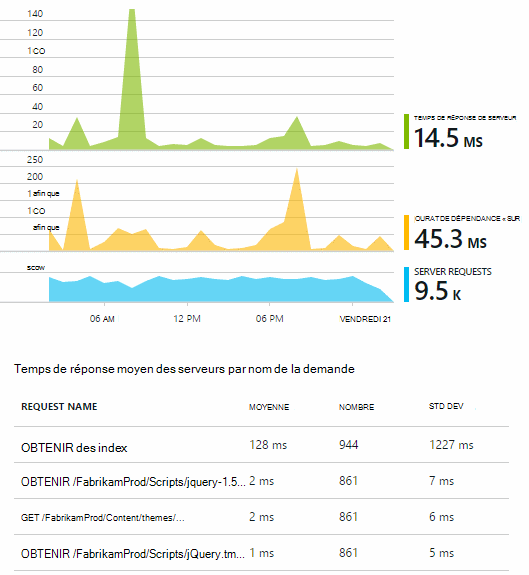

Elle peut évaluer l’effet sur les performances de chaque déploiement, généralement en comparant chaque semaine avec le dernier. S’il existe une aggravation subite, elle qui déclenche avec les développeurs appropriés.

## Triage

Triage - évaluation de la gravité et l’étendue du problème - est la première étape après détection. Devons nous appeler l’équipe à minuit ? Ou il peut être laissé jusqu'à ce que l’intervalle de pratique suivant dans la file d’attente ? Il existe certaines questions clés en triage.

Combien cela se passe-t-il ? Les graphiques sur la lame de vue d’ensemble donnent une perspective à un problème. Par exemple, l’application de Fabrikam généré une nuit à quatre alertes de test web. En examinant le graphique dans le matin, l’équipe a pu voir qu’il y avait en effet des points rouges, bien que toujours la plupart des tests ont été verte. FORAGE dans le diagramme de disponibilité, il était clair que tous ces problèmes intermittents ont été à partir de l’emplacement d’un test. Ceci est évidemment un problème réseau qui affectent un seul itinéraire et aurait très probablement disparaître de lui-même.  

En revanche, une hausse spectaculaire et stable dans le graphique d’exception décomptes ou réponse fois est évidemment à la panique à propos.

Une tactique de triage utile est essayez il vous-même. Si vous rencontrez le même problème, vous savez qu’il est bien réel.

Quelle fraction d’utilisateurs sont affectés ? Pour obtenir une réponse approximative, divisez le taux de défaillance par le nombre de sessions.

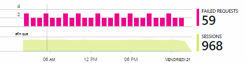

En ce qui concerne les délais de réponse, comparer la table de requêtes de plus lent à répondre avec la fréquence d’utilisation de chaque page.

Quelle est l’important du scénario bloqué ? S’il s’agit d’un problème fonctionnel de blocage d’un récit utilisateur particulier, est-elle bien ? Si les clients ne peuvent pas payer leurs factures, c’est une grave ; Si elles ne peuvent pas modifier leurs préférences de couleur d’écran, peut-être qu’il peut attendre. Les détails de l’événement ou d’exception, ou l’identité de la page chargée, vous indique où les clients rencontrent des problèmes.

## Diagnostic

Diagnostic n’est pas tout à fait identique à déboguer. Avant de démarrer le traçage dans le code, vous devez disposer d’une idée approximative du pourquoi, quand et où l’erreur se produit.

**Lorsqu’il se produit-il ?** L’affichage Historique fourni par les graphiques de l’événement et métrique rend facile à mettre en corrélation les effets avec les causes possibles. S’il existe des pics dans les taux d’exception ou de temps de réponse, regardez le nombre de demande : si elle est optimale en même temps, puis il ressemble à un problème de ressource. Vous devez affecter davantage de processeurs ou de mémoire ? Ou une dépendance qui ne peut pas gérer la charge ?

**Il est nous ?**  Si vous avez une chute soudaine d’un type particulier de demande - par exemple lorsque le client souhaite un relevé de compte - des performances, il est possible, il peut être un sous-système externe plutôt que dans votre application web. Dans l’Explorateur de mesures, sélectionnez le taux d’échec de dépendance et le taux de la durée de la dépendance et comparer leurs historiques sur les cours de quelques heures ou jours avec le problème que vous avez détecté. Si il sont corrélation des modifications, un sous-système externe peut être à l’origine du problème.  

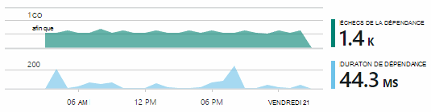

Certains problèmes de lenteur de dépendance sont des problèmes de géolocalisation. Banque de Fabrikam utilise les ordinateurs virtuels Azure et découvert qu’ils avaient situé par inadvertance leur serveur web et le serveur compte dans différents pays. Une amélioration considérable a été provoquée par la migration d’un d’eux.

**Qu’avez-vous pensé ?** Si le problème ne semble pas être une dépendance, et si elle n’était pas toujours il, il est probablement dû à une modification récente. La perspective historique est fournie par les graphiques métrique et événements rend facile à mettre en corrélation des changements soudains des déploiements. Cela réduit donc la recherche du problème.

**Que se passe-t-il ?** Certains problèmes se produisent rarement et peuvent être difficiles à repérer en testant en mode hors connexion. Nous pouvons le faire qu’à tenter de capturer le bogue lorsqu’il se produit en temps réel. Vous pouvez inspecter les vidages de pile dans les rapports d’exception. En outre, vous pouvez écrire les appels de suivi, avec votre structure d’enregistrement favori ou TrackTrace() ou TrackEvent().  

Fabrikam avait un problème intermittent avec les transferts entre comptes, mais uniquement avec certains types de compte. Pour mieux comprendre ce qui se produisait, ils inséré les appels TrackTrace() à des points importants dans le code, en attachant le type de compte sous la forme d’une propriété à chaque appel. Il était facile filtrer uniquement les traces dans la recherche de Diagnostic. Ils joint également les valeurs de paramètre en tant que propriétés et mesures pour les suivi des appels.

## Traite

Une fois que vous avez constaté le problème, vous pouvez créer un plan pour le corriger. Vous devez peut-être restaurer une modification récente, ou peut-être vous pouvez foncez et corrigez-le. Une fois la correction effectuée, perspectives d’Application vous indiquera si vous a réussi.  

Équipe de développement de la banque de Fabrikam prendre une approche plus structurée à la mesure des performances qu’elles avant d’idées d’Application utilisés.

* Ils définir des objectifs de performances des mesures spécifiques dans la page de vue d’ensemble des perspectives de l’Application.

* Ils conçoivent des mesures de performances dans l’application à partir du début, par exemple les mesures qui mesurent la progression de l’utilisateur par le biais de « Entonnoirs. »  

## Utilisation de

Idées d’application peuvent également servir pour savoir que faire les utilisateurs avec une application. Une fois qu’il s’exécute correctement, l’équipe souhaite connaître les fonctionnalités qui sont les plus populaires, ce que les utilisateurs comme ou ont des difficultés avec et la fréquence à laquelle ils réapparaissent. Qui leur permettra de hiérarchiser leur travail à venir. Et ils peuvent planifier mesurer la réussite de chaque fonctionnalité dans le cadre du cycle de développement. [En savoir plus][usage].

## Vos applications

C’est une utilisation en équipe perspectives d’Application non seulement pour résoudre des problèmes particuliers, mais pour améliorer leur cycle de vie de développement. J’espère qu’il vous a donné quelques idées sur comment les perspectives d’Application peut vous aider à améliorer les performances de vos propres applications.

## Vidéo

[AZURE.VIDEO performance-monitoring-application-insights]

<!--Link references-->

[api]: app-insights-api-custom-events-metrics.md
[availability]: app-insights-monitor-web-app-availability.md
[diagnostic]: app-insights-diagnostic-search.md
[metrics]: app-insights-metrics-explorer.md
[perf]: app-insights-web-monitor-performance.md
[usage]: app-insights-web-track-usage.md
 
