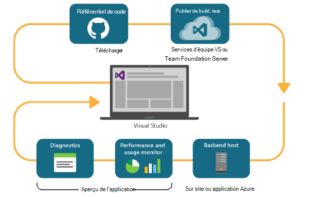

<properties
    pageTitle="Analytique de développeur"
    description="DevOps grâce à Visual Studio, Application, HockeyApp"
    authors="alancameronwills"
    services="application-insights"
    documentationCenter=""
    manager="douge"/>

<tags
    ms.service="application-insights"
    ms.workload="tbd"
    ms.tgt_pltfrm="ibiza"
    ms.devlang="na"
    ms.topic="article" 
    ms.date="05/18/2016"
    ms.author="awills"/>

# Analytique de développeur grâce à Application des HockeyApp

*Idées d’application est en mode Aperçu.*

De nombreux projets fonctionnent un cycle [DevOps](https://en.wikipedia.org/wiki/DevOps) rapide. Ils générer et distribuer leurs applications, obtenir des commentaires sur son fonctionnement et quoi en faire les utilisateurs et utilisent ensuite ces connaissances pour planifier de futures des cycles de développement. 

Pour surveiller l’utilisation et les performances, il est important de disposer des données télémétriques fournies par les applications en ligne, ainsi que les utilisateurs eux-mêmes. 

De nombreux systèmes sont créées à partir de plusieurs composants : un service web, les processeurs back-end ou des magasins de données et le logiciel client dans le navigateur de l’utilisateur ou comme une application dans un téléphone ou un autre périphérique. La télémétrie à partir de ces différents composants doit être pris ensemble.

Certaines versions ont limité à distribuer aux testeurs désignés ; Nous avons également organisé flighting (essais de nouvelles fonctionnalités à un public bien précis) et A | B test (tests parallèles d’autre interface utilisateur).

Gestion des distributions et en intégrant la surveillance se prolonge sur plusieurs composants client et serveur n’est pas une tâche facile. Ce processus est une partie essentielle de l’architecture de l’application : nous ne pouvons pas créer un système de ce type sans un cycle de développement itératif et les bons outils de surveillance.

Dans cet article, nous allons étudier comment les aspects de surveillance du cycle devOps s’intègrent avec les autres parties du processus. 

Si vous souhaitez examiner un exemple spécifique, il existe [une étude de cas intéressante](http://aka.ms/mydrivingdocs) qui comporte plusieurs composants client et serveur.

## Un cycle DevOps

Les outils et l’Analytique de développeur Visual Studio offrent une expérience de devOps bien intégrée. Par exemple, Voici un cycle typique d’une application web (qui pourrait être Java, Node.js ou ASP.NET) :

* Un développeur archive dans le référentiel de code ou fusionne dans la branche principale. Le référentiel est Git dans cette illustration, mais il peut être également le [Contrôle de Version Team Foundation](https://www.visualstudio.com/docs/tfvc/overview).
* Les modifications de déclenchent un build et le test unitaire. Le service de build peut être dans [Visual Studio Team Services ou son homologue sur site, Team Foundation Server](https://www.visualstudio.com/docs/vsts-tfs-overview). 
* Une génération réussie et un test unitaire peuvent [le déploiement automatique de déclencheur](https://www.visualstudio.com/docs/release/author-release-definition/more-release-definition). L’hôte d’application web peut être votre propre serveur web ou Microsoft Azure. 
* Données télémétriques fournies par l’application direct est envoyé à [d’Idées d’Application](app-insights-overview.md), à la fois à partir du serveur et [des navigateurs clients](app-insights-javascript.md). Vous pouvez analyser les performances des modèles d’application et de l’utilisation. Aide puissants [Outils de recherche](app-insights-analytics.md) vous diagnostiquer les problèmes. [Alertes](app-insights-alerts.md) vous devez connaître à propos d’un problème dès qu’il se produit. 
* Votre prochain cycle de développement est informée par l’analyse de la télémétrie live.

### Applications de bureau et de périphérique

Pour les périphériques et les applications de bureau, la partie de la distribution du cycle est légèrement différente, car nous ne vous rechargez simplement à un ou deux serveurs. Au lieu de cela, une génération réussie et un test unitaire peuvent [déclencheur téléchargement vers HockeyApp](https://support.hockeyapp.net/kb/third-party-bug-trackers-services-and-webhooks/how-to-use-hockeyapp-with-visual-studio-team-services-vsts-or-team-foundation-server-tfs). HockeyApp supervise la distribution à votre équipe d’utilisateurs de test (ou au grand public, si vous préférez). 

HockeyApp recueille également des performances et des données d’utilisation, dans les formes de :

* Rétroaction textuellement avec captures d’écran
* Rapports d’incident
* Télémétrie personnalisé codé par vous.

Une fois de plus, le cycle devOps est terminé lorsque vous prenez vos plans d’évolution à la lumière de l’évaluation acquise.

## Configuration Analytique de développeur

Pour chaque composant de votre application - mobile ou de site web ou de bureau - les étapes sont les mêmes. Pour de nombreux types d’application, Visual Studio exécute automatiquement certaines de ces étapes.

1. Ajoutez le Kit de développement logiciel approprié à votre application. Pour les applications de périphérique, il est HockeyApp, et pour les services web, il est perspectives d’Application. Chacun possède plusieurs variantes pour les différentes plates-formes. (Il est également possible d’utiliser un SDK pour applications de bureau, mais nous vous recommandons de HockeyApp.)
2. Inscrire votre application avec le portail de perspectives de l’Application ou HockeyApp, selon le Kit de développement que vous avez utilisé. Il s’agit d’où vous verrez analytique à partir de votre application en direct. Vous obtenez une clé d’instrumentation ou l’ID que vous configurez dans votre application afin que le Kit de développement logiciel sache où envoyer son télémétrie.
3. Ajouter du code personnalisé (si nécessaire) pour connecter des événements ou des métriques, pour vous aider avec les tests de diagnostic ou d’analyser les performances ou utilisation. Il existe un grand nombre de surveillance intégrée, et vous ne devez donc sur votre premier cycle.
3. Pour les applications de périphérique :
 * Télécharger une version debug à HockeyApp. À partir de là, vous pouvez le distribuer à une équipe d’utilisateurs de test. Chaque fois que vous téléchargez les versions ultérieures, l’équipe sera informée.
 * Lorsque vous configurez votre continue build service, créez une définition de version qui utilise de l’étape de plug-in de télécharger vers HockeyApp.

### Analytique et l’exportation de télémétrie de HockeyApp

Vous pouvez étudier HockeyApp personnalisé et connecter l’utilisation des fonctionnalités Analytique et exporter Continuous de perspectives de l’Application par la [configuration d’un pont](app-insights-hockeyapp-bridge-app.md)de télémétrie.

## Étapes suivantes
 
Voici les instructions détaillées pour différents types d’application :

* [ASP.NET web app](app-insights-asp-net.md) 
* [Application web de Java](app-insights-java-get-started.md)
* [Node.js web app](https://github.com/Microsoft/ApplicationInsights-node.js)
* [application iOS](https://support.hockeyapp.net/kb/client-integration-ios-mac-os-x-tvos/hockeyapp-for-ios)
* [Mac OS X app](https://support.hockeyapp.net/kb/client-integration-ios-mac-os-x-tvos/hockeyapp-for-mac-os-x)
* [Application d’Android](https://support.hockeyapp.net/kb/client-integration-android/hockeyapp-for-android-sdk)
* [Application Windows universel](https://support.hockeyapp.net/kb/client-integration-windows-and-windows-phone/how-to-create-an-app-for-uwp)
* [Windows Phone 8 et 8.1 app](https://support.hockeyapp.net/kb/client-integration-windows-and-windows-phone/hockeyapp-for-windows-phone-silverlight-apps-80-and-81)
* [Windows Presentation Foundation application](https://support.hockeyapp.net/kb/client-integration-windows-and-windows-phone/hockeyapp-for-windows-wpf-apps)

