<properties 
    pageTitle="À l’aide de la recherche de Diagnostic | Microsoft Azure" 
    description="Rechercher et filtrer les événements individuels, des demandes et journal des traces." 
    services="application-insights" 
    documentationCenter=""
    authors="alancameronwills" 
    manager="douge"/>

<tags 
    ms.service="application-insights" 
    ms.workload="tbd" 
    ms.tgt_pltfrm="ibiza" 
    ms.devlang="na" 
    ms.topic="article" 
    ms.date="06/09/2016" 
    ms.author="awills"/>
 
# À l’aide de la recherche de Diagnostic dans les perspectives de l’Application

Recherche de diagnostic est une fonctionnalité [d’Aperçu de l’Application] [ start] que vous utilisez pour rechercher et Explorer des éléments de télémétrie individuels, tels que les affichages de page, des exceptions ou web des demandes. Et vous pouvez afficher le journal des traces et des événements que vous avez codé.

## Lorsque vous voyez le Diagnostic recherche ?

### Dans le portail Azure

Vous pouvez ouvrir une recherche diagnostic explicitement :

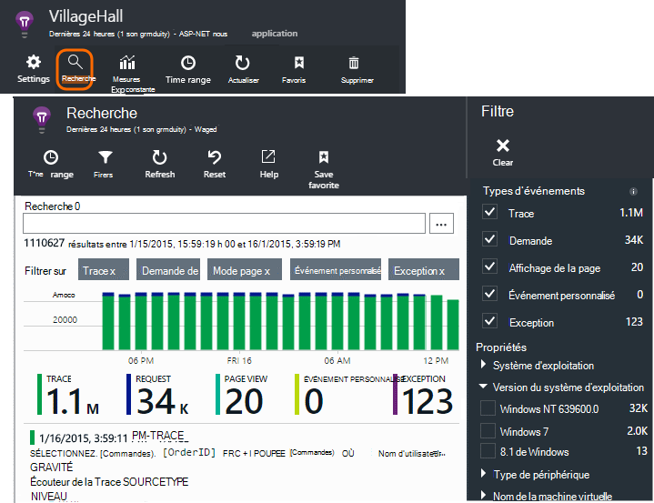

Il s’affiche également lorsque vous cliquez sur par l’intermédiaire de certains graphiques et les éléments de la grille. Dans ce cas, les filtres sont pré-établies pour vous concentrer sur le type d’élément que vous avez sélectionné. 

Par exemple, si votre application est un service web, la lame de vue d’ensemble affiche un graphique du volume de requêtes. Cliquez dessus, vous obtenez un graphique plus détaillées, avec une liste indiquant le nombre de requêtes qui ont été apportée pour chaque URL. Cliquez sur n’importe quelle ligne, et vous obtenez une liste de requêtes individuelles pour cette URL :

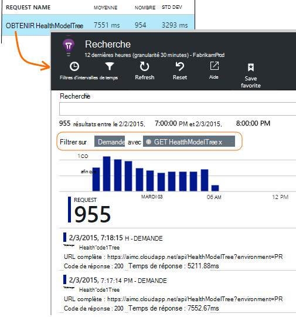

Le corps principal du Diagnostic de recherche est une liste d’éléments de télémétrie - demandes de serveur, la page affichages, les événements personnalisés que vous avez codé et ainsi de suite. En haut de la liste est un résumé graphique affichant des nombres d’événements au fil du temps.

Événements généralement s’affichent dans la recherche de diagnostic avant d’apparaître dans l’Explorateur de métriques. Bien que la lame s’actualise à intervalles, vous pouvez cliquer sur Actualiser si vous êtes en attente pour un événement particulier.

### Dans Visual Studio

Ouvrez la fenêtre de recherche dans Visual Studio :

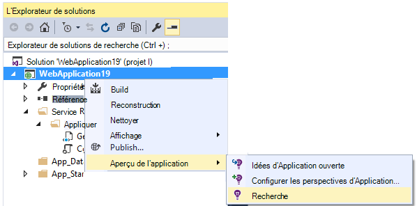

La fenêtre de recherche possède les mêmes fonctionnalités que le portail web :

## Échantillonnage

Si votre application génère un grand nombre de télémétrie (et vous utilisez la 2.0.0-beta3 de version du Kit de développement ASP.NET ou une version ultérieure), le module d’échantillonnage adapté réduit automatiquement le volume qui est envoyé sur le portail en envoyant uniquement une fraction représentative des événements. Toutefois, les événements liés à la même demande va être activés ou désactivées en tant que groupe, afin que vous pouvez naviguer entre les événements associés. 

[Obtenir des informations sur le prélèvement](app-insights-sampling.md).

## Inspecter des éléments individuels

Sélectionnez n’importe quel élément de télémétrie pour voir les champs clés et les éléments associés. Si vous souhaitez voir l’ensemble des champs, cliquez sur «... ». 

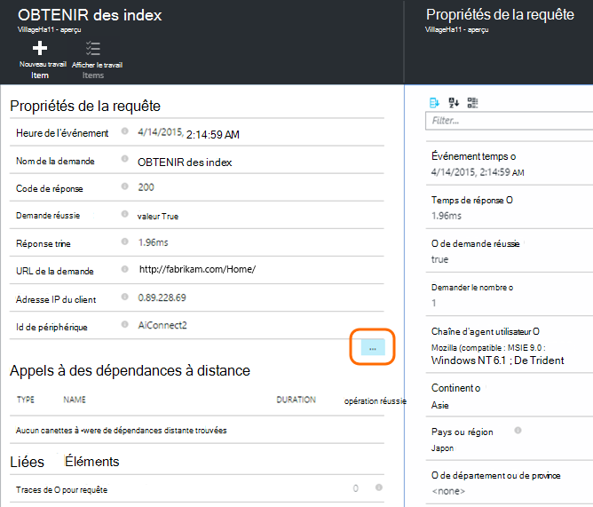

Pour rechercher l’ensemble des champs, utilisez des chaînes de texte brut (sans caractères génériques). Les champs disponibles varient en fonction du type de télémétrie.

## Créer l’élément de travail

Vous pouvez créer un bogue dans Visual Studio Team Services avec les détails à partir de n’importe quel élément de télémétrie. 

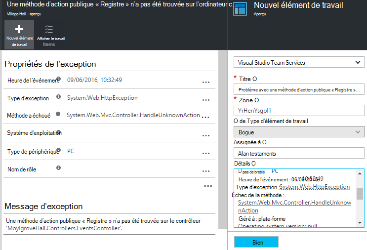

La première fois que vous procédez ainsi, vous êtes invité à configurer un lien vers votre compte de Services de l’équipe et le projet.

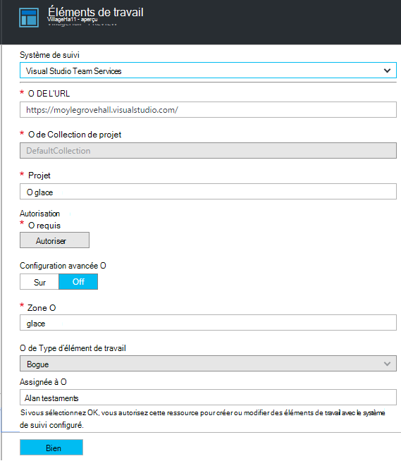

(Vous pouvez également accéder à la lame de configuration à partir des paramètres > des éléments de travail.)

## Filtrer les types d’événements

La lame de filtre et les types d’événements que vous souhaitez afficher. (Si, par la suite, vous souhaitez restaurer les filtres avec lequel vous avez ouvert la lame, cliquez sur Réinitialiser).

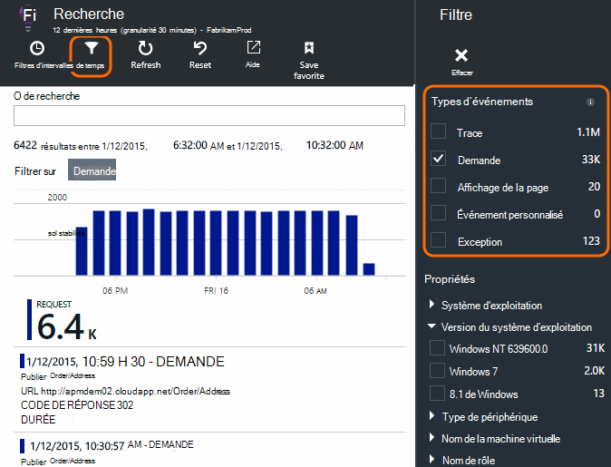

Les types d’événements sont les suivantes :

* **Trace** - journaux de Diagnostic, y compris les appels de TrackTrace, log4Net, NLog et System.Diagnostic.Trace.
* **Demande** - demandes HTTP reçues par votre application serveur, y compris les pages, les scripts, les images, les fichiers de style et les données. Ces événements sont utilisés pour créer des graphiques de la vue d’ensemble de la demande et la réponse.
* **Affichage de la Page** - télémétrie envoyé par le client web, utilisée pour créer la page Afficher les rapports. 
* **Custom Event** - si vous avez inséré des appels à TrackEvent() afin de [surveiller l’utilisation de][track], vous pouvez les rechercher ici.
* **Exception** : les exceptions non interceptées par le serveur et que vous vous connectez à l’aide de TrackException().

## Filtrer sur les valeurs de propriété

Vous pouvez filtrer les événements sur les valeurs de leurs propriétés. Les propriétés disponibles varient selon les types d’événements que vous avez sélectionné. 

Par exemple, de sélectionner les requêtes avec un code de réponse spécifique.

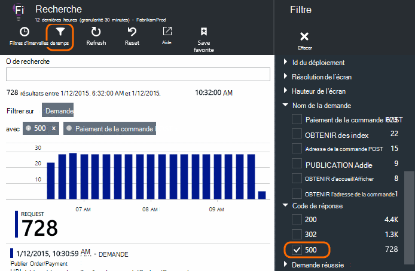

Ne choisissez aucune valeur d’une propriété particulière a le même effet que la sélection de toutes les valeurs ; il désactive le filtrage pour cette propriété.

### Affiner votre recherche

Notez que les nombres à droite des valeurs de filtre affichent le nombre de récurrences est dans le jeu filtré en cours. 

Dans cet exemple, il est clair que la `Reports/Employees` demande les résultats dans la plupart des 500 erreurs :

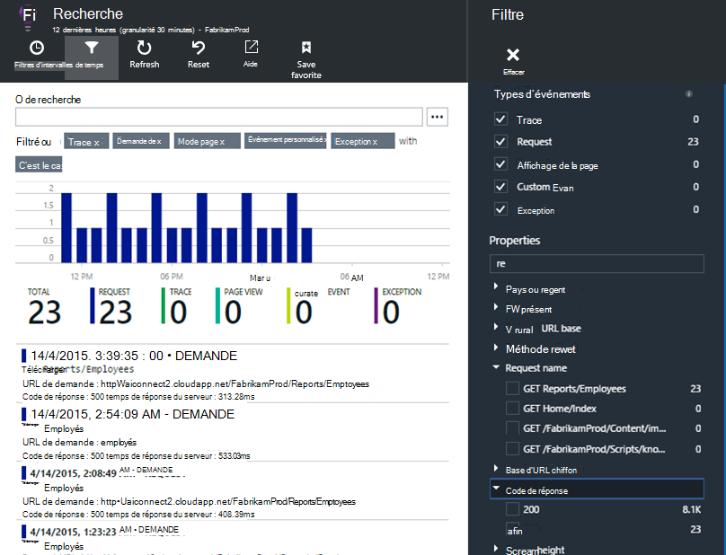

En outre si vous souhaitez voir aussi les autres événements ont lieu pendant ce temps, vous pouvez vérifier **les événements inclure avec les propriétés non définies**.

## Suppression du trafic de test web et robots

Utiliser le filtre **le trafic réel ou synthétique** et **réel**.

Vous pouvez également filtrer par **Source de trafic synthétique**.

## Inspecter les occurrences individuelles

Ajouter ce nom de demande pour le jeu de filtres, et vous pouvez alors inspecter les occurrences de cet événement.

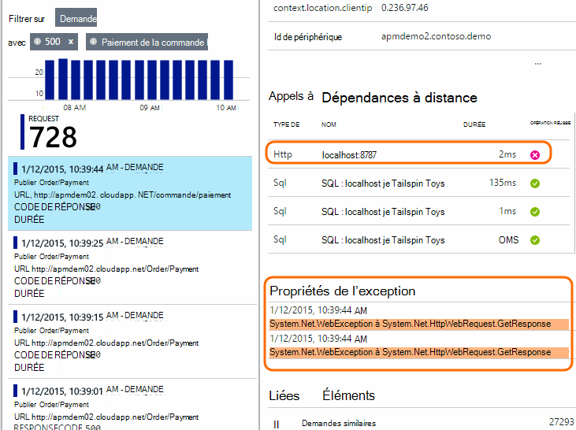

Pour les événements de requête, les détails indiquent les exceptions qui se sont produites lors du traitement de la demande.

Cliquez sur voir ses détails, y compris la trace de pile d’une exception.

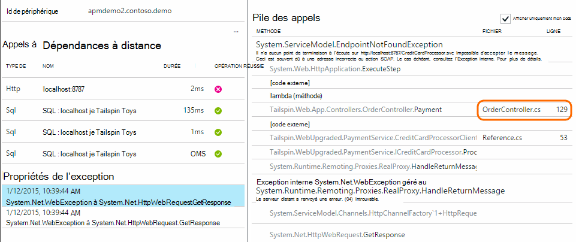

## Trouver des événements ayant la même propriété.

Trouver tous les éléments ayant la même valeur de propriété :

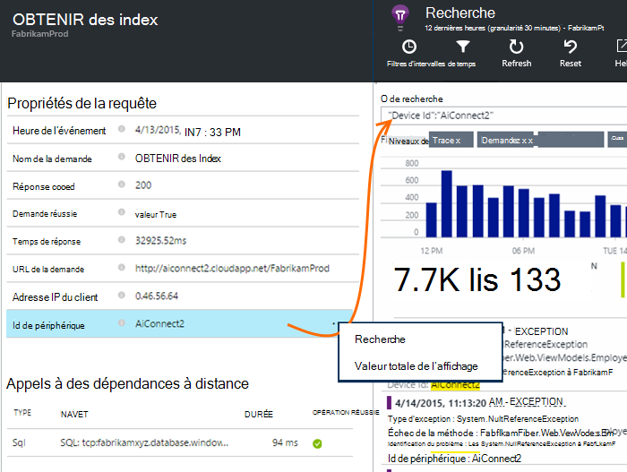

## Effectuer une recherche par valeur métrique

Obtenez tout le temps de réponse en demandes > 5 s.  Heures sont indiquées en graduations : 10 000 graduations = 1 ms.

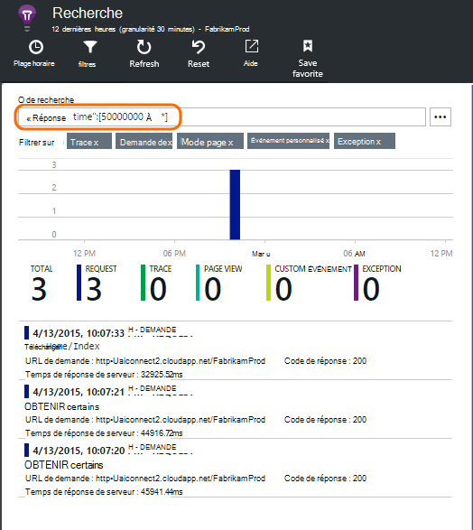

## Rechercher les données

Vous pouvez rechercher des termes dans une des valeurs de propriété. Ceci est particulièrement utile si vous avez écrit [des événements personnalisés] [ track] avec les valeurs de propriété. 

Vous pouvez souhaiter définir une durée étendue, que les recherches sur une plage plus courte sont plus rapides. 

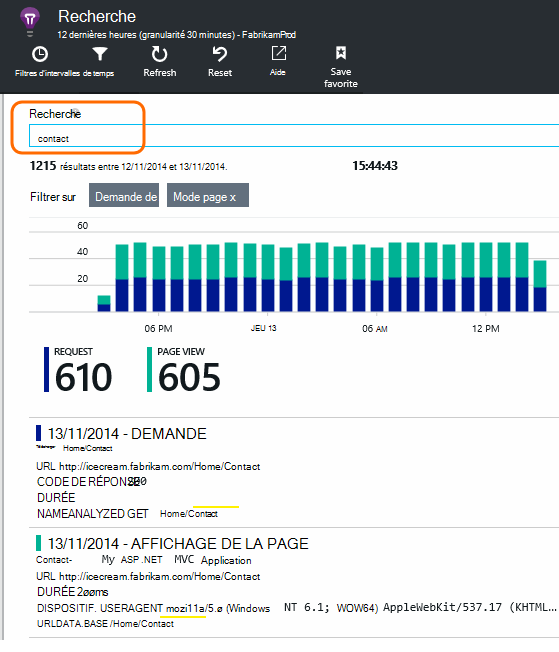

Recherchez des termes, pas des sous-chaînes. Termes sont des chaînes alphanumériques, y compris de certains signes de ponctuation tels que '.' et '_'. Par exemple :

terme|ne reconnaît *pas*|mais ils ne correspondent pas
---|---|---
HomeController.About|sur accueil|h\*sur accueil\*
IsLocal|local est \*local|ISL\* IsLocal i\*l\*
Nouveau délai|d w|Nouveau délai n\* et d\*

Vous pouvez utiliser les expressions de recherche sont :

Exemple de requête | Effet 
---|---
ralentir|Rechercher tous les événements dans la plage de dates dont les champs incluent le terme « lent »
base de données ?|Correspond à Basededonnées01, databaseAB... ? n’est pas autorisé au début d’un terme de recherche.
base de données * |Correspond à la base de données, Basededonnées01, databaseNNNN  * n’est pas autorisé au début d’un terme de recherche
Apple et banane|Rechercher des événements contenant les deux termes. Utiliser des capitaux « et », pas « et ».
Apple, banana d’OR bananes Apple|Rechercher des événements contenant les deux termes. Utilisez « Ou », pas « ou ». < /br/ > court formulaire.
Apple, banana pas Apple-banane|Rechercher des événements qui contiennent un terme mais pas l’autre. Forme abrégée.
application * et banane-(grape pear)|Les opérateurs logiques et mise entre crochets.
« Metric » : 0 à 500. « Metric » : À 500 * | Rechercher des événements contenant la mesure nommée dans la plage de valeurs.

## Enregistrer votre recherche

Lorsque vous avez défini tous les filtres que vous le souhaitez, vous pouvez enregistrer la recherche en tant que favori. Si vous travaillez dans un compte d’organisation, vous pouvez choisir de le partager avec d’autres membres de l’équipe.

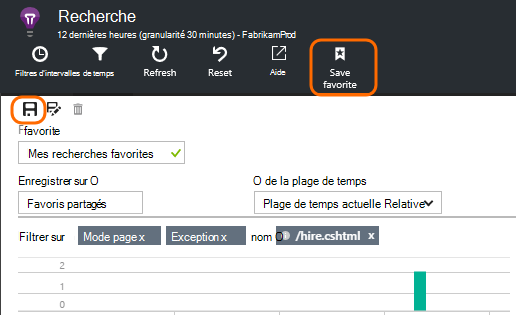

Pour voir la recherche, **accédez à la lame de vue d’ensemble** et ouvrir Favoris :

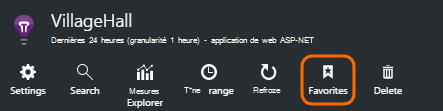

Si vous avez enregistré avec un intervalle de temps relatif, la lame rouverte dispose des dernières données. Si vous avez enregistré avec une plage de temps absolu, vous voyez les mêmes données à chaque fois.

## Envoyer plus de télémétrie d’idées d’Application

En plus de la télémétrie de-l’emploi envoyée par l’Application Insights SDK, vous pouvez :

* Capture des traces du journal à partir de votre infrastructure de journalisation favoris dans [.NET] [ netlogs] ou [Java][javalogs]. Cela signifie que vous pouvez effectuer une recherche dans vos traces de journal et les mettre en corrélation avec les vues de page, les exceptions et les autres événements. 
* [Écrire du code] [ track] pour envoyer des événements personnalisés, les vues de page et les exceptions. 

[Apprenez à envoyer des journaux et télémétrie personnalisé aux analyses d’Application][trace].

## Q & r

### La quantité de données est conservée ?

Événements jusqu'à 500 par seconde à partir de chaque application. Les événements sont conservés pendant sept jours.

### Comment puis-je voir les données de publication dans Mes demandes de serveur ?

Nous n’enregistre pas automatiquement les données de publication, mais vous pouvez utiliser les [appels de TrackTrace ou de journal][trace]. Placer les données de publication dans le paramètre de message. Vous ne pouvez pas filtrer sur le message à la façon dont vous pouvez propriétés, mais la limite de taille est plus longue.

## Étapes suivantes

* [Envoyer les journaux et télémétrie personnalisé aux analyses de l’Application][trace]
* [Configurer les tests de la réactivité et de disponibilité][availability]
* [Résolution des problèmes][qna]

<!--Link references-->

[availability]: app-insights-monitor-web-app-availability.md
[javalogs]: app-insights-java-trace-logs.md
[netlogs]: app-insights-asp-net-trace-logs.md
[qna]: app-insights-troubleshoot-faq.md
[start]: app-insights-overview.md
[trace]: app-insights-search-diagnostic-logs.md
[track]: app-insights-api-custom-events-metrics.md

 