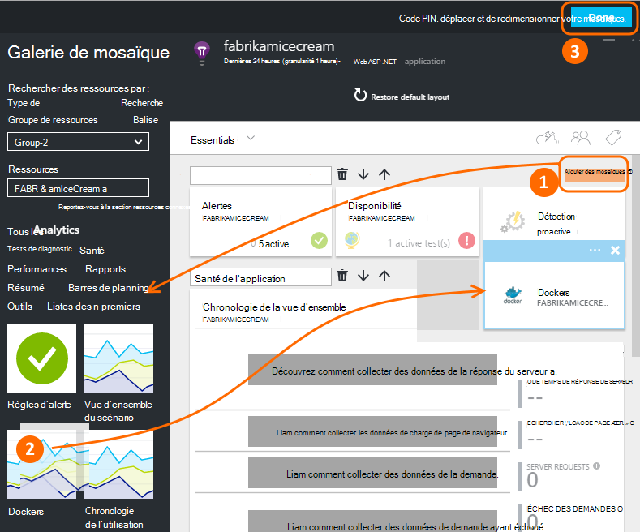
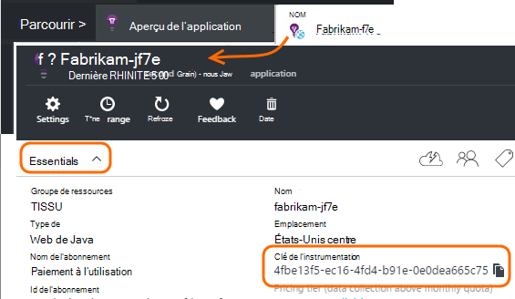
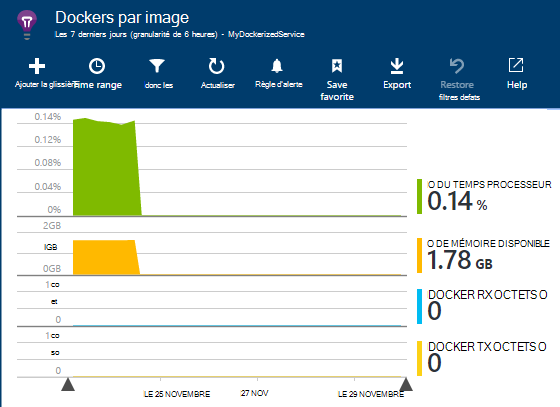
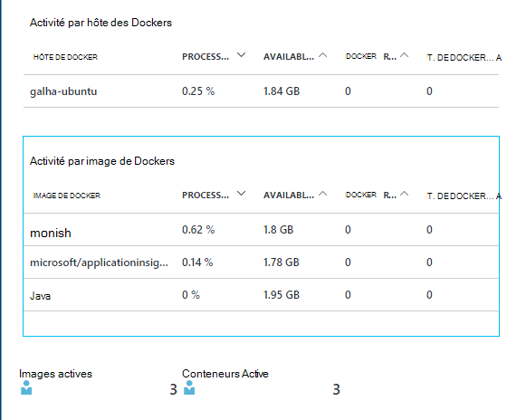
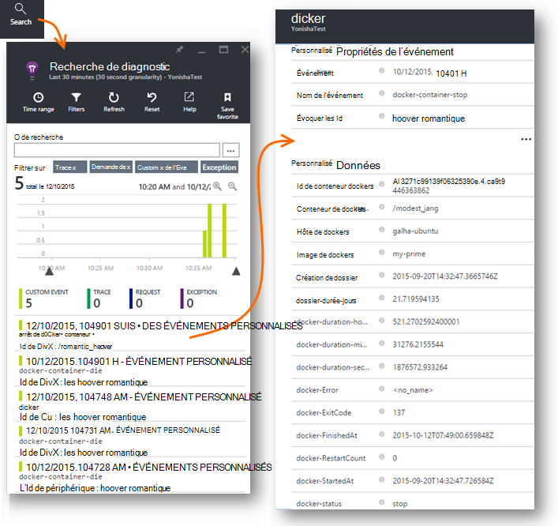
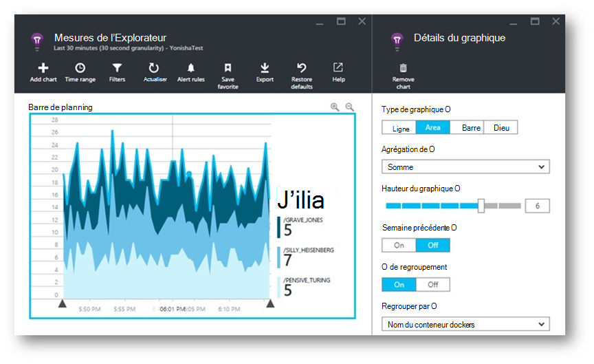
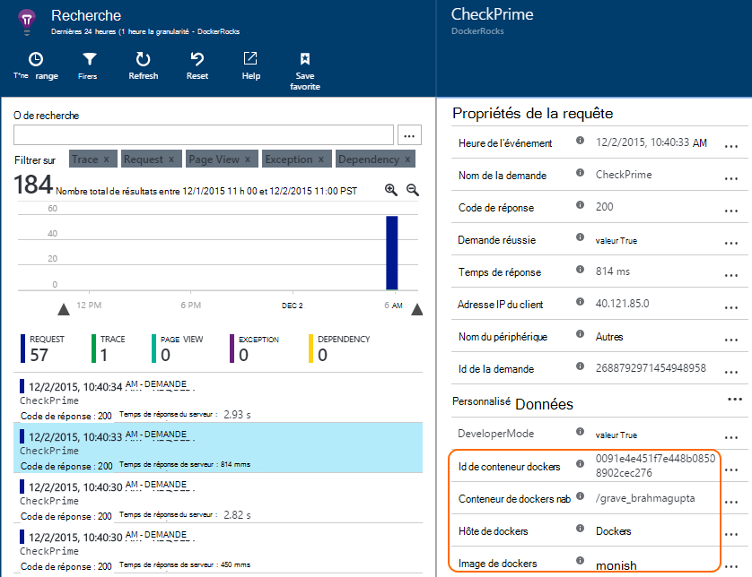
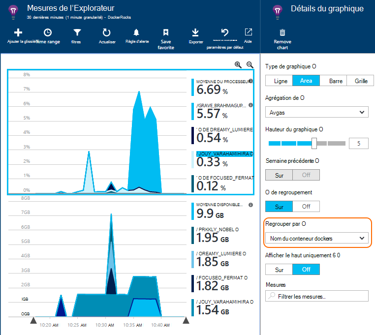

<properties 
    pageTitle="Surveiller des applications Docker dans les perspectives de l’Application" 
    description="Exceptions, les événements et les compteurs de performance docker peuvent figurer sur les perspectives de l’Application, ainsi que de la télémétrie à partir des applications." 
    services="application-insights" 
    documentationCenter=""
    authors="alancameronwills" 
    manager="douge"/>

<tags 
    ms.service="application-insights" 
    ms.workload="tbd" 
    ms.tgt_pltfrm="ibiza" 
    ms.devlang="na" 
    ms.topic="article" 
    ms.date="12/01/2015" 
    ms.author="awills"/>
 
# <a name="monitor-docker-applications-in-application-insights"></a>Surveiller des applications Docker dans les perspectives de l’Application

Événements de cycle de vie et les compteurs de performance à partir des conteneurs de [Docker](https://www.docker.com/) peuvent être représentées sur les perspectives de l’Application. Installer l’image de [l’Aperçu de l’Application](app-insights-overview.md) dans un conteneur dans votre hôte, et affiche les compteurs de performance pour l’hôte, ainsi que pour les autres images.

Avec Docker, vous distribuez vos applications dans des contenants légers avec toutes les dépendances. Qu’elles s’exécutent sur l’ordinateur hôte qui exécute un moteur Docker.

Lorsque vous exécutez l' [image de l’aperçu de l’Application](https://hub.docker.com/r/microsoft/applicationinsights/) sur votre hôte Docker, vous obtenez ces avantages :

* TELEMETRIE de cycle de vie sur tous les conteneurs en cours d’exécution sur l’hôte - Démarrer, arrêter et ainsi de suite.
* Compteurs de performance pour tous les conteneurs. Processeur, mémoire, l’utilisation du réseau et bien plus encore.
* Si vous avez [installé le SDK de perspectives d’Application](app-insights-java-live.md) dans les applications en cours d’exécution dans les conteneurs, tous la TELEMESURE de ces applications ont des propriétés supplémentaires qui identifie l’ordinateur hôte et de conteneur. Par exemple, si vous avez des instances d’une application en cours d’exécution dans plus d’un hôte, vous serez facilement en mesure de filtrer de télémétrie de votre application par hôte.


## <a name="set-up-your-application-insights-resource"></a>Configuration de votre ressource de perspectives d’Application

1. Connectez-vous à [Microsoft Azure Portal](https://azure.com) et ouvrez la ressource d’informations d’Application pour votre application ; ou [créez-en un nouveau](app-insights-create-new-resource.md). 

    *Quelle ressource dois-je utiliser ?* Si les applications que vous exécutez sur votre hôte ont été développées par quelqu'un d’autre, vous devrez [créer une nouvelle ressource de perspectives de l’Application](app-insights-create-new-resource.md). Il s’agit d’où vous permet d’afficher et d’analyser la télémétrie. (Sélectionnez « Autres » pour le type d’application).

    Mais si vous êtes développeur d’applications, puis nous espérons que vous [ajouté SDK de perspectives d’Application](app-insights-java-live.md) à chacun d’eux. S’ils sont tous les composants réellement d’une application commerciale unique, vous pouvez configurer tous les envoyer de télémétrie pour une ressource, et vous devez utiliser la même ressource pour afficher les données de performances et du cycle de vie de Docker. 

    Un troisième scénario est que vous avez développé la plupart des applications, mais vous utilisez des ressources distinctes pour afficher leur télémétrie. Dans ce cas, vous devrez probablement créer une ressource séparée pour les données de Docker. 

2.  Ajouter la mosaïque Docker : **Ajouter en mosaïque**, faites glisser le carreau de Docker à partir de la galerie et cliquez sur **terminé**. 

    


3. Cliquez sur le menu déroulant **Essentials** et copier la clé de l’Instrumentation. Vous l’utiliserez pour indiquer le Kit de développement de logiciel où envoyer son télémétrie.


    

Conservez cette fenêtre de navigateur pratique, vous allez y revenir ultérieurement pour consulter votre télémétrie.


## <a name="run-the-application-insights-monitor-on-your-host"></a>Exécutez le moniteur de perspectives de l’Application sur votre hôte
 
Maintenant que vous avez un emplacement où afficher la télémétrie, vous pouvez configurer l’application en conteneur qui va collecter et les envoyer.

1.  Se connecter à l’hôte Docker. 
2.  Modifier la clé de votre instrumentation dans cette commande et ensuite l’exécuter :
 
    ```

    docker run -v /var/run/docker.sock:/docker.sock -d microsoft/applicationinsights ikey=000000-1111-2222-3333-444444444
    ```

Qu’une image de l’aperçu de l’Application est requise par hôte de Docker. Si votre application est déployée sur plusieurs hôtes de Docker, puis répétez la commande sur chaque hôte.

## <a name="update-your-app"></a>Mise à jour de votre application

Si votre application est instrumentée avec l' [Application aperçu SDK pour Java](app-insights-java-get-started.md), ajoutez la ligne suivante dans le fichier ApplicationInsights.xml dans votre projet, sous la `<TelemetryInitializers>` élément :

```xml

    <Add type="com.microsoft.applicationinsights.extensibility.initializer.docker.DockerContextInitializer"/> 
```

Cela ajoute des informations de Docker comme conteneur et id d’hôte pour chaque élément de télémétrie envoyé à partir de votre application.

## <a name="view-your-telemetry"></a>Afficher votre télémétrie

Revenez à votre ressource de perspectives d’Application dans Azure portal.

Cliquez sur la mosaïque Docker.

Vous verrez bientôt des données en provenance de l’application Docker, surtout si vous avez d’autres conteneurs en cours d’exécution sur votre moteur de Docker.


Voici quelques-unes des vues que vous pouvez obtenir.

### <a name="perf-counters-by-host-activity-by-image"></a>Compteurs de performance par hôte, activité par image








Cliquez sur n’importe quel nom d’hôte ou de l’image pour plus de détails.


Pour personnaliser l’affichage, cliquez sur n’importe quel graphique, la grille de position, ou utilisez Ajouter un graphique. 

[En savoir plus sur l’Explorateur de mesures](app-insights-metrics-explorer.md).

### <a name="docker-container-events"></a>Événements de conteneur docker




Pour étudier les événements individuels, cliquez sur [Rechercher](app-insights-diagnostic-search.md). Recherche et filtre pour rechercher les événements que vous souhaitez. Cliquez sur n’importe quel événement pour obtenir plus de détails.
 
### <a name="exceptions-by-container-name"></a>Exceptions par nom du conteneur
 



### <a name="docker-context-added-to-app-telemetry"></a>Contexte de docker ajouté à télémétrie d’application

Demande de télémétrie envoyé de l’application instrumentée avec AI SDK, enrichis avec contexte de Docker :



Temps processeur et des compteurs de performance de la mémoire disponible, enrichi et regroupés par nom de conteneur de Docker :





## <a name="q--a"></a>Q & r

*Que me qui n’arrive pas à obtenir à partir de Docker ' donner les perspectives d’Application ?*

* Analyse détaillée des compteurs de performance par conteneur et image.
* Intégrer des données de conteneur et d’application dans un tableau de bord.
* [Exportation de télémétrie](app-insights-export-telemetry.md) pour approfondir l’analyse pour une base de données, alimentation BI ou tableau de bord.

*Comment obtenir la télémétrie à partir de l’application elle-même ?*

* Installez l’Application d’idées SDK dans l’application. Découvrez comment faire pour : [les applications web Java](app-insights-java-get-started.md), les [applications web de Windows](app-insights-asp-net.md).
