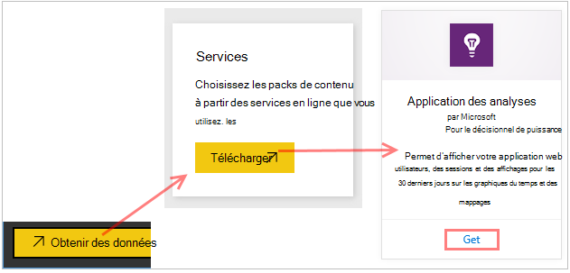
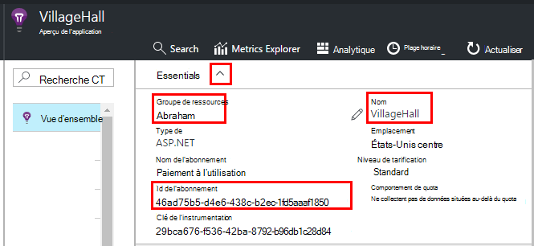
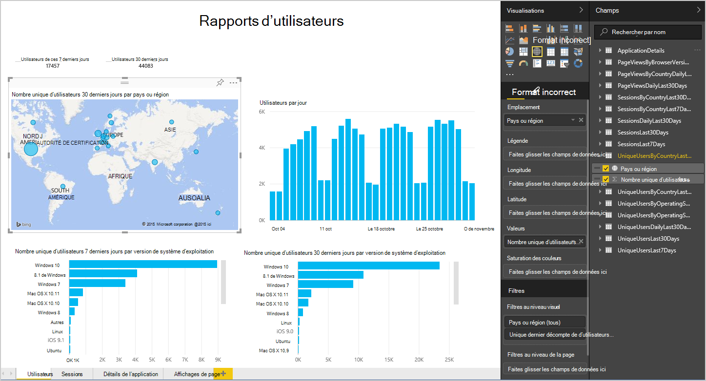
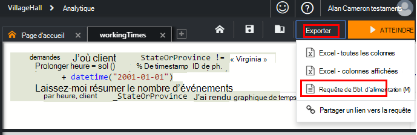
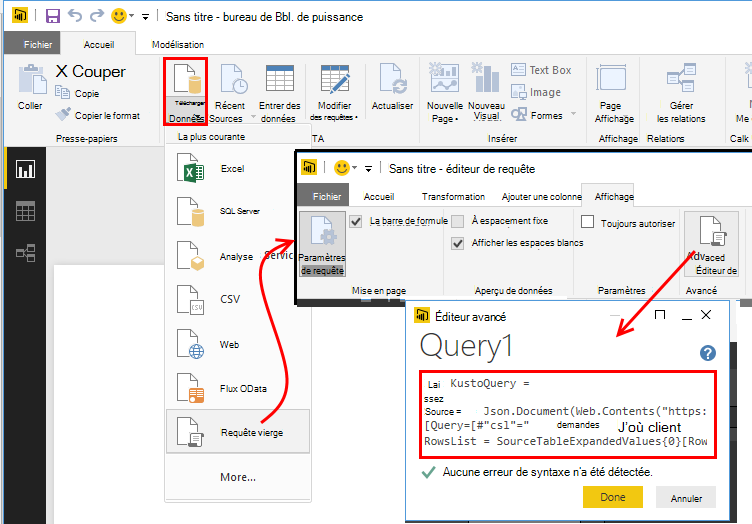
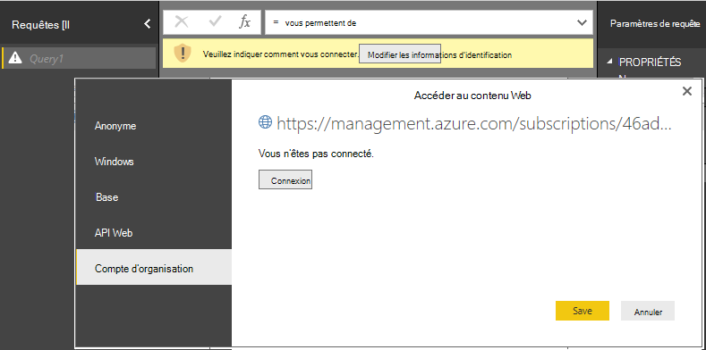
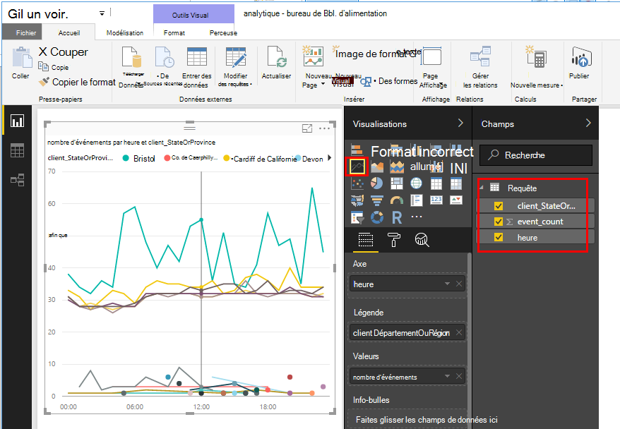
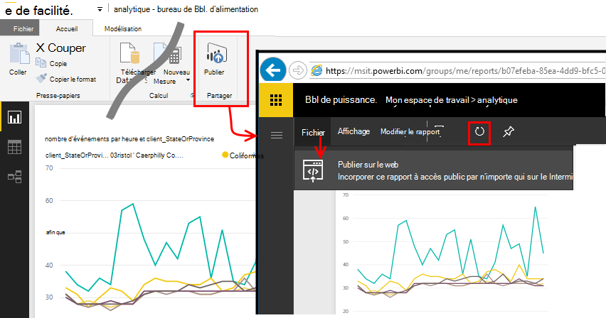

<properties 
    pageTitle="Exporter vers BI de puissance à partir de perspectives d’Application | Microsoft Azure" 
    description="Les requêtes Analytique peuvent être affichés dans BI d’alimentation." 
    services="application-insights" 
    documentationCenter=""
    authors="noamben" 
    manager="douge"/>

<tags 
    ms.service="application-insights" 
    ms.workload="tbd" 
    ms.tgt_pltfrm="ibiza" 
    ms.devlang="na" 
    ms.topic="article" 
    ms.date="10/18/2016" 
    ms.author="awills"/>

# Alimentation de puissance BI perspectives d’Application

[Alimentation BI](http://www.powerbi.com/) est une suite d’outils d’analytique professionnels qui vous aident à analyser les données et de partager des idées. Les tableaux de bord riches sont disponibles sur tous les périphériques. Vous pouvez combiner des données provenant de nombreuses sources, y compris les requêtes Analytique à partir de [Perspectives d’Application Visual Studio](app-insights-overview.md).

Il existe trois méthodes recommandées d’exportation de données de l’aperçu de l’Application à alimentation BI. Vous pouvez les utiliser séparément ou ensemble.

* [**Adaptateur d’alimentation BI**](#power-pi-adapter) - définir un tableau de bord complet de télémétrie à partir de votre application. L’ensemble des graphiques est prédéfini, mais vous pouvez ajouter vos propres requêtes à partir de toutes les autres sources.
* [**Requêtes d’exporter l’Analytique**](#export-analytics-queries) - écrire une requête souhaité à l’aide d’Analytique, exportez-le vers l’alimentation BI. Vous pouvez placer cette requête sur un tableau de bord avec toutes les autres données.
* [**Exportation de continue et flux Analytique**](app-insights-export-stream-analytics.md) - cela implique plus de travail pour configurer. Il est utile si vous souhaitez conserver vos données pendant de longues périodes. Dans le cas contraire, les autres méthodes sont recommandées.

## Adaptateur BI

Cette méthode crée un tableau de bord complet de télémétrie pour vous. Le jeu de données initial est prédéfini, mais vous pouvez ajouter des données à elle.

### Obtenir la carte

1. Se connecter à [alimentation BI](https://app.powerbi.com/).
2. Ouvrir les **données**, les **Services**, les **perspectives d’Application**

    

3. Fournir les détails de votre ressource de perspectives de l’Application.

    

4. Attendez une minute ou deux pour les données à importer.

    

Vous pouvez modifier le tableau de bord, en combinant les diagrammes d’idées d’Application avec ceux d’autres sources et avec des requêtes Analytique. Il existe une galerie de visualisation où vous pouvez obtenir des graphiques plus, et chaque graphique a un que vous pouvez définir des paramètres.

Après l’importation initiale, le tableau de bord et les rapports de continuent à mettre à jour tous les jours. Vous pouvez contrôler la planification d’actualisation du groupe de données.

## Exporter des requêtes Analytique

Cet itinéraire vous permet d’écrire une requête Analytique que vous souhaitez et puis l’exporter que dans un tableau de bord d’alimentation. (Vous pouvez ajouter au tableau de bord créé par la carte.)

### Une fois : installation de puissance BI Desktop

Pour importer votre requête de perspectives de l’Application, vous utilisez la version bureau d’alimentation BI. Mais, puis vous pouvez le publier sur le web ou à votre espace de travail du nuage d’alimentation BI. 

Installez [Desktop BI de puissance](https://powerbi.microsoft.com/en-us/desktop/).

### Exporter une requête Analytique

1. [Analytique ouvert et écrivez votre requête](app-insights-analytics-tour.md).
2. Tester et affiner la requête jusqu'à ce que vous soyez satisfaits des résultats.
3. Dans le menu **Exporter** , choisissez **Alimentation BI (M)**. Enregistrez le fichier texte.

    
4. Dans le bureau de BI d’alimentation sélectionnez **obtenir les données, la requête vierge** , puis dans l’éditeur de requête, sous **affichage** **Éditeur de requête avancée**.

    Collez le script de langage de M exporté dans l’éditeur de requête avancée.

    

5. Vous devrez fournir les informations d’identification pour permettre à BI de puissance accéder aux Azure. Utilisez 'compte d’organisation' pour vous connecter à votre compte Microsoft.

    

6. Choisissez une visualisation pour votre requête, sélectionnez les champs de l’axe x, axe y et segmentation de dimension.

    

7. Publier votre rapport dans votre espace de travail du nuage d’alimentation BI. À partir de là, vous pouvez incorporer une version synchronisée sur vos pages web.

    
 
8. Actualiser le rapport de manuellement à des intervalles, ou configurer une actualisation planifiée dans la page options.

## À propos de l’échantillonnage

Si votre application envoie un lot de données, la fonctionnalité d’échantillonnage adapté peut fonctionner et envoyer uniquement un pourcentage de votre télémétrie. Il en est de même si vous avez défini manuellement d’échantillonnage dans le Kit de développement ou de réception. [Pour en savoir plus sur l’échantillonnage.](app-insights-sampling.md)
 

## Étapes suivantes

* [Alimentation BI - en savoir plus](http://www.powerbi.com/learning/)
* [Didacticiel d’Analytique](app-insights-analytics-tour.md)
