<properties 
    pageTitle="Analytique de flux permet de traiter les données exportées à partir de perspectives d’Application | Microsoft Azure" 
    description="Analytique de flux en continu peut transformer, filtrer et acheminer les données que vous exportez à partir de l’aperçu de l’Application." 
    services="application-insights" 
    documentationCenter=""
    authors="noamben" 
    manager="douge"/>

<tags 
    ms.service="application-insights" 
    ms.workload="tbd" 
    ms.tgt_pltfrm="ibiza" 
    ms.devlang="na" 
    ms.topic="article" 
    ms.date="10/18/2016" 
    ms.author="awills"/>

# <a name="use-stream-analytics-to-process-exported-data-from-application-insights"></a>Analytique de flux permet de traiter les données exportées à partir de l’aperçu de l’Application

[Analytique de flux Azure](https://azure.microsoft.com/services/stream-analytics/) est l’outil idéal pour le traitement des données [exportées à partir de perspectives de l’Application](app-insights-export-telemetry.md). Analytique de flux peut extraire des données de diverses sources. Il peut transformer et filtrer les données et puis de l’itinéraire à une variété de récepteurs.

Dans cet exemple, nous allons créer une carte qui prend les données à partir de l’Application aperçu, renomme et traite certains champs et il injecte dans BI d’alimentation.

> [AZURE.WARNING] Il y a beaucoup plus facile et [méthodes recommandées pour afficher des données d’idées d’Application alimentation BI](app-insights-export-power-bi.md). Le chemin d’accès illustré ici est qu’un exemple pour illustrer comment traiter les données exportées.

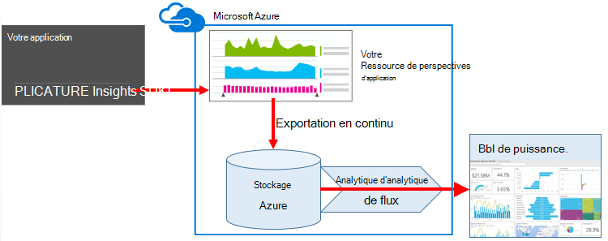


## <a name="create-storage-in-azure"></a>Créer un espace de stockage dans Azure

Exporter Continuous retourne toujours les données dans un compte de stockage Azure, vous devez d’abord créer le stockage.

1.  Créer un compte de stockage « classique » dans votre abonnement [Azure portal](https://portal.azure.com).

    

2. Créer un conteneur

    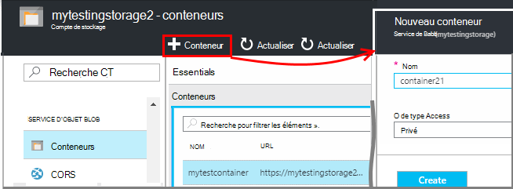

3. Copiez la clé d’accès de stockage

    Vous en aurez besoin ultérieurement pour définir l’entrée pour le service d’analytique de flux de données.

    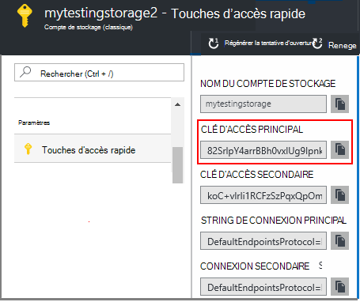

## <a name="start-continuous-export-to-azure-storage"></a>Démarrer l’exportation continue au stockage Azure

[Exportation de continu](app-insights-export-telemetry.md) déplace les données à partir de perspectives d’Application dans le stockage Azure.

1. Dans le portail Azure, accédez à la ressource de perspectives d’Application que vous avez créé pour votre application.

    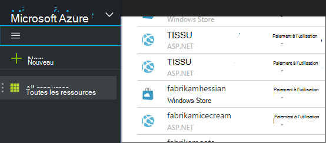

2. Créer une exportation continue.

    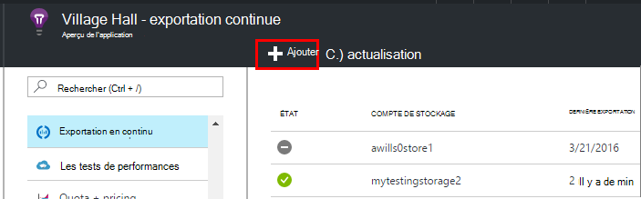


    Sélectionnez le compte de stockage que vous avez créé précédemment :

    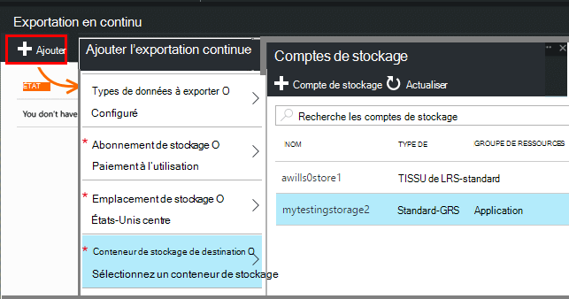
    
    Définir les types d’événements que vous souhaitez afficher :

    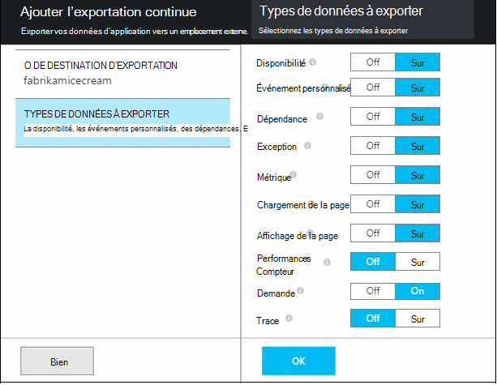

3. Laisser certaines données s’accumulent. Détendez-vous et laissez les personnes à utiliser votre application pendant un certain temps. Télémétrie arriveront et vous verrez des graphiques statistiques dans [l’Explorateur de métriques](app-insights-metrics-explorer.md) et événements individuels dans la [recherche de diagnostic](app-insights-diagnostic-search.md). 

    Et, également, d’exportation de données à votre système de stockage. 

4. Vérifiez que les données exportées. Dans Visual Studio, choisissez **Afficher / Cloud Explorer**, ouvrez Azure / stockage. (Si vous n’avez pas cette option de menu, vous devez installer le SDK Azure : ouvrir la boîte de dialogue Nouveau projet, puis ouvrez Visual C# / Cloud / obtenir Microsoft Azure SDK .NET.)

    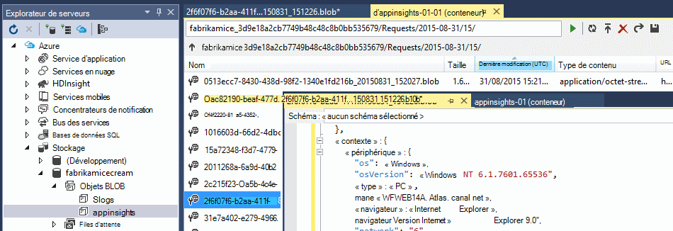

    Prenez note de la partie commune du nom de chemin d’accès, qui est dérivée de la clé de nom et d’instrumentation d’application. 

Les événements sont écrits dans le blob de fichiers au format JSON. Chaque fichier peut contenir un ou plusieurs événements. Nous souhaitons donc lire les données d’événement et de filtrer les champs. Il existe toutes sortes de choses que nous pouvons faire avec les données, mais notre plan aujourd'hui est d’utiliser des flux Analytique pour les données d’alimentation BI.

## <a name="create-an-azure-stream-analytics-instance"></a>Créer une instance d’Azure flux Analytique

À partir du [Portail d’Azure classique](https://manage.windowsazure.com/), sélectionnez le service Analytique de flux d’Azure et créer une nouvelle tâche de flux de données Analytique :


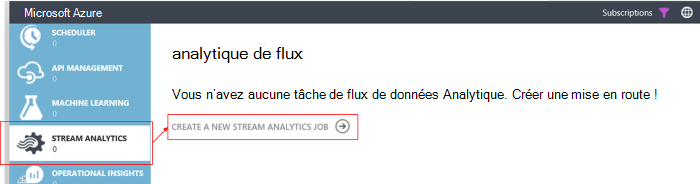


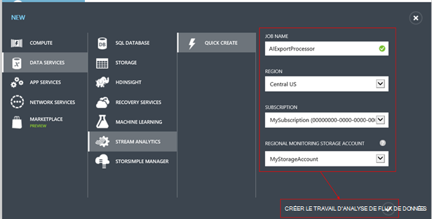

Lors de la création du nouveau projet, développez les détails :

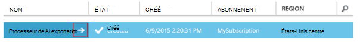


### <a name="set-blob-location"></a>Définir un emplacement blob

Définir à partir du blob exporter Continuous :

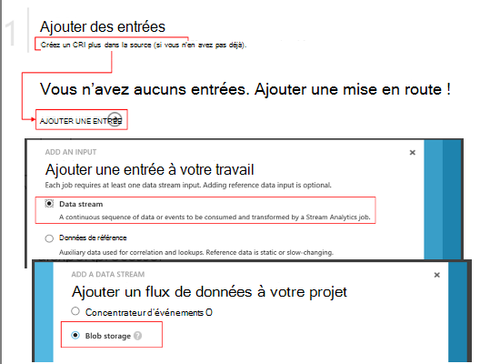

Vous devez maintenant la clé primaire de l’accès à partir de votre compte de stockage, vous avez noté précédemment. Définir en tant que la clé de compte de stockage.

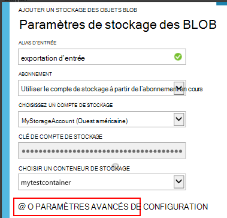

### <a name="set-path-prefix-pattern"></a>Modèle de préfixe de chemin d’accès défini 

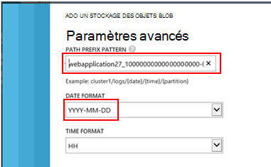


**Veillez à définir le Format de Date au format AAAA-MM-JJ (avec les tirets).**

Le modèle du préfixe de chemin d’accès indique où Analytique de flux recherche les fichiers d’entrée dans le stockage. Vous devez définir pour le correspond à exporter Continuous le stockage des données. Définissez-le comme suit :

    webapplication27_12345678123412341234123456789abcdef0/PageViews/{date}/{time}

Dans cet exemple :

* `webapplication27`est le nom de ressource perspectives d’Application **tout bas de casse**.
* `1234...`est la clé de l’instrumentation de la ressource de perspectives de l’Application, **l’omission de tirets**. 
* `PageViews`est le type de données que vous souhaitez analyser. Les types disponibles varient en fonction du filtre que vous définissez dans exporter Continuous. Examinez les données exportées pour voir d’autres types disponibles et voir l' [exportation du modèle de données](app-insights-export-data-model.md).
* `/{date}/{time}`un modèle est écrit littéralement.

> [AZURE.NOTE] Vérifiez que le stockage afin de vous assurer que vous obtenez le chemin d’accès de droite.

### <a name="finish-initial-setup"></a>Terminer l’installation initiale

Vérifiez le format de sérialisation :

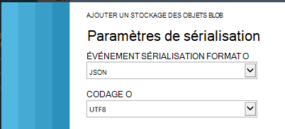

Fermer l’Assistant et attendez que l’installation se termine.

> [AZURE.TIP] L’exemple de commande permet de télécharger des données. Conserver sous la forme d’une prise d’essai à déboguer votre requête.

## <a name="set-the-output"></a>Définissez la sortie

Maintenant, sélectionnez votre projet et définissez la sortie.

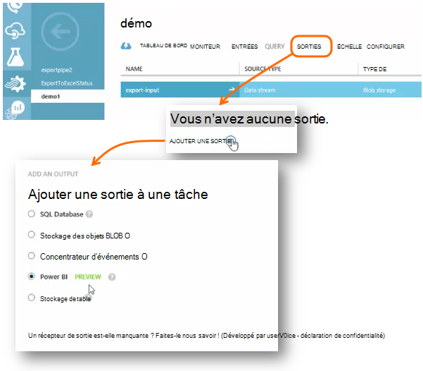

Fournir votre **travail ou de l’école compte** pour autoriser Analytique de flux de données pour accéder à votre ressource de puissance BI. Puis inventer un nom pour la sortie et le groupe de données cible BI de puissance et de la table.

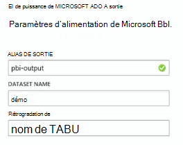

## <a name="set-the-query"></a>Définissez la requête

La requête régit la traduction à partir de l’entrée vers la sortie.

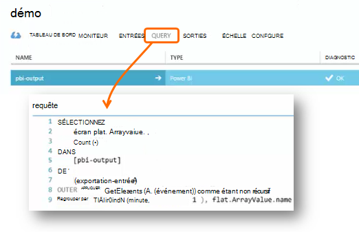


Utilisez la fonction de Test pour vérifier que vous obtenez le résultat approprié. Lui donner l’exemple de données que vous avez prises à partir de la page de données. 

### <a name="query-to-display-counts-of-events"></a>Une requête pour afficher le nombre d’événements

Collez cette requête :

```SQL

    SELECT
      flat.ArrayValue.name,
      count(*)
    INTO
      [pbi-output]
    FROM
      [export-input] A
    OUTER APPLY GetElements(A.[event]) as flat
    GROUP BY TumblingWindow(minute, 1), flat.ArrayValue.name
```

* entrée à l’exportation est l’alias que nous avons donné dans le flux d’entrée
* pbi-sortie est l’alias de sortie que nous avons défini
* Nous utilisons [GetElements d’appliquer externe](https://msdn.microsoft.com/library/azure/dn706229.aspx) car le nom de l’événement est dans un arrray JSON imbriqué. L’instruction Select sélectionne ensuite le nom de l’événement, ainsi que le nombre d’instances de ce nom dans la période de temps. La clause [Group By](https://msdn.microsoft.com/library/azure/dn835023.aspx) regroupe les éléments dans des périodes de 1 minute.


### <a name="query-to-display-metric-values"></a>Requête pour afficher les valeurs métriques


```SQL

    SELECT
      A.context.data.eventtime,
      avg(CASE WHEN flat.arrayvalue.myMetric.value IS NULL THEN 0 ELSE  flat.arrayvalue.myMetric.value END) as myValue
    INTO
      [pbi-output]
    FROM
      [export-input] A
    OUTER APPLY GetElements(A.context.custom.metrics) as flat
    GROUP BY TumblingWindow(minute, 1), A.context.data.eventtime

``` 

* Cette requête explore la télémétrie métriques pour obtenir l’heure de l’événement et la valeur métrique. Les valeurs métriques sont à l’intérieur d’un tableau, nous utilisons le modèle externe GetElements d’appliquer pour extraire les lignes. « myMetric » est le nom de la mesure dans ce cas. 

### <a name="query-to-include-values-of-dimension-properties"></a>Requête pour inclure les valeurs de propriétés de dimension

```SQL

    WITH flat AS (
    SELECT
      MySource.context.data.eventTime as eventTime,
      InstanceId = MyDimension.ArrayValue.InstanceId.value,
      BusinessUnitId = MyDimension.ArrayValue.BusinessUnitId.value
    FROM MySource
    OUTER APPLY GetArrayElements(MySource.context.custom.dimensions) MyDimension
    )
    SELECT
     eventTime,
     InstanceId,
     BusinessUnitId
    INTO AIOutput
    FROM flat

```

* Cette requête contient les valeurs des propriétés de dimension sans en fonction d’une dimension spécifique qui se trouve à un index fixé dans le tableau à une dimension.

## <a name="run-the-job"></a>Exécution de la tâche

Vous pouvez sélectionner une date dans le passé pour démarrer la tâche à partir de. 

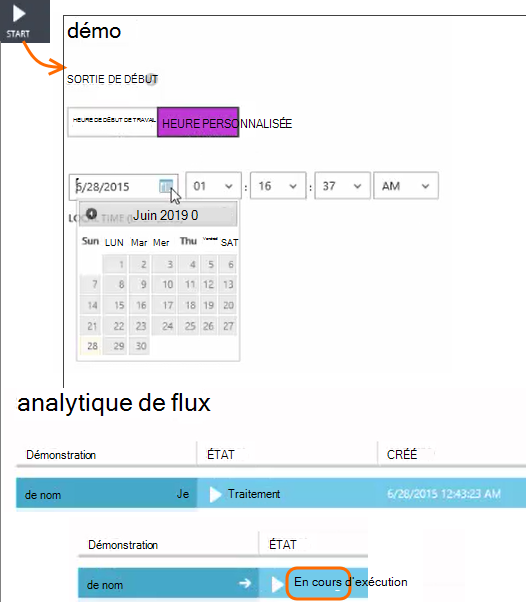

Attendez que la tâche est en cours d’exécution.

## <a name="see-results-in-power-bi"></a>Afficher les résultats dans BI de puissance

> [AZURE.WARNING] Il y a beaucoup plus facile et [méthodes recommandées pour afficher des données d’idées d’Application alimentation BI](app-insights-export-power-bi.md). Le chemin d’accès illustré ici est qu’un exemple pour illustrer comment traiter les données exportées.

Ouvrez BI de puissance avec votre travail ou établissement de compte et sélectionnez le groupe de données et la table que vous avez définie comme la sortie de la tâche de flux de données Analytique.

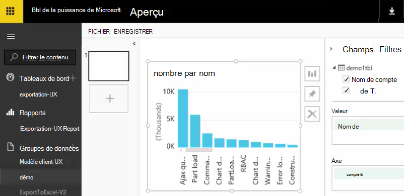

Vous pouvez désormais utiliser ce groupe de données dans les rapports et tableaux de bord de [Puissance BI](https://powerbi.microsoft.com).


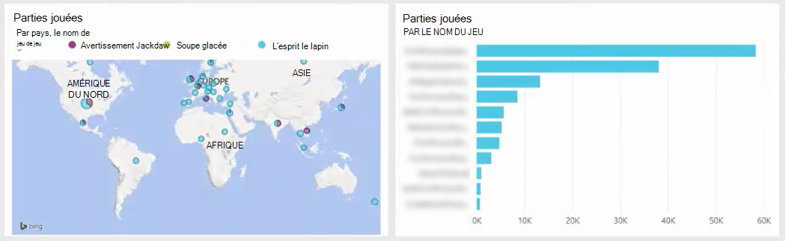


## <a name="no-data"></a>Aucune donnée ?

* Vérifiez que vous [Définissez le format de date](#set-path-prefix-pattern) correctement AAAA-MM-JJ (avec les tirets).


## <a name="video"></a>Vidéo

Noam Ben Zeev montre comment traiter les données exportées à l’aide de flux de données Analytique.

> [AZURE.VIDEO export-to-power-bi-from-application-insights]

## <a name="next-steps"></a>Étapes suivantes

* [Exportation en continu](app-insights-export-telemetry.md)
* [Données détaillées du modèle de référence pour les types de propriété et les valeurs.](app-insights-export-data-model.md)
* [Aperçu de l’application](app-insights-overview.md)
* [Plus d’exemples et procédures pas à pas](app-insights-code-samples.md)
 
