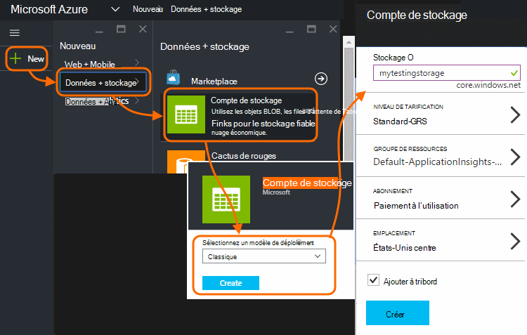
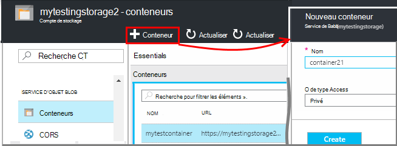
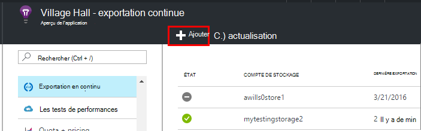
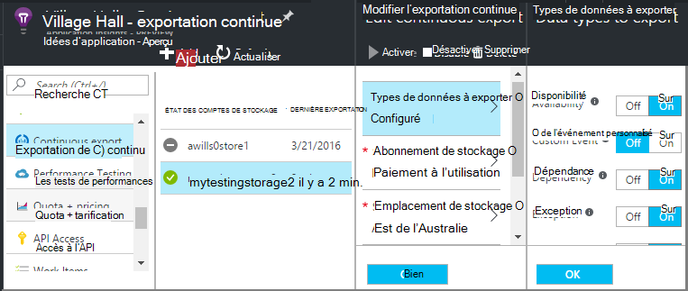
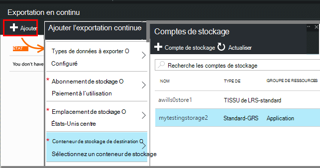
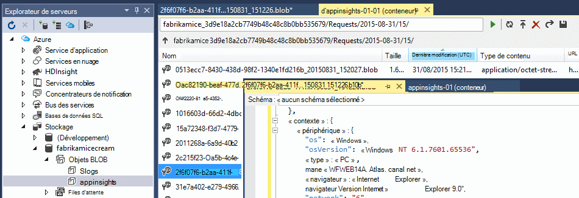
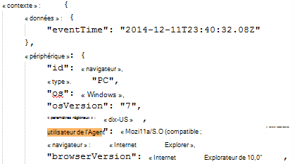
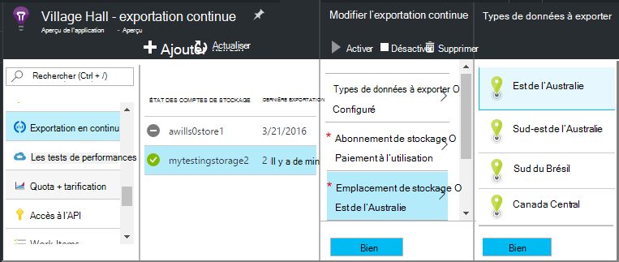

<properties 
    pageTitle="Exportation en continu des données télémétriques fournies par les perspectives d’Application | Microsoft Azure" 
    description="Exporter des données de diagnostic et de l’utilisation de stockage dans Microsoft Azure et de le télécharger à partir de là." 
    services="application-insights" 
    documentationCenter=""
    authors="alancameronwills" 
    manager="douge"/>

<tags 
    ms.service="application-insights" 
    ms.workload="tbd" 
    ms.tgt_pltfrm="ibiza" 
    ms.devlang="na" 
    ms.topic="article" 
    ms.date="10/18/2016" 
    ms.author="awills"/>
 
# Télémétrie d’exportation à partir de l’aperçu de l’Application

Vous souhaitez conserver votre télémétrie plus longtemps que la période de rétention standard ? Ou d’une certaine façon spécialisée ? Exportation en continu est idéale pour cela. Les événements que vous voyez dans le portail d’idées d’Application peuvent être exportées vers le stockage dans Microsoft Azure au format JSON. À partir de là, vous pouvez télécharger vos données et écrire tout code que vous devez traiter.  

Exporter Continuous est disponible dans la période d’essai gratuite et sur [Standard et Premium tarifications](https://azure.microsoft.com/pricing/details/application-insights/).

Avant de configurer une exportation continue, il existe certaines alternatives que vous souhaiterez :

* [Bouton Exporter](app-insights-metrics-explorer.md#export-to-excel) l’en haut d’une lame de mesures ou de recherche vous permet de transférer des tables et des graphiques sur une feuille de calcul Excel. 
* [Analytique](app-insights-analytics.md) fournit un langage de requête puissantes de télémétrie et peut également exporter les résultats.
* Si vous avez besoin pour [Explorer vos données BI d’alimentation](http://blogs.msdn.com/b/powerbi/archive/2015/11/04/explore-your-application-insights-data-with-power-bi.aspx), vous pouvez le faire sans utiliser exporter Continuous.

## Créer un compte de stockage

Si vous ne disposez pas d’un compte de stockage « classique », créer un maintenant.

1. Créer un compte de stockage de votre abonnement au [portail Azure](https://portal.azure.com).

    

2. Créer un conteneur.

    

## Configurer exporter Continuous

Sur la lame de vue d’ensemble de votre application dans le portail de perspectives de l’Application, ouvrez exporter Continuous : 

Ajoutez une exportation continue et choisir les types d’événements que vous souhaitez exporter :

Choisir ou créer un [compte de stockage Azure](../storage/storage-introduction.md) où vous souhaitez stocker les données :

Une fois que vous avez créé votre exportation, il démarre va. (Vous obtenez uniquement les données qui arrive après la création de l’exportation.) 

Il peut y avoir un délai d’environ une heure avant que les données s’affichent dans le blob.

Si vous souhaitez modifier les types d’événements par la suite, modifier l’exportation :

Pour arrêter le flux de données, cliquez sur Désactiver. Lorsque vous cliquez sur Activer à nouveau, le flux de données redémarre avec de nouvelles données. Vous n’obtiendrez pas les données qui sont arrivés dans le portail, tandis que l’exportation a été désactivée.

Pour arrêter le flux de données définitivement, supprimez l’exportation. Cette opération ne supprime pas vos données à partir du stockage.

#### Impossible d’ajouter ou de modifier une exportation ?

* Pour ajouter ou modifier des exportations, vous avez besoin d’un propriétaire, collaborateurs ou collaborateur de perspectives d’Application des droits d’accès. [En savoir plus sur les rôles][roles].

## Les événements obtenez-vous ?

Les données exportées sont la télémétrie brute que nous recevoir à partir de votre application, à ceci près que nous ajoutons des données de localisation qui nous calculer à partir de l’adresse IP du client. 

Données qui a été ignorées par [échantillonnage](app-insights-sampling.md) ne sont pas incluses dans les données exportées.

Autres mesures calculées ne sont pas inclus. Par exemple, nous n’exporter une utilisation moyenne de l’UC, mais nous la télémétrie brut à partir de laquelle la moyenne est calculée.

Les données comprennent également les résultats de tous les [tests de disponibilité web](app-insights-monitor-web-app-availability.md) que vous avez configuré. 

> [AZURE.NOTE] **Prélèvement d’échantillons.** Si votre application envoie un lot de données et que vous utilisez le Kit de développement du perspectives d’Application pour ASP.NET version 2.0.0-beta3 ou version ultérieure, la fonctionnalité d’échantillonnage adapté peut fonctionner et envoyer uniquement un pourcentage de votre télémétrie. [Pour en savoir plus sur l’échantillonnage.](app-insights-sampling.md)

## Inspecter les données

Vous pouvez inspecter le stockage directement dans le portail. Cliquez sur **Parcourir**, sélectionnez votre compte de stockage et puis ouvrez les **conteneurs**.

Pour vérifier si le stockage Azure dans Visual Studio, ouvrez **affichage**, **Explorateur de nuage**. (Si vous n’avez pas cette commande de menu, vous devez installer le SDK Azure : ouvrir la boîte de dialogue **Nouveau projet** , développez Visual C# / Cloud et choisissez **Obtenir Microsoft Azure SDK pour .NET**.)

Lorsque vous ouvrez votre Boutique de blob, vous verrez un conteneur avec un ensemble de fichiers blob. L’URI de chaque fichier dérivé de votre nom de ressource de perspectives de l’Application, sa clé d’instrumentation, la télémétrie-type/date/heure. (Le nom de la ressource est en minuscule et la clé d’instrumentation omet les tirets).

La date et l’heure sont UTC et lorsque la télémétrie a été déposé dans la banque d’informations - pas le temps qu’il a été généré. Ainsi, si vous écrivez du code pour télécharger les données, il peut parcourir linéairement les données.

Voici la forme du chemin d’accès :

    $"{applicationName}_{instrumentationKey}/{type}/{blobDeliveryTimeUtc:yyyy-MM-dd}/{ blobDeliveryTimeUtc:HH}/{blobId}_{blobCreationTimeUtc:yyyyMMdd_HHmmss}.blob"
  
Où 

-   `blobCreationTimeUtc`heure de création de blob dans le texte interne est mis en œuvre stockage
-   `blobDeliveryTimeUtc`est le temps lorsque le blob est copié vers le stockage de destination d’exportation

## Format de données

* Chaque objet blob est un fichier texte qui contient plusieurs « lignes de \n'-separated. Il contient la télémétrie traitée sur une période d’environ une demi-minute.
* Chaque ligne représente un point de données de télémétrie par exemple une vue de page ou de la demande.
* Chaque ligne est un document non mis en forme de JSON. Si vous souhaitez asseoir et vous fixez il, ouvrez dans Visual Studio et que vous choisissez Modifier, Avancé, Format de fichier :

Durées de temps sont en graduations, où de 10 000 graduations = 1 ms. Par exemple, ces valeurs affichent un temps de 1 ms pour envoyer une demande à partir du navigateur, 3ms, recevoir et 1.8s pour le traitement de la page dans le navigateur :

    "sendRequest": {"value": 10000.0},
    "receiveRequest": {"value": 30000.0},
    "clientProcess": {"value": 17970000.0}

[Données détaillées du modèle de référence pour les types de propriété et les valeurs.](app-insights-export-data-model.md)

## Traitement des données

À petite échelle, vous pouvez écrire du code pour décomposer vos données, lire dans une feuille de calcul et ainsi de suite. Par exemple :

    private IEnumerable<T> DeserializeMany<T>(string folderName)
    {
      var files = Directory.EnumerateFiles(folderName, "*.blob", SearchOption.AllDirectories);
      foreach (var file in files)
      {
         using (var fileReader = File.OpenText(file))
         {
            string fileContent = fileReader.ReadToEnd();
            IEnumerable<string> entities = fileContent.Split('\n').Where(s => !string.IsNullOrWhiteSpace(s));
            foreach (var entity in entities)
            {
                yield return JsonConvert.DeserializeObject<T>(entity);
            }
         }
      }
    }

Pour obtenir un exemple de code plus développé, reportez-vous [à l’aide d’un rôle worker][exportasa].

## Supprimer les anciennes données
Veuillez noter que vous êtes responsable de la gestion de votre capacité de stockage et de suppression des anciennes données si nécessaire. 

## Si vous régénérez votre clé de stockage...

Si vous modifiez la clé de votre stockage, exporter continuous cessera de fonctionner. Vous voyez une notification dans votre compte Azure. 

Ouvrez la lame exporter Continuous et modifier votre exportation. Modifier la Destination d’exportation, mais laissez le même stockage sélectionné. Cliquez sur OK pour confirmer.

L’exportation continue redémarre.

## Exemples d’exportation

* [Exporter vers SQL à l’aide d’un rôle de collaborateur][exportcode]
* [Exporter vers SQL à l’aide de flux de données Analytique][exportasa]
* [Exemple d’Analytique de flux 2](app-insights-export-stream-analytics.md)

Sur une échelle plus grande, pensez à [HDInsight](https://azure.microsoft.com/services/hdinsight/) - clusters Hadoop dans le nuage. HDInsight fournit une variété de technologies pour gérer et analyser des données volumineuses.

## Q & r

* *Mais, tout ce que je veux est un téléchargement unique d’un graphique.*  
 
    Oui, vous pouvez le faire. En haut de la lame, cliquez sur [Exporter les données](app-insights-metrics-explorer.md#export-to-excel).

* *Configurer une exportation, mais aucune donnée dans ma Boutique.*

    Idées d’Application reçue tout télémétrie à partir de votre application dans la mesure où vous configurez l’exportation ? Vous recevrez uniquement les nouvelles données.

* *J’ai essayé de configurer une exportation, mais accès a été refusé*

    Si le compte est détenu par votre organisation, vous devez être membre du groupe propriétaires ou collaborateurs.

* *Puis-je exporter directement à mon propre magasin local ?* 

    Non, Désolé. Notre moteur d’exportation actuellement fonctionne uniquement avec le stockage Azure pour l’instant.  

* *Y a-t-il une limite à la quantité de données à que placer dans ma Boutique ?* 

    N° Nous allons conserver transmettre des données jusqu'à ce que vous supprimiez l’exportation. Nous arrêtez si nous avons atteint la limite extérieure de stockage des objets blob, mais c’est grand. C’est à vous permettent de contrôler la quantité de stockage vous utilisez.  

* *BLOB combien dois-je voir dans le stockage ?*

 * Pour chaque type de données que vous avez choisi d’exporter un blob nouveau est créé chaque minute (si les données sont disponibles). 
 * En outre, pour les applications ayant un trafic dense, unités de partition supplémentaires sont allouées. Dans ce cas chaque unité crée un blob toutes les minutes.

* *Régénération de la clé à mon espace de stockage ou de la modifier le nom du conteneur, et l’exportation ne fonctionne pas.*

    Modifier l’exportation et ouvrir la lame de destination d’exportation. Laissez le même stockage sélectionné comme auparavant, puis cliquez sur OK pour confirmer. Exportation va redémarrer. Si la modification a été au cours des derniers jours, vous ne perdrez les données.

* *Puis-je suspendre l’exportation ?*

    Oui. Cliquez sur Désactiver.

## Exemples de code

* [Analyser le JSON exporté à l’aide d’un rôle de collaborateur][exportcode]
* [Exemple de flux de données Analytique](app-insights-export-stream-analytics.md)
* [Exporter vers SQL à l’aide de flux de données Analytique][exportasa]

* [Données détaillées du modèle de référence pour les types de propriété et les valeurs.](app-insights-export-data-model.md)

<!--Link references-->

[exportcode]: app-insights-code-sample-export-telemetry-sql-database.md
[exportasa]: app-insights-code-sample-export-sql-stream-analytics.md
[roles]: app-insights-resources-roles-access-control.md

 
