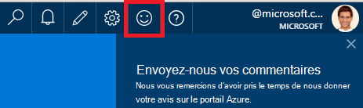
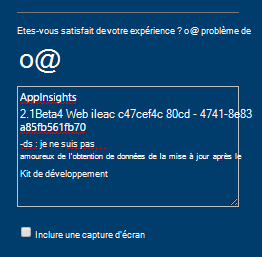
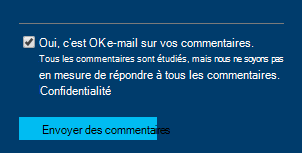

<properties 
    pageTitle="Comment faire pour obtenir le support technique de l’équipe de développement d’idées d’Application | Microsoft Azure" 
    description="Lorsque vous avez un incident qui requiert la prise en charge spéciale à partir de l’équipe de développement d’idées d’Application, voici comment vous pouvez soumettre les détails pour obtenir de l’aide." 
    services="application-insights" 
    documentationCenter=""
    authors="alexbulankou" 
    manager="douge"/>
 
<tags 
    ms.service="application-insights" 
    ms.workload="tbd" 
    ms.tgt_pltfrm="ibiza" 
    ms.devlang="na" 
    ms.topic="article" 
    ms.date="06/01/2016" 
    ms.author="albulank"/>
    
# <a name="how-to-get-technical-support-from-application-insights-development-team"></a>Comment faire pour obtenir le support technique de l’équipe de développement d’idées d’Application
    
Lorsque vous avez un problème technique avec les [Informations d’Application Visual Studio](app-insights-overview.md), voici les options disponibles pour obtenir de l’aide :

## <a name="1-check-the-documents"></a>1. Vérifiez les documents

* Données manquantes ? Vérification : [échantillonnage](app-insights-sampling.md), [les quotas et la limitation](app-insights-pricing.md).
* Résolution des problèmes : [ASP.NET](app-insights-troubleshoot-faq.md) | [Java](app-insights-java-troubleshoot.md)

## <a name="2-search-the-forums"></a>2. dans les forums

* [Forum MSDN](https://social.msdn.microsoft.com/Forums/vstudio/home?forum=ApplicationInsights)
* [StackOverflow](http://stackoverflow.com/questions/tagged/ms-application-insights)

## <a name="3-azure-support-plan"></a>3. Plan de prise en charge azure ?

Il existe des situations où vous souhaitez que les développeurs à étudier votre cas particulier. 

Si vous avez un [plan avec Microsoft Azure de prendre en charge](https://azure.microsoft.com/support/plans/) , vous pouvez [Ouvrir un ticket de support](https://portal.azure.com/?#blade/Microsoft_Azure_Support/HelpAndSupportBlade).

## <a name="4-contact-the-application-insights-team"></a>4. Contactez l’équipe d’idées d’Application

Si vous n’avez pas un plan de support, notre équipe de développement est heureux de vous offrent la meilleure assistance aux clients d’idées d’Application car nous nous préparons pour le jalon de disponibilité générale. Nous présentons **une nouvelle option de prise en charge**: vous pouvez décrire votre cas pour nous par l’envoi d’un formulaire de commentaires sur Azure portal et un développeur sur le contact d’équipe perspectives d’Application vous sauvegardez pour aider à résoudre votre problème.


1. Dans le [portail d’informations d’Application](https://portal.azure.com), cliquez sur l’icône dans le coin supérieur droit :  

       

2. Dans la zone commentaire, assurez-vous de spécifier **AppInsights** en tant que la première ligne et inclure les informations suivantes :   

    ```

    AppInsights   
    ikey: <instrumentation key>   
    sdk: <SDK that you are using, including name and version>  
    issue: <please describe the problem you are having>

    ```   

       

3. Vérifiez que « Oui, c’est OK e-mail ». 

      

Un technicien de l’équipe d’idées d’Application pour être contacté plus rapidement. Comme nous fournissons ce service de mieux, aucun SLA formels ne peut être donnée à ce stade.


