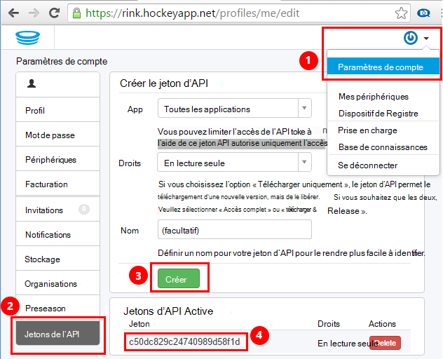
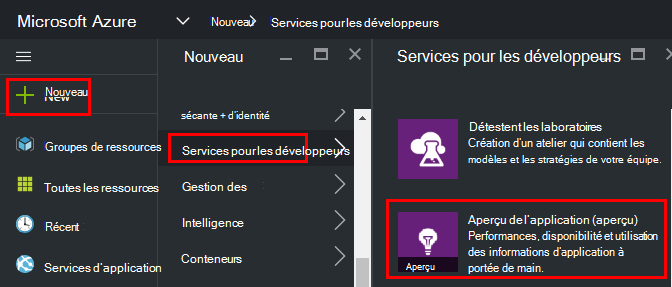
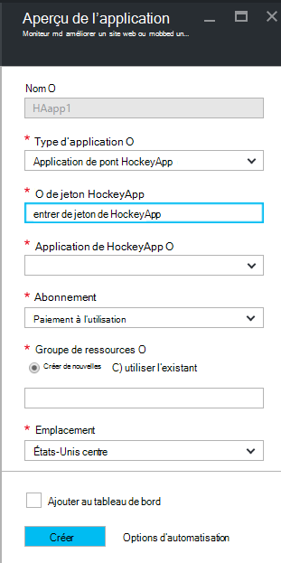
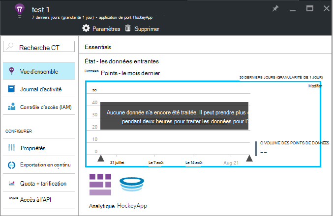
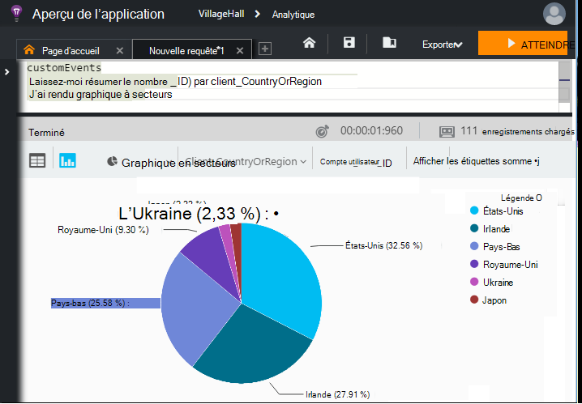

<properties 
    pageTitle="Exploration des données de HockeyApp dans les perspectives d’Application | Microsoft Azure" 
    description="Analyser l’utilisation et les performances de votre application Azure avec aperçus de l’Application." 
    services="application-insights" 
    documentationCenter="windows"
    authors="alancameronwills" 
    manager="douge"/>

<tags 
    ms.service="application-insights" 
    ms.workload="tbd" 
    ms.tgt_pltfrm="ibiza" 
    ms.devlang="na" 
    ms.topic="article" 
    ms.date="08/25/2016" 
    ms.author="awills"/>

#  Exploration des données de HockeyApp dans les perspectives de l’Application

[HockeyApp](https://azure.microsoft.com/services/hockeyapp/) est la plate-forme recommandée pour la surveillance des applications de bureau et mobiles direct. À partir de HockeyApp, vous pouvez envoyer personnalisé et le suivi de télémétrie pour surveiller l’utilisation et l’aider dans le diagnostic (en plus de l’obtention des données de blocage). Ce flux de données de télémétrie peut être interrogée à l’aide de la puissante fonctionnalité [Analytique](app-insights-analytics.md) [d’Idées d’Application Visual Studio](app-insights-overview.md). En outre, vous pouvez [Exporter personnalisé et le suivi de télémétrie](app-insights-export-telemetry.md). Pour activer ces fonctionnalités, permet de paramétrer un pont qui transfère les données de HockeyApp pour les perspectives de l’Application.

## L’application du pont de HockeyApp

L’application de pont HockeyApp est la base qui vous permet d’accéder à vos données de HockeyApp dans les perspectives d’Application via l’Analytique et exporter Continuous fonctionnalités. Toutes les données collectées par HockeyApp après la création de l’application de la passerelle HockeyApp sera accessibles à partir de ces fonctionnalités. Nous allons voir comment définir une de ces applications de pont.

Dans HockeyApp, ouvrez Paramètres de compte, les [Jetons de l’API](https://rink.hockeyapp.net/manage/auth_tokens). Créez un nouveau jeton ou réutiliser un existant. Les droits minimums requis sont « lecture seule ». Effectuer une copie de l’API de jeton.

Ouvrez le portail Microsoft Azure et [créer une ressource d’informations d’Application](app-insights-create-new-resource.md). Définir le Type d’Application « Application de pont HockeyApp » :

Vous n’avez pas besoin de définir un nom, il sera automatiquement configuré à partir du nom de HockeyApp.

Les champs du pont HockeyApp apparaissent. 

Permet d’entrer le jeton HockeyApp que vous avez noté précédemment. Cette action remplit la liste déroulante « Application HockeyApp » avec toutes vos applications HockeyApp. Sélectionnez celui que vous souhaitez utiliser et complétez le reste des champs. 

Ouvrez la nouvelle ressource. 

Notez que les données prennent un certain temps pour démarrer le flux.

Voilà ! Toutes les données collectées dans votre application instrumentée HockeyApp à partir de ce point sont maintenant également disponibles pour vous dans les fonctionnalités Analytique et exporter Continuous de perspectives de l’Application.

Revoyons brièvement chacune de ces fonctionnalités désormais disponibles pour vous.

## Analytique

Analytique est un outil puissant pour l’interrogation d’ad hoc de vos données, ce qui vous permet de diagnostiquer et d’analyser votre télémétrie et de découvrir rapidement les causes et les modèles.

* [En savoir plus sur Analytique](app-insights-analytics-tour.md)
* [Vidéo d’introduction](https://channel9.msdn.com/events/Build/2016/T666)
* [Concepts avancés de vidéo](https://channel9.msdn.com/Events/Build/2016/P591)

## Exportation en continu

Exporter Continuous vous permet d’exporter des données dans un conteneur de stockage des objets Blob Azure. Ceci est très utile si vous avez besoin conserver vos données plus longtemps que la période de rétention actuellement proposée par les perspectives de l’Application. Vous pouvez conserver les données dans le stockage blob, le traiter dans une base de données SQL ou votre solution de gestion de magasins de données par défaut.

[En savoir plus sur l’exportation en continu](app-insights-export-telemetry.md)

## Étapes suivantes

* [Appliquer Analytique à vos données](app-insights-analytics-tour.md)

