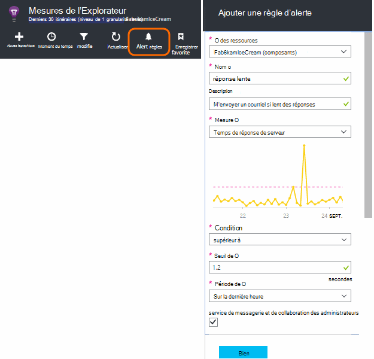
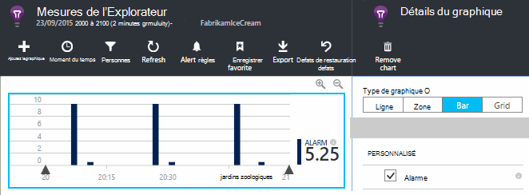
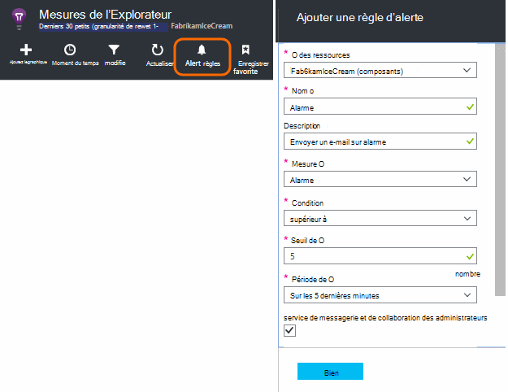
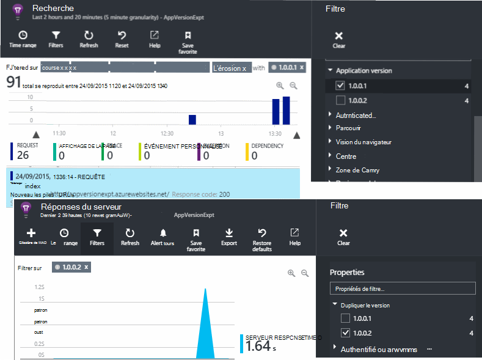
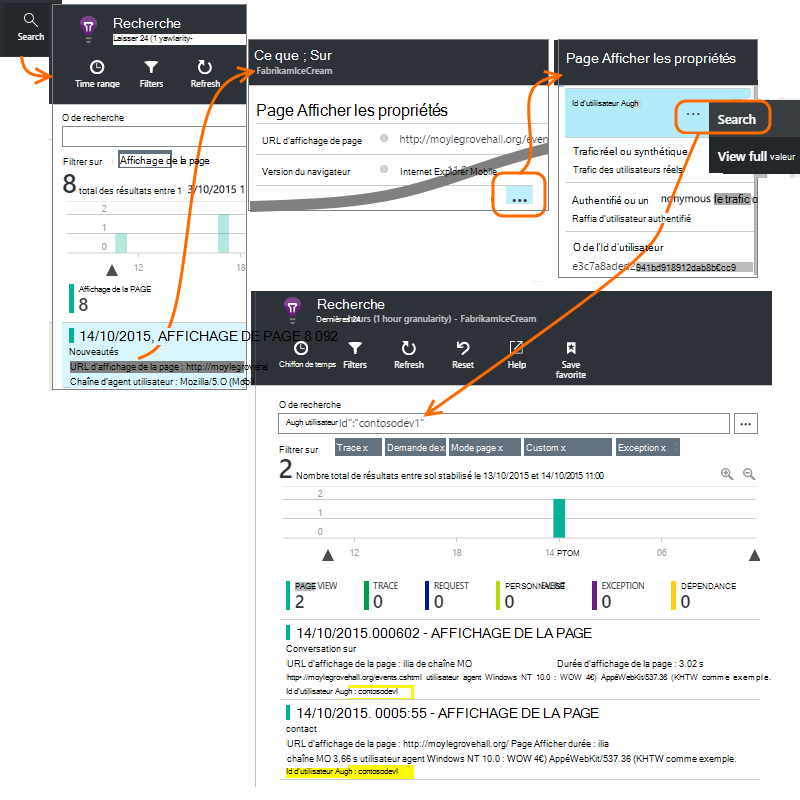
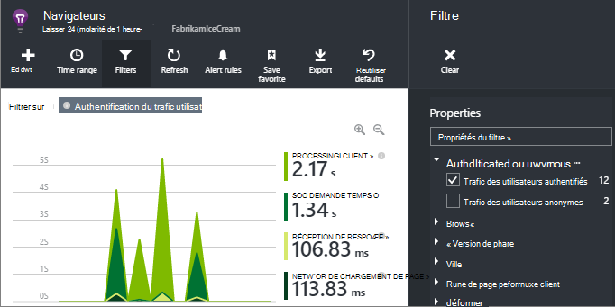
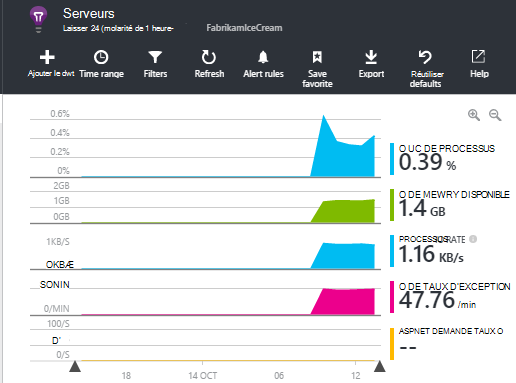

<properties 
    pageTitle="Comment faire... dans les perspectives d’Application | Microsoft Azure" 
    description="Forum aux questions dans les perspectives de l’Application." 
    services="application-insights" 
    documentationCenter=""
    authors="alancameronwills" 
    manager="douge"/>

<tags 
    ms.service="application-insights" 
    ms.workload="tbd" 
    ms.tgt_pltfrm="ibiza" 
    ms.devlang="na" 
    ms.topic="article" 
    ms.date="02/05/2016" 
    ms.author="awills"/>

# <a name="how-do-i--in-application-insights"></a>Comment faire... dans les perspectives d’Application ?

## <a name="get-an-email-when-"></a>Recevoir un e-mail lorsque...

### <a name="email-if-my-site-goes-down"></a>E-mail si mon site tombe en panne

Définir un [test web de disponibilité](app-insights-monitor-web-app-availability.md).

### <a name="email-if-my-site-is-overloaded"></a>E-mail si mon site est surchargé.

Définir une [alerte](app-insights-alerts.md) sur **les temps de réponse de serveur**. Un seuil compris entre 1 et 2 secondes doit fonctionner.



Votre application peut également afficher des signes de déformation en retournant les codes d’erreur. Définir une alerte sur **les demandes a échoué**.

Si vous souhaitez définir une alerte sur les **exceptions de serveur**, vous devrez effectuer [une installation supplémentaire](app-insights-asp-net-exceptions.md) pour afficher les données.

### <a name="email-on-exceptions"></a>Courriel sur les exceptions

1. [Configurer la surveillance des exceptions](app-insights-asp-net-exceptions.md)
2. [Définir une alerte](app-insights-alerts.md) sur la mesure de dénombrement d’Exception


### <a name="email-on-an-event-in-my-app"></a>E-mail sur un événement dans mon application

Supposons que vous souhaitez recevoir un e-mail lorsqu’un événement spécifique se produit. Aperçu de l’application ne fournit pas cette fonctionnalité directement, mais il peut [Envoyer une alerte lorsqu’une mesure dépasse un seuil](app-insights-alerts.md). 

Alertes peuvent être définies sur [des mesures personnalisées](app-insights-api-custom-events-metrics.md#track-metric), bien que des événements non personnalisés. Écrire du code pour augmenter une mesure lorsque l’événement se produit :

    telemetry.TrackMetric("Alarm", 10);

ou :

    var measurements = new Dictionary<string,double>();
    measurements ["Alarm"] = 10;
    telemetry.TrackEvent("status", null, measurements);

Dans la mesure où les alertes ont deux États, vous devez envoyer une valeur faible lorsque vous envisagez l’alerte ayant pris fin :

    telemetry.TrackMetric("Alarm", 0.5);

Créer un graphique dans l' [Explorateur de métriques](app-insights-metrics-explorer.md) pour voir votre alarme :



Maintenant définir une alerte qui se déclenche lorsque la mesure dépasse une valeur moyenne pour une courte période :




Définir la période de calcul de moyenne au minimum. 

Vous obtiendrez des e-mails à la fois lorsque la métrique est au-dessus et au-dessous du seuil.

Certains points à prendre en compte :

* Une alerte a deux États (« alerte » et « sains »). L’état est évalué uniquement lors de la réception d’une mesure.
* Un e-mail est envoyé uniquement lorsque l’état change. C’est pourquoi vous devez envoyer à la fois haute et faible valeur métrique. 
* Pour évaluer l’alerte, la moyenne provient des valeurs reçues pendant la période précédente. Cela se produit chaque fois qu’une mesure est reçue, afin que les messages électroniques peuvent être envoyées plus fréquemment que la période que vous définissez.
* Étant donné que les e-mails sont envoyés à la fois sur « alerte » et « sain », vous pouvez souhaiter penser de nouveau votre événement fourrée comme une condition de deux États. Par exemple, au lieu d’un événement « travail terminé », ont une condition « le travail en cours », où vous obtenez des e-mails au début et à la fin d’un travail.

### <a name="set-up-alerts-automatically"></a>Définir automatiquement des alertes

[Utiliser PowerShell pour créer de nouvelles alertes](app-insights-alerts.md#set-alerts-by-using-powershell)

## <a name="use-powershell-to-manage-application-insights"></a>Utiliser PowerShell pour gérer les analyses de l’Application

* [Créer de nouvelles ressources](app-insights-powershell-script-create-resource.md)
* [Créer de nouvelles alertes](app-insights-alerts.md#set-alerts-by-using-powershell)

## <a name="application-versions-and-stamps"></a>Tampons et versions d’application

### <a name="separate-the-results-from-dev-test-and-prod"></a>Séparer les résultats à partir de la nomenclature de production, de test et de dév.

* Pour les différentes environmnents, configurer différents ikeys
* Pour différents tampons (développement, test, Op) la télémétrie avec différentes valeurs de propriété de la balise

[Pour en savoir plus](app-insights-separate-resources.md)
 

### <a name="filter-on-build-number"></a>Appliquer un filtre sur le numéro de build

Lorsque vous publiez une nouvelle version de votre application, vous voudrez pouvoir séparer de la télémétrie de différentes générations.

Vous pouvez définir la propriété Version de l’Application afin que vous pouvez filtrer les résultats de [recherche](app-insights-diagnostic-search.md) et [explorer métrique](app-insights-metrics-explorer.md) . 




Il existe plusieurs méthodes de définition de la propriété Version de l’Application.

* Définir directement :

    `telemetryClient.Context.Component.Version = typeof(MyProject.MyClass).Assembly.GetName().Version;`

* Placer cette ligne dans un [initialiseur de télémétrie](app-insights-api-custom-events-metrics.md#telemetry-initializers) pour s’assurer que toutes les instances de TelemetryClient sont définies de façon cohérente.

* [ASP.NET] Définir la version dans `BuildInfo.config`. Le module web reprendra la version à partir du nœud BuildLabel. Inclure ce fichier dans votre projet et n’oubliez pas de définir la propriété copie toujours dans l’Explorateur de solutions.

    ```XML

    <?xml version="1.0" encoding="utf-8"?>
    <DeploymentEvent xmlns:xsi="http://www.w3.org/2001/XMLSchema-instance" xmlns:xsd="http://www.w3.org/2001/XMLSchema" xmlns="http://schemas.microsoft.com/VisualStudio/DeploymentEvent/2013/06">
      <ProjectName>AppVersionExpt</ProjectName>
      <Build type="MSBuild">
        <MSBuild>
          <BuildLabel kind="label">1.0.0.2</BuildLabel>
        </MSBuild>
      </Build>
    </DeploymentEvent>

    ```
* [ASP.NET] Générer automatiquement des BuildInfo.config de MSBuild. Pour ce faire, ajouter quelques lignes de votre fichier .csproj :

    ```XML

    <PropertyGroup>
      <GenerateBuildInfoConfigFile>true</GenerateBuildInfoConfigFile>    <IncludeServerNameInBuildInfo>true</IncludeServerNameInBuildInfo>
    </PropertyGroup> 
    ```

    Cette opération génère un fichier appelé *yourProjectName*. BuildInfo.config. Le processus de publication renomme BuildInfo.config.

    L’étiquette de version contienne un espace réservé (AutoGen_...) lorsque vous générez avec Visual Studio. Mais lors de la génération avec MSBuild, il est rempli avec le numéro de version correct.

    Pour permettre à MSBuild générer des numéros de version, définir la version comme `1.0.*` dans AssemblyReference.cs

## <a name="monitor-backend-servers-and-desktop-apps"></a>Surveiller des applications de bureau et les serveurs principaux

[Utilisez le module du Kit de développement logiciel Windows Server](app-insights-windows-desktop.md).


## <a name="visualize-data"></a>Visualiser des données

#### <a name="dashboard-with-metrics-from-multiple-apps"></a>Tableau de bord avec des mesures à partir de plusieurs applications

* Dans l' [Explorateur de métrique](app-insights-metrics-explorer.md), personnaliser votre graphique et l’enregistrer en tant que favori. Épingler au tableau de bord Azure.


#### <a name="dashboard-with-data-from-other-sources-and-application-insights"></a>Tableau de bord avec des données provenant d’autres sources et les perspectives d’Application

* [Exportation de télémétrie pour alimentation BI](app-insights-export-power-bi.md). 

Ou

* Utilisation de SharePoint en tant que votre tableau de bord, affichage des données dans des composants WebPart SharePoint. [Utiliser l’exportation continue et Analytique de flux de données à exporter vers SQL](app-insights-code-sample-export-sql-stream-analytics.md).  Utilisez PowerView pour examiner la base de données et créer un composant WebPart SharePoint de PowerView.


<a name="search-specific-users"></a>
### <a name="filter-out-anonymous-or-authenticated-users"></a>Filtrer les utilisateurs anonymes ou authentifiés

Si vos utilisateurs se connecter, vous pouvez définir l' [id de l’utilisateur authentifié](app-insights-api-custom-events-metrics.md#authenticated-users). (Il ne se produit pas automatiquement.) 

Vous pouvez alors :

* Effectuez une recherche sur un ID utilisateur spécifique



* Mesures de filtre pour les utilisateurs anonymes ou authentifiés



## <a name="modify-property-names-or-values"></a>Modifier les valeurs ou les noms de propriété

Créer un [filtre](app-insights-api-filtering-sampling.md#filtering). Cela vous permet de modifier ou filtrer la télémétrie avant d’être envoyé à partir de votre application aux analyses de l’Application.

## <a name="list-specific-users-and-their-usage"></a>Liste des utilisateurs et leur utilisation

Si vous souhaitez uniquement [Rechercher des utilisateurs spécifiques](#search-specific-users), vous pouvez définir l' [id de l’utilisateur authentifié](app-insights-api-custom-events-metrics.md#authenticated-users).

Si vous souhaitez une liste des utilisateurs des données telles que les pages qui ressemblent à ou la fréquence à laquelle ils se connectent, vous disposez de deux options :

* [Jeu authentifié d’id utilisateur](app-insights-api-custom-events-metrics.md#authenticated-users), [Exporter vers une base de données](app-insights-code-sample-export-sql-stream-analytics.md) et l’utilisation des outils appropriés pour analyser vos données utilisateur.
* Si vous avez uniquement un petit nombre d’utilisateurs, envoyer des événements personnalisés ou des mesures, utilisant les données d’intérêt que le nom d’événement ou de la valeur métrique et la définition de l’id de l’utilisateur en tant que propriété. Pour analyser les modes page, remplacez l’appel de trackPageView de JavaScript standard. Pour analyser la télémétrie du côté serveur, utilisez un initialiseur de télémétrie pour ajouter l’id utilisateur de télémétrie de serveur tous les. Vous pouvez ensuite filtre et segment des audits et des recherches sur l’id d’utilisateur.


## <a name="reduce-traffic-from-my-app-to-application-insights"></a>Réduire le trafic à partir de mon application d’idées d’Application

* Dans [ApplicationInsights.config](app-insights-configuration-with-applicationinsights-config.md), désactivez les modules que vous n’avez pas besoin, tel le collecteur de compteur de performance.
* Utiliser le [prélèvement d’échantillons et de filtrage](app-insights-api-filtering-sampling.md) dans le Kit de développement.
* Dans vos pages web, limiter le nombre d’appels Ajax signalées pour chaque vue de la page. Dans l’extrait de code de script après `instrumentationKey:...` , insérez : `,maxAjaxCallsPerView:3` (ou un nombre approprié).
* Si vous utilisez [TrackMetric](app-insights-api-custom-events-metrics.md#track-metric), calculer l’agrégat des lots de valeurs métriques avant d’envoyer le résultat. Il existe une surcharge de TrackMetric() qui fournit pour cela.


Pour en savoir plus sur les [prix et les quotas](app-insights-pricing.md).

## <a name="disable-telemetry"></a>Désactiver la télémétrie

Pour **Arrêter dynamiquement et démarrer** la collection et la transmission des données télémétriques fournies par le serveur :

```

    using  Microsoft.ApplicationInsights.Extensibility;

    TelemetryConfiguration.Active.DisableTelemetry = true;
```


Pour **désactiver les collecteurs standard sélectionnés** - par exemple, les compteurs de performance, les requêtes HTTP ou dépendances - supprimer ou mettez en comment les lignes appropriées dans [ApplicationInsights.config](app-insights-api-custom-events-metrics.md). Vous pouvez procéder, par exemple, si vous souhaitez envoyer vos propres données de TrackRequest.


## <a name="view-system-performance-counters"></a>Afficher les compteurs de performances système

Parmi les mesures que vous pouvez afficher dans l’Explorateur de mesures est un ensemble de système des compteurs de performance. Il existe une lame prédéfinie intitulée **serveurs** qui affiche plusieurs d'entre eux.



### <a name="if-you-see-no-performance-counter-data"></a>Si vous ne voyez aucune données de compteur de performance

* **Serveur IIS** sur votre propre ordinateur ou sur un ordinateur virtuel. [Installer le moniteur d’état](app-insights-monitor-performance-live-website-now.md). 
* **Site web de azure** - nous ne prend en charge les compteurs de performances encore. Il existe plusieurs mesures que vous pouvez obtenir comme une partie standard du Panneau de configuration de site de web Azure.
* **Serveur UNIX** - [installation collectd](app-insights-java-collectd.md)

### <a name="to-display-more-performance-counters"></a>Pour afficher les compteurs de performance

* Tout d’abord, [Ajouter un nouveau graphique](app-insights-metrics-explorer.md) et voir si le compteur est en basic que nous proposons.
* Si ce n’est pas le cas, [Ajoutez le compteur à l’ensemble collectée par le module de compteur de performance](app-insights-performance-counters.md).


