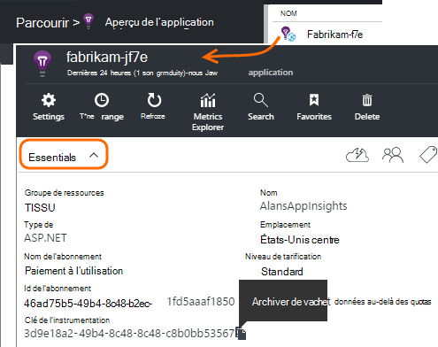
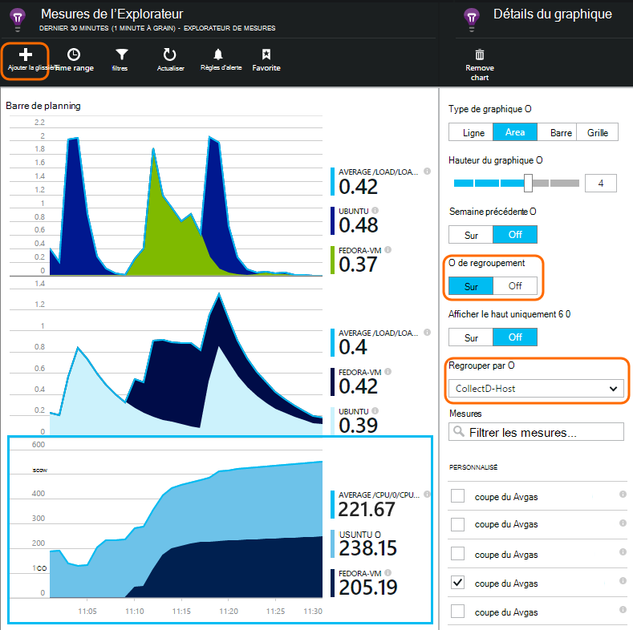

<properties 
    pageTitle="collectd : les statistiques de performance pour Java sous Unix dans les perspectives de l’Application" 
    description="-Surveillance de votre site Web de Java avec le plug-in de CollectD d’idées d’Application étendue" 
    services="application-insights" 
    documentationCenter="java"
    authors="alancameronwills" 
    manager="douge"/>

<tags 
    ms.service="application-insights" 
    ms.workload="tbd" 
    ms.tgt_pltfrm="ibiza" 
    ms.devlang="na" 
    ms.topic="article" 
    ms.date="08/24/2016" 
    ms.author="awills"/>
 
# <a name="collectd-unix-performance-metrics-in-application-insights"></a>collectd : les mesures de performances Unix dans les perspectives de l’Application

*Idées d’application est en mode Aperçu.*

Pour Explorer les métriques de performances système Unix dans les [Perspectives d’Application](app-insights-overview.md), installer [collectd](http://collectd.org/), ainsi que ses conseils d’Application plug-in. Cette solution open source rassemble diverses statistiques système et réseau.

Généralement, vous utilisez collectd si vous avez déjà [instrumentés votre service web de Java avec les perspectives d’Application][java]. Il vous donne plus de données pour vous aider à améliorer les performances de votre application ou de diagnostiquer les problèmes. 


## <a name="get-your-instrumentation-key"></a>Obtenir votre clé d’instrumentation

Dans le [portail Microsoft Azure](https://portal.azure.com), ouvrez la ressource de [Perspectives de l’Application](app-insights-overview.md) où vous voulez que les données s’affichent. (Ou [créez une nouvelle ressource](app-insights-create-new-resource.md).)

Effectuer une copie de la clé de l’instrumentation, qui identifie la ressource.




## <a name="install-collectd-and-the-plug-in"></a>Installer le plug-in et collectd

Sur vos ordinateurs de serveur Unix :

1. Installer [collectd](http://collectd.org/) version 5.4.0 ou version ultérieure.
2. Télécharger le [plug-in d’idées d’Application collectd writer](https://aka.ms/aijavasdk). Notez le numéro de version.
3. Copie le plug-in JAR dans `/usr/share/collectd/java`.
3. Modifier `/etc/collectd/collectd.conf`:
 * Vérifiez que [le plug-in Java](https://collectd.org/wiki/index.php/Plugin:Java) est activée.
 * Mise à jour de la JVMArg pour le java.class.path pour inclure le fichier JAR suivant. Mise à jour le numéro de version correspond à celui que vous avez téléchargé :
  * `/usr/share/collectd/java/applicationinsights-collectd-1.0.5.jar`
 * Ajouter cet extrait de code, à l’aide de la clé d’Instrumentation à partir de la ressource :

```

     LoadPlugin "com.microsoft.applicationinsights.collectd.ApplicationInsightsWriter"
     <Plugin ApplicationInsightsWriter>
        InstrumentationKey "Your key"
     </Plugin>
```

Ici fait partie d’un exemple de fichier de configuration :

    ...
    # collectd plugins
    LoadPlugin cpu
    LoadPlugin disk
    LoadPlugin load
    ...

    # Enable Java Plugin
    LoadPlugin "java"

    # Configure Java Plugin
    <Plugin "java">
      JVMArg "-verbose:jni"
      JVMArg "-Djava.class.path=/usr/share/collectd/java/applicationinsights-collectd-1.0.5.jar:/usr/share/collectd/java/collectd-api.jar"

      # Enabling Application Insights plugin
      LoadPlugin "com.microsoft.applicationinsights.collectd.ApplicationInsightsWriter"
                
      # Configuring Application Insights plugin
      <Plugin ApplicationInsightsWriter>
        InstrumentationKey "12345678-1234-1234-1234-123456781234"
      </Plugin>

      # Other plugin configurations ...
      ...
    </Plugin>
.   ...

Configurer les autres [plug-ins de collectd](https://collectd.org/wiki/index.php/Table_of_Plugins), permettant de recueillir des données différentes provenant de différentes sources.

Redémarrez collectd en fonction de son [manuel](https://collectd.org/wiki/index.php/First_steps).

## <a name="view-the-data-in-application-insights"></a>Afficher les données dans l’aperçu de l’Application

Dans votre ressource de perspectives de l’Application, ouvrez [Explorer de mesures et d’ajouter des graphiques][metrics], sélectionner les mesures que vous souhaitez afficher à partir de la catégorie personnalisée.



Par défaut, les mesures sont agrégées sur tous les ordinateurs hôtes à partir de laquelle les mesures ont été collectés. Pour afficher les mesures par hôte, la lame de détails graphiques, activer le regroupement, puis choisissez Grouper par CollectD-hôte.


## <a name="to-exclude-upload-of-specific-statistics"></a>Pour exclure le téléchargement de statistiques spécifiques

Par défaut, le plug-in d’idées d’Application envoie toutes les données collectées par tous le collectd activé « lecture » des plug-ins. 

Pour exclure les données provenant de sources de données ou des plug-ins spécifiques :

* Modifiez le fichier de configuration. 
* Dans `<Plugin ApplicationInsightsWriter>`, ajoutez la directive lignes comme suit :

Directive | Effet
---|---
`Exclude disk` | Exclure toutes les données collectées par le `disk` plug-in
`Exclude disk:read,write` | Exclure les sources nommés `read` et `write` de la `disk` plug-in.

Directives particulières avec un saut de ligne.


## <a name="problems"></a>Problèmes ?

*Je ne vois pas les données dans le portail*

* Ouvrir la [recherche] [ diagnostic] pour voir si les événements bruts sont arrivés. Il faut parfois attendre plus de temps apparaissent dans l’Explorateur de mesures.
* Vous devrez peut-être définir des [exceptions de pare-feu pour les messages sortants](app-insights-ip-addresses.md)
* Activer le suivi dans le plug-in de perspectives de l’Application. Ajoutez cette ligne au sein de `<Plugin ApplicationInsightsWriter>`:
 *  `SDKLogger true`
* Ouvrez un terminal et démarrer collectd en mode détaillé, pour voir les problèmes, qu'il est signalé :
 * `sudo collectd -f`


<!--Link references-->

[api]: app-insights-api-custom-events-metrics.md
[apiexceptions]: app-insights-api-custom-events-metrics.md#track-exception
[availability]: app-insights-monitor-web-app-availability.md
[diagnostic]: app-insights-diagnostic-search.md
[eclipse]: app-insights-java-eclipse.md
[java]: app-insights-java-get-started.md
[javalogs]: app-insights-java-trace-logs.md
[metrics]: app-insights-metrics-explorer.md
[usage]: app-insights-web-track-usage.md

 
