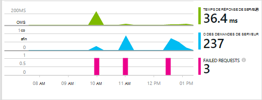

<properties 
    pageTitle="Mise en route de perspectives d’Application avec Java dans Éclipse" 
    description="Le plug-in d’Eclipse permet d’ajouter la surveillance des performances et l’utilisation de votre site Web de Java avec aperçus de l’Application" 
    services="application-insights" 
    documentationCenter="java"
    authors="alancameronwills" 
    manager="douge"/>

<tags 
    ms.service="application-insights" 
    ms.workload="tbd" 
    ms.tgt_pltfrm="ibiza" 
    ms.devlang="na" 
    ms.topic="article" 
    ms.date="03/02/2016" 
    ms.author="awills"/>
 
# Mise en route de perspectives d’Application avec Java dans Éclipse

Le Kit de développement de perspectives Application envoie télémétrie à partir de votre application web de Java afin que vous pouvez analyser les performances et l’utilisation. L’Eclipse plug-in pour les perspectives de l’Application installe automatiquement le Kit de développement de votre projet afin que vous obteniez de télémétrie de la zone, ainsi qu’une API que vous pouvez utiliser pour écrire la télémétrie personnalisé.   

## Conditions préalables

Actuellement le plug-in fonctionne pour les projets Maven et Dynamic Web dans Eclipse. ([Ajouter les idées Application à d’autres types de projet de Java][java].)

Vous aurez besoin :

* Oracle JRE version 1.6 ou ultérieure
* Un abonnement à [Microsoft Azure](https://azure.microsoft.com/). (Vous pouvez démarrer avec [version d’évaluation gratuite](https://azure.microsoft.com/pricing/free-trial/).)
* [Eclipse IDE pour les développeurs Java EE](http://www.eclipse.org/downloads/), Indigo ou une version ultérieure.
* Windows 7 ou version ultérieure, ou Windows Server 2008 ou version ultérieure

## Installer le SDK sur Eclipse (une fois)

Vous ne devez faire ceci par machine. Cette étape installe un ensemble d’outils qui peut ajouter puis le Kit de développement pour chaque projet Web dynamique.

1. Dans Eclipse, cliquez sur aide, installer un nouveau logiciel.

    

2. Le Kit de développement est en http://dl.windowsazure.com/eclipse, sous Azure Shared Computer Toolkit. 
3. Désactivez l’option **contacter tous les sites de mise à jour...**

    

Suivez les étapes restantes pour chaque projet de Java.

## Créer une ressource d’idées d’Application dans Azure

1. Connectez-vous au [portail Azure](https://portal.azure.com).
2. Créer une nouvelle ressource de perspectives de l’Application.  

      
3. Définir le type d’application à application web de Java.  

      
4. Recherchez la clé de l’instrumentation de la nouvelle ressource. Vous devrez coller dans votre projet de code sous peu.  

      

## Ajouter des informations d’Application à votre projet

1. Ajouter les perspectives d’Application dans le menu contextuel de votre projet web de Java.

    

2. Collez la clé d’instrumentation que vous avez obtenu à partir du portail Azure.

    

La clé est envoyée avec chaque élément de télémétrie et indique les perspectives d’Application pour l’afficher dans votre ressource.

## Exécutez l’application et voir métriques

Exécutez votre application.

Revenir à votre ressource de perspectives d’Application dans Microsoft Azure.

Données de requêtes HTTP seront affiche sur la lame de vue d’ensemble. (En revanche, si elle n’existait pas, attendez quelques secondes et puis cliquez sur Actualiser).

 

Cliquez sur n’importe quel graphique pour afficher des mesures plus détaillées. 

[Pour en savoir plus sur les mesures.][metrics]

 

Et lorsque vous affichez les propriétés d’une requête, vous pouvez voir les événements de télémesure associés tels que les demandes et les exceptions.
 

## TELEMETRIE de côté client

À partir de la blade de démarrage rapide, cliquez sur obtenir le code pour analyser Mes pages web : 

Insérez l’extrait de code dans la section head de vos fichiers HTML.

#### Afficher les données côté client

Ouvrir vos pages web mises à jour et de les utiliser. Attendez une minute ou deux, puis revenir à l’aperçu de l’Application et ouvrez la blade d’utilisation. (De la lame de la vue d’ensemble, faites défiler vers le bas et cliquez sur utilisation.)

Mesures de session, l’utilisateur et afficher la page apparaîtra sur la blade d’utilisation :

[Plus d’informations sur la configuration de télémétrie du côté client.][usage]

## Publication de votre application.

Maintenant publier votre application sur le serveur, utilisez permettent aux personnes et regarder la télémétrie afficheront sur le portail.

* Assurez-vous que votre pare-feu permet à votre application d’envoyer de télémétrie pour ces ports :

 * DC.Services.VisualStudio.com:443
 * DC.Services.VisualStudio.com:80
 * F5.Services.VisualStudio.com:443
 * F5.Services.VisualStudio.com:80

* Sur les serveurs Windows, installer :

 * [Microsoft Visual C++ Redistributable](http://www.microsoft.com/download/details.aspx?id=40784)

    (Ainsi, les compteurs de performance.)

## Exceptions et défaillances de demande

Les exceptions non gérées sont collectées automatiquement :

Pour collecter des données sur les autres exceptions, vous disposez de deux options :

* [Insérer des appels à TrackException dans votre code](app-insights-api-custom-events-metrics.md#track-exception). 
* [Installation de l’Agent de Java sur votre serveur](app-insights-java-agent.md). Vous indiquez les méthodes que vous souhaitez regarder.

## Analyser les appels de méthode et des dépendances externes

[Installer l’Agent Java](app-insights-java-agent.md) pour ouvrir une session spécifiée des méthodes internes et les appels effectués via JDBC, avec des données de temporisation.

## Compteurs de performance

Sur la lame de votre présentation, faites défiler et cliquez sur la mosaïque de **serveurs** . Vous verrez une plage de compteurs de performance.

### Personnalisation de la collecte de compteur de performance

Pour désactiver la collecte de l’ensemble standard de compteurs de performance, ajoutez le code suivant sous le nœud racine du fichier ApplicationInsights.xml :

    <PerformanceCounters>
       <UseBuiltIn>False</UseBuiltIn>
    </PerformanceCounters>

### Collecter les compteurs de performance supplémentaires

Vous pouvez spécifier les compteurs de performance supplémentaires pour être collectés.

#### Compteurs JMX (exposées par la Machine virtuelle Java)

    <PerformanceCounters>
      <Jmx>
        <Add objectName="java.lang:type=ClassLoading" attribute="TotalLoadedClassCount" displayName="Loaded Class Count"/>
        <Add objectName="java.lang:type=Memory" attribute="HeapMemoryUsage.used" displayName="Heap Memory Usage-used" type="composite"/>
      </Jmx>
    </PerformanceCounters>

*   `displayName`– Nom affiché dans le portail de perspectives de l’Application.
*   `objectName`– Le nom de l’objet JMX.
*   `attribute`– L’attribut de l’objet JMX à extraire
*   `type`(facultatif) - type de l’attribut de l’objet JMX :
 *  Par défaut : un type simple comme int ou long.
 *  `composite`: les données de compteur de performance sont au format 'Attribute.Data'
 *  `tabular`: les données de compteur de performance sont sous la forme d’une ligne de tableau

#### Compteurs de performances de Windows

Chaque [compteur de performance Windows](https://msdn.microsoft.com/library/windows/desktop/aa373083.aspx) est un membre d’une catégorie (de la même façon qu’un champ est un membre d’une classe). Catégories peut être globales, ou peuvent avoir numérotés ou instances nommées.

    <PerformanceCounters>
      <Windows>
        <Add displayName="Process User Time" categoryName="Process" counterName="%User Time" instanceName="__SELF__" />
        <Add displayName="Bytes Printed per Second" categoryName="Print Queue" counterName="Bytes Printed/sec" instanceName="Fax" />
      </Windows>
    </PerformanceCounters>

*   displayName – le nom affiché dans le portail de perspectives de l’Application.
*   nom de la catégorie, la catégorie de compteur de performance (objet de performance) à laquelle ce compteur de performance est associé.
*   counterName – le nom du compteur de performance.
*   instanceName – le nom de l’instance de catégorie de compteur de performance, ou chaîne vide (" »), si la catégorie contient une seule instance. Si categoryName est le processus, et le compteur de performance que vous souhaitez collecter à partir du processus en cours de JVM sur laquelle votre application est en cours d’exécution, spécifiez `"__SELF__"`.

Les compteurs de performance sont visibles en tant que mesures personnalisées dans [l’Explorateur de mesures][metrics].

### Compteurs de performance UNIX

* Pour obtenir une grande variété de données système et réseau, [installer collectd avec le plug-in de perspectives de l’Application](app-insights-java-collectd.md) .

## Disponibilité des tests web

Idées d’application peuvent de tester votre site Web à intervalles réguliers pour vérifier que c’est et répondre correctement. [Pour configurer les][availability], faites défiler sur la disponibilité.

Vous obtiendrez les chartes de temps de réponse, ainsi que des notifications par courrier électronique si votre site tombe en panne.

[Pour en savoir plus sur la disponibilité des tests web.][availability] 

## Journaux de diagnostic

Si vous utilisez la Logback ou Log4J (v1.2 ou v2.0) pour le suivi, vous pouvez avoir vos journaux de suivi envoyés automatiquement aux analyses d’Application où vous pouvez Explorer et effectuez une recherche sur les.

[En savoir plus sur les journaux de diagnostic][javalogs]

## Télémétrie personnalisé 

Insérez quelques lignes de code dans votre application web de Java à savoir ce que font les utilisateurs avec lui ou pour aider à diagnostiquer les problèmes. 

Vous pouvez insérer le code dans la page de web JavaScript et le Java côté serveur.

[En savoir plus sur la télémétrie personnalisé][track]

## Étapes suivantes

#### Détecter et diagnostiquer des problèmes

* [Ajouter de télémétrie de client web] [ usage] pour obtenir de télémétrie de performances à partir du client web.
* [Paramétrer des tests web] [ availability] pour vous assurer que votre application reste réactive et en temps réel.
* [Rechercher des événements et les journaux] [ diagnostic] pour aider à diagnostiquer les problèmes.
* [Capture des traces Log4J ou Logback][javalogs]

#### Effectuer le suivi de l’utilisation

* [Ajouter de télémétrie de client web] [ usage] pour les vues de page moniteur et mesures de l’utilisateur de base.
* [Effectuer le suivi des événements personnalisés et les mesures de] [ track] pour en savoir plus sur la manière dont votre application est utilisée, à la fois sur le client et le serveur.

<!--Link references-->

[availability]: app-insights-monitor-web-app-availability.md
[diagnostic]: app-insights-diagnostic-search.md
[java]: app-insights-java-get-started.md
[javalogs]: app-insights-java-trace-logs.md
[metrics]: app-insights-metrics-explorer.md
[track]: app-insights-api-custom-events-metrics.md
[usage]: app-insights-web-track-usage.md

 