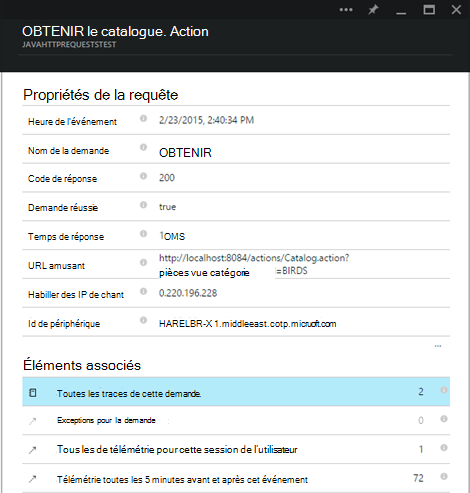
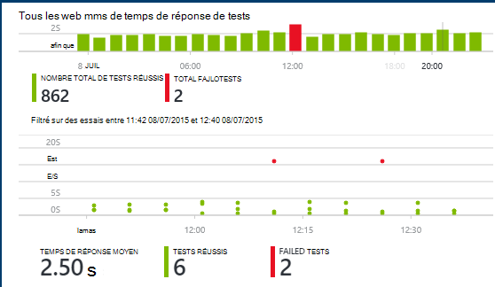

<properties
    pageTitle="Analytique d’application web Java avec les perspectives d’Application | Microsoft Azure"
    description="Surveiller les performances et l’utilisation de votre site Web de Java avec aperçus de l’Application. "
    services="application-insights"
    documentationCenter="java"
    authors="alancameronwills"
    manager="douge"/>

<tags
    ms.service="application-insights"
    ms.workload="tbd"
    ms.tgt_pltfrm="ibiza"
    ms.devlang="na"
    ms.topic="get-started-article"
    ms.date="08/17/2016"
    ms.author="awills"/>

# Mise en route de perspectives de l’Application dans un projet web de Java

*Idées d’application est en mode Aperçu.*

[AZURE.INCLUDE [app-insights-selector-get-started](../../includes/app-insights-selector-get-started.md)]

[Idées d’application](https://azure.microsoft.com/services/application-insights/) est un service analytique extensible qui vous permet de comprendre les performances et l’utilisation de vos applications en ligne. Il permet de [détecter et diagnostiquer les problèmes de performances et les exceptions](app-insights-detect-triage-diagnose.md)et [écrire du code] [ api] pour effectuer le suivi de ce que les utilisateurs à faire avec votre application.

Idées d’application prend en charge les applications Java en cours d’exécution sur Linux, Unix ou Windows.

Tu as besoin de :

* Oracle JRE version 1.6 ou ultérieure, ou Zoulou JRE version 1.6 ou ultérieure
* Un abonnement à [Microsoft Azure](https://azure.microsoft.com/). (Vous pouvez démarrer avec [version d’évaluation gratuite](https://azure.microsoft.com/pricing/free-trial/).)

*Si vous disposez d’une application web qui est déjà en ligne, vous pourriez suivre la procédure pour [Ajouter le Kit de développement logiciel en cours d’exécution sur le serveur web](app-insights-java-live.md). Cette alternative évite de reconstruire le code, mais vous n’obtenez pas l’option d’écrire du code pour effectuer le suivi de l’activité des utilisateurs.*

## 1. obtenir une clé d’instrumentation de perspectives de l’Application

1. Ouvrez une session sur le [portail Microsoft Azure](https://portal.azure.com).
2. Créez une ressource de perspectives de l’Application. Définir le type d’application à application web de Java.

    
4. Recherchez la clé de l’instrumentation de la nouvelle ressource. Vous devrez coller cette clé dans votre projet de code, peu de temps.

    

## 2. Ajoutez le perspectives d’Application SDK pour Java à votre projet

*Choisissez le moyen approprié pour votre projet.*

#### Si vous utilisez Eclipse pour créer un projet Maven ou Web dynamique...

Utiliser l' [Application informations SDK pour Java plug-in][eclipse].

#### Si vous utilisez Maven...

Si votre projet est déjà configuré pour utiliser Maven pour génération, fusionner le code suivant à votre fichier pom.xml.

Ensuite, actualiser les dépendances du projet pour obtenir les fichiers binaires téléchargés.

    <repositories>
       <repository>
          <id>central</id>
          <name>Central</name>
          <url>http://repo1.maven.org/maven2</url>
       </repository>
    </repositories>

    <dependencies>
      <dependency>
        <groupId>com.microsoft.azure</groupId>
        <artifactId>applicationinsights-web</artifactId>
        <!-- or applicationinsights-core for bare API -->
        <version>[1.0,)</version>
      </dependency>
    </dependencies>

* *Erreurs de validation de build ou de total de contrôle ?* Essayez d’utiliser une version spécifique, telle que : `<version>1.0.n</version>`. Vous trouverez la dernière version dans les [notes de version du Kit de développement logiciel](https://github.com/Microsoft/ApplicationInsights-Java#release-notes) ou nos [artefacts de Maven](http://search.maven.org/#search%7Cga%7C1%7Capplicationinsights).
* *Vous avez besoin pour mettre à jour un nouveau Kit de développement SDK ?* Actualiser les interdépendances de votre projet.

#### Si vous utilisez Gradle...

Si votre projet est déjà configuré pour utiliser Gradle pour génération, fusionner le code suivant à votre fichier build.gradle.

Actualiser les dépendances du projet pour obtenir les fichiers binaires téléchargés.

    repositories {
      mavenCentral()
    }

    dependencies {
      compile group: 'com.microsoft.azure', name: 'applicationinsights-web', version: '1.+'
      // or applicationinsights-core for bare API
    }

* Erreurs de build ou total de contrôle de la validation de *? Essayez d’utiliser une version spécifique, telle que :* `version:'1.0.n'`. *Vous trouverez la dernière version dans les [notes de version du Kit de développement logiciel](https://github.com/Microsoft/ApplicationInsights-Java#release-notes).*
* *Mise à jour vers un nouveau SDK*
 * Actualiser les interdépendances de votre projet.

#### Sinon...

Ajouter manuellement le Kit de développement logiciel :

1. Télécharger l' [Application aperçu SDK pour Java](https://aka.ms/aijavasdk).
2. Extraire les fichiers binaires à partir du fichier zip et les ajouter à votre projet.

### Questions...

* *Quelle est la relation entre la `-core` et `-web` composants dans le zip ?*

 * `applicationinsights-core`vous permet de l’API sans système d’exploitation. Vous devez toujours ce composant.
 * `applicationinsights-web`vous donne des métriques qui assurent le suivi des temps de réponse et les comptes de demandes HTTP. Vous pouvez omettre ce composant si vous ne souhaitez pas que cette télémétrie recueilli de façon automatique. Par exemple, si vous souhaitez écrire votre propre.

* *Mise à jour du Kit de développement logiciel lorsque nous publions des modifications*
 * Téléchargez la dernière [Application Insights SDK pour Java](https://aka.ms/qqkaq6) et remplacent les anciennes.
 * Les modifications sont décrites dans les [notes de version du Kit de développement logiciel](https://github.com/Microsoft/ApplicationInsights-Java#release-notes).

## 3. Ajoutez un fichier .xml de perspectives de l’Application

Ajouter ApplicationInsights.xml dans le dossier de ressources dans votre projet ou assurez-vous qu’il est ajouté au chemin d’accès de la classe de votre projet de déploiement. Copiez-y le code XML suivant.

Remplacez par la clé de l’instrumentation que vous avez obtenu à partir du portail Azure.

    <?xml version="1.0" encoding="utf-8"?>
    <ApplicationInsights xmlns="http://schemas.microsoft.com/ApplicationInsights/2013/Settings" schemaVersion="2014-05-30">

      <!-- The key from the portal: -->

      <InstrumentationKey>** Your instrumentation key **</InstrumentationKey>

      <!-- HTTP request component (not required for bare API) -->

      <TelemetryModules>
        <Add type="com.microsoft.applicationinsights.web.extensibility.modules.WebRequestTrackingTelemetryModule"/>
        <Add type="com.microsoft.applicationinsights.web.extensibility.modules.WebSessionTrackingTelemetryModule"/>
        <Add type="com.microsoft.applicationinsights.web.extensibility.modules.WebUserTrackingTelemetryModule"/>
      </TelemetryModules>

      <!-- Events correlation (not required for bare API) -->
      <!-- These initializers add context data to each event -->

      <TelemetryInitializers>
        <Add   type="com.microsoft.applicationinsights.web.extensibility.initializers.WebOperationIdTelemetryInitializer"/>
        <Add type="com.microsoft.applicationinsights.web.extensibility.initializers.WebOperationNameTelemetryInitializer"/>
        <Add type="com.microsoft.applicationinsights.web.extensibility.initializers.WebSessionTelemetryInitializer"/>
        <Add type="com.microsoft.applicationinsights.web.extensibility.initializers.WebUserTelemetryInitializer"/>
        <Add type="com.microsoft.applicationinsights.web.extensibility.initializers.WebUserAgentTelemetryInitializer"/>

      </TelemetryInitializers>
    </ApplicationInsights>

* La clé de l’instrumentation est envoyée avec chaque élément de télémétrie et indique les perspectives d’Application pour l’afficher dans votre ressource.
* Le composant de requête HTTP est facultatif. Il envoie automatiquement télémétrie sur les demandes et les temps de réponse pour le portail.
* Corrélation des événements est un ajout pour le composant de requête HTTP. Il assigne un identificateur à chaque demande reçue par le serveur et ajoute cet identificateur comme une propriété pour chaque élément de télémétrie que la propriété 'Operation.Id'. Il vous permet de mettre en corrélation la télémétrie associé à chaque demande en définissant un filtre de [recherche de diagnostic][diagnostic].
* La clé d’idées d’Application peut être passée dynamiquement à partir du portail Azure sous la forme d’une propriété système (-DAPPLICATION_INSIGHTS_IKEY = your_ikey). S’il n’existe aucune propriété définie, il vérifie pour la variable d’environnement (APPLICATION_INSIGHTS_IKEY) dans les paramètres de l’application Azure. Si les deux propriétés ne sont pas définies, la valeur par défaut de InstrumentationKey est utilisé à partir de ApplicationInsights.xml. Cette séquence vous aide à gérer dynamiquement des InstrumentationKeys différentes pour les différents environnements.

### Autres façons de définir la clé de l’instrumentation

SDK de perspectives d’application recherche la clé dans cet ordre :

1. Propriété système :-DAPPLICATION_INSIGHTS_IKEY = your_ikey
2. Variable d’environnement : APPLICATION_INSIGHTS_IKEY
3. Fichier de configuration : ApplicationInsights.xml

Vous pouvez également [la définir dans le code](app-insights-api-custom-events-metrics.md#ikey):

    telemetryClient.InstrumentationKey = "...";

## 4. Ajoutez un filtre HTTP

La dernière étape de configuration permet du composant de requête HTTP pour se connecter à chaque demande web. (Non obligatoire si vous voulez simplement l’API sur matériel vierge.)

Recherchez et ouvrez le fichier web.xml dans votre projet et fusionner le code suivant sous le nœud web-app, dans lequel les filtres d’application sont configurés.

Pour obtenir les résultats les plus précis, le filtre doit être mappé avant tous les autres filtres.

    <filter>
      <filter-name>ApplicationInsightsWebFilter</filter-name>
      <filter-class>
        com.microsoft.applicationinsights.web.internal.WebRequestTrackingFilter
      </filter-class>
    </filter>
    <filter-mapping>
       <filter-name>ApplicationInsightsWebFilter</filter-name>
       <url-pattern>/*</url-pattern>
    </filter-mapping>

#### Si vous utilisez un ressort Web MVC 3.1 ou version ultérieure

Modifier ces éléments pour inclure le package de perspectives de l’Application :

    <context:component-scan base-package=" com.springapp.mvc, com.microsoft.applicationinsights.web.spring"/>

    <mvc:interceptors>
        <mvc:interceptor>
            <mvc:mapping path="/**"/>
            <bean class="com.microsoft.applicationinsights.web.spring.RequestNameHandlerInterceptorAdapter" />
        </mvc:interceptor>
    </mvc:interceptors>

#### Si vous utilisez des entretoises 2

Ajouter cet élément au fichier de configuration jambes (généralement appelé struts.xml ou des jambes-default.xml) :

     <interceptors>
       <interceptor name="ApplicationInsightsRequestNameInterceptor" class="com.microsoft.applicationinsights.web.struts.RequestNameInterceptor" />
     </interceptors>
     <default-interceptor-ref name="ApplicationInsightsRequestNameInterceptor" />

(Si vous avez définis dans une pile par défaut des intercepteurs, l’intercepteur peut simplement être ajouté à cette pile.)

## 5. Lancez votre application

Exécuter en mode de débogage sur votre ordinateur de développement, soit publier sur votre serveur.

## 6. afficher votre télémétrie dans les perspectives de l’Application

Revenir à votre ressource de perspectives d’Application dans [Microsoft Azure portal](https://portal.azure.com).

Données de requêtes HTTP s’affiche sur la lame de vue d’ensemble. (En revanche, si elle n’existait pas, attendez quelques secondes et puis cliquez sur Actualiser).

[Pour en savoir plus sur les mesures.][metrics]

Cliquez sur n’importe quel graphique pour voir plus de mesures agrégées.

> Idées d’application suppose que le format des demandes HTTP pour les applications MVC est : `VERB controller/action`. Par exemple, `GET Home/Product/f9anuh81`, `GET Home/Product/2dffwrf5` et `GET Home/Product/sdf96vws` sont regroupés dans des `GET Home/Product`. Ce regroupement permet d’agrégations significatives de demandes, par exemple le nombre de demandes et de la durée moyenne d’exécution des demandes.

### Données d’instance 

Cliquez sur un type de demande spécifique pour afficher les instances individuelles. 

Deux types de données sont affichées dans l’aperçu de l’Application : données agrégées, stockés et affichés en tant que moyennes, des décomptes et des totaux ; et l’instance de données - les rapports individuels de demandes HTTP, les exceptions, vues de page ou des événements personnalisés.

Lorsque vous affichez les propriétés d’une requête, vous pouvez voir les événements de télémesure associés tels que les demandes et les exceptions.

### Analytique : Langage de requête puissantes

En accumulant plus de données, vous pouvez exécuter des requêtes à la fois d’agréger des données et pour trouver des instances individuelles. [Analytique]() est un outil puissant pour à la fois pour l’utilisation et les performances de la compréhension et à des fins de Diagnostics.

## 7. Installez votre application sur le serveur

Maintenant publier votre application sur le serveur, utilisez permettent aux personnes et regarder la télémétrie afficheront sur le portail.

* Assurez-vous que votre pare-feu permet à votre application d’envoyer de télémétrie pour ces ports :

 * DC.Services.VisualStudio.com:443
 * F5.Services.VisualStudio.com:443

* Sur les serveurs Windows, installer :

 * [Microsoft Visual C++ Redistributable](http://www.microsoft.com/download/details.aspx?id=40784)

    (Ce composant permet de compteurs de performance).

## Exceptions et défaillances de demande

Les exceptions non gérées sont collectées automatiquement :

Pour collecter des données sur les autres exceptions, vous disposez de deux options :

* [Insérez les appels à trackException() dans votre code][apiexceptions]. 
* [Installation de l’Agent de Java sur votre serveur](app-insights-java-agent.md). Vous indiquez les méthodes que vous souhaitez regarder.

## Analyser les appels de méthode et des dépendances externes

[Installer l’Agent Java](app-insights-java-agent.md) pour ouvrir une session spécifiée des méthodes internes et les appels effectués via JDBC, avec des données de temporisation.

## Compteurs de performance

Ouvrir les **paramètres**, **les serveurs**, pour afficher une plage de compteurs de performance.

### Personnalisation de la collecte de compteur de performance

Pour désactiver la collecte de l’ensemble standard de compteurs de performance, ajoutez le code suivant sous le nœud racine du fichier ApplicationInsights.xml :

    <PerformanceCounters>
       <UseBuiltIn>False</UseBuiltIn>
    </PerformanceCounters>

### Collecter les compteurs de performance supplémentaires

Vous pouvez spécifier les compteurs de performance supplémentaires pour être collectés.

#### Compteurs JMX (exposées par la Machine virtuelle Java)

    <PerformanceCounters>
      <Jmx>
        <Add objectName="java.lang:type=ClassLoading" attribute="TotalLoadedClassCount" displayName="Loaded Class Count"/>
        <Add objectName="java.lang:type=Memory" attribute="HeapMemoryUsage.used" displayName="Heap Memory Usage-used" type="composite"/>
      </Jmx>
    </PerformanceCounters>

*   `displayName`– Nom affiché dans le portail de perspectives de l’Application.
*   `objectName`– Le nom de l’objet JMX.
*   `attribute`– L’attribut de l’objet JMX à extraire
*   `type`(facultatif) - type de l’attribut de l’objet JMX :
 *  Par défaut : un type simple comme int ou long.
 *  `composite`: les données de compteur de performance sont au format 'Attribute.Data'
 *  `tabular`: les données de compteur de performance sont sous la forme d’une ligne de tableau

#### Compteurs de performances de Windows

Chaque [compteur de performance Windows](https://msdn.microsoft.com/library/windows/desktop/aa373083.aspx) est un membre d’une catégorie (de la même façon qu’un champ est un membre d’une classe). Catégories peut être globales, ou peuvent avoir numérotés ou instances nommées.

    <PerformanceCounters>
      <Windows>
        <Add displayName="Process User Time" categoryName="Process" counterName="%User Time" instanceName="__SELF__" />
        <Add displayName="Bytes Printed per Second" categoryName="Print Queue" counterName="Bytes Printed/sec" instanceName="Fax" />
      </Windows>
    </PerformanceCounters>

*   displayName – le nom affiché dans le portail de perspectives de l’Application.
*   nom de la catégorie, la catégorie de compteur de performance (objet de performance) à laquelle ce compteur de performance est associé.
*   counterName – le nom du compteur de performance.
*   instanceName – le nom de l’instance de catégorie de compteur de performance, ou chaîne vide (" »), si la catégorie contient une seule instance. Si categoryName est le processus, et le compteur de performance que vous souhaitez collecter à partir du processus en cours de JVM sur laquelle votre application est en cours d’exécution, spécifiez `"__SELF__"`.

Les compteurs de performance sont visibles en tant que mesures personnalisées dans [l’Explorateur de mesures][metrics].

### Compteurs de performance UNIX

* Pour obtenir une grande variété de données système et réseau, [installer collectd avec le plug-in de perspectives de l’Application](app-insights-java-collectd.md) .

## Obtenir des données de session et d’utilisateur

OK, vous envoyez de télémétrie de votre serveur web. Pour obtenir la vue de 360 degrés de votre application, vous pouvez désormais ajouter une analyse plus :

* [Ajouter de télémétrie pour vos pages web] [ usage] pour les vues de page moniteur et mesures de l’utilisateur.
* [Paramétrer des tests web] [ availability] pour vous assurer que votre application reste réactive et en temps réel.

## Capture des traces du journal

Vous pouvez utiliser les conseils d’Application pour analyser les journaux Log4J, Logback ou autres infrastructures de journalisation. Vous pouvez corréler les journaux avec les demandes HTTP et autre télémétrie. [Découvrez comment][javalogs].

## Envoyer vos propres télémétrie

Maintenant que vous avez installé le SDK, vous pouvez utiliser l’API pour envoyer vos propres télémétrie.

* [Effectuer le suivi des événements personnalisés et les mesures de] [ api] pour savoir ce que font les utilisateurs avec votre application.
* [Rechercher des événements et les journaux] [ diagnostic] pour aider à diagnostiquer les problèmes.

## Disponibilité des tests web

Idées d’application peuvent de tester votre site Web à intervalles réguliers pour vérifier que c’est et répondre correctement. [Pour configurer les][availability], cliquez sur les tests Web.

Vous obtiendrez les chartes de temps de réponse, ainsi que des notifications par courrier électronique si votre site tombe en panne.

[Pour en savoir plus sur la disponibilité des tests web.][availability] 

## Questions ? Problèmes ?

[Résolution des problèmes liés à Java](app-insights-java-troubleshoot.md)

## Étapes suivantes

Pour plus d’informations, consultez le [Centre pour développeurs Java](/develop/java/).

<!--Link references-->

[api]: app-insights-api-custom-events-metrics.md
[apiexceptions]: app-insights-api-custom-events-metrics.md#track-exception
[availability]: app-insights-monitor-web-app-availability.md
[diagnostic]: app-insights-diagnostic-search.md
[eclipse]: app-insights-java-eclipse.md
[javalogs]: app-insights-java-trace-logs.md
[metrics]: app-insights-metrics-explorer.md
[usage]: app-insights-web-track-usage.md
