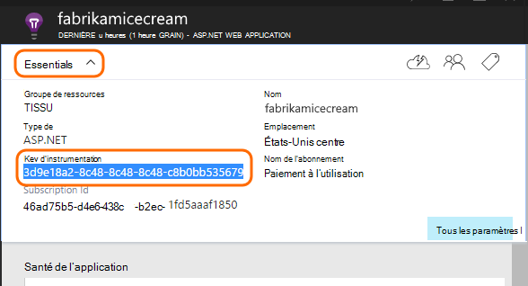

<properties 
    pageTitle="Idées d’application pour les applications web Java qui sont déjà live" 
    description="Démarrer le contrôle d’une application web qui est déjà en cours d’exécution sur votre serveur" 
    services="application-insights" 
    documentationCenter="java"
    authors="alancameronwills" 
    manager="douge"/>

<tags 
    ms.service="application-insights" 
    ms.workload="tbd" 
    ms.tgt_pltfrm="ibiza" 
    ms.devlang="na" 
    ms.topic="article" 
    ms.date="08/24/2016" 
    ms.author="awills"/>
 
# Idées d’application pour les applications web Java qui sont déjà live

*Idées d’application est en mode Aperçu.*

Si vous disposez d’une application web qui est déjà en cours d’exécution sur votre serveur J2EE, vous pouvez démarrer la surveillance avec [Aperçus de l’Application](app-insights-overview.md) sans avoir à apporter des modifications de code ou recompiler votre projet. Avec cette option, vous obtenez des informations sur les demandes HTTP envoyées à votre serveur, les exceptions non gérées et les compteurs de performance.

Vous aurez besoin d’un abonnement à [Microsoft Azure](https://azure.com).

> [AZURE.NOTE] La procédure de cette page ajoute le Kit de développement pour votre application web lors de l’exécution. Cette infrastructure de runtime est utile si vous ne souhaitez pas mettre à jour ou reconstruire votre code source. Mais si vous le pouvez, nous vous recommandons de vous [Ajouter le Kit de développement du code source](app-insights-java-get-started.md) à la place. Qui vous propose des options supplémentaires, telles que l’écriture de code pour effectuer le suivi de l’activité des utilisateurs.

## 1. obtenir une clé d’instrumentation de perspectives de l’Application

1. Connectez-vous au [portail de Microsoft Azure](https://portal.azure.com)
2. Créer une nouvelle ressource d’idées d’Application

    
3. Définir le type d’application à application web de Java.

    
4. Recherchez la clé de l’instrumentation de la nouvelle ressource. Vous devrez coller cette clé dans votre projet de code, peu de temps.

    

## 2. Téléchargez le Kit de développement

1. Télécharger l' [Application aperçu SDK pour Java](https://aka.ms/aijavasdk). 
2. Sur votre serveur, extraire le contenu du Kit de développement logiciel dans le répertoire à partir duquel les fichiers binaires du projet sont chargés. Si vous utilisez Tomcat, ce répertoire est généralement sous`webapps\<your_app_name>\WEB-INF\lib`

## 3. Ajoutez un fichier xml de perspectives de l’Application

Créer des ApplicationInsights.xml dans le dossier dans lequel vous avez ajouté le Kit de développement logiciel. Dans celui-ci, placez le code XML suivant.

Remplacez par la clé de l’instrumentation que vous avez obtenu à partir du portail Azure.

    <?xml version="1.0" encoding="utf-8"?>
    <ApplicationInsights xmlns="http://schemas.microsoft.com/ApplicationInsights/2013/Settings" schemaVersion="2014-05-30">

      <!-- The key from the portal: -->

      <InstrumentationKey>** Your instrumentation key **</InstrumentationKey>

      <!-- HTTP request component (not required for bare API) -->

      <TelemetryModules>
        <Add type="com.microsoft.applicationinsights.web.extensibility.modules.WebRequestTrackingTelemetryModule"/>
        <Add type="com.microsoft.applicationinsights.web.extensibility.modules.WebSessionTrackingTelemetryModule"/>
        <Add type="com.microsoft.applicationinsights.web.extensibility.modules.WebUserTrackingTelemetryModule"/>
      </TelemetryModules>

      <!-- Events correlation (not required for bare API) -->
      <!-- These initializers add context data to each event -->

      <TelemetryInitializers>
        <Add   type="com.microsoft.applicationinsights.web.extensibility.initializers.WebOperationIdTelemetryInitializer"/>
        <Add type="com.microsoft.applicationinsights.web.extensibility.initializers.WebOperationNameTelemetryInitializer"/>
        <Add type="com.microsoft.applicationinsights.web.extensibility.initializers.WebSessionTelemetryInitializer"/>
        <Add type="com.microsoft.applicationinsights.web.extensibility.initializers.WebUserTelemetryInitializer"/>
        <Add type="com.microsoft.applicationinsights.web.extensibility.initializers.WebUserAgentTelemetryInitializer"/>

      </TelemetryInitializers>
    </ApplicationInsights>

* La clé de l’instrumentation est envoyée avec chaque élément de télémétrie et indique les perspectives d’Application pour l’afficher dans votre ressource.
* Le composant de requête HTTP est facultatif. Il envoie automatiquement télémétrie sur les demandes et les temps de réponse pour le portail.
* Corrélation des événements est un ajout pour le composant de requête HTTP. Il assigne un identificateur à chaque demande reçue par le serveur et ajoute cet identificateur comme une propriété pour chaque élément de télémétrie que la propriété 'Operation.Id'. Il vous permet de mettre en corrélation la télémétrie associé à chaque demande en définissant un filtre de [recherche de diagnostic](app-insights-diagnostic-search.md).

## 4. Ajoutez un filtre HTTP

Localiser et ouvrir le fichier web.xml dans votre projet et de fusionner l’extrait suivant du code sous le nœud web-app, dans lequel les filtres d’application sont configurés.

Pour obtenir les résultats les plus précis, le filtre doit être mappé avant tous les autres filtres.

    <filter>
      <filter-name>ApplicationInsightsWebFilter</filter-name>
      <filter-class>
        com.microsoft.applicationinsights.web.internal.WebRequestTrackingFilter
      </filter-class>
    </filter>
    <filter-mapping>
       <filter-name>ApplicationInsightsWebFilter</filter-name>
       <url-pattern>/*</url-pattern>
    </filter-mapping>

## 5. Vérifiez les exceptions de pare-feu

Vous devrez peut-être [définir des exceptions pour envoyer des données sortantes](app-insights-ip-addresses.md).

## 6. Redémarrez votre application web

## 7. afficher votre télémétrie dans les perspectives de l’Application

Revenir à votre ressource de perspectives d’Application dans [Microsoft Azure portal](https://portal.azure.com).

Télémétrie sur les requêtes HTTP s’affiche sur la lame de vue d’ensemble. (En revanche, si elle n’existait pas, attendez quelques secondes et puis cliquez sur Actualiser).

 

Cliquez sur n’importe quel graphique pour afficher des mesures plus détaillées. 

 

Et lorsque vous affichez les propriétés d’une requête, vous pouvez voir les événements de télémesure associés tels que les demandes et les exceptions.
 

[Pour en savoir plus sur les mesures.](app-insights-metrics-explorer.md)

## Étapes suivantes

* [Télémétrie d’ajouter à vos pages web](app-insights-web-track-usage.md) pour les affichages de page moniteur et mesures de l’utilisateur.
* [Paramétrer des tests web](app-insights-monitor-web-app-availability.md) pour vous assurer que votre application reste réactive et en temps réel.
* [Capture des traces du journal](app-insights-java-trace-logs.md)
* [Journaux et événements de recherche](app-insights-diagnostic-search.md) pour aider à diagnostiquer les problèmes.

 
