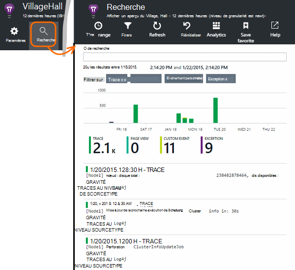

<properties 
    pageTitle="Explorez Java, les journaux de suivi dans les perspectives de l’Application" 
    description="Traces de recherche Log4J ou Logback dans les perspectives d’Application" 
    services="application-insights" 
    documentationCenter="java"
    authors="alancameronwills" 
    manager="douge"/>

<tags 
    ms.service="application-insights" 
    ms.workload="tbd" 
    ms.tgt_pltfrm="ibiza" 
    ms.devlang="na" 
    ms.topic="article" 
    ms.date="07/12/2016" 
    ms.author="awills"/>

# Explorez Java, les journaux de suivi dans les perspectives de l’Application

Si vous utilisez la Logback ou Log4J (v1.2 ou v2.0) pour le suivi, vous pouvez avoir vos journaux de suivi envoyés automatiquement aux analyses d’Application où vous pouvez Explorer et effectuez une recherche sur les.

Installer [l’Application aperçu SDK pour Java][java], si vous ne l’avez pas déjà fait.

## Ajouter des bibliothèques de journalisation à votre projet

*Choisissez le moyen approprié pour votre projet.*

#### Si vous utilisez Maven...

Si votre projet est déjà configuré pour utiliser Maven pour génération, fusionner un des extraits de code suivants de code dans votre fichier pom.xml.

Actualiser les dépendances du projet, pour obtenir les fichiers binaires téléchargés.

*Logback*

    <dependencies>
       <dependency>
          <groupId>com.microsoft.azure</groupId>
          <artifactId>applicationinsights-logging-logback</artifactId>
          <version>[1.0,)</version>
       </dependency>
    </dependencies>

*Log4j v2.0*

    <dependencies>
       <dependency>
          <groupId>com.microsoft.azure</groupId>
          <artifactId>applicationinsights-logging-log4j2</artifactId>
          <version>[1.0,)</version>
       </dependency>
    </dependencies>

*Log4j v1.2*

    <dependencies>
       <dependency>
          <groupId>com.microsoft.azure</groupId>
          <artifactId>applicationinsights-logging-log4j1_2</artifactId>
          <version>[1.0,)</version>
       </dependency>
    </dependencies>

#### Si vous utilisez Gradle...

Si votre projet est déjà configuré pour utiliser Gradle pour génération, ajouter une des lignes suivantes à la `dependencies` groupe dans votre fichier build.gradle :

Actualiser les dépendances du projet, pour obtenir les fichiers binaires téléchargés.

**Logback**

    compile group: 'com.microsoft.azure', name: 'applicationinsights-logging-logback', version: '1.0.+'

**Log4j v2.0**

    compile group: 'com.microsoft.azure', name: 'applicationinsights-logging-log4j2', version: '1.0.+'

**Log4j v1.2**

    compile group: 'com.microsoft.azure', name: 'applicationinsights-logging-log4j1_2', version: '1.0.+'

#### Sinon...

Téléchargez et extraire l’appender approprié, puis ajouter la bibliothèque appropriée à votre projet :

Enregistreur d’événements | Télécharger | Bibliothèque
----|----|----
Logback|[Kit de développement logiciel avec Logback appender](https://aka.ms/xt62a4)|applicationinsights-connexion-logback
Log4j v2.0|[Kit de développement logiciel avec Log4J v2 appender](https://aka.ms/qypznq)|applicationinsights-connexion-log4j2 
Log4j v1.2|[Kit de développement logiciel avec Log4J v1.2 appender](https://aka.ms/ky9cbo)|applicationinsights-connexion-log4j1_2 

## Ajouter l’appender à votre infrastructure de journalisation

Pour commencer à obtenir des traces, fusionner l’extrait de code dans le fichier de configuration Log4J ou Logback : 

*Logback*

    <appender name="aiAppender" 
      class="com.microsoft.applicationinsights.logback.ApplicationInsightsAppender">
    </appender>
    <root level="trace">
      <appender-ref ref="aiAppender" />
    </root>

*Log4j v2.0*

    <Configuration packages="com.microsoft.applicationinsights.Log4j">
      <Appenders>
        <ApplicationInsightsAppender name="aiAppender" />
      </Appenders>
      <Loggers>
        <Root level="trace">
          <AppenderRef ref="aiAppender"/>
        </Root>
      </Loggers>
    </Configuration>

*Log4j v1.2*

    <appender name="aiAppender" 
         class="com.microsoft.applicationinsights.log4j.v1_2.ApplicationInsightsAppender">
    </appender>
    <root>
      <priority value ="trace" />
      <appender-ref ref="aiAppender" />
    </root>

Les appenders d’idées d’Application peuvent être référencées par n’importe quel journal configuré et pas nécessairement par le journal de la racine (comme illustré dans les exemples de code ci-dessus).

## Explorez vos traces dans le portail d’idées d’Application

Maintenant que vous avez configuré votre projet pour envoyer les traces d’idées d’Application, vous pouvez afficher et rechercher ces traces dans le portail de perspectives de l’Application, dans la [recherche] [ diagnostic] blade.

## Étapes suivantes

[Recherche de diagnostic][diagnostic]

<!--Link references-->

[diagnostic]: app-insights-diagnostic-search.md
[java]: app-insights-java-get-started.md

 
