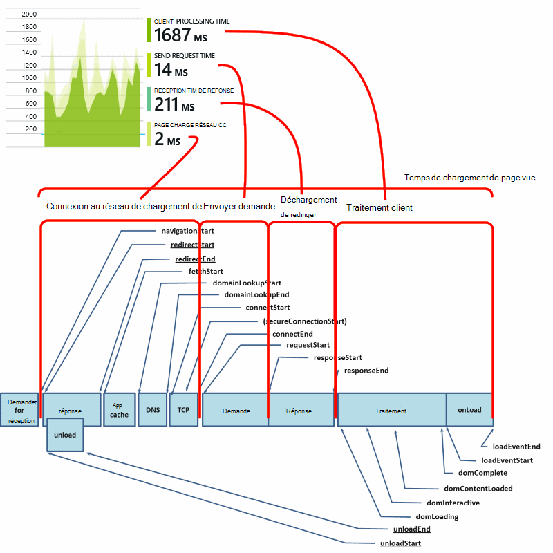

<properties
    pageTitle="Idées d’application JavaScript des applications web | Microsoft Azure"
    description="Obtenir la session et afficher le nombre de pages, données de client web et suivre les modèles d’utilisation. Détecter les exceptions et les problèmes de performances dans les pages web de JavaScript."
    services="application-insights"
    documentationCenter=""
    authors="alancameronwills"
    manager="douge"/>

<tags
    ms.service="application-insights"
    ms.workload="tbd"
    ms.tgt_pltfrm="ibiza"
    ms.devlang="na"
    ms.topic="get-started-article"
    ms.date="08/15/2016"
    ms.author="awills"/>

# Idées d’application pour les pages web

[AZURE.INCLUDE [app-insights-selector-get-started-dotnet](../../includes/app-insights-selector-get-started-dotnet.md)]

Découvrez les performances et l’utilisation de votre page web ou une application. Si vous ajoutez des perspectives d’Application Visual Studio à votre script de la page, vous obtenez des minutages de chargements de page et appels AJAX, nombres et les détails des exceptions du navigateur et des échecs d’AJAX, ainsi que des utilisateurs et des comptes de session. Tous ces peuvent être subdivisés en page client du système d’exploitation et version du navigateur, les emplacement géographique et d’autres dimensions. Vous pouvez également définir des alertes sur le nombre de défaillance ou ralentir le chargement de la page.

Vous pouvez utiliser les conseils d’Application avec toutes les pages web, vous ajoutez simplement un petit morceau de JavaScript. Si votre service web [Java](app-insights-java-get-started.md) ou [ASP.NET](app-insights-asp-net.md), vous pouvez intégrer des données télémétriques fournies par votre serveur et vos clients.

Vous avez besoin d’un abonnement à [Microsoft Azure](https://azure.com). Si votre équipe possède un abonnement d’organisation, demandez au propriétaire pour lui ajouter votre Account de Microsoft. Il existe un niveau de tarification libre, afin que le développement et l’utilisation de petite taille ne coûte rien.

## Définir des perspectives d’Application pour votre page web

Tout d’abord, vous devez ajouter les perspectives d’Application à vos pages web ? Vous pouvez déjà fait. Si vous avez choisi d’ajouter les perspectives d’Application pour votre application web dans la boîte de dialogue Nouveau projet dans Visual Studio, le script a été ajouté ensuite. Dans ce cas, vous n’avez pas besoin d’effectuer d’autres.

Dans le cas contraire, vous devez ajouter, un extrait de code de vos pages web, comme suit.

### Ouvrez une ressource d’informations d’Application

La ressource de l’Application aperçu est où les données sur les performances et l’utilisation de votre page s’affiche. 

Connectez-vous au [portail Azure](https://portal.azure.com).

Si vous déjà configurez pour le côté serveur de votre application de surveillance, vous disposez déjà d’une ressource :

Si vous n’en avez pas, créez-le :

*Questions déjà ?* [En savoir plus sur la création d’une ressource](app-insights-create-new-resource.md).

### Ajouter le script du Kit de développement logiciel pour votre application ou des pages web

Dans démarrage rapide, obtenez le script pour les pages web :

Insérer le script juste avant la `</head>` balise de chaque page que vous souhaitez effectuer le suivi. Si votre site possède une page maître, vous pouvez y placez le script. Par exemple :

* Dans un projet ASP.NET MVC, vous devez le placer dans`View\Shared\_Layout.cshtml`
* Dans un site SharePoint, dans le panneau de configuration, ouvrez [paramètres du Site / Page maître](app-insights-sharepoint.md).

Le script contient la clé d’instrumentation qui dirige les données à votre ressource de perspectives de l’Application. 

(Pour[une explication plus approfondie du script.](http://apmtips.com/blog/2015/03/18/javascript-snippet-explained/))

*(Si vous utilisez un cadre de page de web bien connu, explorez pour cartes de perspectives de l’Application. Par exemple, est [un module AngularJS](http://ngmodules.org/modules/angular-appinsights).)*

## Configuration détaillée

Il existe plusieurs [paramètres](https://github.com/Microsoft/ApplicationInsights-JS/blob/master/API-reference.md#config) , vous pouvez définir, dans la plupart des cas, vous ne devez ; Par exemple, vous pouvez désactiver ou limiter le nombre d’appels Ajax signalés par l’affichage de la page (pour réduire le trafic). Ou bien, vous pouvez définir le mode de débogage pour que télémétrie déplacer rapidement à travers le pipeline sans être regroupés par lots.

Pour définir ces paramètres, recherchez la ligne dans l’extrait de code et ajouter plus d’éléments séparés par des virgules :

    })({
      instrumentationKey: "..."
      // Insert here
    });

Les [paramètres disponibles](https://github.com/Microsoft/ApplicationInsights-JS/blob/master/API-reference.md#config) sont les suivantes :

    // Send telemetry immediately without batching.
    // Remember to remove this when no longer required, as it
    // can affect browser performance.
    enableDebug: boolean,

    // Don't log browser exceptions.
    disableExceptionTracking: boolean,

    // Don't log ajax calls.
    disableAjaxTracking: boolean,

    // Limit number of Ajax calls logged, to reduce traffic.
    maxAjaxCallsPerView: 10, // default is 500

    // Time page load up to execution of first trackPageView().
    overridePageViewDuration: boolean,

    // Set these dynamically for an authenticated user.
    appUserId: string,
    accountId: string,

## Exécutez votre application.

Exécuter votre application web, utilisez un certain temps pour générer de télémétrie et attendez quelques secondes. Vous pouvez exécuter à l’aide de la touche **F5** sur votre ordinateur de développement, ou publier et permettent aux utilisateurs de jouer avec elle.

Si vous souhaitez vérifier la télémétrie qui envoie aux analyses d’Application une application web, utilisez les outils de débogage de votre navigateur (**F12** sur de nombreux navigateurs). Données sont envoyées à dc.services.visualstudio.com.

## Explorez les données de performance de votre navigateur

Ouvrez la lame de navigateurs pour afficher des données de performances agrégées à partir de navigateurs de vos utilisateurs.

*Pas encore de données ? Cliquez sur * *Actualiser* * en haut de la page. Toujours rien ? Reportez-vous à la section [dépannage](app-insights-troubleshoot-faq.md).*

La lame de navigateurs est une [lame de mesures Explorer](app-insights-metrics-explorer.md) avec filtres prédéfinis et des sélections de graphe. Si vous le souhaitez et enregistrez le résultat en tant que favori, vous pouvez modifier la plage de temps, des filtres et configuration des graphiques. Cliquez sur **restaurer les valeurs par défaut** pour revenir à la configuration d’origine de la lame.

## Performances de chargement de page

Dans la partie supérieure est un graphique segmenté des temps de chargement de page. La hauteur totale du graphique représente le temps moyen de charger et d’afficher des pages à partir de votre application dans le navigateur de vos utilisateurs. Le temps est mesuré à partir de lorsque le navigateur envoie la requête HTTP initiale jusqu'à la charge synchrone de tous les événements ont été traités, y compris la mise en page et d’exécuter des scripts. Il n’inclut pas les tâches asynchrones des composants WebPart à partir des appels AJAX.

Le graphique segmente le temps de chargement du nombre total de pages en les [minutages standard définis par le W3C](http://www.w3.org/TR/navigation-timing/#processing-model). 

Notez que le temps de *connexion au réseau* est souvent inférieur vous pouvez vous y attendre, car elle est une moyenne de toutes les demandes du navigateur au serveur. De nombreuses demandes individuelles ont un temps de connexion de 0 car il existe déjà une connexion active au serveur.

### Chargement lent ?

Chargements de page lente constituent une source majeure d’insatisfaction pour vos utilisateurs. Si le graphique indique des chargements de page lente, il est facile d’effectuer des recherches de diagnostic.

Le graphique affiche la moyenne de toutes les charges de la page dans votre application. Pour voir si le problème se limite à certaines pages, parcourez la lame, lorsqu’il existe une grille segmentée par l’URL de la page :

Notez le nombre de vues de page et un écart-type. Si le nombre de pages est très faible, puis le problème n’est pas affecter les utilisateurs beaucoup. Un écart élevé (comparable à la moyenne lui-même) indique un grand nombre de variation entre les mesures individuelles.

**Effectuer un zoom avant sur une URL et d’affichage d’une page.** Cliquez sur n’importe quel nom de la page pour voir une lame de graphiques de navigateur filtré pour cette URL ; puis sur une instance d’un affichage de page.

Cliquez sur `...` pour une liste complète de propriétés pour cet événement, ou examinez les appels Ajax et les événements associés. Les appels Ajax lents affectent le temps de chargement de page global si elles sont synchrones. Événements connexes incluent les demandes du serveur pour la même URL (si vous avez configuré les perspectives de l’Application sur votre serveur web).

**Performances de la page dans le temps.** Retour à la lame de navigateurs, modifier la grille de temps de chargement de Page vue dans un graphique en courbes pour voir s’il y a des pics à des heures particulières :

**Le segment par d’autres dimensions.** Peut-être que vos pages sont plus lentes à charger sur un navigateur particulier, système d’exploitation client ou localité d’utilisateur ? Ajouter un nouveau graphique et faire des essais avec la dimension de **regroupement** .

## Performances d’AJAX

Assurez-vous que tous les appels AJAX dans vos pages web sont fonctionne bien. Ils sont souvent utilisés pour remplir les parties de votre page de façon asynchrone. Bien que la page entière peut charger rapidement, vos utilisateurs pourraient frustrés par les interrogeant sur les composants WebPart vierge, en attente de données s’affichent dans les.

Les appels effectués à partir de votre page web AJAX sont affichés sur la lame de navigateurs en tant que dépendances.

Il existe dans la partie supérieure de la lame de synthèse graphiques :

et grilles plus bas :

Cliquez sur n’importe quelle ligne pour obtenir des détails spécifiques.

> [AZURE.NOTE] Si vous supprimez le filtre sur la lame de navigateurs, les serveurs et les dépendances AJAX sont inclus dans ces graphiques. Cliquez sur paramètres par défaut pour reconfigurer le filtre.

**Plonger les appels Ajax échecs** défiler la grille de défaillances de dépendance, puis cliquez sur une ligne pour afficher des instances spécifiques.

Cliquez sur `...` de la télémétrie complet pour un appel Ajax.

### Les appels Ajax signalé ?

Les appels AJAX incluent des appels HTTP effectuées à partir du script de votre page web. Si vous ne voyez pas les signalé, vérifiez que l’extrait de code ne le `disableAjaxTracking` ou `maxAjaxCallsPerView` [paramètres](https://github.com/Microsoft/ApplicationInsights-JS/blob/master/API-reference.md#config).

## Exceptions du navigateur

Sur la lame de navigateurs, est un graphique de synthèse des exceptions et une grille des types d’exception plus vers le bas de la lame.

Si vous ne voyez pas les exceptions de navigateur signalées, vérifiez que l’extrait de code ne la `disableExceptionTracking` [paramètre](https://github.com/Microsoft/ApplicationInsights-JS/blob/master/API-reference.md#config).

## Examiner des événements d’affichage de page individuelle

Généralement télémétrie d’affichage de page est analysée par les perspectives de l’Application et vous ne verrez que les rapports de cumulé, valeur moyennes pour tous vos utilisateurs. Mais pour le débogage, vous pouvez également consulter afficher les événements de page individuels.

Dans la recherche de Diagnostic lame, définir des filtres à l’affichage de la Page.

Sélectionnez n’importe quel événement pour afficher plus de détails. Dans la page de détails, cliquez sur «... » pour voir davantage de détails.

> [AZURE.NOTE] Si vous utilisez la [recherche](app-insights-diagnostic-search.md), notez que vous devez faire correspondre les mots entiers : « Ropos » et « à propos » ne correspondent pas à « À propos ».

Vous pouvez également utiliser puissant [langage de requête Analytique](app-insights-analytics-tour.md) pour rechercher des vues de la page.

### Afficher les propriétés de page

* **Durée d’affichage de page** 

 * Par défaut, le temps nécessaire au chargement de la page, à partir de clients demandent à pleine charge (y compris les fichiers auxiliaires, mais à l’exclusion des tâches asynchrones telles que Ajax appelle). 
 * Si vous définissez `overridePageViewDuration` dans la [configuration de la page](#detailed-configuration), l’intervalle entre le client demande l’exécution de la première `trackPageView`. Si vous avez déplacé les trackPageView à partir de sa position habituelle après l’initialisation du script, il reflète une autre valeur.
 * Si `overridePageViewDuration` est défini et une durée d’argument est fournie dans le `trackPageView()` appeler, puis la valeur de l’argument est utilisée à la place. 

## Nombre de pages personnalisées

Par défaut, un nombre de page se produit à chaque fois qu'une nouvelle page est chargée dans le navigateur client.  Mais vous pouvez compter les vues de page supplémentaires. Par exemple, une page peut afficher son contenu dans un onglet et vous souhaitez compter une page lorsque l’utilisateur bascule des onglets. Ou de code JavaScript dans la page peut charger le nouveau contenu sans modifier l’URL du navigateur.

À l’endroit approprié dans votre code client, insérez un appel JavaScript comme suit :

    appInsights.trackPageView(myPageName);

Le nom de la page peut contenir les mêmes caractères sous la forme d’une URL, mais tout après « # » ou « ? » est ignoré.

## Suivi de l’utilisation

Vous voulez savoir ce que vos utilisateurs n’avec votre application ?

* [En savoir plus sur le suivi de l’utilisation](app-insights-web-track-usage.md)
* [Obtenir des informations sur les événements personnalisés et les mesures de l’API](app-insights-api-custom-events-metrics.md).

#### Vidéo : Suivi de l’utilisation

> [AZURE.VIDEO tracking-usage-with-application-insights]

## Étapes suivantes

* [Effectuer le suivi de l’utilisation](app-insights-web-track-usage.md)
* [Les mesures et les événements personnalisés](app-insights-api-custom-events-metrics.md)
* [Build-mesure-en savoir plus](app-insights-overview-usage.md)

