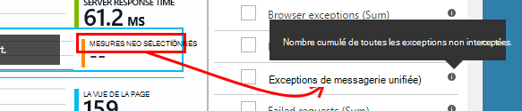
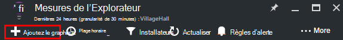

<properties 
    pageTitle="Exploration des mesures dans les perspectives d’Application | Microsoft Azure" 
    description="Comment interpréter les graphiques dans l’Explorateur de métriques et comment personnaliser les lames explorer métrique." 
    services="application-insights" 
    documentationCenter=""
    authors="alancameronwills" 
    manager="douge"/>

<tags 
    ms.service="application-insights" 
    ms.workload="tbd" 
    ms.tgt_pltfrm="ibiza" 
    ms.devlang="na" 
    ms.topic="article" 
    ms.date="10/15/2016" 
    ms.author="awills"/>
 
# Exploration des mesures dans les perspectives de l’Application

Mesures dans les [Perspectives d’Application] [ start] sont mesurées et le nombre d’événements qui sont envoyés dans la télémétrie à partir de votre application. Ils vous permettent de détecter les problèmes de performances et d’observer les tendances dans l’utilisation de votre application. Il existe un large éventail de mesures standard, et vous pouvez également créer vos propres mesures personnalisées et les événements.

Nombre de mesures et les événements est affiché dans les graphiques de valeurs agrégées telles que des sommes, des moyennes ou des nombres.

Voici un exemple de graphique :

Certains graphiques sont segmentés : la hauteur totale du graphique à tout moment est la somme des mesures affichées. La légende par défaut affiche les plus grandes quantités.

Lignes en pointillés affiche la valeur de la métrique d’une semaine auparavant.

## Plage horaire

Vous pouvez modifier la période couverte par les graphiques ou grilles sur des lames.

Si vous attendez des données qui n’a pas encore s’est affichée, cliquez sur Actualiser. Graphiques eux-mêmes Actualiser à intervalles, mais les intervalles sont plus longues pour les plages de temps plus grandes. En mode release, il peut prendre un certain temps pour les données à passer par le pipeline d’analyse sur un graphique.

Pour effectuer un zoom dans une partie d’un graphique, faites glisser dessus :

Cliquez sur le bouton Annuler de Zoom pour la restaurer.

## Valeurs Granularity et point

Faites glisser votre souris sur le graphique pour afficher les valeurs des mesures à ce stade.

La valeur de la mesure à un moment donné est agrégée pendant l’intervalle d’échantillonnage précédente. 

L’intervalle d’échantillonnage ou une « précision » est affichée en haut de la lame. 

Vous pouvez ajuster la granularité de la lame de plage de temps :

Les granularités disponibles varient selon la plage horaire que vous sélectionnez. Les granularités explicites sont des alternatives à la granularité « automatique » pour la plage de temps. 

## Mesures de l’Explorateur

Cliquez sur n’importe quel graphique sur la lame de vue d’ensemble pour afficher un jeu plus détaillé des grilles et des graphiques associés. Vous pouvez modifier les graphiques et les grilles pour vous concentrer sur les détails que qui vous intéressent.

Ou vous pouvez cliquez sur le bouton Explorateur de mesures dans la tête de la lame de vue d’ensemble.

Par exemple, cliquez sur graphique de demandes ayant échoué de l’application web :

## Que signifient les chiffres ?

La légende du côté par défaut affiche généralement la valeur d’agrégation sur la période du graphique. Si vous placez le curseur sur le graphique, il affiche la valeur à ce stade.

Chaque point de données sur le graphique est un agrégat des valeurs de données reçues dans le précédent intervalle d’échantillonnage ou de la « précision ». La granularité est indiquée en haut de la lame et varie en fonction de l’échelle de temps globale du graphique.

Les mesures peuvent être regroupés de différentes façons : 

 * **Somme** additionne les valeurs de tous les points de données reçues sur la période du graphique ou de l’intervalle d’échantillonnage.
 * **Moyenne** divise la somme par le nombre de points de données reçues sur l’intervalle.
 * Nombres de **unique** sont utilisés pour les comptes d’utilisateurs et de comptes. Sur l’intervalle d’échantillonnage, ou sur la période du graphique, le chiffre indique le nombre des différents utilisateurs dans ce laps de temps.

Vous pouvez modifier la méthode d’agrégation :

La méthode par défaut pour chaque mesure s’affiche lorsque vous créez un nouveau graphique ou lorsque toutes les mesures sont désactivées :

## Modification des graphiques et des grilles

Pour ajouter un nouveau graphique à la blade :

Sélectionnez **Modifier** un graphique existant ou nouveau à modifier ce qu’elle affiche :

Vous pouvez afficher plus d’une mesure dans un graphique, qu’il existe des restrictions sur les combinaisons qui peuvent être affichés ensemble. Dès que vous sélectionnez une mesure, certains des autres sont désactivés. 

Si vous avez codé [métrique personnalisée] [ track] dans votre application (appels à TrackMetric et TrackEvent) qu’ils sont répertoriés ici.

## Segmenter vos données

Vous pouvez fractionner une métrique par propriété - par exemple, pour comparer les vues de page sur des clients avec différents systèmes d’exploitation. 

Sélectionnez un graphique ou une grille, basculer sur regroupement, puis une propriété au groupe par :

> [AZURE.NOTE] Lorsque vous utilisez le regroupement, les types de zone et graphique à barres fournissent un affichage empilé. Cela convient dans laquelle la méthode d’agrégation est la somme. Mais dans le cas où le type d’agrégation est moyenne, choisir les types d’affichage de ligne ou de grille. 

Si vous avez codé [métrique personnalisée] [ track] dans votre application et ils incluent des valeurs de propriété, vous serez en mesure de sélectionner la propriété dans la liste.

Le graphique n’est trop petite pour les données segmentées ? Ajuster sa hauteur :

## Filtrer vos données

Pour afficher uniquement les mesures pour un ensemble de valeurs de propriété :

Si vous ne sélectionnez pas toutes les valeurs d’une propriété particulière, il est identique à la sélection de tous les : il n’existe aucun filtre sur cette propriété.

Notez le nombre d’événements à côté de chaque valeur de la propriété. Lorsque vous sélectionnez des valeurs d’une propriété, les nombres ainsi que d’autres valeurs de propriétés sont ajustées.

Les filtres s’appliquent à tous les graphiques sur une lame. Si vous souhaitez que différents filtres appliqués aux différents graphiques, créez et enregistrez des lames de différentes mesures. Si vous le souhaitez, vous pouvez ajouter des graphiques à partir de lames différentes au tableau de bord, afin que vous puissiez les voir à côté de l’autre.

### Suppression du trafic de test web et robots

Utiliser le filtre **le trafic réel ou synthétique** et **réel**.

Vous pouvez également filtrer par **Source de trafic synthétique**.

### Pour ajouter des propriétés à la liste de filtres

Vous souhaitez filtrer la télémétrie sur une catégorie de votre choix ? Par exemple, peut-être diviser vos utilisateurs en différentes catégories, et que vous souhaitez que vos données de segment par ces catégories.

[Créer votre propre propriété](app-insights-api-custom-events-metrics.md#properties). Définir dans un [Initialiseur de télémétrie](app-insights-api-custom-events-metrics.md#telemetry-initializers) pour le faire apparaître dans tous les télémétrie - y compris la télémétrie standard envoyée par les différents modules du Kit de développement logiciel.

## Modifier le type de graphique

Notez que vous pouvez basculer entre les grilles et les graphiques :

## Enregistrer la blade de mesures

Lorsque vous avez créé d’autres graphiques, les enregistrer en tant que favori. Vous pouvez choisir de le partager avec d’autres membres de l’équipe, si vous utilisez un compte d’organisation.

Pour voir la lame à nouveau, **passez à la lame de vue d’ensemble** et ouvrir Favoris :

Si vous avez choisi une période Relative lorsque vous avez enregistré, la lame sera mis à jour avec les dernières mesures. Si vous choisissez la plage de temps absolu, il affiche les mêmes données chaque fois.

## Réinitialisation de la lame

Si vous modifiez une lame mais puis vous souhaitez revenir à l’original enregistré le jeu, cliquez sur Réinitialiser.

## Flux direct de mesures : les mesures instantanées de surveillance étroite

Mesures de flux vous montre les mesures de votre application dès ce moment précis où, avec une latence de temps réel proche de 1 seconde. Cela est particulièrement utile lorsque vous êtes publie une nouvelle version et que vous souhaitez vous assurer que tout est travail comme prévu, ou l’examen d’un incident en temps réel.

Contrairement à Explorer de mesures, mesures de flux affiche un ensemble fixe de mesures. Les données persistent uniquement tant qu’il est sur le graphique et est ignorée. 

Mesures de flux est disponible avec le SDK de perspectives d’Application pour ASP.NET, version 2.1.0 ou version ultérieure.

## Définir des alertes

Pour être averti par courrier électronique les valeurs inhabituelles de toute mesure, ajouter une alerte. Vous pouvez choisir d’envoyer l’e-mail aux administrateurs de compte, ou pour les adresses de messagerie spécifiques.

[Pour en savoir plus sur les alertes][alerts].

## Exporter vers Excel

Vous pouvez exporter des données métriques qui s’affiche dans l’Explorateur de mesure vers un fichier Excel. Les données exportées contiennent des données de tous les graphiques et les tables, comme dans le portail. 

Les données pour chaque graphique ou un tableau sont exportées vers une feuille distincte dans le fichier Excel.

Ce que vous voyez est que doit être exportée. Modifier la période ou les filtres si vous souhaitez modifier la plage de données exportées. Pour les tables, si la commande **charger plus** s’affiche, vous pouvez cliquer dessus avant de cliquer sur l’exportation, pour d’autres données exportées.

*Exportation fonctionne uniquement pour Internet Explorer et de Chrome à l’heure actuelle. Nous travaillons sur l’ajout de la prise en charge pour d’autres navigateurs.*

## Exportation en continu

Si vous souhaitez que les données exportées en permanence de sorte que vous pouvez traiter en externe, envisagez d’utiliser [continu exporter](app-insights-export-telemetry.md).

### Alimentation BI

Si vous souhaitez que les vues enrichies de vos données, vous pouvez [exporter à alimentation BI](http://blogs.msdn.com/b/powerbi/archive/2015/11/04/explore-your-application-insights-data-with-power-bi.aspx).

## Analytique

[Analytique](app-insights-analytics.md) est un moyen plus souple pour analyser votre télémétrie à l’aide d’un langage de requête puissantes. Utilisez-le si vous souhaitez combiner ou calculer les résultats des mesures ou effectuer une exploration en-deph de performance récente de votre application. D’autre part, utilisez l’Explorateur métriques que si vous souhaitez que l’actualisation automatique, les graphiques sur le tableau de bord et les alertes.

## Résolution des problèmes

*Je ne vois pas toutes les données de mon graphique.*

* Les filtres s’appliquent à tous les graphiques de la lame. Assurez-vous que, alors que vous vous concentrez sur un graphique, vous n’avez pas un filtre qui exclut toutes les données sur un autre. 

    Si vous souhaitez définir différents filtres graphiques différents, de les créer dans les différentes blades, enregistrer les Favoris distincts. Si vous le souhaitez, vous pouvez les épingler au tableau de bord afin que vous puissiez les voir à côté de l’autre.

* Si vous regroupez un graphique par une propriété qui n’est pas définie sur la mesure, puis il y aura rien sur le graphique. Essayez de désactiver les « grouper par », ou cliquez sur une propriété de regroupement différents.
* Les données de performance (UC, les taux d’e/s et ainsi de suite) est disponible pour Java services web, Windows applications de bureau, [IIS web des applications et services si vous installez le moniteur d’état](app-insights-monitor-performance-live-website-now.md)et [Les Services en nuage Azure](app-insights-azure.md). Il n’est pas disponible pour les sites Web Azure.

## Étapes suivantes

* [Analyse de l’utilisation avec les perspectives de l’Application](app-insights-overview-usage.md)
* [À l’aide de la recherche de Diagnostic](app-insights-diagnostic-search.md)

<!--Link references-->

[alerts]: app-insights-alerts.md
[start]: app-insights-overview.md
[track]: app-insights-api-custom-events-metrics.md

 