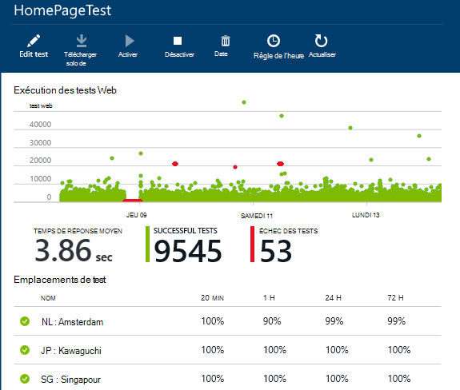
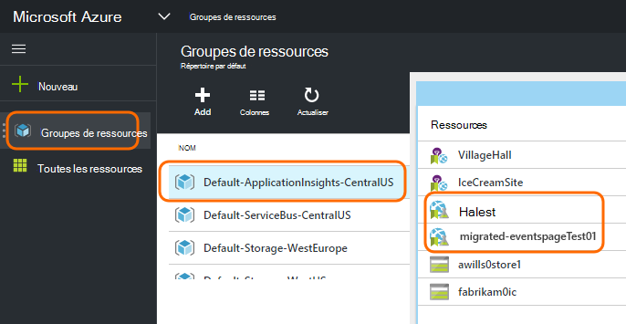
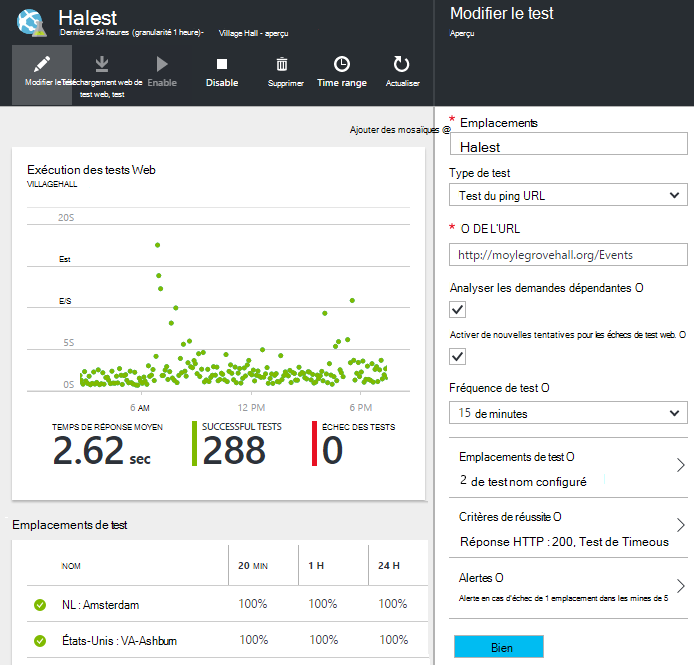

<properties 
    pageTitle="Migrer d’Azure point de terminaison d’Application perspectives sur les Tests de disponibilité" 
    description="Migrer des tests de contrôle de point de terminaison Azure classiques à Application vos tests de disponibilité par le 31 octobre 2016."
    services="application-insights" 
    documentationCenter=""
    authors="soubhagyadash" 
    manager="douge"/>

<tags 
    ms.service="application-insights" 
    ms.workload="tbd" 
    ms.tgt_pltfrm="ibiza" 
    ms.devlang="na" 
    ms.topic="article" 
    ms.date="07/25/2016" 
    ms.author="awills"/>
 
# Déplacement de la surveillance de point de terminaison Azure à Application perspectives sur les Tests de disponibilité

Vous utilisez [la surveillance de point de terminaison](https://blogs.msdn.microsoft.com/mast/2013/03/03/windows-azure-portal-update-configure-web-endpoint-status-monitoring-preview/) pour vos applications Azure ? En *date du 31 octobre 2016*, nous remplacerons par les [tests de disponibilité](app-insights-monitor-web-app-availability.md)nouveau et plus puissant. Nous avons déjà créé des tests nouveau, même si elles sont désactivées jusqu’au 31 octobre 2016. 

Vous pouvez modifier les nouveaux tests et faites-vous le commutateur si vous le souhaitez. Vous les trouverez [Azure portal](https://portal.azure.com) dans le groupe de ressources par défaut-ApplicationInsights-CentralUS.

## Quels sont les tests de disponibilité ?

Test de la disponibilité d’est une fonctionnalité d’Azure qui vérifie continuellement que n’importe quel site web ou le service est actif et en cours d’exécution en envoyant des requêtes HTTP (tests ping unique ou les tests de site web Visual Studio) à partir de jusqu'à 16 emplacements dans le monde entier. 

Dans le [portail d’Azure classique](https://manage.windowsazure.com), ces tests ont été appelés contrôle de point de terminaison. Ils ont une portée plus limitées. Les nouveaux tests de disponibilité sont une amélioration sensible :

* Jusqu'à 10 tests de site web Visual Studio ou les tests ping par ressource de perspectives de l’Application. 
* Jusqu'à 16 dans le monde à envoyer des requêtes de test pour votre application web. Meilleur contrôle des critères de réussite des tests. 
* Test de n’importe quel site ou service web - applications web pas simplement Azure.
* Tester de nouvelles tentatives : réduire les faux positifs des alertes en raison de problèmes de réseau temporaires. 
* Webhooks recevoir les notifications de HTTP POST pour les alertes.

Découvrez [ici les tests de disponibilité](app-insights-monitor-web-app-availability.md).

Les tests de disponibilité sont partie d' [Idées d’Application Visual Studio](app-insights-overview.md), qui est un service analytique extensible pour toute application web.

## Par conséquent, ce qui se passe à mon point de terminaison tests ?

* Nous avons copié votre point de terminaison des tests pour les nouveaux tests de perspectives sur la disponibilité des applications de surveillance.
* Les nouveaux tests de disponibilité sont actuellement désactivés, et les tests de point de terminaison anciens sont en cours d’exécution.
* Les alertes de règles n’ont *pas* été migrés. Les nouveaux tests ont initialement été définis avec une règle par défaut :
 * Se déclenche lorsque plus de 1 emplacement signale des défaillances dans les 5 minutes.
 * Envoie un e-mail aux administrateurs de l’abonnement.

Dans le [portail Azure](https://portal.azure.com), vous trouverez les tests migrés dans le groupe de ressources « Par défaut-ApplicationInsights-CentralUS ». Les noms de test portent le préfixe « Migrée- ». 

## Que dois-je faire ?

* Si nous avons manqué d’une certaine manière la migration de vos tests, les nouveaux tests de disponibilité sont [faciles à configurer](app-insights-monitor-web-app-availability.md).

### Option A: faire rien. Laisser nous.

**Sur le 31 octobre 2016,** nous allons :

* Désactiver les tests de point de terminaison ancien.
* Activer les tests de disponibilité migrés.

### Option b : vous gérer et/ou activer les nouveaux tests.

* Vérifiez et modifiez les nouveaux tests de disponibilité dans le nouveau [portail Azure](https://portal.azure.com). 
 * Passez en revue les critères du déclencheur
 * Passez en revue les destinataires de l’e-mail
* Activer les nouveaux tests
* Permet de désactiver le point de terminaison hérité surveillance des tests sur le 31 octobre 2016 

### Option C: son droit de refus

Si vous ne souhaitez pas utiliser les tests de disponibilité, vous pouvez les supprimer dans [Azure portal](https://portal.azure.com). Il existe également un lien de désinscription au bas des e-mails de notification.

Nous supprimons toujours l’ancien tests point de terminaison sur le 31 octobre 2016. 

## Comment pour modifier les nouveaux tests ?

Connectez-vous au [portail Azure](https://portal.azure.com) et rechercher les tests web migrée : 

Modifier ou activer le test :

## Que se passe-t-il ?

Améliorer le service. L’ancien service de point de terminaison a été nettement plus étroite. Vous pouvez fournir les deux URL pour les tests ping simple à partir de 3 emplacements geo une application Azure VM ou web. Les nouveaux tests peuvent exécuter des tests web de plusieurs étapes de jusqu'à 16 emplacements, et vous pouvez spécifier jusqu'à 10 tests pour une application. Vous pouvez tester n’importe quelle URL - il ne doit pas être un site Azure.

Les nouveaux tests sont configurés séparément à partir du web app ou la machine virtuelle que vous êtes en train de tester. 

Nous effectuons la migration les tests pour vous de continuer à contrôler les lors de l’utilisation du nouveau portail. 

## Ce qui est des idées d’Application ?

Les nouveaux tests de disponibilité font partie des [Perspectives d’Application Visual Studio](app-insights-overview.md). Voici une [vidéo de 2 minutes](http://go.microsoft.com/fwlink/?LinkID=733921).

## Je paie pour les nouveaux tests ?

Les essais de migration sont définies dans une ressource d’Application idées dans le plan de libre par défaut. Cela permet la collecte jusqu'à 5 millions de points de données. Qui couvre facilement vos tests utilise actuellement le volume de données. 

Bien entendu, si vous perspectives d’Application et créez des tests de disponibilité plus ou adopter plus de son analyse des performances et les fonctionnalités de diagnostic, vous allez générer davantage de points de données.  Toutefois, le résultat ne serait que vous pourriez atteindre le quota pour le régime de libre. Vous ne recevrez pas une facture, sauf si vous choisissez cette option pour les plans Standard ou Premium. 

[En savoir plus sur la tarification des perspectives d’Application et de contrôle du quota](app-insights-pricing.md). 

## Ce qu’est et n’est pas migré ?

Conservées à partir de votre ancien tests de point de terminaison :

* URL du point de terminaison doit être testée.
* Emplacement géographique à partir de laquelle les demandes sont envoyées.
* Fréquence de test reste 5 minutes.
* Délai d’attente de test reste 30 secondes. 

Pas de migration :

* Règle de déclenchement d’alerte. La règle que nous avons défini des déclencheurs lors de le 1 emplacement signale des défaillances dans les 5 minutes.
* Destinataires de l’alerte. Vous recevrez des e-mails de notification pour les propriétaires d’abonnements et de copropriétaires. 

## Comment pour trouver les nouveaux tests ?

Vous pouvez modifier un des nouveaux tests maintenant si vous le souhaitez. Connectez-vous au [portail Azure](https://portal.azure.com), ouvrir des **Groupes de ressources** et sélectionner **Par défaut-ApplicationInsights-CentralUS**. Dans ce groupe, vous trouverez les nouveaux tests web. [En savoir plus sur les nouveaux tests de disponibilité](app-insights-monitor-web-app-availability.md).

Veuillez noter que les nouveaux messages d’alerte seront envoyés à partir de cette adresse : alertes de perspectives d’application(ai-noreply@microsoft.com)

## Que se passe-t-il si je ne fais rien ?

Option A s’applique. Nous activer les tests de migration et définir les règles d’alerte par défaut comme indiqué ci-dessus. Vous devez ajouter des règles d’alerte personnalisés, destinataires comme indiqué ci-dessus. Nous permet de désactiver le point de terminaison hérité des tests de surveillance. 

## Où puis-je fournir des commentaires sur ce ? 

Nous vous remercions pour vos commentaires. Veuillez [nous envoyer un e-mail](mailto:vsai@microsoft.com). 

