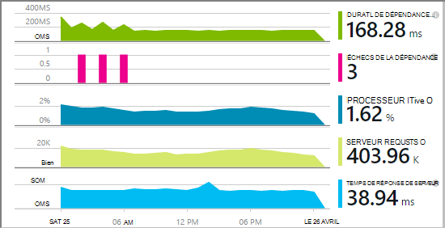
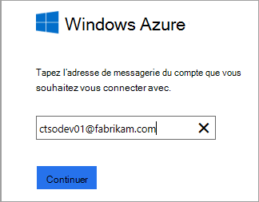
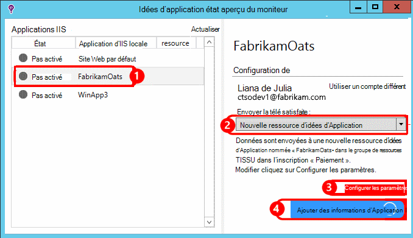
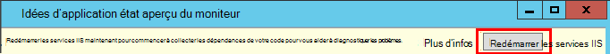
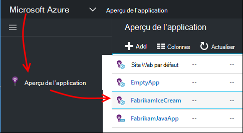
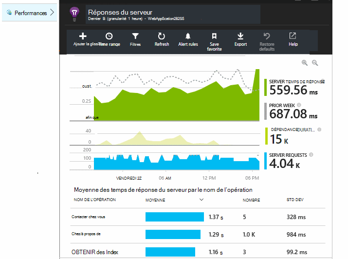
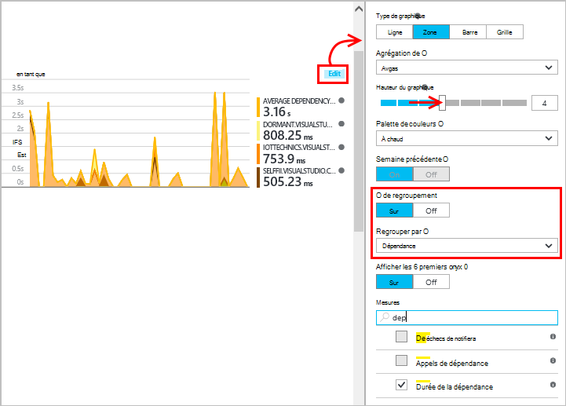
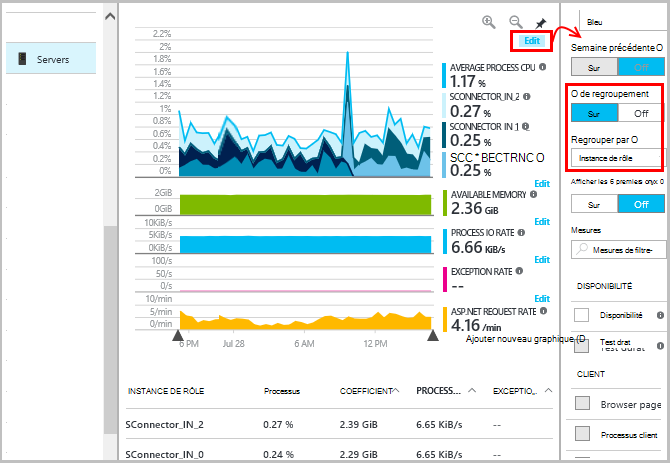
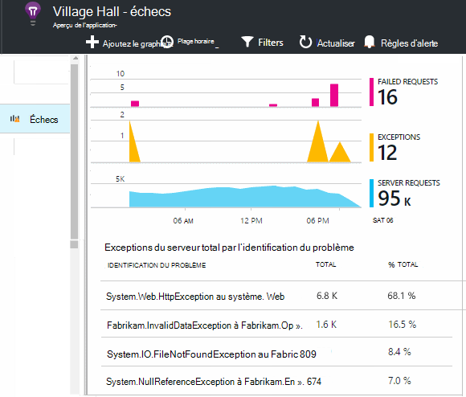
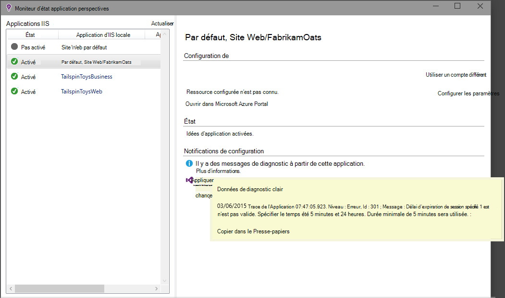

<properties
    pageTitle="Diagnostiquer les problèmes de performances sur un site Web d’IIS en cours d’exécution | Microsoft Azure"
    description="Surveiller les performances d’un site Web sans redéployer sur elle. Utilisez autonome ou avec le Kit de développement logiciel pour obtenir de télémétrie de dépendance perspectives sur Application."
    services="application-insights"
    documentationCenter=".net"
    authors="alancameronwills"
    manager="douge"/>

<tags
    ms.service="application-insights"
    ms.workload="tbd"
    ms.tgt_pltfrm="ibiza"
    ms.devlang="na"
    ms.topic="get-started-article"
    ms.date="10/24/2016"
    ms.author="awills"/>

# Applications web instrument lors de l’exécution avec les perspectives de l’Application

*Idées d’application est en mode Aperçu.*

Vous pouvez instrumenter une application web en direct avec Visual Studio Insights d’Application, sans avoir à modifier ou à redéployer votre code. Dans vos applications sont hébergées par un serveur IIS local, vous installez le moniteur d’état ; ou bien, si ils sont applications Azure web ou que vous exécutent dans un ordinateur virtuel d’Azure, vous pouvez installer l’extension de l’Application aperçu. (Il existe également des articles distincts sur l’instrumentation [live J2EE web applications](app-insights-java-live.md) et [Services en nuage Azure](app-insights-cloudservices.md).)

Vous avez le choix entre trois routes à appliquer les conseils d’Application à vos applications web de .NET :

* **Heure de création :** [Ajouter les perspectives d’Application SDK] [greenbrown] pour le code de votre application web. 
* **Moment de l’exécution :** Instrumenter votre application web sur le serveur, comme décrit ci-dessous, sans régénérer et redéployer le code.
* **à la fois :** Le Kit de développement de build dans votre code d’application web et également appliquer les extensions lors de l’exécution. Obtenir le meilleur de ces deux options. 

Voici un résumé de ce que vous obtenez par chaque itinéraire :

||Heure de création|Moment de l’exécution|
|---|---|---|
|Requêtes et exceptions|Oui|Oui|
|[Plus d’exceptions](app-insights-asp-net-exceptions.md)||Oui|
|[Diagnostics de dépendance](app-insights-asp-net-dependencies.md)|Sur .NET 4.6 +|Oui|
|[Compteurs de performance système](app-insights-performance-counters.md)||IIS ou Azure cloud service pas Azure web app|
|[API de télémétrie personnalisé][api]|Oui||
|[Integration de journal de suivi](app-insights-asp-net-trace-logs.md)|Oui||
|[Données de la page Afficher & utilisateur](app-insights-javascript.md)|Oui||
|Inutile de régénérer le code|N°||

## Instrumenter votre application web au moment de l’exécution

Vous avez besoin d’un abonnement [Microsoft Azure](http://azure.com) .

### Si votre application est une application Azure web ou un Service en nuage

* Sélectionner les perspectives d’Application sur le panneau de configuration de l’application dans Azure. 

    [En savoir plus](app-insights-azure.md).

### Si votre application est hébergée sur le serveur IIS

1. Sur votre serveur web IIS, connectez-vous avec les informations d’identification d’administrateur.
2. Téléchargez et exécutez [programme d’installation de l’Analyseur de l’état](http://go.microsoft.com/fwlink/?LinkId=506648).
4. Dans l’Assistant d’installation, vous connecter à Microsoft Azure.

    

    *Erreurs de connexion ? Consultez [résolution des problèmes](#troubleshooting).*

5. Choisissez l’application web installés ou un site Web que vous souhaitez surveiller, puis configurez la ressource dans laquelle vous souhaitez afficher les résultats dans le portail de perspectives de l’Application.

    

    En règle générale, vous choisissez de configurer une nouvelle ressource et le [groupe de ressources][roles].

    Sinon, utilisez une ressource existante si vous déjà configuré des [tests web] [ availability] pour votre site, ou la [Surveillance du client web][client].

6. Redémarrer les services IIS.

    

    Votre service web est interrompu pendant un court moment.

6. Notez que ApplicationInsights.config a été inséré dans les applications web que vous souhaitez surveiller.

    

   Il existe également quelques modifications au fichier web.config.

#### Vous souhaitez configurer ultérieurement (re) ?

Après avoir terminé l’Assistant, vous pouvez reconfigurer l’agent chaque fois que vous le souhaitez. Vous pouvez également utiliser si vous avez installé l’agent, mais il y a des difficultés avec la configuration initiale.

## Affichage performances télémétrie

Vous connecter [au](https://portal.azure.com)portail Azure, parcourir les perspectives de l’Application et ouvrez la ressource que vous avez créé.

Ouvrez la lame de performances pour afficher la demande, le temps de réponse, dépendances et autres données.

Cliquez sur n’importe quel graphique pour ouvrir une vue plus détaillée.

Vous pouvez [modifier, réorganiser, enregistrez](app-insights-metrics-explorer.md), et ajouter des graphiques ou la lame entier à un [tableau de bord](app-insights-dashboards.md).

## Dépendances

Le graphique de dépendance durée indique le temps pris par les appels à partir de votre application à des composants externes tels que les bases de données, les API reste ou stockage blob Azure.

Pour segmenter le graphique par les appels de dépendances différentes : modifier le graphique et activer le regroupement puis regrouper par dépendance, Type de dépendance ou des performances de dépendance.

## Compteurs de performance 

(Pas pour les applications web Azure.) Cliquez sur serveurs sur la lame de vue d’ensemble pour voir des graphiques de compteurs de performance de serveur telles que l’utilisation mémoire et d’occupation du processeur.

Si vous avez plusieurs instances de serveur, vous pouvez souhaiter modifier les graphiques pour regrouper par instance de rôle.

Vous pouvez également [Modifier l’ensemble de compteurs de performance qui sont signalés par le SDK](app-insights-configuration-with-applicationinsights-config.md#nuget-package-3). 

## Exceptions

Vous pouvez consulter les exceptions spécifiques (au cours des sept derniers jours) et obtenir des traces de la pile et les données de contexte.

## Échantillonnage

Si votre application envoie un lot de données et que vous utilisez le Kit de développement du perspectives d’Application pour ASP.NET version 2.0.0-beta3 ou version ultérieure, la fonctionnalité d’échantillonnage adapté peut fonctionner et envoyer uniquement un pourcentage de votre télémétrie. [Pour en savoir plus sur l’échantillonnage.](app-insights-sampling.md)

## Résolution des problèmes

### Erreurs de connexion

Vous devez ouvrir [certains ports sortants](app-insights-ip-addresses.md#outgoing-ports) dans le pare-feu de votre serveur pour permettre l’écran d’état de fonctionner.

### Aucun télémétrie ?

  * Votre site, permet de générer des données.
  * Attendez quelques minutes pour laisser les données arrivent, puis cliquez sur **Actualiser**.
  * Ouvrez recherche Diagnostic (la mosaïque de recherche) pour consulter des événements particuliers. Les événements sont souvent visibles dans la recherche de Diagnostic avant d’agréger des données s’affiche dans les graphiques.
  * Ouvrir le moniteur d’état et sélectionnez votre application dans le volet de gauche. Vérifiez s’il existe des messages de diagnostic pour cette application dans la section « notifications Configuration » :

  

  * Assurez-vous que votre pare-feu de serveur autorise le trafic sortant sur les ports répertoriés ci-dessus.
  * Sur le serveur, si vous voyez un message sur les « autorisations insuffisantes », essayez ce qui suit :
    * Dans le Gestionnaire des services Internet, sélectionnez le pool d’applications, ouvrir les **Paramètres avancés**et sous **Modèle de processus** , notez l’identité.
    * Dans le panneau de configuration ordinateur gestion, ajoutez cette identité au groupe utilisateurs du moniteur de performances.
  * Si vous avez installé sur votre serveur MMA/SCOM, certaines versions peuvent entrer en conflit. Désinstallez SCOM et moniteur d’état et ré-installer les versions les plus récentes.
  * Voir [Dépannage de le][qna].

## Configuration système requise

Prise en charge du système d’exploitation pour moniteur d’état Application perspectives sur serveur :

- Windows Server 2008
- Windows Server 2008 R2
- Windows Server 2012
- Serveur Windows 2012 R2

avec les derniers Service Pack et.NET Framework 4.0 et 4.5

Sur le client Windows 7, 8 et 8.1, à l’aide de.NET Framework 4.0 et 4.5

Prise en charge de IIS : IIS 7, 7.5, 8, 8.5 (IIS est requis)

## Automatisation PowerShell

Vous pouvez démarrer et arrêter la surveillance de votre serveur IIS à l’aide de PowerShell.

Tout d’abord importer le module d’idées d’Application :

`Import-Module 'C:\Program Files\Microsoft Application Insights\Status Monitor\PowerShell\Microsoft.Diagnostics.Agent.StatusMonitor.PowerShell.dll'`

Découvrez comment les applications sont en cours d’analyse :

`Get-ApplicationInsightsMonitoringStatus [-Name appName]`

* `-Name`(Facultatif) Le nom d’une application web.
* Affiche l’Application perspectives sur la surveillance de l’état pour chaque application web (ou l’application nommée) sur ce serveur IIS.

* Cette propriété renvoie `ApplicationInsightsApplication` pour chaque application :
 * `SdkState==EnabledAfterDeployment`: App est en cours d’analyse et qu’il a été instrumenté au moment de l’exécution, l’outil de surveillance de l’état, ou en `Start-ApplicationInsightsMonitoring`.
 * `SdkState==Disabled`: L’application n’est pas instrumentée pour les perspectives de l’Application. Il n’a jamais été instrumenté, soit lors de l’exécution de surveillance a été désactivée avec l’outil d’analyse de l’état ou `Stop-ApplicationInsightsMonitoring`.
 * `SdkState==EnabledByCodeInstrumentation`: L’application a été instrumentée en ajoutant le Kit de développement du code source. Le Kit de développement logiciel ne peut pas être mis à jour ou arrêté.
 * `SdkVersion`Affiche la version en cours d’utilisation pour la surveillance de cette application.
 * `LatestAvailableSdkVersion`Affiche la version actuellement disponible sur la galerie NuGet. Pour l’application de mise à niveau vers cette version, utilisez `Update-ApplicationInsightsMonitoring`.

`Start-ApplicationInsightsMonitoring -Name appName -InstrumentationKey 00000000-000-000-000-0000000`

* `-Name`Le nom de l’application dans IIS
* `-InstrumentationKey`L’ikey de la ressource d’idées d’Application où vous voulez les résultats à afficher.

* Cette applet de commande affecte uniquement les applications qui ne sont pas déjà instrumentées - c'est-à-dire SdkState == NotInstrumented.

    L’applet de commande n’affecte pas une application qui est déjà instrumentée, au moment de la génération en ajoutant le Kit de développement logiciel pour le code, soit au moment de l’exécution par l’utilisation antérieure de cette applet de commande.

    La version du Kit de développement logiciel utilisée pour l’instrumentation de l’application est la version qui a été téléchargée le plus récemment à ce serveur.

    Pour télécharger la version la plus récente, utilisez ApplicationInsightsVersion à la mise à jour.

* Cette propriété renvoie `ApplicationInsightsApplication` en cas de réussite. En cas d’échec, il enregistre une trace dans stderr.

    
          Name                      : Default Web Site/WebApp1
          InstrumentationKey        : 00000000-0000-0000-0000-000000000000
          ProfilerState             : ApplicationInsights
          SdkState                  : EnabledAfterDeployment
          SdkVersion                : 1.2.1
          LatestAvailableSdkVersion : 1.2.3

`Stop-ApplicationInsightsMonitoring [-Name appName | -All]`

* `-Name`Le nom d’une application dans IIS
* `-All`Arrête la surveillance de toutes les applications sur ce serveur IIS pour lequel`SdkState==EnabledAfterDeployment`

* Arrête l’analyse des applications spécifiées et supprime l’instrumentation. Il ne fonctionne que pour les applications qui ont été instrumentées au moment de l’exécution à l’aide de l’outil de surveillance de l’état ou d’un début-ApplicationInsightsApplication. (`SdkState==EnabledAfterDeployment`)

* Cette propriété renvoie ApplicationInsightsApplication.

`Update-ApplicationInsightsMonitoring -Name appName [-InstrumentationKey "0000000-0000-000-000-0000"`]

* `-Name`: Le nom d’une application web dans IIS.
* `-InstrumentationKey`(Facultatif). Utilisez cette option pour modifier la ressource à laquelle la télémétrie de l’application est envoyée.
* Cette applet de commande :
 * Mises à niveau de l’application nommée à la version du Kit de développement téléchargée le plus récemment sur cet ordinateur. (Ne fonctionne que si `SdkState==EnabledAfterDeployment`)
 * Si vous fournissez une clé de l’instrumentation, l’application nommée est reconfigurée pour envoyer de télémétrie pour la ressource avec cette clé. (Fonctionne si `SdkState != Disabled`)

`Update-ApplicationInsightsVersion`

* Télécharge la dernière version du SDK de perspectives de Application sur le serveur.

## Étapes suivantes

* [Créer des tests web] [ availability] pour vous assurer que votre site reste actif.
* [Rechercher des événements et les journaux] [ diagnostic] pour aider à diagnostiquer les problèmes.
* [Ajouter de télémétrie de client web] [ usage] pour voir les exceptions à partir de code de page web et vous permettent d’insérer les appels de suivi.
* [Ajouter l’Application SDK de perspectives à votre code de service web] [ greenbrown] afin que vous pouvez insérer la trace et le journal des appels dans le code serveur.

<!--Link references-->

[api]: app-insights-api-custom-events-metrics.md
[availability]: app-insights-monitor-web-app-availability.md
[client]: app-insights-javascript.md
[diagnostic]: app-insights-diagnostic-search.md
[greenbrown]: app-insights-asp-net.md
[qna]: app-insights-troubleshoot-faq.md
[roles]: app-insights-resources-roles-access-control.md
[usage]: app-insights-web-track-usage.md
