<properties
    pageTitle="Surveiller la disponibilité et la réactivité de n’importe quel site web | Microsoft Azure"
    description="Définir des tests web dans l’Application aperçu. Recevoir des alertes si un site Web n’est pas disponible ou qu’il répond lentement."
    services="application-insights"
    documentationCenter=""
    authors="alancameronwills"
    manager="douge"/>

<tags
    ms.service="application-insights"
    ms.workload="tbd"
    ms.tgt_pltfrm="ibiza"
    ms.devlang="na"
    ms.topic="get-started-article"
    ms.date="09/07/2016"
    ms.author="awills"/>

# Surveiller la disponibilité et la réactivité d’un site web

Une fois que vous avez déployé votre application web ou un site web sur un serveur, vous pouvez définir des tests web pour surveiller la disponibilité et la réactivité. [Idées d’Application Visual Studio](app-insights-overview.md) envoie des requêtes web à votre application à des intervalles réguliers à partir de points dans le monde entier. Il vous avertit si votre application ne répond pas ou répond lentement.

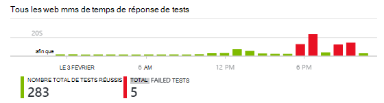

Vous pouvez définir des tests web pour n’importe quel point de terminaison HTTP ou HTTPS est accessible à partir de l’internet public.

Il existe deux types de test web :

* [Ping de l’URL de test](#create): un test simple que vous pouvez créer dans le portail Azure.
* [Test web de plusieurs étapes](#multi-step-web-tests): que vous créez dans Visual Studio Ultimate ou entreprise de Visual Studio et le télécharger dans le portail.

Vous pouvez créer jusqu'à 10 tests web par la ressource d’application.

## 1. création d’une ressource pour vos rapports de test

Ignorez cette étape si vous avez déjà [configuré une ressource d’informations d’Application] [ start] pour cette application et que vous souhaitez voir les rapports de disponibilité au même endroit.

S’inscrire à [Microsoft Azure](http://azure.com), accédez au [portail Azure](https://portal.azure.com)et créer une ressource d’informations d’Application.

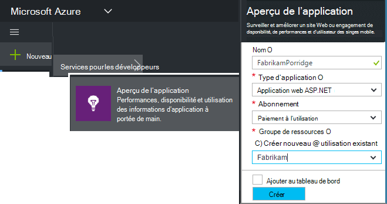

Cliquez sur **toutes les ressources** pour ouvrir la lame de vue d’ensemble de la nouvelle ressource.

## 2. création d’un test ping de URL

Dans votre ressource de perspectives de l’Application, recherchez la mosaïque de disponibilité. Cliquez sur ce bouton pour ouvrir la lame de tests Web pour votre application et ajouter un test web.

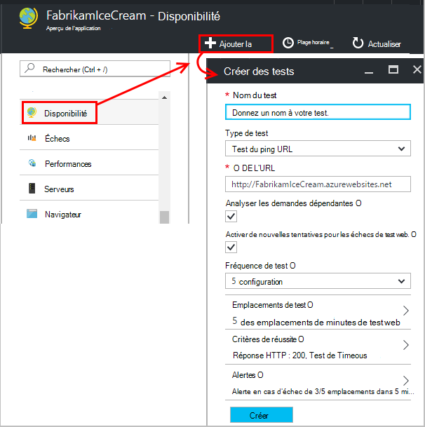

- **L’URL** doit être visible à partir de l’internet public. Il peut inclure une chaîne de requête & #151 ; ainsi, par exemple, vous pouvez exercer votre base de données un peu. Si l’URL correspond à une redirection, nous faire suivre jusqu'à 10 redirections.
- **Analyser les demandes dépendantes**: Images, scripts, fichiers de style et autres ressources de la page sont demandés dans le cadre de l’essai, et le temps de réponse enregistrées inclut ces heures. Le test échoue si toutes ces ressources ne peuvent pas être téléchargés avec succès dans le délai imparti pour l’ensemble de l’essai.
- **Activer de nouvelles tentatives**: lorsque le test échoue, elle est relancée après un court intervalle. Une erreur est signalée uniquement si les trois tentatives successives échouent. Les tests suivants sont alors effectuées à la fréquence de test habituel. Nouvelle tentative est temporairement suspendue jusqu'à la réussite suivante. Cette règle est appliquée indépendamment à chaque emplacement de test. (Nous vous recommandons de ce paramètre. En moyenne, environ 80 % des défaillances disparaissent sur Réessayer.)
- **Fréquence de test**: définit la fréquence à laquelle le test est exécuté à partir de l’emplacement de chaque test. Avec une fréquence de cinq minutes et le test de cinq emplacements, votre site est testé en moyenne toutes les minutes.
- **Emplacements de test** sont les endroits d’où nos serveurs envoient les demandes web vers l’URL. Choisissez plusieurs options afin que vous pouvez distinguer les problèmes de votre site Web à partir de problèmes de réseau. Vous pouvez sélectionner jusqu'à 16 emplacements.

- **Critères de réussite**:

    **Délai d’attente de test**: diminuez cette valeur pour être averti des réponses lentes. Le test est considérée comme un échec si les réponses à partir de votre site n’ont pas été reçus au cours de cette période. Si vous avez choisi d' **analyser les demandes dépendantes**, puis toutes les images, les fichiers de style, scripts et autres ressources dépendantes doivent ont été reçues pendant cette période.

    **Réponse HTTP**: le code d’état retourné est considérée comme un succès. 200 est le code qui indique qu’une page web normale a été retourné.

    **Contenu correspond à**: une chaîne, comme « Bienvenue ! » Nous testons qu’il se produit dans chaque réponse. Il doit être une chaîne simple, sans les caractères génériques. N’oubliez pas que si les modifications de contenu de page que vous deviez mettre à jour.

- **Les alertes** sont, par défaut, envoyé si sont en panne dans trois emplacements plus de cinq minutes. Une défaillance dans un seul emplacement est probablement un problème de réseau et pas d’un problème avec votre site. Vous pouvez modifier le seuil afin d’être plus ou moins sensibles, mais vous pouvez également modifier qui doivent recevoir les e-mails.

    Vous pouvez définir un [webhook](../monitoring-and-diagnostics/insights-webhooks-alerts.md) qui est appelée lorsqu’une alerte est déclenchée. (Mais notez que, à l’heure actuelle, les paramètres de requête ne sont pas passés en tant que propriétés.)

### URL plus du test

Ajouter plus de tests. Pour exemple, ainsi que tester votre page d’accueil, il se peut que vous pouvez vous assurer que votre base de données est en cours d’exécution en testant l’URL pour une recherche.

## 3. consultez votre site web les résultats des tests

Après 1 à 2 minutes, les résultats s’affichent dans la lame de Test Web.

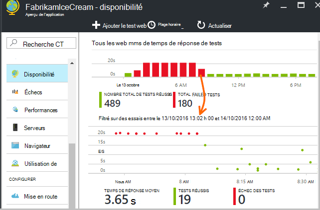

Cliquez sur une barre dans le graphique de synthèse pour un affichage plus détaillé de cette période.

Ces graphiques combinent les résultats de tous les tests web de cette application.

## Si vous constatez des échecs

Cliquez sur un point rouge.

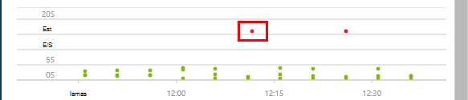

Ou, faites défiler vers le bas et cliquez sur un test dans lequel vous consultez inférieur à une réussite de 100 %.

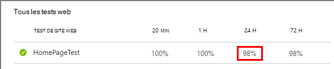

Les résultats de ce test à ouvrir.

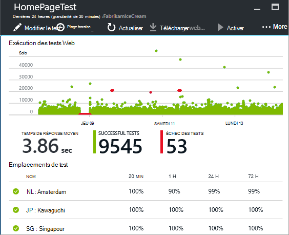

Le test est exécuté à partir de plusieurs emplacements & #151 ; un prélèvement lorsque les résultats sont moins de 100 %.

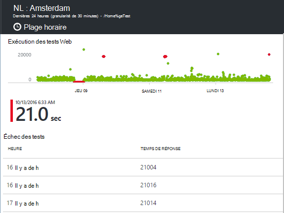

Faites défiler jusqu'à **l’Échec des tests** et choisissez un résultat.

Cliquez sur le résultat pour l’évaluer dans le portail et voir pourquoi il a échoué.

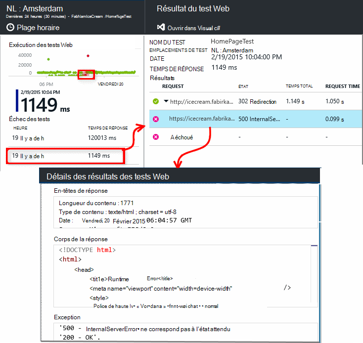

Vous pouvez également télécharger le fichier de résultat et l’inspecter dans Visual Studio.

*Recherche OK mais signalée comme un échec ?* Vérifiez toutes les images, les scripts, les feuilles de style, et tous les autres fichiers chargement par la page. Si un d’eux échoue, le test est signalé comme ayant échoué, même si la page html principale charge OK.

## Tests web de plusieurs étapes

Vous pouvez surveiller un scénario qui implique une séquence d’URL. Par exemple, si vous analysez un site Web de vente, vous pouvez tester que l’ajout d’articles à l’achat panier fonctionne correctement.

Pour créer un test à plusieurs étapes, vous enregistrez le scénario à l’aide de Visual Studio et puis à télécharger l’enregistrement aux analyses de l’Application. Idées d’application relit le scénario à intervalles et vérifie les réponses.

Notez que vous ne pouvez pas utiliser codée en fonctions de vos tests : les étapes du scénario doivent figurer sous la forme d’un script dans le fichier .webtest.

#### 1. enregistrer un scénario

Utilisez Visual Studio entreprise ou Édition intégrale pour enregistrer une session web.

1. Créez un projet de test de performances web.

    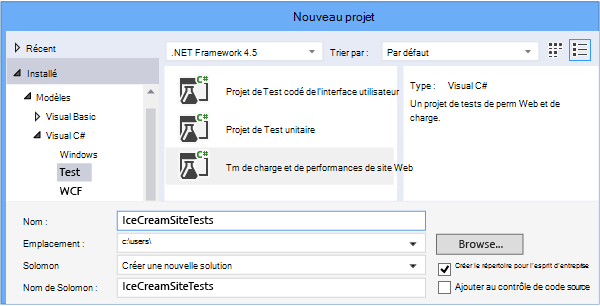

2. Ouvrez le fichier .webtest et commencer l’enregistrement.

    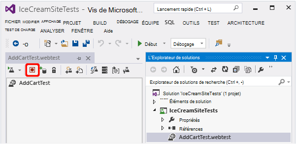

3. Effectuer les actions d’utilisateur que vous souhaitez simuler dans votre test : Ouvrez votre site Web, ajouter un produit au panier d’achat et ainsi de suite. Puis arrêtez votre test.

    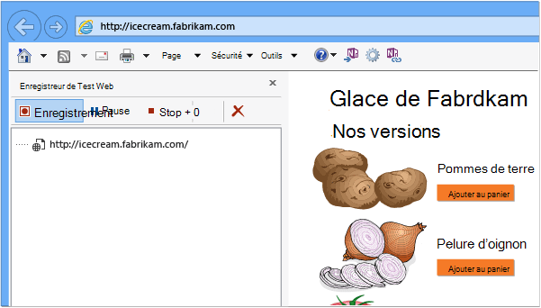

    Ne faites pas un scénario de long. Il existe une limite de 100 étapes et 2 minutes.

4. Modifier le test :
 - Ajouter des validations pour vérifier les codes de texte et de la réponse reçues.
 - Supprimer toute interaction superflue. Vous pouvez également supprimer les demandes dépendantes pour les images ou à la publicité ou le suivi des sites.

    Gardez à l’esprit que vous ne pouvez modifier le script de test, vous ne pouvez pas ajouter du code personnalisé ou appeler d’autres tests web. Ne pas insérer des boucles dans le test. Vous pouvez utiliser des plug-ins de test web standard.

5. Exécutez le test dans Visual Studio afin de vous assurer qu’il fonctionne.

    Test runner web ouvre un navigateur web et répète les actions enregistrées. Assurez-vous qu’il fonctionne comme prévu.

    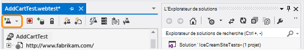

#### 2. Téléchargez le test web aux analyses de l’Application

1. Dans le portail de perspectives de l’Application, créez un test web.

    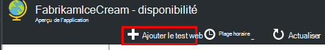

2. Sélectionnez les tests à plusieurs étapes et de télécharger le fichier .webtest.

    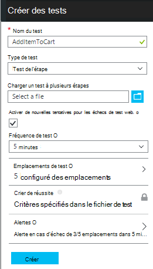

    Définir des emplacements de test, la fréquence et les paramètres d’alerte de la même façon que pour des tests ping.

Permet d’afficher les résultats des tests et les erreurs éventuelles de la même manière que pour les tests d’url unique.

Une raison courante de l’échec est que le test s’exécute trop long. Il ne s’exécute plu de deux minutes.

N’oubliez pas que toutes les ressources d’une page doivent charger correctement pour le test réussisse, y compris les scripts, feuilles de style, images et ainsi de suite.

Notez que le test web doit être entièrement contenu dans le fichier .webtest : vous ne pouvez pas utiliser les fonctions codées dans le test.

### Branchement des numéros aléatoires et l’heure dans votre test à plusieurs étapes

Supposons que vous testiez un outil qui extrait des données de temps tels que des actions à partir d’une alimentation externe. Lorsque vous enregistrez votre test web, vous devez utiliser des heures spécifiques, mais vous les définir en tant que paramètres de l’essai, StartTime et EndTime.

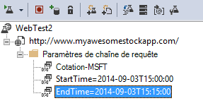

Lorsque vous exécutez le test, vous souhaitez que l’heure de fin toujours à l’heure actuelle, et StartTime doit être de 15 minutes auparavant.

Plug-ins de Test Web vous permettent de paramétrer les heures.

1. Ajoutez un test web plug-in pour chaque valeur de paramètre de variable que vous souhaitez. Dans la barre d’outils de test web, sélectionnez **Ajouter un plug-in de Test Web**.

    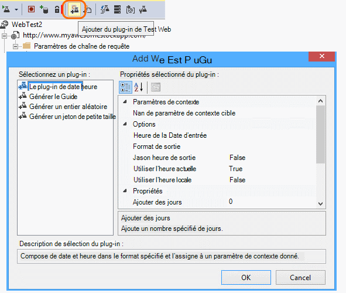

    Dans cet exemple, nous utilisons deux instances du plug-in de Date heure. Une instance est pour « il y a 15 minutes » et l’autre pour « maintenant ».

2. Ouvrez les propriétés de chaque plug-in. Donnez-lui un nom et les configurer pour utiliser l’heure actuelle. Pour l’un des, définissez Minutes ajouter = -15.

    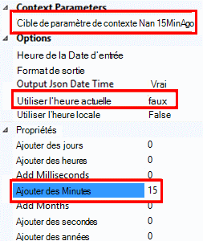

3. Tester les paramètres du site Web, utilisez {{nom du plug-in}} pour faire référence à un nom de plug-in.

    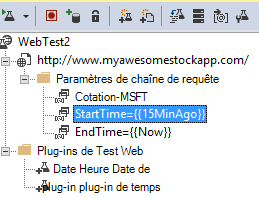

À présent, télécharger votre test sur le portail. Il utilise les valeurs dynamiques à chaque exécution du test.

## Traitement de connexion

Si vos utilisateurs se connecter à votre application, vous disposez de différentes options de simulation d’ouverture de session afin que vous puissiez tester les pages derrière le signe de. L’approche que vous utilisez dépend du type de sécurité fourni par l’application.

Dans tous les cas, vous devez créer un compte dans votre application afin de tester. Si possible, limitez les autorisations de ce compte de test afin qu’il n’y a aucune possibilité des tests web qui affectent les utilisateurs réels.

### Simple nom d’utilisateur et le mot de passe

Enregistrer un test web de la manière habituelle. Supprimez d’abord les cookies.

### Authentification SAML

Utilisez le plug-in SAML qui est disponible pour les tests web.

### Secret des clients

Si votre application dispose d’un itinéraire de connexion qui implique un secret client, utiliser cet itinéraire. Azure Active Directory (DAS) est un exemple d’un service qui fournit un client secrète sign-in. Le secret du client DAS, est la clé de l’application.

Voici un test web sur une application web Azure à l’aide d’une clé d’application :

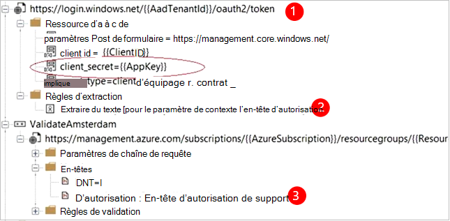

1. Obtenir le jeton de DAS à l’aide de secret du client (AppKey).
2. Extrait le jeton de porteur de réponse.
3. Appeler des API à l’aide du jeton de support dans l’en-tête d’autorisation.

Assurez-vous que le test web est un cas client réel, autrement dit, il a sa propre application de DAS - et utiliser ses clientId + l’appkey. Votre service testé a également sa propre application de DAS : l’identificateur URI de cette application est répercutée dans le test web dans le champ « ressource ».

### Authentification ouverte

Un exemple d’authentification ouverte est connecter avec votre compte Microsoft ou Google. Beaucoup d’applications qui utilisent OAuth fournit le client secrète alternative, votre première stratégie doit donc à étudier cette éventualité.

Si votre test doit se connecter à l’aide de OAuth, l’approche générale est la suivante :

 * Utilisez un outil tel que Fiddler d’examiner le trafic entre votre navigateur web, le site de l’authentification et votre application.
 * Effectuer deux ou plusieurs connexions à l’aide de machines différentes ou des navigateurs ou à des intervalles de temps (afin que les jetons d’expiration).
 * En comparant les différentes sessions, identifier le jeton passé à partir du site d’authentification, qui est ensuite transmis à votre serveur d’application après la connexion.
 * Enregistrez un test web à l’aide de Visual Studio.
 * Paramétrer les jetons, en définissant le paramètre lorsque le jeton est renvoyé à partir de l’authentificateur et son utilisation dans la requête pour le site.
 (Visual Studio essaie de paramétrer le test, mais il ne pas correctement paramétrer les jetons.)

## Modifier ou désactiver un test

Ouvrez un test pour le modifier ou le désactiver.

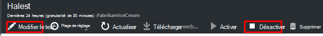

Vous pouvez souhaiter désactiver les tests de site web lorsque vous effectuez la maintenance de votre service.

## Tests de performances

Vous pouvez exécuter un test de charge sur votre site Web. Comme le test de la disponibilité, vous pouvez envoyer des demandes simples ou demandes de plusieurs étapes à partir de nos points dans le monde entier. Contrairement à un test de disponibilité, de nombreuses demandes sont envoyées, simulant plusieurs utilisateurs simultanés.

À partir de la vue d’ensemble lame, ouvrir les **paramètres**, **Les Tests de performances**. Lorsque vous créez un test, vous êtes invité à vous connecter à ou créer un compte de Services d’équipe Visual Studio.

Lorsque le test est terminé, vous obtenez des temps de réponse et taux de réussite.

## Automation

* [Scripts d’utiliser PowerShell pour configurer un test web](https://azure.microsoft.com/blog/creating-a-web-test-alert-programmatically-with-application-insights/) automatiquement.
* Permet de paramétrer un [webhook](../monitoring-and-diagnostics/insights-webhooks-alerts.md) qui est appelée lorsqu’une alerte est déclenchée.

## Questions ? Problèmes ?

* *Puis-je appeler le code à partir du test de mon site web ?*

    N° Les étapes du test doivent être dans le fichier .webtest. Et ne peut pas appeler d’autres tests web ou utiliser les boucles. Mais il existe plusieurs plug-ins qui pouvez vous être utile.

* *HTTPS est pris en charge ?*

    Nous prenons en charge TLS 1.1 et TLS 1.2.

* *Y a-t-il une différence entre « web tests » et « disponibilité » ?*

    Nous utilisons les deux termes indifféremment.

* *Je souhaite utiliser les tests de disponibilité sur notre serveur interne qui s’exécute derrière un pare-feu.*

    Configurez votre pare-feu pour autoriser les demandes à partir [du site web, les adresses IP des agents de test](app-insights-ip-addresses.md#availability).

* *Échec de chargement d’un test web de plusieurs étapes*

    Il existe une limite de taille de 300 k

    Boucles ne sont pas pris en charge.

    Références à d’autres tests web ne sont pas pris en charge.

    Sources de données ne sont pas pris en charge.

* *Ne complète pas mon test à plusieurs étapes*

    Il existe une limite de 100 demandes par test.

    Le test est arrêté si elle s’exécute plu de deux minutes.

* *Comment exécuter un test avec des certificats clients ?*

    Nous ne prennent en charge, nous sommes désolés.

## Vidéo

> [AZURE.VIDEO monitoring-availability-with-application-insights]

## Étapes suivantes

[Recherche des journaux de diagnostic][diagnostic]

[Résolution des problèmes][qna]

[Adresses IP des agents de test web](app-insights-ip-addresses.md)

<!--Link references-->

[azure-availability]: ../insights-create-web-tests.md
[diagnostic]: app-insights-diagnostic-search.md
[qna]: app-insights-troubleshoot-faq.md
[start]: app-insights-overview.md
