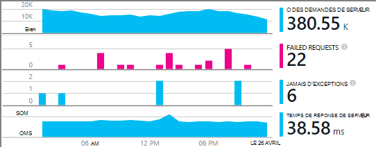

<properties
    pageTitle="Ajouter le Kit de développement logiciel pour surveiller votre application Node.js Insights Application | Microsoft Azure"
    description="Analyser l’utilisation, la disponibilité et les performances de vos locaux ou une application web de Microsoft Azure avec aperçus de l’Application."
    services="application-insights"
    documentationCenter=""
    authors="alancameronwills"
    manager="douge"/>

<tags
    ms.service="application-insights"
    ms.workload="tbd"
    ms.tgt_pltfrm="ibiza"
    ms.devlang="na"
    ms.topic="get-started-article"
    ms.date="08/30/2016"
    ms.author="awills"/>


# <a name="add-application-insights-sdk-to-monitor-your-nodejs-app"></a>Ajouter le Kit de développement logiciel pour surveiller votre application Node.js Insights Application

*Idées d’application est en mode Aperçu.*

[Idées d’Application Visual Studio](app-insights-overview.md) surveille vos applications en ligne pour vous aider à [détecter et diagnostiquer les problèmes de performances et les exceptions](app-insights-detect-triage-diagnose.md)et [Découvrez comment votre application est utilisée](app-insights-overview-usage.md). Il fonctionne pour les applications qui sont hébergées sur vos propres serveurs d’IIS en local ou sur Azure VM, ainsi que les applications web Azure.


Le SDK fournit une collecte automatique de taux de demandes HTTP entrantes et les réponses, les compteurs de performance (processeur, mémoire, RPS) et les exceptions non gérées. En outre, vous pouvez ajouter des appels personnalisés pour effectuer le suivi des dépendances, des mesures ou des autres événements.




#### <a name="before-you-start"></a>Avant de commencer

Tu as besoin de :

* Visual Studio 2013 ou une version ultérieure. Une version ultérieure est préférable.
* Un abonnement à [Microsoft Azure](http://azure.com). Si votre équipe ou votre organisation possède un abonnement Azure, le propriétaire peut vous ajouter, à l’aide de votre [compte Microsoft](http://live.com).

## <a name="add"></a>Créer une ressource d’informations d’Application

Connectez-vous au [portail Azure][portal]et de créer une nouvelle ressource de perspectives de l’Application. Une [ressource] [ roles] dans Azure est une instance d’un service. Cette ressource est où données télémétriques fournies par votre application seront analysées et présentés.


Choisissez autre que le type d’application. Le choix du type d’application définit le contenu par défaut des propriétés et les lames de ressource visible dans [l’Explorateur de mesures][metrics].

#### <a name="copy-the-instrumentation-key"></a>Copiez la clé d’Instrumentation

La clé identifie la ressource, et vous allez l’installer rapidement dans le Kit de développement logiciel pour diriger les données à la ressource.


## <a name="sdk"></a>Installer le Kit de développement de votre application

```
npm install applicationinsights --save
```

## <a name="usage"></a>Utilisation de

Cela permet la surveillance de demande, une exception non gérée de suivi et les performances du système (processeur, mémoire/RPS) de surveillance.

```javascript

var appInsights = require("applicationinsights");
appInsights.setup("<instrumentation_key>").start();
```

L’instrumentation clé peut également être définie dans la variable d’environnement APPINSIGHTS_INSTRUMENTATIONKEY. Dans ce cas, aucun argument n’est nécessaire lors de l’appel `appInsights.setup()` ou `appInsights.getClient()`.

Vous pouvez essayer du Kit de développement sans envoyer de télémétrie : définissez la clé de l’instrumentation sur une chaîne non vide.


## <a name="run"></a>Exécutez votre projet.

Exécutez votre application et d’essayer : ouvrir les différentes pages pour générer certains télémétrie.


## <a name="monitor"></a>Afficher votre télémétrie

Retourner au [portail Azure](https://portal.azure.com) et accédez à votre ressource de perspectives de l’Application.


Rechercher des données dans la page Vue d’ensemble. Dans un premier temps, vous ne voyez qu’un ou deux points. Par exemple :


Cliquez sur n’importe quel graphique pour afficher des mesures plus détaillées. [Pour en savoir plus sur les mesures.][perf]

#### <a name="no-data"></a>Aucune donnée ?

* Utilisez l’application, ouvrez les différentes pages afin qu’il génère certains télémétrie.
* Ouvrez la fenêtre de [recherche](app-insights-diagnostic-search.md) , pour consulter des événements particuliers. Parfois il faut événements un peu longtemps pour obtenir via le pipeline de mesures.
* Attendez quelques secondes et cliquez sur **Actualiser**. Graphiques eux-mêmes actualiser périodiquement, mais vous pouvez actualiser manuellement si vous vous attendez des données s’affiche.
* Voir [Dépannage de le][qna].

## <a name="publish-your-app"></a>Publier votre application

Maintenant déployer votre application IIS ou Azure et regarder les données s’accumulent.


#### <a name="no-data-after-you-publish-to-your-server"></a>Pas de données une fois que vous publiez sur le serveur ?

Ouvrir ces ports pour le trafic sortant dans le pare-feu de votre serveur :

+ `dc.services.visualstudio.com:443`
+ `f5.services.visualstudio.com:443`


#### <a name="trouble-on-your-build-server"></a>Problèmes sur votre serveur de builds ?

Consultez [cet article de résolution des problèmes](app-insights-asp-net-troubleshoot-no-data.md#NuGetBuild).


## <a name="customized-usage"></a>Utilisation personnalisée 

### <a name="disabling-auto-collection"></a>La désactivation de la collecte automatique

```javascript
import appInsights = require("applicationinsights");
appInsights.setup("<instrumentation_key>")
    .setAutoCollectRequests(false)
    .setAutoCollectPerformance(false)
    .setAutoCollectExceptions(false)
    // no telemetry will be sent until .start() is called
    .start();
```

### <a name="custom-monitoring"></a>Surveillance personnalisée

```javascript
import appInsights = require("applicationinsights");
var client = appInsights.getClient();

client.trackEvent("custom event", {customProperty: "custom property value"});
client.trackException(new Error("handled exceptions can be logged with this method"));
client.trackMetric("custom metric", 3);
client.trackTrace("trace message");
```

[En savoir plus sur l’API de télémétrie](app-insights-api-custom-events-metrics.md).

### <a name="using-multiple-instrumentation-keys"></a>L’utilisation de plusieurs clés d’instrumentation

```javascript
import appInsights = require("applicationinsights");

// configure auto-collection with one instrumentation key
appInsights.setup("<instrumentation_key>").start();

// get a client for another instrumentation key
var otherClient = appInsights.getClient("<other_instrumentation_key>");
otherClient.trackEvent("custom event");
```

## <a name="examples"></a>Exemples

### <a name="tracking-dependency"></a>Dépendance de suivi

```javascript
import appInsights = require("applicationinsights");
var client = appInsights.getClient();

var startTime = Date.now();
// execute dependency call
var endTime = Date.now();

var elapsedTime = endTime - startTime;
var success = true;
client.trackDependency("dependency name", "command name", elapsedTime, success);
```


### <a name="manual-request-tracking-of-all-get-requests"></a>Suivi de demande manuelle de toutes les demandes « GET »

```javascript
var http = require("http");
var appInsights = require("applicationinsights");
appInsights.setup("<instrumentation_key>")
    .setAutoCollectRequests(false) // disable auto-collection of requests for this example
    .start();

// assign common properties to all telemetry sent from the default client
appInsights.client.commonProperties = {
    environment: process.env.SOME_ENV_VARIABLE
};

// track a system startup event
appInsights.client.trackEvent("server start");

// create server
var port = process.env.port || 1337
var server = http.createServer(function (req, res) {
    // track all "GET" requests
    if(req.method === "GET") {
        appInsights.client.trackRequest(req, res);
    }

    res.writeHead(200, { "Content-Type": "text/plain" });
    res.end("Hello World\n");
}).listen(port);

// track startup time of the server as a custom metric
var start = +new Date;
server.on("listening", () => {
    var end = +new Date;
    var duration = end - start;
    appInsights.client.trackMetric("StartupTime", duration);
});
```

## <a name="next-steps"></a>Étapes suivantes

* [Surveiller vos télémétrie dans le portail](app-insights-dashboards.md)
* [Écrire des requêtes Analytique sur votre télémétrie](app-insights-analytics-tour.md)


<!--Link references-->

[knowUsers]: app-insights-overview-usage.md
[metrics]: app-insights-metrics-explorer.md
[perf]: app-insights-web-monitor-performance.md
[portal]: http://portal.azure.com/
[qna]: app-insights-troubleshoot-faq.md
[roles]: app-insights-resources-roles-access-control.md
