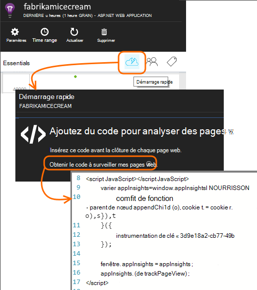

<properties
    pageTitle="Analyse de l’utilisation avec les perspectives de l’Application"
    description="Vue d’ensemble d’analytique de l’utilisation avec les perspectives de l’Application"
    services="application-insights"
    documentationCenter=""
    authors="alancameronwills"
    manager="douge"/>

<tags
    ms.service="application-insights"
    ms.workload="tbd"
    ms.tgt_pltfrm="ibiza"
    ms.devlang="multiple"
    ms.topic="article" 
    ms.date="04/08/2016"
    ms.author="awills"/>

# Analyse de l’utilisation avec les perspectives de l’Application

Connaître la manière dont les personnes utilisent votre application vous permet de concentrer votre travail de développement sur les scénarios qui sont plus importants et intégrer les objectifs qu’ils trouveront plus facile ou plus difficile à obtenir.

Perspectives d’application peuvent fournir une vision claire de l’utilisation de votre application, pour vous aider à améliorer l’expérience de vos utilisateurs et vos objectifs stratégiques.

Idées d’application fonctionne pour les deux applications autonomes (sur iOS, Android et Windows) et pour les applications web (hébergées sur .NET ou J2EE). 

## Ajouter des informations d’Application à votre projet

Pour commencer, ouvrez un compte gratuit avec [Microsoft Azure](https://azure.com). (Après la période d’évaluation, vous pouvez continuer avec la couche libre du service.)

Dans le [portail Azure](https://portal.azure.com), créez une ressource de perspectives de l’Application. Voici où vous pouvez afficher les données d’utilisation et de performances sur votre application.

**Si votre application est une application de périphérique,** ajoutez le SDK de perspectives d’Application à votre projet. La procédure exacte varie selon votre [IDE et la plate-forme](app-insights-platforms.md). Pour les applications Windows, tout droit sur le projet dans Visual Studio et choisissez « Aperçu de l’Application ajouter ».

**Si elle est une application web,** Ouvrez la lame Quick Start et obtenez l’extrait de code à ajouter à vos pages web. Les republier avec cet extrait de code.

Vous pouvez également ajouter des perspectives d’Application à votre code de serveur [ASP.NET](app-insights-asp-net.md) ou [J2EE](app-insights-java-get-started.md) pour combiner des données télémétriques fournies par le client et le serveur.

### Exécutez votre projet et de voir les résultats de la première

Exécutez votre projet en mode débogage pendant quelques minutes, puis accédez au [portail Azure](https://portal.azure.com) et accédez à votre ressource de projet dans les perspectives de l’Application.

Publier votre application pour obtenir plus de télémétrie et de savoir ce que vos utilisateurs font avec votre application.

## Analytique prêts à l’emploi

Cliquez sur la mosaïque de vues de Page pour afficher les détails d’utilisation.

Placez le curseur dans la partie vide au-dessus d’un graphique pour afficher les nombres à un moment donné. Dans le cas contraire, les numéros indiquent la valeur agrégée sur la période, comme une moyenne, un total ou un nombre d’utilisateurs distincts au cours de la période.

Dans les applications web, les utilisateurs sont comptés par l’utilisation de cookies. Une personne qui utilise plusieurs navigateurs, efface les cookies ou la fonctionnalité de confidentialité sera comptée plusieurs fois.

Une session web est pris en compte après 30 minutes d’inactivité. Une session sur un téléphone ou un autre périphérique est pris en compte lorsque l’application est interrompue pendant plus de quelques secondes.

Cliquez sur n’importe quel graphique pour afficher plus de détails. Par exemple :

(Cet exemple est à partir d’un site Web, mais les graphiques semblable pour les applications qui s’exécutent sur des périphériques).

Comparer avec la semaine précédente pour voir si les choses évoluent :

Comparez les deux mesures, par exemple les utilisateurs et les nouveaux utilisateurs :

Données de groupe (segment) par une propriété de navigateur, système d’exploitation ou de la ville :

## Utilisation de la page

Cliquez sur les vues de la page en mosaïque pour obtenir une ventilation de vos pages les plus populaires :

L’exemple ci-dessus est à partir d’un site Web de jeux. À partir de celui-ci nous pouvons voir instantanément :

* L’utilisation n’a pas amélioré la semaine dernière. Peut-être nous devons penser à propos de l’optimisation des moteurs de recherche ?
* Moins de personnes de voient les pages de jeux à la page d’accueil. Pourquoi notre page d’accueil n’attirer les personnes à jouer à des jeux ?
* « Mots croisés » est le jeu les plus populaires. Nous devons donner la priorité à il des améliorations et de nouvelles idées.

## Suivi personnalisé

Supposons qu’au lieu d’implémenter chaque jeu dans une page web distincte, vous décidez de refactoriser les dans la même application de page unique, la plupart des fonctionnalités codée Javascript dans la page web. Cela permet à l’utilisateur de basculer rapidement d’un jeu et un autre ou même plusieurs jeux sur une seule page.

Mais vous voulez quand même les perspectives d’Application pour enregistrer le nombre de fois où chaque jeu est ouvert dans exactement de la même manière que lorsqu’ils se trouvaient sur des pages web distinctes. C’est très simple : simplement insérer un appel au module de télémétrie dans JavaScript souhaité pour l’enregistrement d’une « page » a ouvert :

    telemetryClient.trackPageView(game.Name);

## Événements personnalisés

Vous pouvez utiliser télémétrie de nombreuses façons de comprendre comment votre application est utilisée. Mais vous ne souhaitez pas que de mélanger les messages avec des vues de la page. À la place, utiliser des événements personnalisés. Vous pouvez les envoyer à partir d’applications de périphérique, les pages web ou un serveur web :

(JavaScript)

    telemetryClient.trackEvent("GameEnd");

(C#)

    var tc = new Microsoft.ApplicationInsights.TelemetryClient();
    tc.TrackEvent("GameEnd");

(VB)

    Dim tc = New Microsoft.ApplicationInsights.TelemetryClient()
    tc.TrackEvent("GameEnd")

Les événements personnalisés plus fréquentes sont répertoriées sur la lame de vue d’ensemble.

Cliquez sur l’en-tête de la table pour voir le nombre total d’événements. Vous pouvez segmenter le graphique par divers attributs tels que le nom de l’événement :

La fonctionnalité particulièrement utile de chronologies est que vous pouvez mettre en corrélation les modifications avec les autres mesures et les événements. Par exemple, lorsque d’autres jeux est lus, attendez-vous à voir une hausse de jeux abandonnés ainsi. Mais l’augmentation des jeux abandonné est disproportionnée, vous pouvez savoir si la charge élevée est à l’origine de problèmes que les utilisateurs trouveront inacceptables.

## Explorez des événements spécifiques

Pour obtenir une meilleure compréhension de comment une session type passe, vous pouvez souhaiter vous concentrer sur une session utilisateur spécifique qui contient un type particulier d’événement.

Dans cet exemple, nous avons codé un événement personnalisé « NoGame » qui est appelée si l’utilisateur se déconnecte sans réellement démarrer un jeu. Pourquoi un utilisateur pour cela ? Peut-être que si nous plonger dans certaines occurrences spécifiques, nous verrons un indice.

Les événements personnalisés provenant de l’application sont répertoriés par nom sur la lame de présentation :

Cliquez sur par le biais de l’événement d’intérêt et sélectionnez une occurrence spécifique récente :

Examinons tous la télémétrie pour la session dans laquelle cet événement particulier de NoGame s’est produite.

Il n’y avait aucuns exceptions, afin que l’utilisateur n’a pas été empêché de lecture par un échec.

Nous pouvons filtrer tous les types de télémétrie, à l’exception des affichages de page pour cette session :

Et maintenant nous pouvons voir que cet utilisateur connecté simplement à vérifier les derniers résultats. Peut-être que nous devrions envisager de développer un récit utilisateur qui le rend plus facile à faire. (Et il nous faut implémenter un événement personnalisé pour le rapport lorsque ce scénario spécifique se produit.)

## Filtrer, rechercher et segmenter vos données avec des propriétés
Vous pouvez joindre des balises arbitraires et des valeurs numériques pour les événements.

JavaScript sur le client

    appInsights.trackEvent("WinGame",
        // String properties:
        {Game: currentGame.name, Difficulty: currentGame.difficulty},
        // Numeric measurements:
        {Score: currentGame.score, Opponents: currentGame.opponentCount}
    );

C# au niveau serveur

    // Set up some properties:
    var properties = new Dictionary <string, string>
        {{"game", currentGame.Name}, {"difficulty", currentGame.Difficulty}};
    var measurements = new Dictionary <string, double>
        {{"Score", currentGame.Score}, {"Opponents", currentGame.OpponentCount}};

    // Send the event:
    telemetry.TrackEvent("WinGame", properties, measurements);

VB au niveau serveur

    ' Set up some properties:
    Dim properties = New Dictionary (Of String, String)
    properties.Add("game", currentGame.Name)
    properties.Add("difficulty", currentGame.Difficulty)

    Dim measurements = New Dictionary (Of String, Double)
    measurements.Add("Score", currentGame.Score)
    measurements.Add("Opponents", currentGame.OpponentCount)

    ' Send the event:
    telemetry.TrackEvent("WinGame", properties, measurements)

Attacher des propriétés à des vues de page de la même manière :

JavaScript sur le client

    appInsights.trackPageView("Win",
        {Game: currentGame.Name},
        {Score: currentGame.Score});

Dans Diagnostic recherche, afficher les propriétés en cliquant à une occurrence d’un événement.

Pour voir des occurrences d’événement avec une valeur de propriété particulière, utilisez le champ de recherche.

## A | Test de B

Si vous ne connaissez pas le type variant d’une fonctionnalité sera plus efficace, relâchez les deux, rendre chaque accessibles aux différents utilisateurs. Mesurer le succès de chaque et déplacez-le vers une version unifiée.

Cette technique, vous attacher des balises distinctes pour tous les télémétrie envoyé par chaque version de votre application. Vous pouvez faire qui en définissant des propriétés dans la TelemetryContext active. Ces propriétés par défaut sont ajoutées à chaque message de télémétrie que l’application envoie - non seulement vos messages personnalisés, mais la télémétrie standard ainsi.

Dans le portail d’informations d’Application, vous allez alors pouvoir pour filtrer et grouper (segment) vos données dans les balises, afin de comparer les différentes versions.

C# au niveau serveur

    using Microsoft.ApplicationInsights.DataContracts;

    var context = new TelemetryContext();
    context.Properties["Game"] = currentGame.Name;
    var telemetry = new TelemetryClient(context);
    // Now all telemetry will automatically be sent with the context property:
    telemetry.TrackEvent("WinGame");

VB au niveau serveur

    Dim context = New TelemetryContext
    context.Properties("Game") = currentGame.Name
    Dim telemetry = New TelemetryClient(context)
    ' Now all telemetry will automatically be sent with the context property:
    telemetry.TrackEvent("WinGame")

Télémétrie individuel peut substituer les valeurs par défaut.

Vous pouvez configurer un initialiseur universel afin que tous les TelemetryClients de nouveau utiliser automatiquement votre contexte.

    // Telemetry initializer class
    public class MyTelemetryInitializer : ITelemetryInitializer
    {
        public void Initialize (ITelemetry telemetry)
        {
            telemetry.Properties["AppVersion"] = "v2.1";
        }
    }

Dans l’initialiseur app comme Global.asax.cs :

    protected void Application_Start()
    {
        // ...
        TelemetryConfiguration.Active.TelemetryInitializers
        .Add(new MyTelemetryInitializer());
    }

## Build - mesure - en savoir plus

Lorsque vous utilisez analytique, il devient partie intégrante de votre cycle de développement, pas simplement quelque chose que vous pensez environ pour aider à résoudre des problèmes. Voici quelques conseils :

* Déterminer les mesures clés de votre application. Voulez-vous que les utilisateurs autant que possible, ou si vous préférez un petit ensemble d’utilisateurs très heureux ? Vous souhaitez optimiser les visites ou des ventes ?
* Plan de mesure de chaque article. Lorsque vous esquissez un nouveau récit utilisateur ou une fonction ou plan de mettre à jour une réfléchissez toujours à propos de comment vous allez mesurer la réussite de la modification. Avant de coder démarre, demander « les conséquences cela aura-t-il sur nos unités de mesure, si cela fonctionne ? Devons nous suivre tous les nouveaux événements ? »
Et bien sûr, lorsque la fonction est en ligne, veillez à vous regardez l’analytique et d’agir sur les résultats.
* Autres mesures concernent les mesures clés. Par exemple, si vous ajoutez une fonctionnalité de « favoris », vous souhaitez connaître la fréquence à laquelle les utilisateurs ajoutent des Favoris. Mais il est sans doute plus intéressant de connaître la fréquence à laquelle ils reviennent à leurs favoris. Et, plus important encore, les clients qui utilisent des Favoris finalement achètent-ils votre produit ?
* Canaries test. Définissez un commutateur de fonctionnalité qui permet d’afficher une nouvelle fonctionnalité uniquement à certains utilisateurs. Idées d’Application permet de voir si la nouvelle fonctionnalité est utilisée dans la façon dont vous envisagées. Effectuer des ajustements, puis relâchez-la pour un public plus large.
* Communiquer avec vos utilisateurs ! Analytique n’est pas suffisante en soi, mais complémentaires pour maintenir une relation clientèle de qualité.

## Pour en savoir plus

* [Détecter, de triage et de diagnostiquer les incidents et les problèmes de performances dans votre application](app-insights-detect-triage-diagnose.md)
* [Mise en route de perspectives de l’Application sur de nombreuses plates-formes](app-insights-detect-triage-diagnose.md)

## Vidéo

> [AZURE.VIDEO usage-monitoring-application-insights]

 
