<properties 
    pageTitle="Didacticiel d’idées d’application | Microsoft Azure" 
    description="Effectuer le suivi de l’utilisation et les performances de votre application web en direct.  Détecter, de triage et de diagnostiquer les problèmes. En permanence surveiller et améliorer les succès avec vos utilisateurs." 
    services="application-insights" 
    documentationCenter=""
    authors="alancameronwills" 
    manager="douge"/>

<tags 
    ms.service="application-insights" 
    ms.workload="tbd" 
    ms.tgt_pltfrm="ibiza" 
    ms.devlang="na" 
    ms.topic="article" 
    ms.date="10/15/2016" 
    ms.author="awills"/>
 
# Idées d’application - introduction

Idées d’Application Visual Studio est un service d’analytique extensible qui surveille votre application web en direct. Vous pouvez détecter et diagnostiquer les problèmes de performances et comprendre ce que les utilisateurs effectuent avec votre application. Il est conçu pour les développeurs, pour vous aider à améliorer en permanence les performances et la facilité d’utilisation. Il fonctionne pour les applications sur une grande variété de plates-formes y compris .NET, Node.js et J2EE, hébergé sur site ou dans le nuage. 

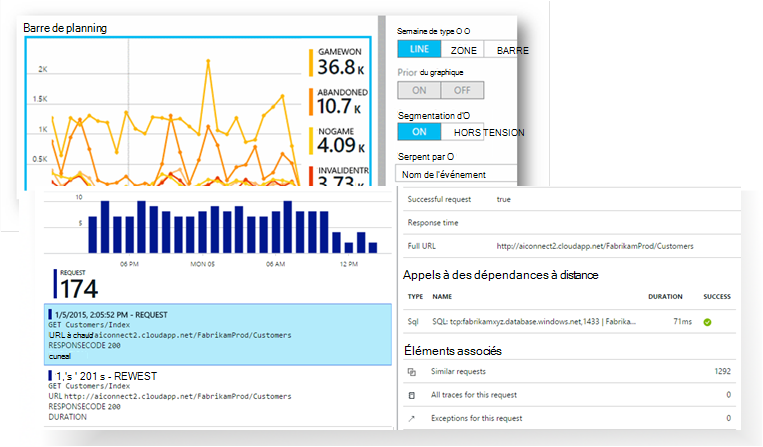

[Examinons l’animation d’introduction](https://www.youtube.com/watch?v=fX2NtGrh-Y0).

## Comment cela fonctionne-t-il ?

Installer un package de petite instrumentation dans votre application et de définir une ressource d’idées d’Application dans le portail Microsoft Azure. L’instrumentation surveille votre application et envoie les données télémétriques sur le portail. Le portail vous montre les graphiques statistiques et fournit de puissants outils de recherche pour vous aider à diagnostiquer les problèmes.

Idées d’application a plusieurs [modules de l’instrumentation standard](app-insights-configuration-with-applicationinsights-config.md) qui collectent les différents types de télémétrie tels que le temps de réponse de demande, d’exceptions et d’appels de dépendance. Vous pouvez également [écrire du code pour envoyer de télémétrie personnalisé](app-insights-api-custom-events-metrics.md) pour le portail.

### Quelle est la surcharge ?

L’impact sur les performances de votre application est très faible. Suivi des appels sont non-bloquante, regroupés par lots et sont envoyés dans un thread séparé. 

## Quel est son rôle ?

Aperçu de l’application est destinée à l’équipe de développement, pour vous aider à comprendre comment votre application s’exécute et comment il est utilisé. Il fournit :

Types de télémétrie :

* Taux de demandes HTTP, les temps de réponse, les taux de réussite.
* Dépendance (HTTP et SQL) appeler les taux, les temps de réponse, les taux de réussite.
* Traces d’exception de serveur et le client.
* Traces de journal de diagnostic.
* Afficher le nombre de pages, les comptes utilisateur et session, les temps de chargement de navigateur, les exceptions.
* Taux d’appels AJAX, temps de réponse et taux de réussite.
* Compteurs de performances du serveur.
* Télémétrie personnalisé de client et le serveur.
* Segmentation par l’emplacement du client, version du navigateur, version du système d’exploitation, instance de serveur, des dimensions personnalisées et bien plus encore.
* Tests de disponibilité

Outils de diagnostics et d’analyse :

* Alertes actives et manuels sur les taux d’échec et d’autres mesures et sur la disponibilité.
* Graphiques dans le temps des mesures agrégées.
* Appels de recherche de diagnostic sur les instances de demandes, les exceptions, les événements personnalisés, le journal des traces, des affichages de page, dépendances et AJAX. 
* Analytique - un langage de requête puissante sur votre télémétrie
* Tableaux de bord - composer les graphiques que vous devez surveiller tous les composants de votre application.

## Comment l’utiliser ?

### Moniteur

Installer les aperçus de l’Application dans votre application web, configurer des tests web de disponibilité, et :

* Définir un tableau de bord pour votre salle de réunion garder un œil sur la charge, la réactivité et les performances de vos dépendances, les chargements de page et les appels AJAX. 
* Découvrez qui sont les plus lents et la plupart des demandes d’absence.
* Regardez les flux en direct lorsque vous déployez une nouvelle version, à savoir immédiatement sur toute dégradation.

### Diagnostiquer

Lorsque vous recevez une alerte ou que vous découvrez un problème :

* Permet de mettre en corrélation les défaillances des exceptions, des appels de dépendance et des traces.
* Examinez les journaux de suivi et les vidages de pile.

### Évaluer

Mesurer l’efficacité de chaque nouvelle fonctionnalité que vous déployez.

* Plan pour mesurer l’utilisent de clients nouvelle expérience utilisateur ou les fonctionnalités d’entreprise.
* Écrire la télémétrie personnalisé dans votre code pour enregistrer l’utilisation.
* Chaque cycle de développement de base de preuve dur de télémétrie.

## Mise en route

Idées d’application est un des nombreux services hébergés dans Microsoft Azure et télémétrie est envoyé pour analyse et la présentation. Avant d’apporter d’autres modifications, vous devez donc un abonnement à [Microsoft Azure](http://azure.com). C’est gratuit pour vous inscrire et vous pouvez choisir la libre [niveau de tarification](https://azure.microsoft.com/pricing/details/application-insights/) des perspectives de l’Application. Si votre organisation possède déjà un abonnement, ils pourraient ajouter votre compte Microsoft lui. 

Il existe plusieurs façons de démarrer. Commence par selon ce qui convient le mieux. Vous pouvez ajouter les autres ultérieurement.

* **Au moment de l’exécution : instrumenter votre application web sur le serveur.** Permet d’éviter toute mise à jour du code. Vous avez besoin d’accès administrateur sur votre serveur.
 * [**IIS en local ou sur un ordinateur virtuel**](app-insights-monitor-performance-live-website-now.md)
 * [**Application web Azure ou VM**](app-insights-monitor-performance-live-website-now.md#if-your-app-runs-as-an-azure-web-app)
 * [**J2EE**](app-insights-java-live.md)
* **Au moment du développement : ajouter les perspectives d’Application dans votre code.** Vous permet d’écrire la télémétrie personnalisé et instrument back-end et les applications de bureau.
 * [Visual Studio](app-insights-asp-net.md) 2013 mise à jour 2 ou version ultérieure.
 * Java dans [Eclipse](app-insights-java-eclipse.md) ou [d’autres outils](app-insights-java-get-started.md)
 * [Node.js](app-insights-nodejs.md)
 * [Autres plates-formes](app-insights-platforms.md)
* **[Instrumenter vos pages web](app-insights-javascript.md)** pour l’affichage de la page, AJAX et autre télémétrie côté client.
* **[Les tests de disponibilité](app-insights-monitor-web-app-availability.md)** - ping sur votre site Web régulièrement de nos serveurs.

> [AZURE.NOTE]  À ce stade, peut-être vous intéresse à obtenir et à tester. Mais si vous souhaitez voir ce que peut faire Application Insights, lisez plutôt...

## Explorez les métriques

Exécutez votre application - soit en mode de débogage sur votre ordinateur de développement, ou en le déployant dans un serveur - et l’utiliser pendant un certain temps. Puis vous connecter au [portail Azure](https://portal.azure.com).

Accédez à lame de vue d’ensemble de perspectives de l’Application de votre application :

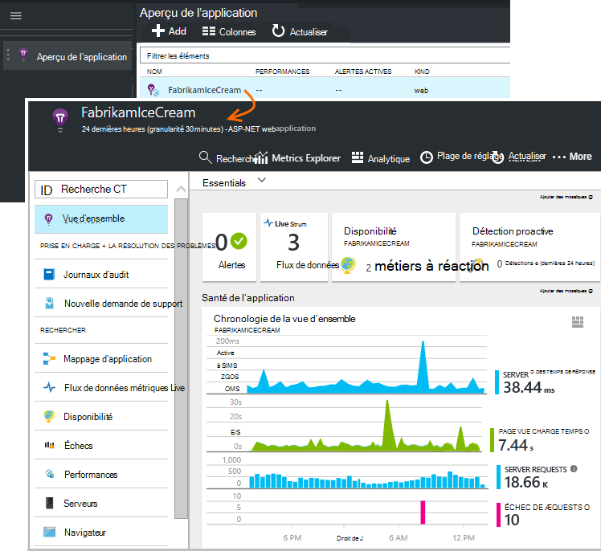

La vue d’ensemble vous permet de voir immédiatement comment votre application s’exécute. Vous pouvez comparer charge (en termes de taux de demandes) avec l’heure de votre application trop pour répondre aux demandes. S’il existe une augmentation disproportionnée des temps de réponse lorsque la charge augmente, vous pouvez souhaiter allouer davantage de ressources pour votre application. S’il affiche plus droit d’échecs de réponse une fois que vous avez déployé une nouvelle build, vous pouvez souhaiter revenir.

#### Obtenir plus de détails

Cliquez sur n’importe quel graphique afin d’obtenir des graphiques plus détaillées. Par exemple, le graphique de temps de réponse de serveur permet de graphiques qui montrent le taux de demandes, les temps de réponse et les temps de réponse des dépendances (c'est-à-dire que les services que votre application appelle).  

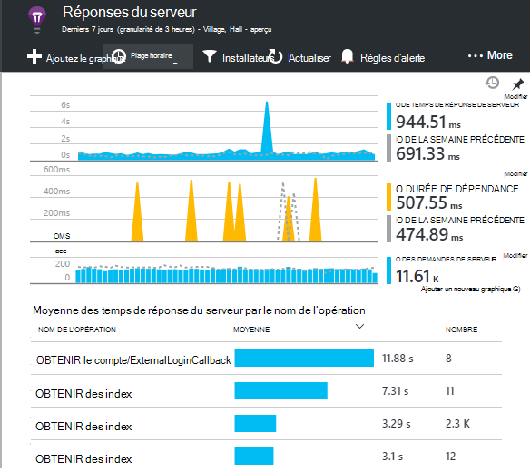

Le graphique de dépendances est utile car il vous permet de voir si les bases de données et les API reste que votre application utilise répondent bien, ou provoquent des retards.

#### Personnaliser un graphique

Essayez de modifier un de ces graphiques. Par exemple, si votre application web s’exécute sur une collection d’instances de serveur, vous pouvez comparer les temps de réponse sur les instances de serveur différentes :

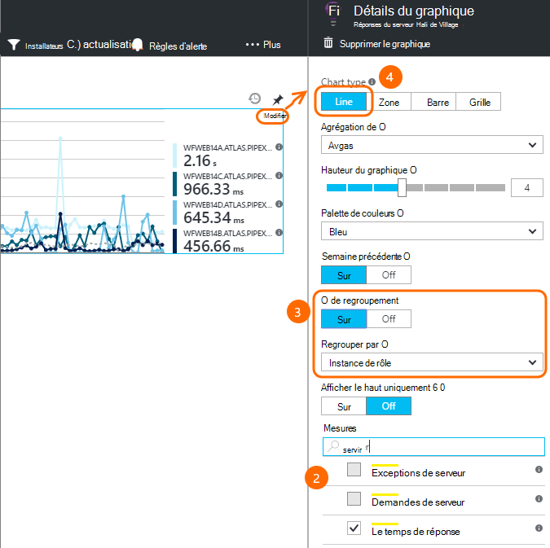

1. Placez le curseur sur le graphique, puis cliquez sur Modifier.
2. Choisissez une mesure. Plusieurs mesures peuvent être affichés sur un graphique, mais uniquement dans certaines combinaisons : il se peut que vous deviez désactiver une mesure avant de sélectionner celui qui vous intéresse.
3. Utiliser Group By pour segmenter une métrique par une propriété. Dans cet exemple, nous affichons les lignes distinctes pour les temps de réponse. 

    Notez que vous devez sélectionner une propriété valide pour la mesure ou le graphique n’affiche pas les données.
4. Sélectionnez un type de graphique. Graphiques à barres et zone Afficher empilées approprié lorsque le type d’agrégation est 'Sum'.

[En savoir plus sur les mesures de l’exploration](app-insights-metrics-explorer.md).

## Recherche les données d’instance

Pour étudier un problème, il est utile d’inspecter des instances d’événements spécifiques.

Cliquez sur un graphique de métriques pour parcourir les données d’instance avec les filtres appropriés et de la plage de temps. Par exemple, cliquez sur demande de serveur compte pour visualiser les États de demande individuelle. 

Ou bien, vous pouvez obtenir directement aux données de l’instance de recherche sur la page de vue d’ensemble :

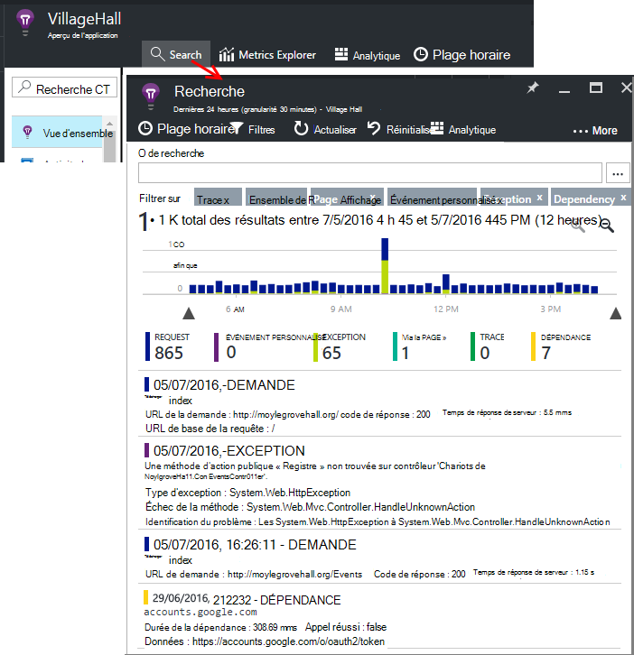

Utiliser des filtres pour se concentrer sur certains types d’événement et des valeurs de la propriété choisie :

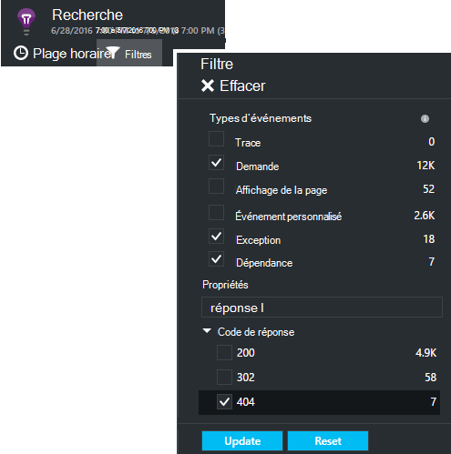

Cliquez sur «... » pour afficher la liste complète des propriétés ou ouvrez d’autres événements associés à la même demande. Dans cet exemple, la requête ayant échoué a un état d’exception associée :

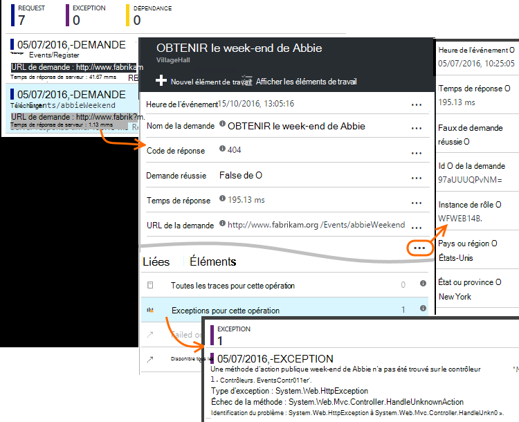

Ouvrir un événement - dans cet exemple, l’exception associée - et vous pouvez créer un élément de travail (si vous utilisez Visual Studio Team Services pour effectuer le suivi des tâches). 
 
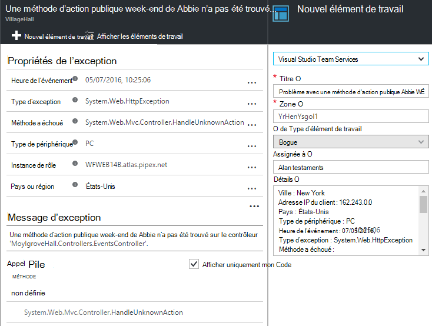

## Analytique

[Analytique](app-insights-analytics.md) est une fonctionnalité de recherche et d’analyse encore plus puissante, dans lequel vous pouvez écrire des requêtes de type SQL sur les données de télémétrie, soit pour rechercher des problèmes spécifiques ou de compiler des informations statistiques.

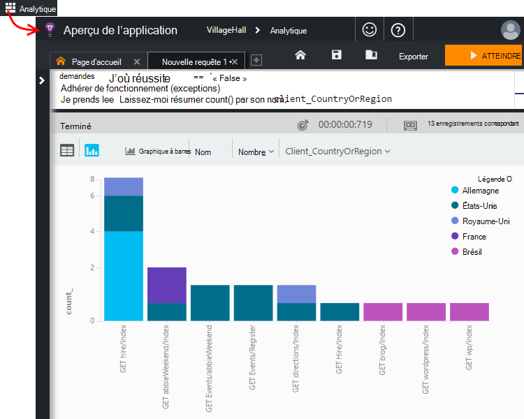

Ouvrez la fenêtre didacticiel pour afficher et exécuter les exemples de requêtes sur vos données, ou lisez le [didacticiel procédure pas à pas](app-insights-analytics-tour.md)de plus de temps. IntelliSense affiche les requêtes que vous pouvez utiliser, et il existe une [référence du langage complet](app-insights-analytics-reference.md). 

Requêtes commencent généralement par le nom d’un flux de télémétrie par exemple les demandes, les exceptions ou les dépendances. Ouvrez la barre de schéma située à gauche pour afficher la liste des flux disponibles de télémétrie. La requête est un tuyau [d’opérations](app-insights-analytics-reference.md#queries-and-operators) de requête tel que `where` - un filtre de booléen - ou `project` -qui calcule les nouvelles propriétés. `summarize`[instances d’agrégats](app-insights-analytics-tour.md#aggregate-groups-of-rows), leur regroupement par les fonctions que vous définissez et ensuite appliquer les fonctions d’agrégation sur les données groupées.

Résultats peuvent être [rendus dans des tables ou divers types de graphique](app-insights-analytics-tour.md#charting-the-results).

## Télémétrie personnalisé

La télémétrie intégrée que vous obtenez seulement par l’installation d’idées d’Application vous permet d’analyser le nombre, le taux de réussite, et les délais de réponse importants à la fois pour les demandes web à votre application et les dépendances - autrement dit, les appels à partir de votre application à SQL, l’API de reste. Vous obtenez également des traces de l’exception et (avec le moniteur de statut sur votre serveur) des compteurs de performance système. Si vous ajoutez l’extrait de code client à vos pages web, vous obtenez les comptes d’affichages de page et des temps de chargement, les exceptions client et AJAX appellent les taux de réussite et de réponse. 

Analyse tous les ce télémétrie peut vous dire beaucoup sur les performances et l’utilisation de votre application. Mais parfois qui n’est pas suffisant. Vous souhaiterez peut-être surveiller la longueur d’une file d’attente de sorte que vous pouvez optimiser les performances ; compter les ventes ou les segments par emplacement ; ou bien, sur le côté client, découvrez comment souvent les utilisateurs cliquent sur un bouton de sorte que vous pouvez optimiser l’expérience utilisateur.

L' [API de perspectives d’Application](app-insights-api-custom-events-metrics.md) fournit des appels de `TrackEvent(name)` et `TrackMetric(name, value)` afin que vous puissiez envoyer vos propres événements personnalisés et les mesures. Il y a des appels équivalents pour le côté client.

Par exemple, si votre page web est une application de jeu d’une page, vous pouvez insérer une ligne dans les emplacements appropriés pour ouvrir une session lorsque l’utilisateur wins ou perd une partie :

    
    appInsights.trackEvent("WinGame");
    ...
    appInsights.trackEvent("LoseGame");

Nous pouvons ensuite graphique décomptes d’événement personnalisé, leur segmentation par le nom de l’événement :

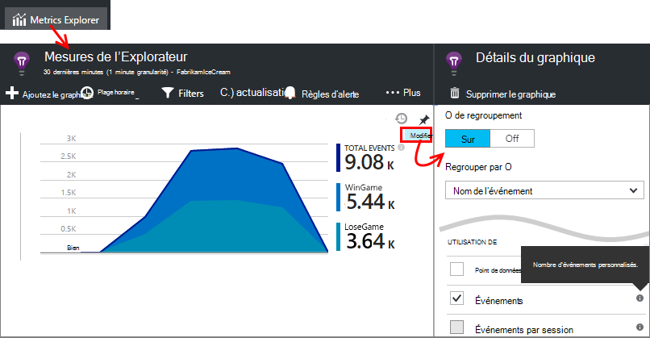

### Journal des traces

À des fins de diagnostic, il existe un événement personnalisé `TrackTrace(message)` que vous pouvez utiliser des traces de l’exécution. Dans les fonctionnalités de recherche et Analytique, vous pouvez rechercher dans le contenu du message, qui peut être plus long que le nom d’un événement. 

Si vous utilisez déjà une infrastructure d’enregistrement tels que Log4Net, NLog, Log4J ou System.Diagnostic.Trace, ces appels de traçage peuvent être capturées par les perspectives de l’Application et seront affichent à côté des autre la télémétrie. Les outils de Visual Studio ajoutent automatiquement le module SDK approprié.

## Tableaux de bord

De nombreuses applications se composent de plusieurs composants, tel qu’un service web, et un ou plusieurs processeurs arrière-guichet. Chaque composant sera contrôlée par une ressource d’idées d’Application séparée. Si votre système s’exécute sur Azure, vous pouvez - et analyse - services de concentrateurs d’événement et d’apprentissage ainsi que de l’ordinateur. 

Pour contrôler l’intégralité de votre système, vous pouvez sélectionner les graphiques plus intéressantes à partir de différentes applications et les épingler à un [tableau de bord](app-insights-dashboards.md)d' Azure, ce qui vous permet de garder un œil sur l’ensemble du système, en permanence. 

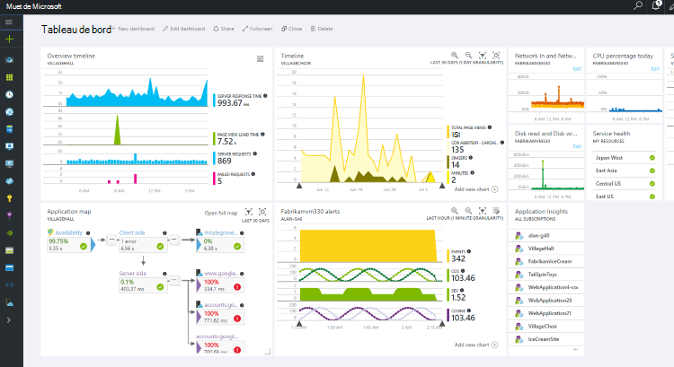

En fait, vous pouvez créer plusieurs tableaux de bord - par exemple, une équipe place du tableau de bord pour surveiller l’état général du système ; un tableau de bord de conception qui se concentre sur l’utilisation des fonctionnalités différentes. un tableau de bord distinct pour les composants à tester ; et ainsi de suite.  

Les tableaux de bord, comme les ressources peuvent être partagées entre les membres de l’équipe.

## Développement dans Visual Studio

Si vous utilisez Visual Studio pour développer votre application, vous trouverez plusieurs outils d’idées d’Application intégrées. 

### Recherche de diagnostic

La fenêtre de recherche affiche les événements qui ont été consignés. (Si vous connecté à Azure lorsque vous paramétrez des perspectives de l’Application, vous serez en mesure de rechercher les mêmes événements dans le portail.)

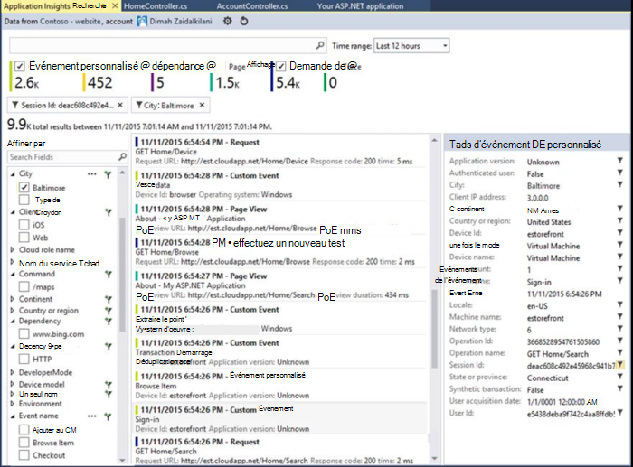

La recherche en texte libre fonctionne sur tous les champs dans les événements. Par exemple, recherchez la partie de l’URL d’une page ; ou la valeur d’une propriété telle que de la ville du client ; ou des mots spécifiques dans un journal de suivi.

Cliquez sur n’importe quel événement pour afficher ses propriétés détaillées.

Vous pouvez également ouvrir l’onglet éléments associés pour diagnostiquer les exceptions ou les demandes ayant échoué.

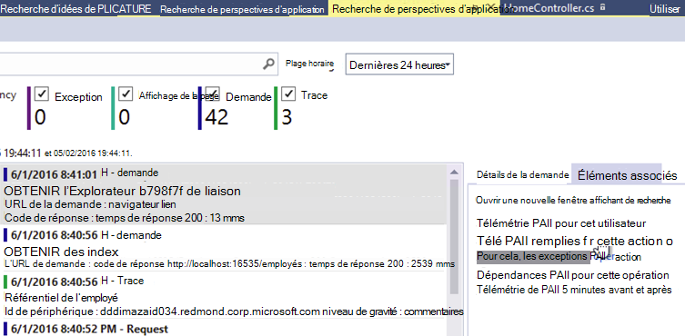

### Concentrateur de Diagnostics

Le concentrateur de Diagnostics (dans Visual Studio 2015 ou version ultérieure) affiche la télémétrie serveur perspectives d’Application lorsqu’elles sont générées. Cela fonctionne même si vous avez choisi uniquement pour installer le Kit de développement, sans le connecter à une ressource dans le portail Azure.

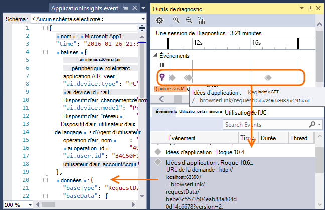

### Exceptions

Si vous avez [configuré à la surveillance des exceptions](app-insights-asp-net-exceptions.md), les rapports d’exception s’affichera dans la fenêtre de recherche. 

Cliquez sur une exception afin d’obtenir une trace de la pile. Si le code de l’application est ouvert dans Visual Studio, vous pouvez cliquer sur par le biais de la trace de la pile à la ligne appropriée dans le code.

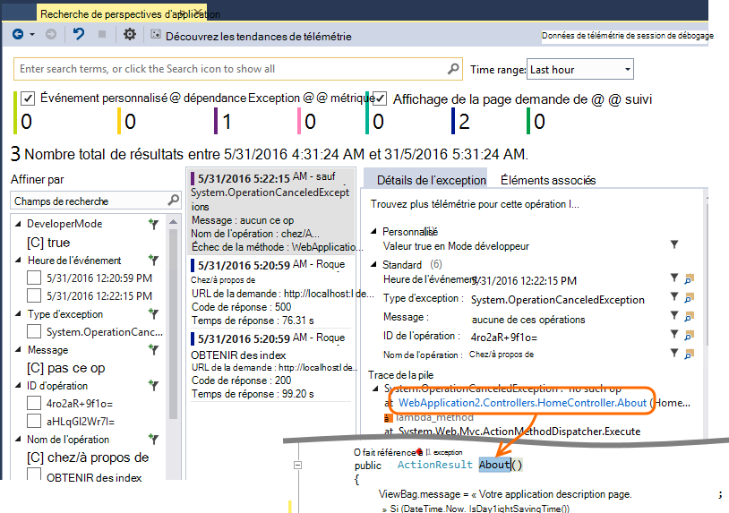

En outre, dans la ligne de Code objectif au-dessus de chaque méthode, vous verrez un décompte des exceptions consignées par les perspectives d’Application dans les 24 heures passées.

### Analyse locale

(À partir de Visual Studio 2015 mise à jour 2) Si vous n’avez pas configuré le SDK pour envoyer de télémétrie sur le portail de perspectives de l’Application (de sorte qu’il n’y a aucune clé de l’instrumentation dans ApplicationInsights.config) la fenêtre diagnostics affiche télémétrie à partir de votre session de débogage plus tard. 

Cela est souhaitable si vous avez déjà publié une version antérieure de votre application. Vous ne voulez pas la télémétrie dans vos sessions de débogage à être mélangées avec la télémétrie sur le portail d’idées d’Application à partir de l’application publiée.

Il est également utile si vous avez quelques [télémétrie personnalisé](app-insights-api-custom-events-metrics.md) que vous souhaitez déboguer avant l’envoi de télémétrie pour le portail.

* *Tout d’abord, j’ai configuré entièrement perspectives d’Application pour envoyer de télémétrie pour le portail. Mais maintenant je souhaite voir la télémétrie uniquement dans Visual Studio.*

 * Dans les paramètres de la fenêtre de recherche, il existe une option de recherche des diagnostics local même si votre application envoie de télémétrie pour le portail.
 * Pour arrêter la télémétrie envoyée au portail, commentez la ligne `<instrumentationkey>...` de ApplicationInsights.config. Lorsque vous êtes prêt à envoyer à nouveau de télémétrie au portail, ne commentez pas.

## Tendances

Tendances est un outil de Visual Studio permet de visualiser le comportement de votre application dans le temps. 

Cliquez sur **Découvrez les tendances de télémétrie** à partir de la fenêtre de recherche de perspectives d’Application ou le bouton de barre d’outils d’aperçu de l’Application. Choisissez l’une des cinq requêtes communes pour commencer. Vous pouvez analyser des datasets différents en fonction des types de télémétrie, les plages de temps et d’autres propriétés. 

Pour rechercher les anomalies dans vos données, choisissez une des options des anomalies dans la liste déroulante « Type de vue ». Les options de filtrage au bas de la fenêtre facilitent le rapproche des sous-ensembles spécifiques de votre télémétrie.

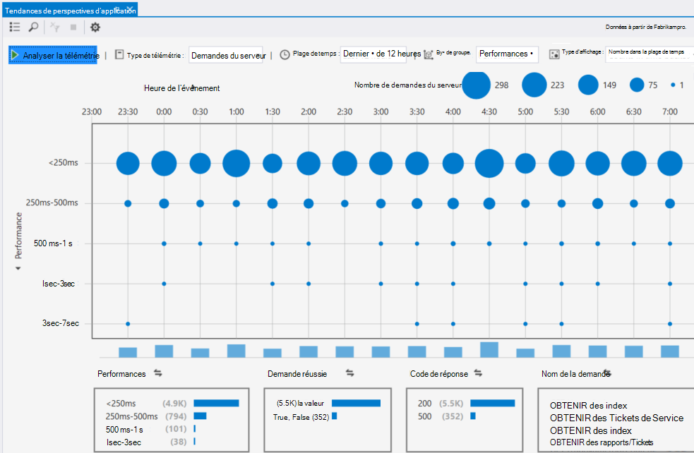

## Publie une nouvelle version

### Flux de données métriques Live

Mesures de flux vous montre les mesures de votre application dès ce moment précis où, avec une latence de temps réel proche de 1 seconde. Cela est particulièrement utile lorsque vous êtes publie une nouvelle version et que vous souhaitez vous assurer que tout est travail comme prévu, ou l’examen d’un incident en temps réel.

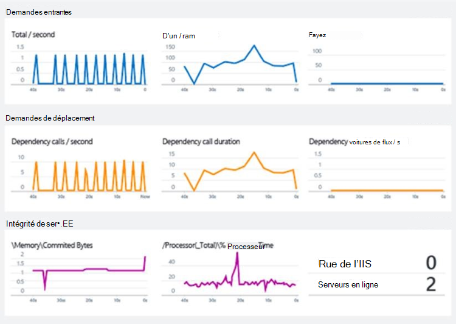

Contrairement à Explorer de mesures, mesures de flux affiche un ensemble fixe de mesures. Les données persistent uniquement tant qu’il est sur le graphique et est ignorée. 

### Annotations

[Annotations de version](app-insights-annotations.md) dans les graphiques mesures indiquent où vous avez déployé une nouvelle build. Ils facilitent voir si vos modifications ont un effet sur les performances de votre application. Ils peuvent être créés automatiquement par le [système de génération Visual Studio Team Services](https://www.visualstudio.com/en-us/get-started/build/build-your-app-vs), et vous pouvez également [les créer à partir de PowerShell](#create-annotations-from-powershell).

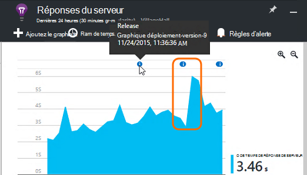

Annotations de version sont une fonctionnalité de la version en nuage et de Visual Studio Team Services service de mise à jour. 

## Alertes

En cas de problème avec votre application, vous voudrez savoir immédiatement. 

Idées d’application offre trois types d’alerte, qui sont remis par courrier électronique.

### Diagnostics proactifs 

[Diagnostics proactifs](app-insights-proactive-failure-diagnostics.md) est configuré automatiquement, vous n’êtes pas obligé de le configurer. Si votre site comporte suffisamment de trafic, vous obtiendrez un e-mail s’il y a une hausse des demandes ayant échoué qui est rare pour l’heure du jour ou une demande de taux. L’alerte contient des informations de diagnostic. 

Voici un échantillon d’alerte. 

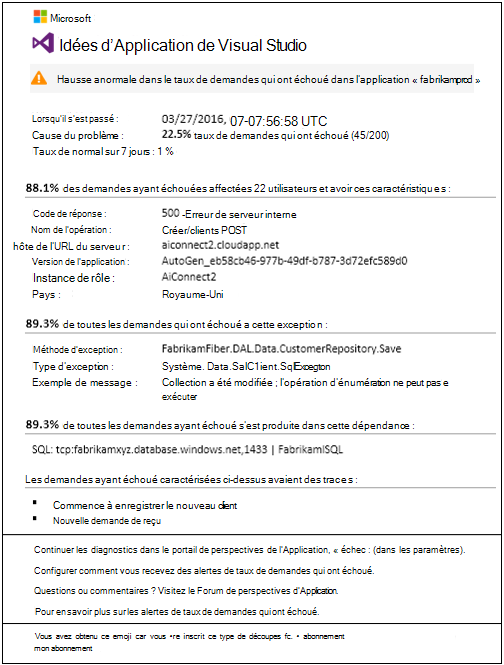

Un deuxième type de détection proactive découvre des corrélations entre les défaillances et de facteurs tels que le type de navigateur, système d’exploitation client ou emplacement.

### Alertes de métriques

Vous pouvez configurer des [alertes métriques](app-insights-alerts.md) pour vous indiquer quand toute mesure dépasse une valeur de seuil pendant une certaine période - par exemple nombre de défaillance, la mémoire ou les vues de page.

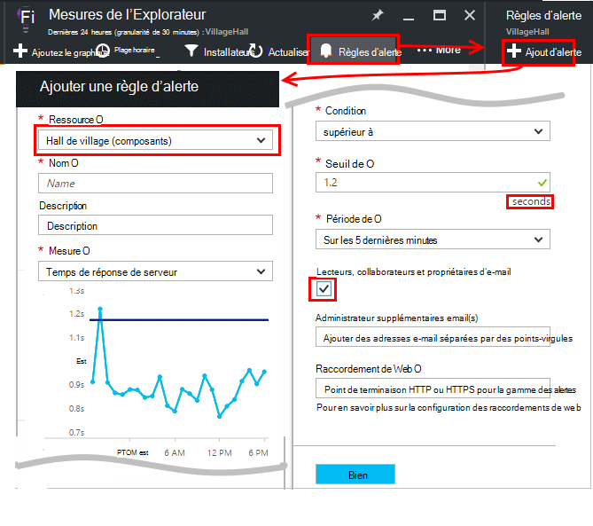

### Disponibilité

[Les tests de disponibilité web](app-insights-monitor-web-app-availability.md) envoient des demandes à votre site à partir de nos serveurs à différents emplacements dans le monde entier. Ils vous indiquent lorsque votre site n’est pas disponible sur internet, ou ne répond lentement. 

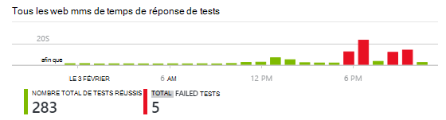

## Exporter

Il existe plusieurs méthodes que vous pouvez obtenir les données de télémétrie au portail d’idées d’Application :

* [Exporter en continu](app-insights-export-telemetry.md) est idéale si vous souhaitez conserver la plus grande partie de votre télémétrie plus longtemps que la période de rétention standard.
* Tables de [mesures](app-insights-metrics-explorer.md#export-to-excel) , les résultats de la recherche et les résultats de [Analytique](app-insights-analytics.md) peuvent être exportées vers une feuille de calcul Excel. 
* L’API reste d’accès aux données peut être utilisé pour rechercher et extraire les données, y compris l’exécution des requêtes Analytique. L’API est en cours d’aperçu privé. [En savoir plus sur l’adhésion à l’aperçu](https://visualstudio.uservoice.com/forums/357324-application-insights/suggestions/4999529-make-data-accessible-via-apis-for-custom-processin).
* Vous pouvez exporter des tableaux de bord de [requêtes Analytique à alimentation BI](app-insights-export-power-bi.md) et afficher les résultats dans les visualisations BI de puissance, qui peuvent être actualisées automatiquement.

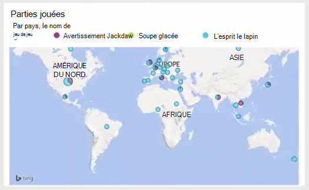
 
## Gestion des données

Il existe des limites de l’utilisation de perspectives d’Application, qui en dépendent dans une certaine mesure la tarification que vous choisissez. Les principales limites sont :

* Taux de télémétrie par minute
* Nombre de points de données par mois
* Période de rétention des données

[L’échantillonnage](app-insights-sampling.md) est un mécanisme de réduction des coûts et d’éviter la limitation. Il rejette une proportion de votre télémétrie, conservant un échantillon représentatif. Éléments associés (par exemple, les exceptions et les requêtes qui les a) sont conservés ou supprimés ensemble. Pour les applications ASP.NET, le prélèvement est automatique et est appliqué dans l’application ; Vous pouvez définir dans le cas contraire, qu’il soit appliqué à l’ingestion pour le portail.

## Étapes suivantes

Mise en route lors de l’exécution avec :

* [Serveur IIS](app-insights-monitor-performance-live-website-now.md)
* [Serveur de J2EE](app-insights-java-live.md)

Mise en route au moment du développement avec :

* [ASP.NET](app-insights-asp-net.md)
* [Java](app-insights-java-get-started.md)
* [Node.js](app-insights-nodejs.md)

## Commentaires et support

* Questions et problèmes :
 * [Résolution des problèmes][qna]
 * [Forum MSDN](https://social.msdn.microsoft.com/Forums/vstudio/home?forum=ApplicationInsights)
 * [StackOverflow](http://stackoverflow.com/questions/tagged/ms-application-insights)
 * [Obtenir de l’aide du développeur](app-insights-get-dev-support.md)
* Vos suggestions :
 * [UserVoice](https://visualstudio.uservoice.com/forums/357324)
* Blog :
 * [Application Insights blog](https://azure.microsoft.com/blog/tag/application-insights)

## Vidéos

[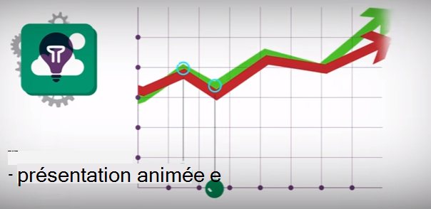](https://www.youtube.com/watch?v=fX2NtGrh-Y0)

> [AZURE.VIDEO 218]

> [AZURE.VIDEO usage-monitoring-application-insights]

> [AZURE.VIDEO performance-monitoring-application-insights]

> [Animation d’introduction](https://www.youtube.com/watch?v=fX2NtGrh-Y0)

<!--Link references-->

[android]: https://github.com/Microsoft/ApplicationInsights-Android
[azure]: ../insights-perf-analytics.md
[client]: app-insights-javascript.md
[desktop]: app-insights-windows-desktop.md
[detect]: app-insights-detect-triage-diagnose.md
[greenbrown]: app-insights-asp-net.md
[ios]: https://github.com/Microsoft/ApplicationInsights-iOS
[java]: app-insights-java-get-started.md
[knowUsers]: app-insights-overview-usage.md
[platforms]: app-insights-platforms.md
[portal]: http://portal.azure.com/
[qna]: app-insights-troubleshoot-faq.md
[redfield]: app-insights-monitor-performance-live-website-now.md

 