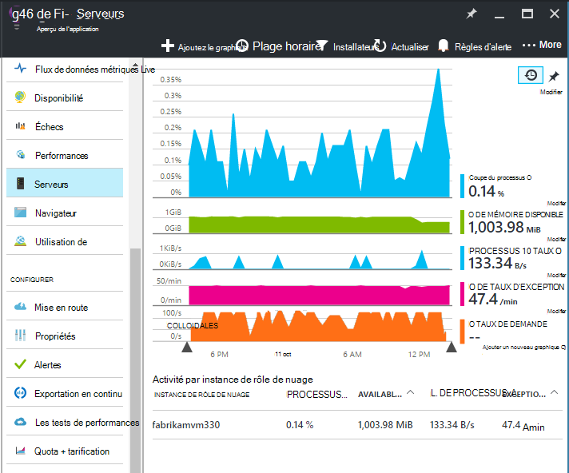
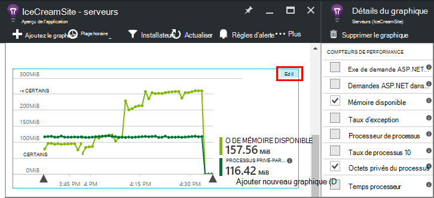
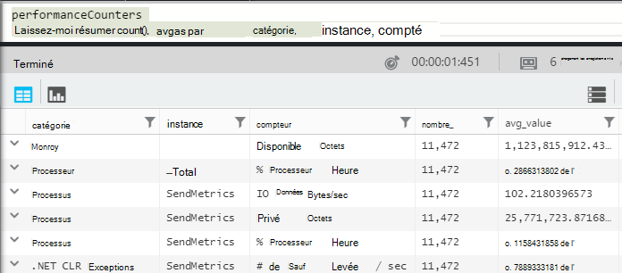
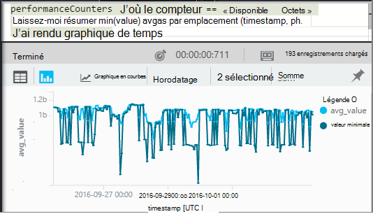
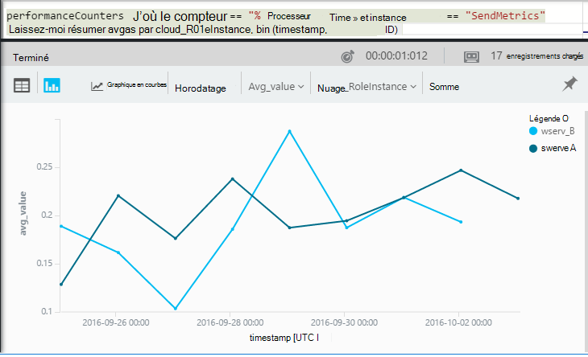

<properties 
    pageTitle="Compteurs de performance dans les perspectives d’Application | Microsoft Azure" 
    description="Moniteur système et les compteurs de performance .NET personnalisés dans les perspectives de l’Application." 
    services="application-insights" 
    documentationCenter=""
    authors="alancameronwills" 
    manager="douge"/>

<tags 
    ms.service="application-insights" 
    ms.workload="tbd" 
    ms.tgt_pltfrm="ibiza" 
    ms.devlang="na" 
    ms.topic="article" 
    ms.date="10/11/2016" 
    ms.author="awills"/>
 
# <a name="system-performance-counters-in-application-insights"></a>Compteurs de performance système dans les perspectives de l’Application


Windows fournit une grande variété de [compteurs de performance](http://www.codeproject.com/Articles/8590/An-Introduction-To-Performance-Counters) , tels que l’occupation du processeur, mémoire, disque et l’utilisation du réseau. Vous pouvez également définir les vôtres. [Aperçu de l’application](app-insights-overview.md) peut afficher ces compteurs de performance de si votre application s’exécute sous IIS sur un hôte de locaux ou d’un ordinateur virtuel pour lequel vous disposez d’un accès administratif. Les graphiques indiquent les ressources disponibles pour vos applications en ligne et peuvent aider à identifier l’équilibrage de charge entre les instances de serveur.

Les compteurs de performance s’affichent dans la lame de serveurs, ce qui inclut une table à ces segments par instance de serveur.



(Compteurs de performance ne sont pas disponibles pour les applications Web Azure. Mais vous pouvez [Envoyer des Diagnostics Azure aux analyses de l’Application](app-insights-azure-diagnostics.md).)

## <a name="configure"></a>Configurer

Si le moniteur d’état Application aperçus n’est pas encore installé sur vos ordinateurs de serveur, vous devez l’installer pour afficher les compteurs de performance.

Téléchargez et exécutez le [programme d’installation de l’Analyseur de l’état](http://go.microsoft.com/fwlink/?LinkId=506648) sur chaque instance du serveur. S’il est déjà installé, vous n’avez pas besoin de le réinstaller.

* *J’ai [installé le SDK de perspectives d’Application dans mon application](app-insights-asp-net.md) pendant le développement. Dois-je toujours moniteur d’état ?*

    Oui, le moniteur d’état est nécessaire pour collecter les compteurs de performance pour les applications web ASP.NET. Comme vous le savez peut-être déjà, moniteur d’état permet également aux [applications web de moniteur qui sont déjà live](app-insights-monitor-performance-live-website-now.md), sans installer le Kit de développement logiciel pendant le développement.


## <a name="view-counters"></a>Afficher les compteurs

La lame de serveurs affiche un ensemble par défaut des compteurs de performance. 

Pour afficher d’autres compteurs, modifier les graphiques sur la lame de serveurs, ou ouvrir une nouvelle lame de [Mesures Explorer](app-insights-metrics-explorer.md) et ajouter des graphiques. 

Lorsque vous modifiez un graphique, les compteurs disponibles sont répertoriés en tant que mesures.



Pour voir tous vos graphiques plus utiles dans un seul endroit, créer un [tableau de bord](app-insights-dashboards.md) et les épingler à celui-ci.

## <a name="add-counters"></a>Ajouter des compteurs

Si le compteur de performance que vous souhaitez n’apparaît pas dans la liste des mesures, c’est parce que les perspectives d’Application SDK n’est pas la collecte de votre serveur web. Vous pouvez le configurer pour le faire.

1. Découvrez quels compteurs sont disponibles sur votre serveur à l’aide de cette commande PowerShell au niveau du serveur :

    `Get-Counter -ListSet *`

    (See [`Get-Counter`](https://technet.microsoft.com/library/hh849685.aspx).)

1. Ouvrez ApplicationInsights.config.

 * Si vous avez ajouté des perspectives d’Application à votre application pendant le développement, modifier ApplicationInsights.config dans votre projet et puis redéployer sur vos serveurs.
 * Si vous avez utilisé le moniteur d’état pour instrumenter une application web en cours d’exécution, recherchez ApplicationInsights.config dans le répertoire racine de l’application dans IIS. Mettre à jour celui-ci dans chaque instance de serveur.

2. Modifiez la directive de collecteur de performances :

 ```XML

    <Add Type="Microsoft.ApplicationInsights.Extensibility.PerfCounterCollector.PerformanceCollectorModule, Microsoft.AI.PerfCounterCollector">
      <Counters>
        <Add PerformanceCounter="\Objects\Processes"/>
        <Add PerformanceCounter="\Sales(photo)\# Items Sold" ReportAs="Photo sales"/>
      </Counters>
    </Add>

```

Vous pouvez capturer les compteurs standard et celles que mises en œuvre de vous-même. `\Objects\Processes`est un exemple d’un compteur standard, disponible sur tous les systèmes Windows. `\Sales(photo)\# Items Sold`est un exemple d’un compteur personnalisé qui peut être implémenté dans un service web. 

Le format est `\Category(instance)\Counter"`, ou pour des catégories n’ayant pas d’instances, simplement `\Category\Counter`.

`ReportAs`est requis pour les noms de compteur qui ne correspondent pas aux `[a-zA-Z()/-_ \.]+` -autrement dit, ils contiennent des caractères qui ne sont pas dans les jeux suivants : lettres, round entre crochets, barre oblique, trait d’union, traits de soulignement, espace, point.

Si vous spécifiez une instance, il sera collecté en tant que dimension « CounterInstanceName » de la mesure signalée.

### <a name="collecting-performance-counters-in-code"></a>Collecte des compteurs de performance dans le code

Pour collecter les compteurs de performance système et les perspectives de l’Application, vous pouvez adapter l’extrait de code ci-dessous :

    var perfCollectorModule = new PerformanceCollectorModule();
    perfCollectorModule.Counters.Add(new PerformanceCounterCollectionRequest(
      @"\.NET CLR Memory([replace-with-application-process-name])\# GC Handles", "GC Handles")));
    perfCollectorModule.Initialize(TelemetryConfiguration.Active);

Ou bien, vous pouvez faire la même chose avec des mesures personnalisées, que vous avez créé :

    var perfCollectorModule = new PerformanceCollectorModule();
    perfCollectorModule.Counters.Add(new PerformanceCounterCollectionRequest(
      @"\Sales(photo)\# Items Sold", "Photo sales"));
    perfCollectorModule.Initialize(TelemetryConfiguration.Active);

## <a name="performance-counters-in-analytics"></a>Compteurs de performance Analytique

Vous pouvez rechercher et afficher des rapports de compteur de performance dans [Analytique](app-insights-analytics.md).


Le schéma de **compteurs de performance** expose le `category`, `counter` nom, et `instance` nom de chaque compteur de performance.  Dans la télémétrie pour chaque application, vous verrez uniquement les compteurs pour cette application. Par exemple, pour voir quels compteurs sont disponibles : 



('Instance' ici fait référence à l’instance de compteur de performance, pas l’instance de machine serveur ou du rôle. Le nom d’instance de compteur performances généralement les segments compteurs de temps processeur par le nom du processus ou l’application.)

Pour obtenir un graphique de mémoire disponible sur la période récente : 




Comme les autre télémétrie, **compteurs de performance** a également une colonne `cloud_RoleInstance` qui indique l’identité de l’instance de serveur hôte sur lequel votre application s’exécute. Par exemple, pour comparer les performances de votre application sur des ordinateurs différents : 




## <a name="aspnet-and-application-insights-counts"></a>ASP.NET et le nombre d’analyses d’Application

*Quelle est la différence entre le taux d’Exception et les mesures d’Exceptions ?*

* *Taux d’exception* est un compteur de performance système. Le CLR compte toutes les exceptions de gérées et non gérées qui sont levées et divise le total dans un intervalle d’échantillonnage par la longueur de l’intervalle. Le Kit de développement de perspectives Application collecte ce résultat et l’envoie sur le portail.
* *Exceptions* est le nombre de rapports TrackException reçues par le portail dans l’intervalle d’échantillonnage du graphique. Il inclut uniquement les exceptions traitées dans lequel vous avez écrit TrackException appelle dans votre code et n’inclut pas toutes les [exceptions non gérées](app-insights-asp-net-exceptions.md). 

## <a name="alerts"></a>Alertes

Comme d’autres mesures, vous pouvez [définir une alerte](app-insights-alerts.md) pour vous avertir si un compteur de performance est à l’extérieur d’une limite que vous spécifiez. La blade d’alertes, cliquez sur Ajouter une alerte.


## <a name="next"></a>Étapes suivantes

* [Suivi des dépendances](app-insights-asp-net-dependencies.md)
* [Exception de suivi](app-insights-asp-net-exceptions.md)