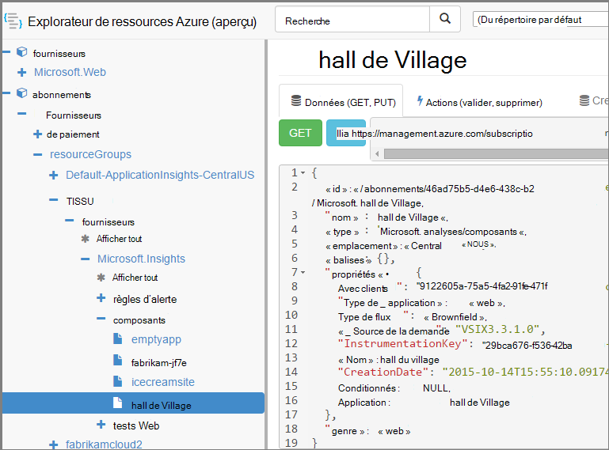

<properties 
    pageTitle="Créer des ressources de perspectives de l’Application à l’aide de PowerShell" 
    description="Créer par programme des ressources de l’Application Aperçu dans le cadre de votre génération." 
    services="application-insights" 
    documentationCenter=""
    authors="alancameronwills" 
    manager="douge"/>

<tags 
    ms.service="application-insights" 
    ms.workload="tbd" 
    ms.tgt_pltfrm="ibiza" 
    ms.devlang="na" 
    ms.topic="article" 
    ms.date="03/02/2016" 
    ms.author="awills"/>
 
# <a name="create-application-insights-resources-using-powershell"></a>Créer des ressources de perspectives de l’Application à l’aide de PowerShell

Cet article vous montre comment créer une ressource [d’Idées d’Application](app-insights-overview.md) dans Azure, automatiquement. Vous pouvez, par exemple, faire dans le cadre d’un processus de génération. Avec la ressource perspectives d’Application de base, vous pouvez créer des [tests web de disponibilité](app-insights-monitor-web-app-availability.md), de [configurer des alertes](app-insights-alerts.md)et créez d’autres ressources Azure.

La clé pour la création de ces ressources est modèles JSON pour [Le Gestionnaire de ressources Azure](../powershell-azure-resource-manager.md). En bref, la procédure est : télécharger les définitions de JSON des ressources existantes ; paramétrer certaines valeurs telles que les noms ; puis exécutez le modèle chaque fois que vous souhaitez créer une nouvelle ressource. Vous pouvez regrouper plusieurs ressources, les créer en un seul rendez-vous - par exemple, un moniteur app avec les tests de disponibilité, d’alertes et de stockage pour l’exportation en continu. Il existe quelques subtilités de certains des paramétrages, ce que nous aborderons ici.

## <a name="one-time-setup"></a>Programme d’installation unique

Si vous n’avez pas utilisé de PowerShell avec votre abonnement Azure avant :

Installez le module Powershell de Azure sur l’ordinateur où vous souhaitez exécuter les scripts :

1. Installation de [Microsoft Web Platform Installer (v5 ou ultérieure)](http://www.microsoft.com/web/downloads/platform.aspx).
2. Il permet d’installer Microsoft Azure Powershell.

## <a name="copy-the-json-for-existing-resources"></a>Copier le JSON pour les ressources existantes

1. Définir des [Perspectives d’Application](app-insights-overview.md) pour un projet semblables à celles que vous souhaitez générer automatiquement. Si vous le souhaitez, ajoutez des tests web et les alertes.
2. Créer un nouveau fichier .json - appelons-le `template1.json` dans cet exemple. Copier ce contenu dans celui-ci :


    ```JSON

        {
          "$schema": "https://schema.management.azure.com/schemas/2015-01-01/deploymentTemplate.json#",
          "contentVersion": "1.0.0.0",
          "parameters": {
            "appName": { "type": "string" },
            "webTestName": { "type": "string" },
            "url": { "type": "string" },
            "text": { "type" : "string" }
          },
          "variables": {
            "testName": "[concat(parameters('webTestName'), 
               '-', toLower(parameters('appName')))]"
            "alertRuleName": "[concat(parameters('webTestName'), 
               '-', toLower(parameters('appName')), 
               '-', subscription().subscriptionId)]"
          },
          "resources": [
            {
              // component JSON file contents
            },
            {
              //web test JSON file contents
            },
            {
              //alert rule JSON file contents
            }
 
            // Any other resources go here
          ]
        }
    
    ```

    Ce modèle configure test une disponibilité en plus de la ressource principale.


2. Ouvrez [Le Gestionnaire de ressources Azure](https://resources.azure.com/). Naviguer vers le bas par le biais de `subscriptions/resourceGroups/<your resource group>/providers/Microsoft.Insights/components`, pour les ressources de votre application. 

    

    *Les composants* sont les ressources base de perspectives de l’Application pour afficher les applications. Il existe des ressources distinctes pour les règles d’alerte associées et la disponibilité des tests web.

3. Copier le JSON du composant à l’emplacement approprié dans `template1.json`.
6. Supprimer ces propriétés :
  * `id`
  * `InstrumentationKey`
  * `CreationDate`
4. Ouvrez les sections webtests et alertrules et copiez le JSON pour des articles individuels dans votre modèle. (Ne pas copier à partir des nœuds webtests ou alertrules : accédez dans les éléments.)

    Chaque test web a une règle d’alerte associée, donc vous devez copier les deux.

    Le test web doit être placé avant la règle d’alerte.

5. Pour satisfaire le schéma, insérez la ligne suivante dans chaque ressource :

    `"apiVersion": "2014-04-01",`

    (Le schéma plaint également la mise en majuscules des noms de type de ressources `Microsoft.Insights/*` --mais *ne* modifiez pas ces.)


## <a name="parameterize-the-template"></a>Paramétrer le modèle

Vous devez à présent remplacer les noms spécifiques avec des paramètres. Pour [paramétrer un modèle](../resource-group-authoring-templates.md), vous écrivez des expressions à l’aide d’un [ensemble de fonctions d’assistance](../resource-group-template-functions.md). 

Impossible de paramétrer seulement une partie d’une chaîne, utilisez `concat()` pour générer des chaînes.

Voici quelques exemples des substitutions, à que vous voudrez mettre : Il existe plusieurs occurrences de chaque substitution. Vous devrez peut-être d’autres personnes dans votre modèle. Ces exemples utilisent les paramètres et les variables que nous avons défini en haut du modèle.

Rechercher | remplacer par
---|---
`"hidden-link:/subscriptions/.../components/MyAppName"`| `"[concat('hidden-link:',`<br/>` resourceId('microsoft.insights/components',` <br/> ` parameters('appName')))]"`
`"/subscriptions/.../alertrules/myAlertName-myAppName-subsId",` | `"[resourceId('Microsoft.Insights/alertrules', variables('alertRuleName'))]",`
`"/subscriptions/.../webtests/myTestName-myAppName",` | `"[resourceId('Microsoft.Insights/webtests', parameters('webTestName'))]",`
`"myWebTest-myAppName"` | `"[variables(testName)]"'`
`"myTestName-myAppName-subsId"` | `"[variables('alertRuleName')]"`
`"myAppName"` | `"[parameters('appName')]"`
`"myappname"`(minuscule) | `"[toLower(parameters('appName'))]"`
`"<WebTest Name=\"myWebTest\" ...`<br/>` Url=\"http://fabrikam.com/home\" ...>"`|`[concat('<WebTest Name=\"',` <br/> `parameters('webTestName'),` <br/> `'\" ... Url=\"', parameters('Url'),` <br/> `'\"...>')]" `


## <a name="set-dependencies-between-the-resources"></a>Définition de relations entre les ressources

Azure doit définir les ressources dans un ordre strict. Pour vous assurer une installation se termine avant le début de la suivante, ajoutez les lignes de dépendance :

* Dans la ressource de test web :

    `"dependsOn": ["[resourceId('Microsoft.Insights/components', parameters('appName'))]"],`

* Dans la ressource d’alerte :

    `"dependsOn": ["[resourceId('Microsoft.Insights/webtests', variables('testName'))]"],`

## <a name="create-application-insights-resources"></a>Créer des ressources de l’Application aperçu

1. Dans PowerShell, connectez-vous à Azure

    `Login-AzureRmAccount`

2. Exécutez une commande comme suit :

    ```PS

        New-AzureRmResourceGroupDeployment -ResourceGroupName Fabrikam `
               -templateFile .\template1.json `
               -appName myNewApp `
               -webTestName aWebTest `
               -Url http://myapp.com `
               -text "Welcome!"
               -siteName "MyAzureSite"

    ``` 

    * -ResourceGroupName est le groupe dans lequel vous souhaitez créer les nouvelles ressources.
    * -templateFile doit se produire avant les paramètres personnalisés.
    * -appName nom de la ressource à créer.
    * -webTestName le nom du test web à créer.
    * -Url l’url de votre application web.
    * -Une chaîne qui apparaît dans votre page web.
    * -siteName - utilisée s’il s’agit d’un site Web d’Azure


## <a name="define-metric-alerts"></a>Définir des alertes métriques

Il existe une [méthode PowerShell de définition d’alertes](app-insights-alerts.md#set-alerts-by-using-powershell).


## <a name="an-example"></a>Un exemple

Voici les composants, le test web et le modèle alerte web test que j’ai créé :

``` JSON

{
  "$schema": "https://schema.management.azure.com/schemas/2015-01-01/deploymentTemplate.json#",
  "contentVersion": "1.0.0.0",
  "parameters": {
    "webTestName": { "type": "string" },
    "appName": { "type": "string" },
    "URL": { "type": "string" },
    "text": { "type" : "string" }
  },
  "variables": {
    "alertRuleName": "[concat(parameters('webTestName'), '-', toLower(parameters('appName')), '-', subscription().subscriptionId)]",
    "testName": "[concat(parameters('webTestName'), '-', toLower(parameters('appName')))]"
  },
  "resources": [
    {
      //"id": "[resourceId('Microsoft.Insights/components', parameters('appName'))]",
      "apiVersion": "2014-04-01",
      "kind": "web",
      "location": "Central US",
      "name": "[parameters('appName')]",
      "properties": {
        "TenantId": "9122605a-471fc50f8438",
        "Application_Type": "web",
        "Flow_Type": "Brownfield",
        "Request_Source": "VSIX3.3.1.0",
        "Name": "[parameters('appName')]",
        //"CreationDate": "2015-10-14T15:55:10.0917441+00:00",
        "PackageId": null,
        "ApplicationId": "[parameters('appName')]"
      },
      "tags": { },
      "type": "microsoft.insights/components"
    },
    {
      //"id": "[resourceId('Microsoft.Insights/webtests', variables('testName'))]",
      "name": "[variables('testName')]",
      "apiVersion": "2014-04-01",
      "type": "microsoft.insights/webtests",
      "location": "Central US",
      "tags": {
        "[concat('hidden-link:', resourceId('microsoft.insights/components', parameters('appName')))]": "Resource"
      },
      "properties": {
        "provisioningState": "Succeeded",
        "Name": "[parameters('webTestName')]",
        "Description": "",
        "Enabled": true,
        "Frequency": 900,
        "Timeout": 120,
        "Kind": "ping",
        "RetryEnabled": true,
        "Locations": [
          {
            "Id": "us-va-ash-azr"
          },
          {
            "Id": "emea-nl-ams-azr"
          },
          {
            "Id": "emea-gb-db3-azr"
          }
        ],
        "Configuration": {
          "WebTest": "[concat(
             '<WebTest   Name=\"', 
                parameters('webTestName'), 
              '\"  Id=\"32cfc791-aaad-4b50-9c8d-993c21beb218\"   Enabled=\"True\"         CssProjectStructure=\"\"    CssIteration=\"\"  Timeout=\"120\"  WorkItemIds=\"\"         xmlns=\"http://microsoft.com/schemas/VisualStudio/TeamTest/2010\"         Description=\"\"  CredentialUserName=\"\"  CredentialPassword=\"\"         PreAuthenticate=\"True\"  Proxy=\"default\"  StopOnError=\"False\"         RecordedResultFile=\"\"  ResultsLocale=\"\">  <Items>  <Request Method=\"GET\"         Guid=\"a6f2c90b-61bf-b28hh06gg969\"  Version=\"1.1\"  Url=\"', 
              parameters('Url'), 
              '\" ThinkTime=\"0\"  Timeout=\"300\" ParseDependentRequests=\"True\"         FollowRedirects=\"True\" RecordResult=\"True\" Cache=\"False\"         ResponseTimeGoal=\"0\"  Encoding=\"utf-8\"  ExpectedHttpStatusCode=\"200\"         ExpectedResponseUrl=\"\" ReportingName=\"\" IgnoreHttpStatusCode=\"False\" />        </Items>  <ValidationRules> <ValidationRule  Classname=\"Microsoft.VisualStudio.TestTools.WebTesting.Rules.ValidationRuleFindText, Microsoft.VisualStudio.QualityTools.WebTestFramework, Version=10.0.0.0, Culture=neutral, PublicKeyToken=b03f5f7f11d50a3a\" DisplayName=\"Find Text\"         Description=\"Verifies the existence of the specified text in the response.\"         Level=\"High\"  ExectuionOrder=\"BeforeDependents\">  <RuleParameters>        <RuleParameter Name=\"FindText\" Value=\"', 
              parameters('text'), 
              '\" />  <RuleParameter Name=\"IgnoreCase\" Value=\"False\" />  <RuleParameter Name=\"UseRegularExpression\" Value=\"False\" />  <RuleParameter Name=\"PassIfTextFound\" Value=\"True\" />  </RuleParameters> </ValidationRule>  </ValidationRules>  </WebTest>')]"
        },
        "SyntheticMonitorId": "[variables('testName')]"
      }
    },
    {
      //"id": "[resourceId('Microsoft.Insights/alertrules', variables('alertRuleName'))]",
      "name": "[variables('alertRuleName')]",
      "apiVersion": "2014-04-01",
      "type": "microsoft.insights/alertrules",
      "location": "East US",
      "dependsOn": [
        "[resourceId('Microsoft.Insights/components', parameters('appName'))]",
        "[resourceId('Microsoft.Insights/webtests', variables('testName'))]"
      ],
      "tags": {
        "[concat('hidden-link:', resourceId('Microsoft.Insights/components', parameters('appName')))]": "Resource",
        "[concat('hidden-link:', resourceId('Microsoft.Insights/webtests', variables('testName')))]": "Resource"
      },
      "properties": {
        "name": "[variables('alertRuleName')]",
        "description": "",
        "isEnabled": true,
        "condition": {
          "$type": "Microsoft.WindowsAzure.Management.Monitoring.Alerts.Models.LocationThresholdRuleCondition, Microsoft.WindowsAzure.Management.Mon.Client",
          "odata.type": "Microsoft.Azure.Management.Insights.Models.LocationThresholdRuleCondition",
          "dataSource": {
            "$type": "Microsoft.WindowsAzure.Management.Monitoring.Alerts.Models.RuleMetricDataSource, Microsoft.WindowsAzure.Management.Mon.Client",
            "odata.type": "Microsoft.Azure.Management.Insights.Models.RuleMetricDataSource",
            "resourceUri": "[resourceId('microsoft.insights/webtests', variables('testName'))]",
            "metricName": "GSMT_AvRaW"
          },
          "windowSize": "PT15M",
          "failedLocationCount": 2
        },
        "action": {
          "$type": "Microsoft.WindowsAzure.Management.Monitoring.Alerts.Models.RuleEmailAction, Microsoft.WindowsAzure.Management.Mon.Client",
          "odata.type": "Microsoft.Azure.Management.Insights.Models.RuleEmailAction",
          "sendToServiceOwners": true,
          "customEmails": [ ]
        },
        "provisioningState": "Succeeded",
        "actions": [ ]
      }

    }
  ]
}

```

## <a name="see-also"></a>Voir aussi

Autres articles d’automation :

* [Créer une ressource d’Application perspectives](app-insights-powershell-script-create-resource.md) - méthode rapide sans utiliser de modèle.
* [Configurer des alertes](app-insights-powershell-alerts.md)
* [Créer des tests web](https://azure.microsoft.com/blog/creating-a-web-test-alert-programmatically-with-application-insights/)
* [Envoyer les Diagnostics de Windows Azure pour les perspectives de l’Application](app-insights-powershell-azure-diagnostics.md)
* [Créer des annotations de version](https://github.com/Microsoft/ApplicationInsights-Home/blob/master/API/CreateReleaseAnnotation.ps1)
