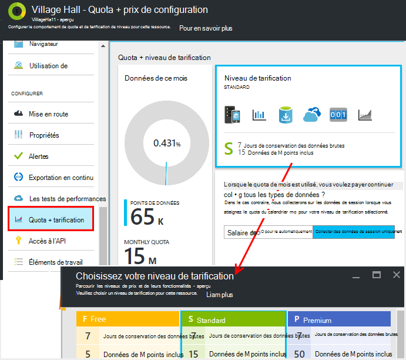
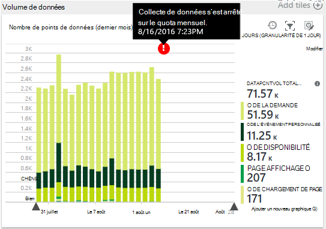
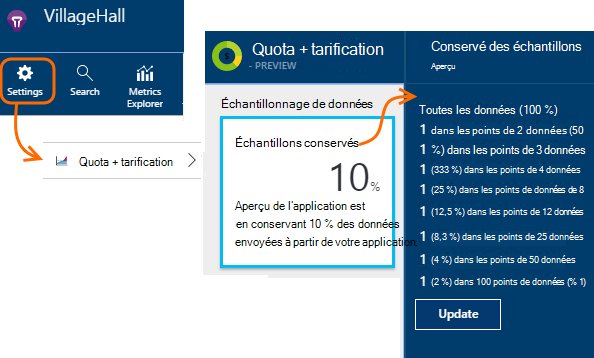
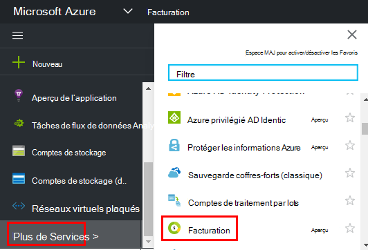

<properties 
    pageTitle="Gérer les prix et le quota d’idées d’Application | Microsoft Azure" 
    description="Sélectionnez le plan de prix que vous avez besoin, gérer des volumes de télémétrie" 
    services="application-insights" 
    documentationCenter=""
    authors="alancameronwills" 
    manager="douge"/>

<tags 
    ms.service="application-insights" 
    ms.workload="tbd" 
    ms.tgt_pltfrm="ibiza" 
    ms.devlang="na" 
    ms.topic="article" 
    ms.date="10/13/2016" 
    ms.author="awills"/>

# Gérer la tarification et quota pour les perspectives de l’Application

*Idées d’application est en mode Aperçu.*

[Prix] [ pricing] [d’Idées d’Application Visual Studio] [ start] est basée sur le volume de données par l’application. Il existe une couche libre substantielle, dans lequel vous obtenez la plupart des fonctionnalités avec certaines limitations.

Chaque ressource de l’Application aperçu est facturé comme un service distinct et contribue à la facture de votre abonnement à Azure.

[Afficher le modèle de tarification][pricing].

## Examen du plan quota et le prix de votre ressource de perspectives de l’Application

Vous pouvez ouvrir le Quota + tarification lame à partir des paramètres de ressource de votre application.

A une incidence sur le choix du mécanisme de tarification :

* [Quota mensuel](#monthly-quota) - montant de télémétrie que vous pouvez d’analyser chaque mois.
* [Débit de données](#data-rate) - la vitesse maximale à laquelle les données de votre application peuvent être traitées.
* [Exportation de continu](#continuous-export) - si vous pouvez exporter des données à d’autres outils et les services.

Ces limites sont définies séparément pour chaque ressource de perspectives de l’Application.

### Version d’évaluation gratuite de prime

Lorsque vous créez une nouvelle ressource de perspectives de l’Application, elle démarre dans la couche libre.

À tout moment, vous pouvez passer à la version d’évaluation de 30 jours gratuite Premium. Cela vous offre les avantages du niveau Premium. Après 30 jours, il sera automatiquement rétablie sur quel niveau vous était avant - sauf si vous choisissez explicitement une autre couche. Vous sélectionnez la couche que vous souhaitez à tout moment au cours de la période d’évaluation, mais vous obtenez toujours la version d’évaluation gratuite jusqu'à la fin de la période de 30 jours.

## Quota mensuel

* Chaque mois, votre application peut envoyer à une quantité déterminée de télémétrie pour les perspectives de l’Application. Le quota pour le niveau de tarification libre est actuellement 5 million de points de données par mois et beaucoup plus pour les autres régimes ; Vous pouvez acheter d’autres si vous atteignez le quota.  Consultez le [mécanisme de tarification] [ pricing] pour les nombres réels. 
* Le quota dépend du niveau de prix que vous avez choisi.
* Le quota est calculée à partir de l’UTC minuit le premier jour de chaque mois.
* Le graphique de points de données indique combien de votre quota a été utilisé jusqu'à ce mois.
* Le quota est mesuré en *des points de données.* Un seul point de données est un appel à l’une des méthodes de suivi, si explicitement appelée dans votre code, ou par un des modules standard de télémétrie. Il peut avoir plusieurs propriétés jointes et une métrique.
* Points de données sont générées par :
 * [Modules du Kit de développement logiciel](app-insights-configuration-with-applicationinsights-config.md) collecter automatiquement des données, par exemple pour signaler une demande ou une panne ou pour mesurer les performances.
 * [API](app-insights-api-custom-events-metrics.md) `Track...` les appels que vous avez écrit, tel que `TrackEvent` ou `trackPageView`.
 * [Les tests de disponibilité web](app-insights-monitor-web-app-availability.md) que vous avez configurées.
* Pendant que vous déboguez, vous pouvez voir les points de données envoyés à partir de votre application dans la fenêtre Sortie de Visual Studio. Les événements client sont visibles en ouvrant que le volet (généralement F12) de débogage de l’onglet réseau dans votre navigateur.
* *Les données de session* n’est pas compté dans le quota. Cela inclut le nombre d’utilisateurs, de sessions, d’environnement et de données de périphérique.
* Si vous souhaitez compter les points de données par l’inspection, vous les trouverez dans divers endroits :
 * Chaque élément que vous voyez dans la [recherche de diagnostic](app-insights-diagnostic-search.md), qui inclut les demandes HTTP, exceptions, journal des traces, vues de page, les événements de dépendance et des événements personnalisés.
 * Chaque mesure brute d’une [métrique](app-insights-metrics-explorer.md) , par exemple un compteur de performance. (Les points que vous voyez dans les graphiques sont généralement des regroupements de plusieurs points de données brutes).
 * Chaque point d’un graphique de la disponibilité web est également un agrégat de plusieurs points de données.
* Vous pouvez également inspecter les points de données individuels à la source pendant le débogage :
 * Si vous exécutez votre application en mode débogage dans Visual Studio, les points de données sont enregistrés dans la fenêtre Sortie. 
 * Pour afficher les points de données client, ouvrez le volet de débogage de votre navigateur (généralement F12), puis ouvrez l’onglet réseau.
* Le débit de données peut être (par défaut) diminué [d’échantillonnage adapté](app-insights-sampling.md). Cela signifie que, comme l’utilisation de votre application d’augmente, le taux de télémétrie n’augmente autant que vous pouvez vous y attendre.

### Excédent

Si votre application envoie plus que le quota mensuel, vous pouvez :

* Paiement en fonction des données supplémentaires. Consultez le [mécanisme de tarification] [ pricing] pour plus de détails. Vous pouvez choisir cette option à l’avance. Cette option n’est pas disponible dans le libre de niveau de prix.
* Mettre à jour votre niveau de tarification.
* Ne rien faire. Continuent à enregistrer les données de session, mais les autres données n’apparaîtront pas dans la recherche de diagnostic ou dans l’Explorateur de mesures.

## La quantité de données envoi ?

Le graphique en bas de la tarification lame indique le volume des points de données de votre application, regroupées par type de point de données. (Vous pouvez également créer ce graphique dans l’Explorateur de métrique).

Cliquez sur le graphique pour plus de détails, ou faites-le et cliquez sur (+) pour le détail d’une plage de temps.

Le graphique indique le volume de données qui arrivent sur le service informations d’Application, après [l’échantillonnage](app-insights-sampling.md).

Si le volume de données atteint votre quota mensuel, une annotation s’affiche dans le graphique.

## Débit de données

Outre le quota mensuel, sont des limites limitation sur le débit de données. Pour la libre [tarification couche] [ pricing] la limite donnée de 200 points par seconde moyenne pendant 5 minutes et pour les niveaux le payant, il est 500/s moyenne plus d’une minute. 

Il existe trois compartiments qui sont comptés séparément :

* [Appels de TrackTrace](app-insights-api-custom-events-metrics.md#track-trace) et de [capturer des journaux](app-insights-asp-net-trace-logs.md)
* [Exceptions](app-insights-api-custom-events-metrics.md#track-exception), limité à 50 points/s.
* Tous les autre télémétrie (vues de page, sessions, demandes, dépendances, mesures, les événements personnalisés, résultats des tests web).

*Que se passe-t-il si mon application dépasse le taux par seconde ?*

* Le volume de données que votre application envoie est évalué toutes les minutes. S’il dépasse le taux par seconde de moyenne pour les minutes, le serveur refuse de certaines demandes. Le Kit de développement logiciel met les données en mémoire tampon et essaie de renvoyer, étendage une surtension sur plusieurs minutes. Si votre application envoie régulièrement des données à la vitesse de régulation, certaines données seront ignorées. (Les ASP.NET, Java et JavaScript SDK essaient de renvoyer de cette manière ; autres kits SDK peut simplement les données de dépôt limité).

Si la limitation se produit, vous voyez une notification d’avertissement que ceci est arrivé.

*Comment savoir le nombre des points de données l’envoi de mon application ?*

* Ouvrez les tarifs et les paramètres/Quota pour afficher le graphique du Volume de données.
* Dans l’Explorateur de métriques, ajouter un nouveau graphique et sélectionnez le **volume des points de données** comme métrique. Basculez sur le regroupement et regrouper par **type de données**.

## Pour réduire la fréquence des données

Si vous rencontrez les limites limitation, voici quelques éléments que vous pouvez faire :

* Utilisez [l’échantillonnage](app-insights-sampling.md). Cette technologie permet de réduire les taux de données sans inclinaison vos mesures et sans interruption de la possibilité de naviguer entre les éléments associés dans la recherche.
* [Limite le nombre d’appels Ajax qui peuvent être signalés](app-insights-javascript.md#detailed-configuration) dans chaque commutateur hors Ajax reporting ou mode page.
* Désactiver des modules de collecte qu'en [modifiant les ApplicationInsights.config](app-insights-configuration-with-applicationinsights-config.md)vous n’avez pas besoin. Par exemple, vous pouvez décider que les compteurs de performance ou les données de dépendance sont inessential.
* Agrégation des mesures. Si vous avez placé les appels à TrackMetric dans votre application, vous pouvez réduire le trafic à l’aide de la surcharge qui accepte le calcul de la moyenne et l’écart-type standard d’un lot de mesures. Ou bien, vous pouvez utiliser un [package avant de groupement](https://www.myget.org/gallery/applicationinsights-sdk-labs). 

## Échantillonnage

[L’échantillonnage](app-insights-sampling.md) est une méthode de réduction de la vitesse à laquelle les télémétrie est envoyé à votre application, tout en conservant la possibilité de rechercher des événements connexes au cours des recherches de diagnostics et en conservant correct événement compte. 

L’échantillonnage est un moyen efficace de réduire les frais et de rester au sein de votre quota mensuel. L’algorithme d’échantillonnage conserve les éléments associés de télémétrie, afin que, par exemple, lorsque vous utilisez la recherche, vous pouvez trouver la demande liée à une exception spécifique. L’algorithme conserve également le nombre correct, afin que vous consultez les valeurs correctes dans l’Explorateur de mesure pour le taux de demande, taux d’exception et les autres nombres.

Il existe plusieurs formes de prélèvement.

* [D’échantillonnage adapté](app-insights-sampling.md) est la valeur par défaut pour le Kit de développement ASP.NET, qui s’ajuste automatiquement pour le volume de télémétrie qui envoie de votre application. Il fonctionne automatiquement dans le Kit de développement de votre application web, le trafic de télémétrie sur le réseau est réduit. 
* *Échantillonnage de réception* est une alternative qui fonctionne au niveau du point où les données télémétriques fournies par votre application entre le service informations d’Application. Il n’affecte pas le volume de télémétrie envoyé à partir de votre application, mais il permet de réduire le volume conservé par le service. Vous pouvez l’utiliser pour réduire le quota utilisé par télémétrie de navigateurs et d’autres kits de développement logiciel.

Pour définir le prélèvement d’échantillons de l’ingestion, définissez le contrôle dans le cadre des contingents + tarification blade :

> [AZURE.WARNING] La valeur affichée dans la fenêtre des échantillons conservés n'indique que la valeur que vous avez défini pour l’échantillonnage de l’ingestion. Il n’affiche pas le taux d’échantillonnage fonctionne le Kit de développement de votre application. 
> 
> Si la télémétrie entrante a déjà été prélevé dans le Kit de développement, l’échantillonnage de réception n’est pas appliquée.
 
Pour découvrir la fréquence d’échantillonnage réelle, quel que soit l’endroit où il a été appliqué, utilisez une [requête d’Analytique](app-insights-analytics.md) comme cela :

    requests | where timestamp > ago(1d)
  	| summarize 100/avg(itemCount) by bin(timestamp, 1h) 
  	| render areachart 

Dans chaque conservés enregistrement, `itemCount` indique le nombre d’enregistrements d’origine qu’il représente, égal à 1 + le nombre d’enregistrements ignorés précédents. 

## Passez en revue la facture de votre abonnement vers Azure

Frais de perspectives d’application sont ajoutés à votre facture Azure. Vous pouvez voir les détails de votre Azure facturer dans la section facturation d’Azure portal ou dans le [Portail de facturation Azure](https://account.windowsazure.com/Subscriptions). 

## Limites de nom

1.  Maximum de 200 noms de mesures uniques et de 200 noms de propriété unique pour votre application. Les mesures incluent des données envoyées via la TrackMetric ainsi que des mesures sur les autres types de données tels que les événements.  [Les noms de mesures et de la propriété] [ api] sont globaux par clé d’instrumentation.
2.  [Propriétés] [ apiproperties] peut être utilisé pour le filtrage et group by uniquement pendant qu’ils ont moins de 100 valeurs uniques pour chaque propriété. Après que le nombre de valeurs uniques est supérieur à 100, vous pouvez toujours rechercher la propriété, mais n’est plus l’utiliser pour les filtres ou par groupe.
3.  Propriétés standard, telles que le nom de la demande et l’URL de la Page sont limitées à des valeurs uniques de 1000 par semaine. Après 1000 valeurs uniques, les autres valeurs sont marqués comme « Autres valeurs ». Les valeurs d’origine peuvent toujours servir pour le filtrage et la recherche de texte intégral.

Si vous trouvez que votre application est le dépassement de ces limites, envisagez de répartir les données entre les clés différentes instrumentations - c'est-à-dire, [créer des ressources de l’Application aperçu](app-insights-create-new-resource.md) et envoyer des données pour les nouvelles clés de l’instrumentation. Vous trouverez peut-être que le résultat est mieux structuré. Vous pouvez utiliser des [tableaux de bord](app-insights-dashboards.md#dashboards) pour afficher les différentes mesures sur le même écran, afin que cette approche ne limiter votre capacité à comparer les différentes mesures. 

## Résumé des limites

[AZURE.INCLUDE [application-insights-limits](../../includes/application-insights-limits.md)]

<!--Link references-->

[api]: app-insights-api-custom-events-metrics.md
[apiproperties]: app-insights-api-custom-events-metrics.md#properties
[start]: app-insights-overview.md
[pricing]: http://azure.microsoft.com/pricing/details/application-insights/

 