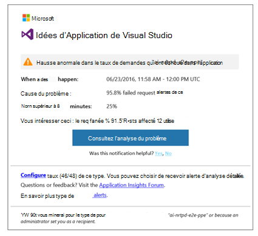
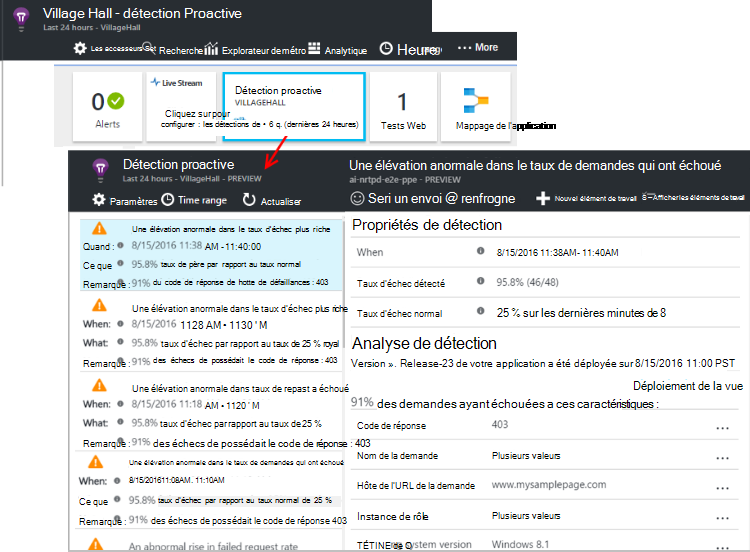

<properties 
    pageTitle="Diagnostics proactifs dans les perspectives d’Application | Microsoft Azure" 
    description="Idées d’application effectue une analyse automatique complète de télémétrie de votre application et vous avertit des problèmes potentiels." 
    services="application-insights" 
    documentationCenter="windows"
    authors="rakefetj" 
    manager="douge"/>

<tags 
    ms.service="application-insights" 
    ms.workload="tbd" 
    ms.tgt_pltfrm="ibiza" 
    ms.devlang="na" 
    ms.topic="article" 
    ms.date="08/15/2016" 
    ms.author="awills"/>

#  Diagnostics proactifs dans les perspectives de l’Application

 Diagnostics proactifs automatiquement vous avertit d’éventuels problèmes de performances dans votre application web. Il effectue une analyse intelligente de la télémétrie votre application envoie aux [Analyses d’Application Visual Studio](app-insights-overview.md). S’il existe une augmentation soudaine de la fréquence des pannes ou des motifs anormales les performances client ou serveur, vous recevez une alerte. Cette fonction a besoin d’aucune configuration. Elle fonctionne si votre application envoie suffisamment télémétrie.

Vous pouvez accéder à des alertes de détection Proactive de l’e-mail que vous recevrez et de la lame de détection Proactive.

## Passez en revue vos détections Proactive

Vous pouvez découvrir les détections de deux manières :

* **Vous recevez un courrier électronique** à partir de l’aperçu de l’Application. Voici un exemple typique :

    

    Cliquez sur le bouton pour ouvrir plus en détail dans le portail.

* Affiche le nombre d’alertes récentes **la détection Proactive en mosaïque** sur la lame de vue d’ensemble de votre application. Cliquez sur la vignette pour afficher la liste des alertes récentes.

Sélectionnez Afficher les détails d’une alerte.

## Quels sont les problèmes sont détectés ?

Il existe trois types de détection :

* [Diagnostics de défaillance proactive de taux](app-insights-proactive-failure-diagnostics.md). Nous utilisons apprentissage définir le taux attendu de demandes ayant échoué pour votre application, de l’ordinateur de mettre en corrélation avec la charge et d’autres facteurs. Si le taux de défaillance tombe en dehors de l’enveloppe prévue, nous envoyer une alerte.
* [Diagnostics des performances proactive](app-insights-proactive-performance-diagnostics.md). Nous rechercher des anormale dans le temps de réponse et taux de défaillance chaque jour. Nous mettre en corrélation ces problèmes avec des propriétés telles que l’emplacement, navigateur, système d’exploitation client, instance de serveur et d’une heure.
* Les [Services en nuage azure](https://azure.microsoft.com/blog/proactive-notifications-on-cloud-service-issues-with-azure-diagnostics-and-application-insights/). Vous prévient si votre application est hébergée dans Azure Cloud Services et une instance de rôle a des échecs de démarrage, recyclage fréquent ou blocage de l’exécution.

(Les liens d’aide dans chaque notification vous accédez à des articles pertinents.)

## Étapes suivantes

Ces outils de diagnostics vous aident à inspecter la télémétrie à partir de votre application :

* [Explorateur de métrique](app-insights-metrics-explorer.md)
* [Explorateur de recherche](app-insights-diagnostic-search.md)
* [Analytique - langage de requête puissantes](app-insights-analytics-tour.md)

Diagnostics proactifs sont entièrement automatiques. Mais vous souhaitez peut-être configurer certaines alertes plus ?

* [Alertes de métriques configurées manuellement](app-insights-alerts.md)
* [Disponibilité des tests web](app-insights-monitor-web-app-availability.md) 

