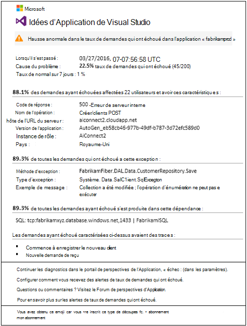
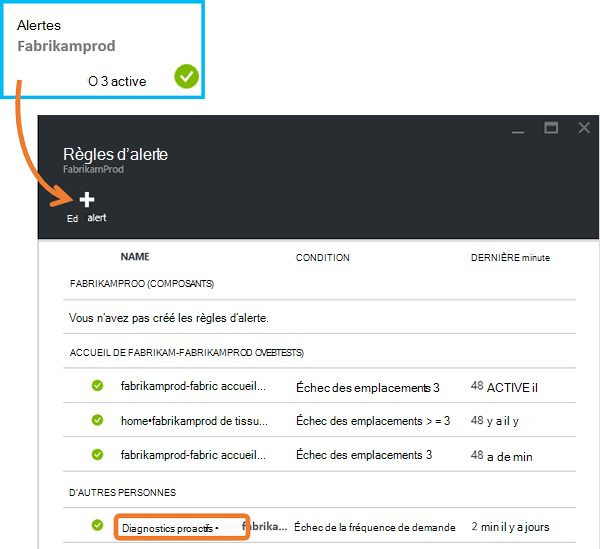
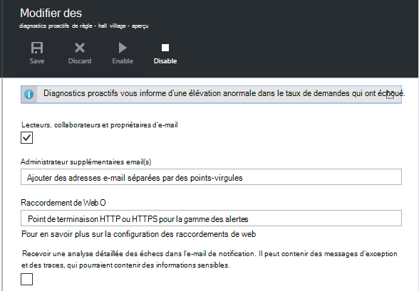
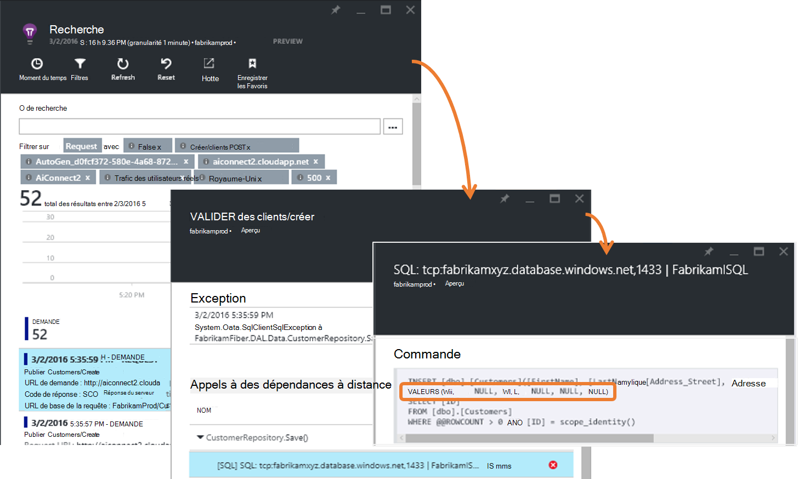
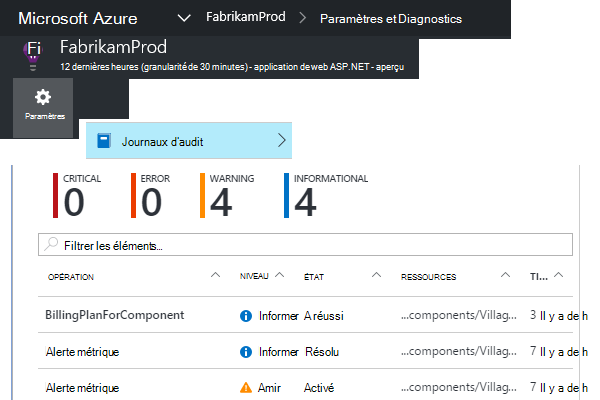
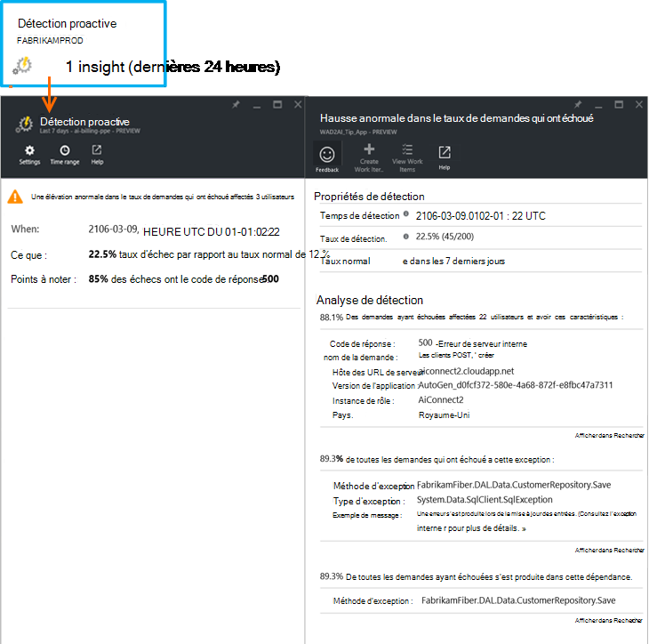

<properties 
    pageTitle="Diagnostics de taux de défaillance proactive dans les perspectives d’Application | Microsoft Azure" 
    description="Vous avertit des changements inhabituels dans le taux de demandes ayant échoué à votre application web et fournit une analyse de diagnostic. Aucune configuration n’est nécessaire." 
    services="application-insights" 
    documentationCenter=""
    authors="yorac" 
    manager="douge"/>

<tags 
    ms.service="application-insights" 
    ms.workload="tbd" 
    ms.tgt_pltfrm="ibiza" 
    ms.devlang="na" 
    ms.topic="article" 
    ms.date="10/12/2016" 
    ms.author="awills"/>
 
# Diagnostics de défaillance proactive de taux

[Idées d’Application Visual Studio](app-insights-overview.md) automatiquement vous informe en temps quasi réel si votre application web subit une élévation anormale dans le taux d’échecs. Il détecte une hausse inhabituelle dans le taux de demandes HTTP signalée comme ayant échoué. Il s’agit généralement de ceux dont les codes de réponse dans les plages 400 et 500. Pour vous aider à trier et à diagnostiquer le problème, une analyse des caractéristiques des demandes ayant échoué et télémétrie connexe est fournie dans la notification. Il existe également des liens vers le portail de perspectives de l’Application de diagnostic supplémentaires. La fonction ne doit aucune configuration ou la configuration, car il utilise des algorithmes d’apprentissage machine pour prévoir le taux de défaillance normal.

Cette fonctionnalité fonctionne pour les applications web ASP.NET et de Java, hébergées dans le nuage ou sur vos propres serveurs. Elle fonctionne également pour n’importe quelle application qui génère de télémétrie de demande - par exemple, si vous avez un rôle worker qui appelle [TrackRequest()](app-insights-api-custom-events-metrics.md#track-request). 

Après [Application des idées pour votre projet](app-insights-overview.md)configuration et fourni votre application génère un certain montant minimal de télémétrie, prend des diagnostics de défaillance Proactive de 24 heures pour obtenir le comportement normal de votre application, avant qu’il est sous tension et peut envoyer des alertes.

Voici un échantillon d’alerte. 

> [AZURE.NOTE] Par défaut, vous obtenez un message de format plus court que dans cet exemple. Mais vous pouvez [Basculer vers ce format détaillé](#configure-alerts).

Notez qu’il vous indique :

* Le taux de défaillance par rapport au comportement d’une application normale.
* Combien d’utilisateurs est affectés, afin que vous sachiez combien vous inquiéter.
* Un modèle caractéristique associé à l’échec. Dans cet exemple, il existe un code de réponse particulière, la nom (opération) de la demande et la version de l’application. Qui vous signale immédiatement où commencer la recherche dans votre code. Autres possibilités peuvent être un système d’exploitation client ou navigateur spécifique.
* L’exception, journal des traces et Échec de la dépendance (bases de données ou d’autres composants externes) qui semblent être associées à l’élément caractérisé les demandes ayant échoué.
* Liens directs vers des recherches pertinentes sur la télémétrie dans les perspectives de l’Application.

## Avantages des alertes proactives

Ordinaire [métriques alertes](app-insights-alerts.md) vous indiquent qu’il peut y avoir un problème. Mais les diagnostics de panne proactive commence le travail de diagnostic pour vous, effectue beaucoup de l’analyse, sinon, vous auriez à effectuer vous-même. Vous obtenez les résultats soigneusement emballés, pour vous aider à accéder rapidement à la racine du problème.

## Mode de fonctionnement

Près de diagnostic proactif en temps réel surveille la télémétrie a reçu à partir de votre application et notamment le taux de demandes qui ont échoué. Cette mesure le nombre de demandes dont le `Successful request` propriété a la valeur false. Par défaut, `Successful request== (resultCode < 400)` (sauf si vous avez écrit du code personnalisé à [filtre](app-insights-api-filtering-sampling.md#filtering) ou générer vos propres appels de [TrackRequest](app-insights-api-custom-events-metrics.md#track-request) ). 

Les performances de votre application a un modèle typique de comportement. Certaines demandes seront plus sujettes à des défaillances que d’autres ; et le taux d’échec global peut monter en tant que la charge augmente. Diagnostics de défaillance proactive utilise apprentissage trouver ces anomalies de l’ordinateur. 

Comme télémétrie est fourni dans les perspectives de l’Application à partir de votre application web, les diagnostics de panne proactive compare le comportement actuel avec les modèles constatés au cours des derniers jours. Si une élévation anormale dans le taux de défaillance est observée par rapport aux performances précédentes, une analyse est déclenchée.

Lorsqu’une analyse est déclenchée, le service effectue une analyse de cluster sur la requête ayant échoué, pour essayer d’identifier un modèle des valeurs qui caractérisent les échecs. Dans l’exemple ci-dessus, l’analyse a découvert que la plupart des échecs sont sur un code de résultat spécifique, nom de la requête, hôte de l’URL du serveur et instance de rôle. En revanche, l’analyse a découvert que la propriété du système d’exploitation client est répartie sur plusieurs valeurs, et par conséquent, il n’est pas répertorié.

Lorsque votre service est instrumenté avec ces télémétrie, l’analyseur détecte une exception et un échec de dépendance qui sont associées à des demandes dans le cluster qu'a identifié, avec un exemple de tous les journaux de suivi associé à ces demandes.

L’analyse vous est envoyé en tant qu’alerte, sauf si vous l’avez configuré ne pas le faire.

Comme les [alertes que vous définissez manuellement](app-insights-alerts.md), vous pouvez examiner l’état de l’alerte et configurez-le de la lame d’alertes de votre ressource de perspectives de l’Application. Mais, contrairement à d’autres alertes, vous n’avez pas besoin installer ou configurer les diagnostics de défaillance Proactive. Si vous le souhaitez, vous pouvez la désactiver ou modifier ses adresses de courrier électronique cible.

## Configurer des alertes 

Vous pouvez désactiver les diagnostics proactifs, modifier les destinataires de l’e-mail, créer un webhook ou participer à des messages d’alerte plus détaillées.

Ouvrez la page des alertes. Diagnostics proactifs est inclus avec toutes les alertes que vous avez défini manuellement, et vous pouvez voir s’il est actuellement dans l’état d’alerte.

Cliquez sur l’alerte pour le configurer.

Notez que vous pouvez désactiver les Diagnostics proactifs, mais vous ne pouvez pas la supprimer (ou créer un autre).

#### Alertes détaillées

Si vous sélectionnez « Recevoir une analyse détaillée » l’e-mail contiendra des informations de diagnostic. Parfois, vous serez en mesure de diagnostiquer le problème uniquement à partir des données dans le message électronique. 

Il existe un risque que l’alerte plus détaillée peut contenir des informations sensibles, car il contient des messages d’exception et la trace. Toutefois, cela seulement se produit si votre code peut permettre à des informations sensibles dans les messages. 

## Triage et diagnostic d’une alerte

Une alerte indique qu’une hausse anormale dans le taux de demandes qui ont échoué a été détectée. Il est probable qu’il existe un problème avec votre application ou dans son environnement.

À partir du pourcentage de demandes et le nombre d’utilisateurs affectés, vous pouvez décider de la priorité du problème est. Dans l’exemple ci-dessus, le taux de défaillance 22.5 % compare avec un taux normal de 1 %, indique que quelque chose se passe. D’autre part, les utilisateurs seulement 11 ont été affectés. S’il s’agissait de votre application, vous ne pourrez pas évaluer leur degré de gravité qui.

Dans de nombreux cas, vous serez en mesure de diagnostiquer le problème rapidement à partir de la nom de la demande, l’exception, la dépendance échec et trace les données fournies. 

Il existe quelques autres indices. Par exemple, le taux de défaillance de dépendance dans cet exemple est le même que le taux d’exception (89.3 %). Cela suggère que l’exception résulte directement à partir de l’échec de dépendance - ce qui vous donne une idée précise de l’emplacement où commencer vos recherches dans votre code.

Pour approfondir, les liens de chaque section vous prend directement à une [page de recherche](app-insights-diagnostic-search.md) filtrés aux demandes appropriées, exception, dépendance ou traces. Ou vous pouvez ouvrir le [portail Azure](https://portal.azure.com), accédez à la ressource d’informations d’Application pour votre application et ouvrir la blade d’échecs.

Dans cet exemple, en cliquant sur le lien « Afficher les détails des échecs de dépendance » ouvre la lame de recherche d’idées d’Application sur l’instruction SQL à l’origine du problème : les valeurs null fourni au niveau des champs obligatoires et n’a pas réussi la validation pendant l’enregistrement opération.

## Passez en revue les alertes récentes

Pour consulter les alertes dans le portail, ouvrez **paramètres, journaux d’Audit**.

Cliquez sur toutes les alertes pour afficher ses détails complets.

Ou cliquez sur **détection Proactive** pour obtenir directement dans l’alerte la plus récente :

## Quelle est la différence...

Diagnostics de taux de défaillance proactive complète les autres similaire des fonctionnalités mais distinctes des perspectives de l’Application. 

* [Alertes de mesure](app-insights-alerts.md) sont définies par vous et contrôler un large éventail de mesures telles que le processeur occupation, taux de demandes, les temps de chargement de page et ainsi de suite. Vous pouvez les utiliser pour vous avertir, par exemple, si vous devez ajouter davantage de ressources. En revanche, les diagnostics de panne proactive couvrent une petite gamme de mesures critiques (actuellement uniquement demande ayant échoué taux), conçue pour avertir vous dans près de manière en temps réel une fois que l’échec de votre application web demandez taux augmente de manière significative par rapport au comportement normal de l’application web.

    Diagnostics de défaillance proactive de taux ajuste automatiquement son seuil en réponse aux conditions en vigueur.

    Diagnostics de défaillance proactive de taux de démarrer le travail de diagnostic pour vous. 
* [Diagnostics des performances proactive](app-insights-proactive-performance-diagnostics.md) utilise également intelligence de machine pour découvrir les modèles inhabituels dans vos mesures et aucune configuration par vous est nécessaire. Mais contrairement aux diagnostics de défaillance Proactive de taux, l’objectif des tests de diagnostic des performances proactive pour trouver les segments de votre collecteur d’utilisation qui peut être mal desservi, par exemple par des pages spécifiques d’un type spécifique de navigateur. L’analyse est effectuée tous les jours, et si un résultat est trouvé, il est susceptible d’être beaucoup moins urgentes à une alerte. En revanche, l’analyse pour les diagnostics de panne proactive est effectuée en continu des données télémétriques fournies entrants et vous serez averti dans les minutes si le taux de défaillance de serveur sont plus grande que prévu.

## Si vous recevez une alerte de diagnostics de taux de défaillance Proactive

*Pourquoi j’ai reçu cette alerte ?*

*   Nous avons détecté une élévation anormale dans le taux de demandes qui ont échoué par rapport à la ligne de base normale de la période précédente. Après analyse des défaillances et télémétrie associé, nous pensons qu’il existe un problème que vous devriez étudier. 

*La notification signifie que je doute d’un problème ?*

*   Nous essayons d’alerte sur l’interruption de l’application, ou la dégradation, bien que seulement vous pouvez comprendre parfaitement la sémantique et l’impact sur les applications ou les utilisateurs.

*Ainsi, nos spécialistes ès utiliser mes données ?*

*   N° Le service est entièrement automatique. Seulement vous obtenez les notifications. Vos données sont [privées](app-insights-data-retention-privacy.md).

*Faut-il que de s’abonner à cette alerte ?* 

*   N° Chaque télémétrie de demande application envoi a cette règle d’alerte.

*Puis-je annuler un abonnement ou obtenir les notifications envoyées à Mes collègues à la place ?*

*   Oui, les règles dans l’alerte, cliquez sur règle de Diagnostics proactifs à le faire. Vous pouvez désactiver l’alerte, ou modifier les destinataires de l’alerte. 

*J’ai perdu l’e-mail. Où puis-je trouver des notifications dans le portail ?*

*   Dans les journaux d’Audit. Cliquez sur paramètres, journaux d’Audit, puis sur une alerte pour voir son apparition, mais avec une vue détaillée limitée.

*Certaines des alertes sont des problèmes connus et je ne souhaite pas les recevoir.*

*   Nous avons la suppression des alertes sur notre file d’attente.

## Étapes suivantes

Ces outils de diagnostics vous aident à inspecter la télémétrie à partir de votre application :

* [Explorateur de métrique](app-insights-metrics-explorer.md)
* [Explorateur de recherche](app-insights-diagnostic-search.md)
* [Analytique - langage de requête puissantes](app-insights-analytics-tour.md)

Détection proactive est entièrement automatiques. Mais vous souhaitez peut-être configurer certaines alertes plus ?

* [Alertes de métriques configurées manuellement](app-insights-alerts.md)
* [Disponibilité des tests web](app-insights-monitor-web-app-availability.md) 

