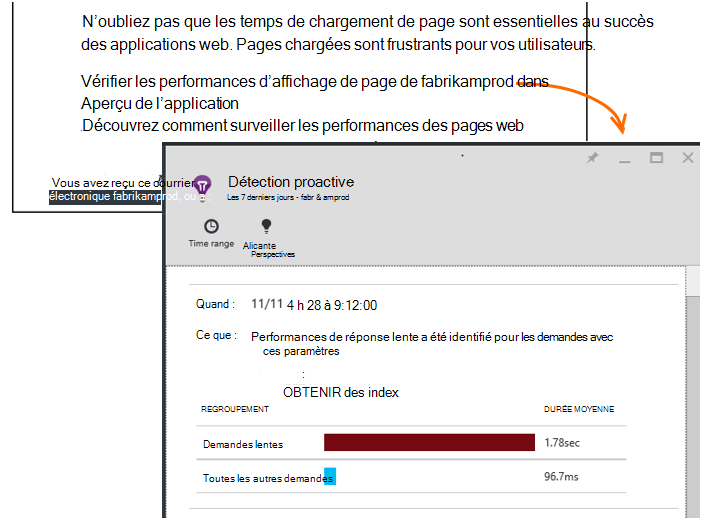

<properties 
    pageTitle="Perspectives de l’application : Diagnostics des performances Proactive | Microsoft Azure" 
    description="Application procède à une analyse approfondie de télémétrie de votre application et vous avertit des problèmes potentiels." 
    services="application-insights" 
    documentationCenter="windows"
    authors="antonfrMSFT" 
    manager="douge"/>

<tags 
    ms.service="application-insights" 
    ms.workload="tbd" 
    ms.tgt_pltfrm="ibiza" 
    ms.devlang="na" 
    ms.topic="article" 
    ms.date="08/31/2016" 
    ms.author="awills"/>

#  Diagnostics des performances proactive

*Idées d’application est en mode Aperçu.*

[Idées d’Application Visual Studio](app-insights-overview.md) effectue une analyse approfondie de télémétrie de votre application et peut vous avertir à propos des problèmes de performances potentiels. Vous avez probablement ce lu parce que vous avez reçu un des nos alertes proactives par courrier électronique. 

Cette fonctionnalité ne requiert aucune configuration et est automatiquement active lorsque votre application génère suffisamment de télémétrie.

## Quels sont les diagnostics de performances proactif ?

Diagnostics des performances proactive découvre inhabituelles de performances dans votre application, en analysant la télémétrie votre application envoie aux analyses de l’Application. 

En particulier, il détecte les problèmes de performances qui affectent uniquement certains de vos utilisateurs, ou qui n’affectent que les utilisateurs dans certains cas.

Par exemple, il peut vous informer si votre application charge pages beaucoup plus lentement sur un type de navigateur que d’autres, ou si les demandes sont fournies plus lentement à partir d’un serveur particulier. Il peut également découvrir des problèmes associés à des combinaisons de propriétés, telles que le chargement de la page lente dans une seule zone géographique à des moments de la journée.

Anomalies telles que celles-ci sont très difficiles à détecter en inspectant les données, mais sont plus courantes que vous ne le pensez. Souvent qu’ils apparaissent uniquement lorsque vos clients se plaignent. À ce stade, il est trop tard : les utilisateurs sont déjà passer à vos concurrents !

Actuellement, notre algorithmes examiner les temps de chargement de page, les temps de réponse de demande sur le serveur et les temps de réponse de dépendance.  

Vous n’êtes pas obligé de définir des seuils ou configurer des règles. Apprentissage automatique et des algorithmes de data mining permettent de détecter les modèles anormales. 

Nous sommes impatients d’avoir vos commentaires. Faites-nous savoir comment il vous aide à vous, comment nous pouvons améliorer la détection Proactive et quelles sont les fonctionnalités supplémentaires que vous souhaitez ajouter. Vous pouvez fournir à envoyer un sourire/froncé dans le portail ou envoyez-nous un e-mail à AppInsightsML@microsoft.com. 

## À propos de l’alerte proactive

* *Pourquoi ai réception de cet e-mail ?*
 * Détection proactive analysé la télémétrie envoyés aux analyses de l’Application de votre application et a détecté un problème de performances dans votre application. 
* *La notification signifie que je doute d’un problème ?*
 * N° Il est simplement une suggestion concernant un élément que vous pouvez souhaiter examiner plus attentivement. 
* *Que dois-je faire ?*
 * [Examinez les données présentées](#responding-to-an-alert). Explorateur de mesures permet de passer en revue les performances dans le temps et l’extraire des mesures supplémentaires. Utilisez la recherche pour filtrer des événements spécifiques qui vous aident à identifier la cause. 
* *Ainsi, nos spécialistes ès utiliser mes données ?*
 * N° Le service est entièrement automatique. Seulement vous obtenez les notifications. Vos données sont [privées](app-insights-data-retention-privacy.md).

## Le processus de détection

* *Quels types d’anomalies de performance sont détectés ?*
 * Modèles que vous trouveriez qu’il prend du temps à vérifier par vous-même. Par exemple, des performances médiocres dans une combinaison spécifique de l’emplacement, l’heure de la journée et de la plate-forme.
* *Analyser toutes les données collectées par les perspectives d’Application ?*
 * Pas à l’heure actuelle. Actuellement, nous analysons les temps de chargement de page, les temps de réponse de dépendance et le temps de réponse de demande. Analyse des statistiques supplémentaires sera bientôt disponible. 
* *Puis-je créer mes propres anomalie de règles de détection ?*
 * Pas encore. Mais, vous pouvez :
 * [Définir des alertes](app-insights-alerts.md) qui vous indiquent quand une mesure dépasse un seuil.)
 * [Exportation de télémétrie](app-insights-export-telemetry.md) vers un outil de [base de données](app-insights-code-sample-export-sql-stream-analytics.md) ou [de PowerBI](app-insights-export-power-bi.md) ou [autres](app-insights-code-sample-export-telemetry-sql-database.md) , où vous pouvez les analyser vous-même.
* *La fréquence à laquelle l’analyse est effectuée ?*
 * Nous avons exécuté l’analyse de tous les jours sur la télémétrie du jour précédent.
* * Donc remplace-t-il cette [métriques alertes](app-insights-alerts.md)?
 * N°  Nous ne pas engager pour détecter tous les comportements que vous pouvez envisager d’anormal.

## Comment faire pour étudier les problèmes soulevés

Ouvrez le rapport de diagnostic à partir de la messagerie électronique ou à partir de la liste d’anomalies.

* **Lorsque** indique le temps que le problème a été détecté.
* **Le** décrit.
 * Le problème a été détecté ;
 * Les caractéristiques de l’ensemble d’événements trouvés affichent le problème.
* Le tableau compare le jeu peu performante avec le comportement moyen de tous les autres événements.

Cliquez sur les liens pour ouvrir Explorateur de mesure et de recherche sur les états pertinents, filtrés sur le temps et les propriétés de l’ensemble de performances lente.

Modifier la période et les filtres pour Explorer la télémétrie.

## Comment puis-je améliorer les performances ?

Réponses lentes et échecs sont parmi les plus grandes frustrations pour les utilisateurs de site web, comme vous le savez à partir de votre propre expérience. Il est donc important résoudre les problèmes.

### Triage

Tout d’abord, il est important ? Si une page est toujours lente à charger, mais avez pas seulement 1 % des utilisateurs de votre site à consulter, vous avez peut-être des éléments plus importants à considérer. En revanche, si seulement 1 % des utilisateurs ouvrir, mais elle lève une exception chaque fois, qui peut être conseillé de rechercher.

Servir de guide général de la déclaration d’impact dans l’e-mail, mais sachez qu’il n’est pas tout. Rassembler les autres éléments de preuve pour confirmer.

Prendre en compte les paramètres du problème. S’il est dépendant de la géographie, configurer [les tests de disponibilité](app-insights-monitor-web-app-availability.md) , y compris de cette région : problèmes de réseau peuvent simplement être dans cette zone. 

### Diagnostiquer des chargements de page lente 

Où est le problème ? Le serveur n’est lent à répondre, est la page très longue ou le navigateur doit effectuer de nombreuses tâches pour l’afficher ?

Ouvrez la lame de métriques de navigateurs. La montre [affichage segmente de temps de chargement de page de navigateur](app-insights-javascript.md#explore-your-data) dans laquelle va le temps. 

* Si vous **Envoyez la durée de la demande** est élevée, le serveur répond lentement, ou la demande est une publication avec une grande quantité de données. Examinez les [métriques de performances](app-insights-web-monitor-performance.md#metrics) pour examiner les temps de réponse. 
* Définir des [dépendances de suivi](app-insights-dependencies.md) pour voir si la lenteur est due à des services externes ou votre base de données.
* Si la **Réception de la réponse** est prédominante, votre page et ses parties dépendantes - JavaScript, CSS, images, etc. (mais pas chargés de façon asynchrone de données) sont longs. Configurer un [test de la disponibilité](app-insights-monitor-web-app-availability.md)et veillez à définir l’option permettant de charger des parties dépendantes. Lorsque vous obtenez des résultats, ouvrez le détail d’un résultat et développez-le pour afficher les temps de chargement de fichiers différents.
* Élevé **temps de traitement du Client** propose des scripts sont exécutent lentement. Si la raison n’est pas évidente, envisagez d’ajouter un code de minutage et d’envoyer les heures dans les appels de trackMetric.

### Améliorer les pages chargées

Il existe un site web complet des conseils sur l’amélioration de vos réponses du serveur et les temps de chargement de page, afin que nous n’essaierons pas répéter tous ici. Voici quelques conseils qui vous connaissez sans doute déjà, uniquement sur la pour manière de penser :

* Lenteur du chargement en raison de fichiers volumineux : charger les scripts et les autres parties de manière asynchrone. Utiliser le regroupement de script. La page principale de pénétrer de widgets qui chargent leurs données séparément. Ne pas envoyer l’ancien format HTML brut pour les tableaux longs : utiliser un script pour demander des données en tant que JSON ou autre format compact, puis remplissez la table en place. Il existe des infrastructures pour aider toutes les. (Ils entraînent des scripts volumineux, bien sûr.)
* Ralentir les dépendances du serveur : considérez les emplacements géographiques de vos composants. Par exemple, si vous utilisez Azure, assurez-vous que le serveur web et la base de données sont dans la même région. Requêtes récupèrent des informations plus que nécessaire ? Est-ce mise en cache ou le traitement par lots d’aide ?
* Problèmes de capacité : examinez les métriques de serveur de temps de réponse et de demande de compte. Si le temps de réponse maximal sans respect des proportions avec des pics dans les comptes de demandes, il est probable que vos serveurs sont étirés. 

## E-mails de notification

* *Faut-il que de s’abonner à ce service pour recevoir des notifications ?*
 * N° Nos robots périodiquement les données de tous les utilisateurs d’idées d’Application des enquêtes et envoie des notifications s’il détecte des problèmes.
* *Puis-je annuler un abonnement ou obtenir les notifications envoyées à Mes collègues à la place ?*
 * Cliquez sur le lien Annuler l’abonnement dans l’alerte ou le courrier électronique. 
 
    Actuellement, ils sont envoyés vers ceux qui disposent [d’un accès en écriture à la ressource de perspectives de l’Application](app-insights-resources-roles-access-control.md).

    Vous pouvez également modifier la liste des destinataires les paramètres dans la lame de détection Proactive.
* *Je ne souhaite pas être envahi par ces messages.*
 * Elles sont limitées à une par jour avec le problème plus pertinents que nous n’avons pas encore rapporté. Vous n’aurez pas se répète d’un message.
* *Si je ne rien faire, va recevoir un rappel ?*
 * Non, vous obtenez un message à propos de chaque problème qu’une seule fois. 
* *J’ai perdu l’e-mail. Où puis-je trouver des notifications dans le portail ?*
 * Dans la vue d’ensemble de l’aperçu de l’Application de votre application, cliquez sur la mosaïque de **Détection Proactive** . Il vous serez en mesure de trouver toutes les notifications à l’arrière-plan de 7 jours.

## Étapes suivantes

Ces outils de diagnostics vous aident à inspecter la télémétrie à partir de votre application :

* [Explorateur de métrique](app-insights-metrics-explorer.md)
* [Explorateur de recherche](app-insights-diagnostic-search.md)
* [Analytique - langage de requête puissantes](app-insights-analytics-tour.md)

Détection proactive est entièrement automatiques. Mais vous souhaitez peut-être configurer certaines alertes plus ?

* [Alertes de métriques configurées manuellement](app-insights-alerts.md)
* [Disponibilité des tests web](app-insights-monitor-web-app-availability.md) 

