<properties
    pageTitle="Notes de publication pour l’Extension de Visual Studio pour le développeur Analytique"
    description="Les dernières mises à jour pour les outils Visual Studio pour le développeur Analytique."
    services="application-insights"
    documentationCenter=""
    authors="acearun"
    manager="douge"/>
<tags
    ms.service="application-insights"
    ms.workload="tbd"
    ms.tgt_pltfrm="ibiza"
    ms.devlang="na"
    ms.topic="article"
    ms.date="06/09/2016"
    ms.author="acearun"/>

# Notes de publication pour les outils de développement Analytique
Nouveautés : perspectives d’Application et de la HockeyApp analytique dans Visual Studio.
## Version 7.0
### Tendances de perspectives d’Application Visual Studio
Idées d’Application Visual Studio est un nouvel outil de Visual Studio que vous pouvez utiliser pour vous aider à analyser le fonctionne de votre application dans le temps. Pour commencer, sur le bouton de la barre d’outils **Aperçu de l’Application** ou dans la fenêtre de recherche de perspectives d’Application, cliquez sur **Explorer les tendances de télémétrie**. Ou, dans le menu **affichage** , cliquez sur **Autres fenêtres**, puis cliquez sur **Application, analyses des tendances**. Choisissez l’une des cinq requêtes communes pour commencer. Vous pouvez analyser les différents ensembles de données basés sur les types de télémétrie, les plages de temps et d’autres propriétés. Pour rechercher les anomalies dans vos données, choisissez une des options des anomalies dans la liste déroulante **Type d’affichage** . Les options de filtrage au bas de la fenêtre facilitent le rapproche des sous-ensembles spécifiques de votre télémétrie.

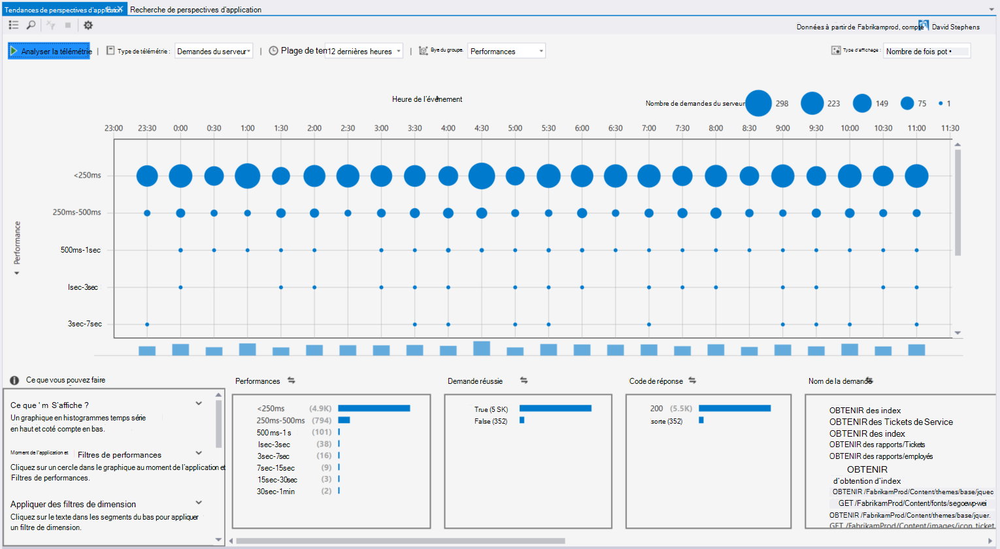

### Exceptions dans CodeLens
Télémétrie d’exception s’affiche désormais dans CodeLens. Si vous avez connecté votre projet pour le service informations d’Application, vous verrez le nombre d’exceptions qui se sont produites dans chaque méthode de production dans les dernières 24 heures. À partir de CodeLens, vous pouvez atteindre la recherche ou de tendances pour examiner les exceptions de façon plus détaillée.

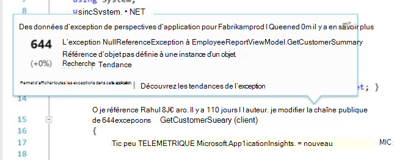

### Prise en charge de base d’ASP.NET
Idées d’application prend désormais en charge les projets de RC2 de base ASP.NET dans Visual Studio. Vous pouvez ajouter des informations d’Application aux nouveaux projets ASP.NET Core RC2 à partir de la boîte de dialogue **Nouveau projet** , comme dans la capture d’écran suivante. Ou bien, vous pouvez ajouter à un projet existant, droit sur le projet dans l’Explorateur de solutions, puis cliquez sur **Ajouter de télémétrie de perspectives sur Application**.

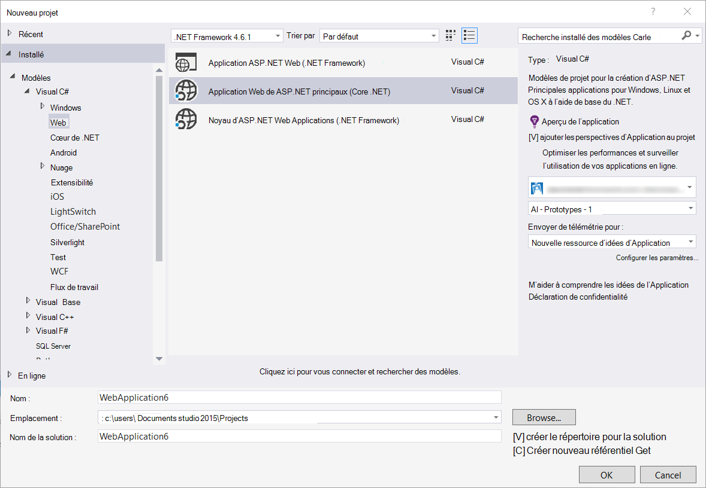

ASP.NET 5 RC1 et RC2 de base ASP.NET projets ont également nouvelle prise en charge dans la fenêtre d’outils de Diagnostic. Vous verrez les événements perspectives d’Application tels que les requêtes et les exceptions à partir de votre application ASP.NET pendant que vous déboguez localement sur votre ordinateur. À partir de chaque événement, cliquez sur **recherche** pour descendre pour plus d’informations.

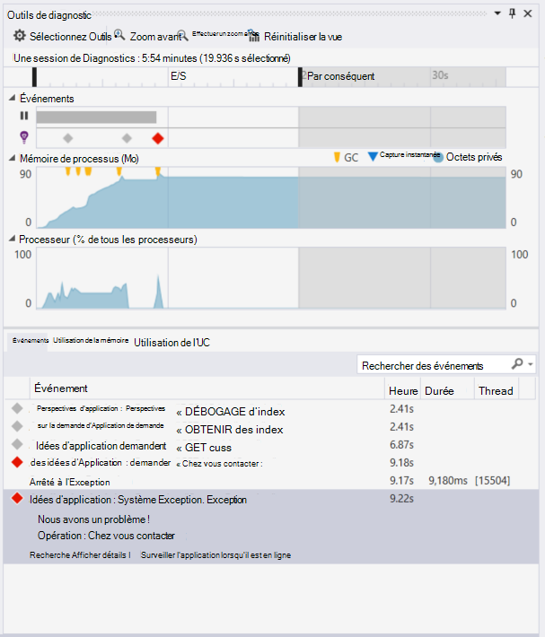

### HockeyApp pour les applications Windows universel
En plus de commentaires d’utilisateur et de la distribution bêta, HockeyApp fournit pour vos applications Windows universel de rapport d’incident symbolicated. Nous avons encore plus facile ajouter le SDK HockeyApp : avec le bouton droit sur votre projet universel de Windows, puis cliquez sur **Application Hockey - activer l’Analytique de tomber en panne**. Cela installe le Kit de développement logiciel, définit la collection de se bloquer et dispositions une ressource HockeyApp dans le nuage, tout cela sans téléchargement de votre application pour le service HockeyApp.

Autres nouvelles fonctionnalités :

* Nous avons l’expérience de la recherche de perspectives d’Application plus rapide et plus intuitive. Maintenant, les plages de temps et de filtres de détail sont appliquées automatiquement lorsque vous les sélectionnez.
* Également dans la recherche de perspectives d’Application, il existe désormais une option permettant d’accéder à du code directement à partir de télémétrie de la demande.
* Nous avons apporté des améliorations à l’expérience de connexion HockeyApp.
* Dans outils de Diagnostic, les informations de télémétrie de production pour les exceptions s’affiche.

## Version 5.2
Nous sommes heureux d’annoncer l’introduction des scénarios HockeyApp dans Visual Studio. La première intégration est en distribution bêta d’applications d’universel de Windows et les applications de Windows Forms dans Visual Studio.

Avec la fonction de distribution bêta, télécharger des versions antérieures de vos applications à HockeyApp pour la distribution à un sous-ensemble sélectionné de clients ou de testeurs. Fonction de distribution bêta, combinée avec HockeyApp sur incident collecte et utilisateur fonctionnalités de commentaires, peut vous fournir des informations précieuses sur votre application avant de procéder à une publication majeure. Vous pouvez utiliser ces informations pour résoudre les problèmes avec votre application afin que vous pouvez éviter ou minimiser les problèmes futurs, tels que les évaluations de faible app, une évaluation négative et ainsi de suite.

Extraction combien il est simple de télécharger les versions pour distribution bêta à partir de Visual Studio.
### Applications Windows universel
Le menu contextuel d’un nœud de projet d’application Windows universel inclut désormais une option de téléchargement de votre build pour HockeyApp.

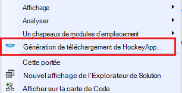

Cliquez sur l’élément et la HockeyApp boîte de dialogue de téléchargement s’ouvre. Vous aurez besoin d’un compte HockeyApp pour télécharger votre version. Si vous êtes un nouvel utilisateur, ne vous inquiétez pas. Création d’un compte est un processus simple.

Lorsque vous êtes connecté, vous verrez le formulaire de téléchargement dans la boîte de dialogue.

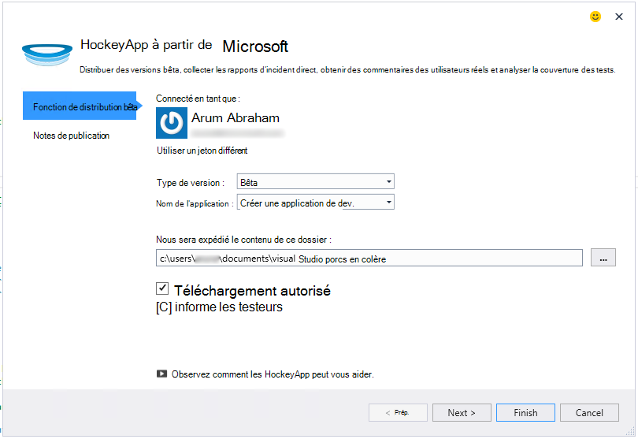

Sélectionnez le contenu à télécharger (fichier .appxbundle ou .aspx) et choisissez les options de la version dans l’Assistant. Si vous le souhaitez, vous pouvez ajouter des notes de publication sur la page suivante. Cliquez sur **Terminer** pour commencer le téléchargement.

Lorsque le téléchargement est terminé, une notification de HockeyApp avec un lien vers l’application dans le portail de HockeyApp et de confirmation s’affiche.

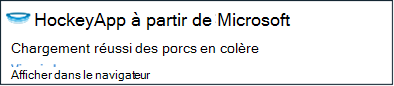

Voilà ! Vous venez de télécharger une version de distribution bêta en seulement quelques clics.

Vous pouvez gérer votre application de différentes façons dans le portail de HockeyApp. Cela inclut l’invitation d’utilisateurs, l’affichage des rapports d’incident et des commentaires, modifier les détails et ainsi de suite.

Consultez la [Base de connaissances HockeyApp](http://support.hockeyapp.net/kb/app-management-2) pour plus de détails sur la gestion de l’application.

### Les applications de Windows Forms
Le menu contextuel d’un nœud de projet Windows Form inclut désormais une option de téléchargement de votre build pour HockeyApp.

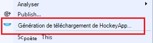

Le dialogue Téléchargement HockeyApp, qui est similaire à celui d’une application universel de Windows s’ouvre.

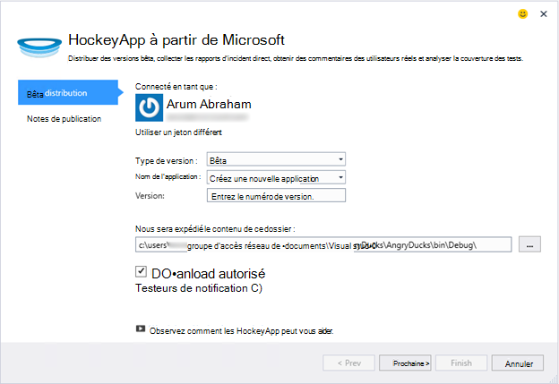

Remarque un nouveau champ dans cet Assistant, pour spécifier la version de l’application. Pour les applications d’universel de Windows, les informations sont remplies à partir du manifeste. Les applications Windows Forms, malheureusement, inutile d’équivalent à cette fonctionnalité. Vous devrez les spécifier manuellement.

Le reste du flux est semblable aux applications Windows universel : choisissez Générer et options de mise à jour, ajouter release notes, télécharger et les gérer dans le portail de HockeyApp.

Il est aussi simple que cela. Essayez-le et faites-nous savoir ce que vous en pensez.
## Version 4.3
### TELEMETRIE de recherche à partir de sessions de débogage local
Dans cette version, vous pouvez maintenant rechercher de télémétrie d’idées d’Application généré pendant la session de débogage de Visual Studio. Avant, vous pouvez utiliser recherche uniquement si vous avez enregistré votre application avec les informations d’Application. Maintenant, votre application doit uniquement avoir l’Application perspectives sur Kit de développement SDK pour effectuer une recherche de télémétrie local.

Si vous disposez d’une application ASP.NET avec le SDK de perspectives d’Application, procédez comme suit pour utiliser la recherche.

1. Déboguer votre application.
2. Ouvrir une Application recherche perspectives dans une des manières suivantes :
    - Dans le menu **affichage** , cliquez sur **Autres fenêtres**, puis cliquez sur **Recherche de perspectives d’Application**.
    - Cliquez sur le bouton de barre d’outils **Aperçu de l’Application** .
    - Dans l’Explorateur de solutions, développez **ApplicationInsights.config**, puis cliquez sur **télémétrie de session de débogage de recherche**.
3. Si vous n’avez pas inscrit avec les informations d’Application, la fenêtre de recherche s’ouvre en mode de télémétrie de session de débogage.
4. Cliquez sur l’icône de **recherche** pour afficher votre télémétrie local.

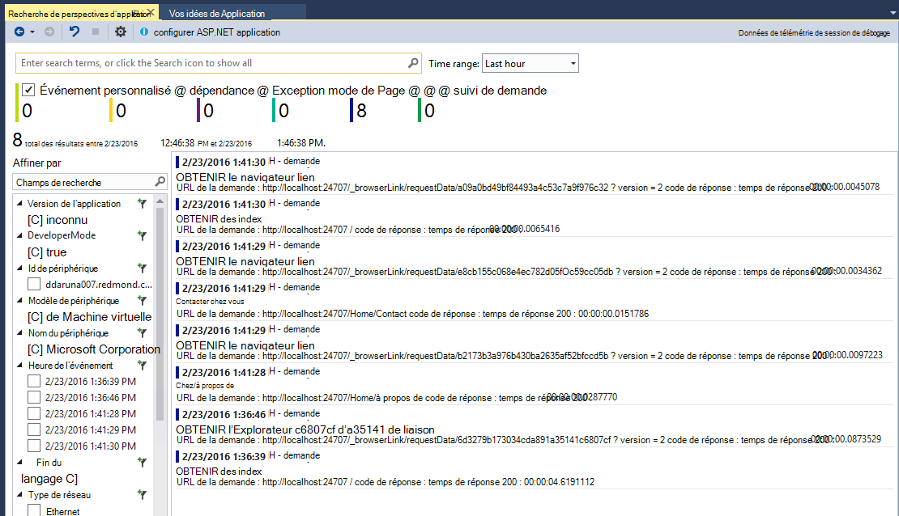

## Version 4.2
Dans cette version, nous avons ajouté des fonctionnalités pour rendre la recherche de données dans le contexte des événements, avec la possibilité d’accéder au code à partir de plusieurs événements de données et une expérience sans effort pour envoyer vos données d’enregistrement pour les perspectives de l’Application. Cette extension est mis à jour chaque mois. Si vous utilisez la fonctionnalité de commentaires ou des demandes, envoyez-le à aidevtools@microsoft.com.
### Expérience de l’enregistrement cliquez sur non
Si vous utilisez déjà NLog, log4net ou System.Diagnostics.Tracing, vous n’avez pas à vous soucier de transférer tous vos traces de perspectives de l’Application. Dans cette version, nous avons intégré les cartes d’enregistrement des perspectives d’Application avec l’expérience de configuration normale.
Si vous avez déjà une de ces structures de journalisation configurées, la section suivante décrit comment faire pour l’obtenir.
**Si vous avez déjà ajouté des perspectives d’Application :**
1. Cliquez sur le nœud du projet et puis cliquez sur **Aperçu de l’Application**, puis cliquez sur **Configurer les perspectives sur l’Application**. Vérifiez que l’option Ajouter la carte appropriée dans la fenêtre de configuration.
2. Ou bien, lorsque vous générez la solution, notez la fenêtre contextuelle qui s’affiche dans le coin supérieur droit de votre écran, cliquez sur **configurer**.

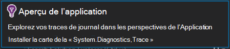

Une fois que la carte d’enregistrement installée, exécuter votre application et vérifiez que les données de l’onglet Outils de diagnostic, comme suit :

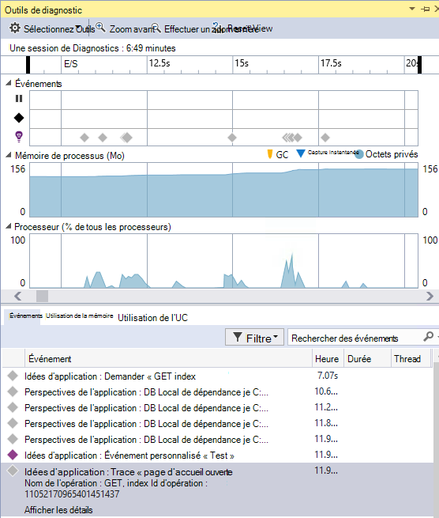

### Accéder à ou de trouver le code où est émise la propriété d’événement de télémétrie
Avec la nouvelle version utilisateur peut cliquer sur n’importe quelle valeur de l’événement en détail et il recherchera une chaîne correspondante dans la solution ouverte en cours. Résultats seront afficheront dans Visual Studio « Résultats de la recherche » liste comme illustré ci-dessous :

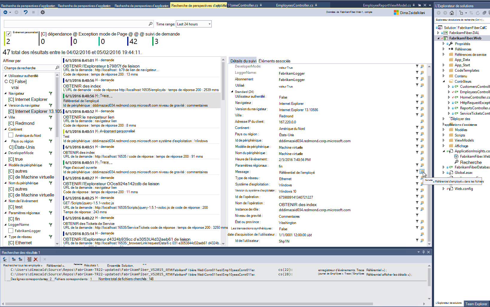

### Nouvelle fenêtre de recherche pour lorsque vous n’êtes pas connecté
Nous avons amélioré l’aspect de la fenêtre de recherche de perspectives d’Application pour vous aider à rechercher vos données pendant que votre application est en production.

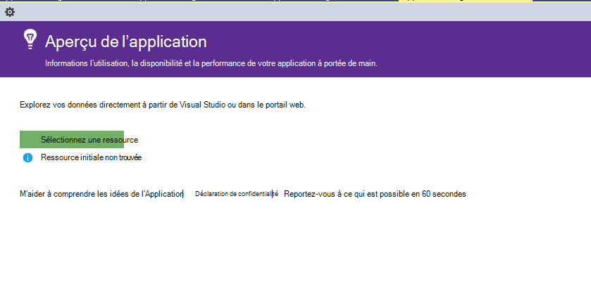

### Voir tous les événements de télémesure associées à l’événement.
Nous avons ajouté un nouvel onglet, avec des requêtes prédéfinies pour toutes les données associées à l’événement de télémétrie que l’affichage de l’utilisateur, en regard de l’onglet Détails de l’événement. Par exemple, une demande a un champ appelé **ID d’opération**. Tous les événements associés à cette demande a la même valeur pour **l’ID de l’opération**. Si une exception se produit pendant l’opération de traitement de la demande, l’exception est donnée le même ID d’opération en tant que la demande pour le rendre plus facile à trouver. Si vous êtes dans une demande, cliquez sur **tous les de télémétrie pour cette opération** pour ouvrir un nouvel onglet qui affiche les résultats de la recherche de nouveau.

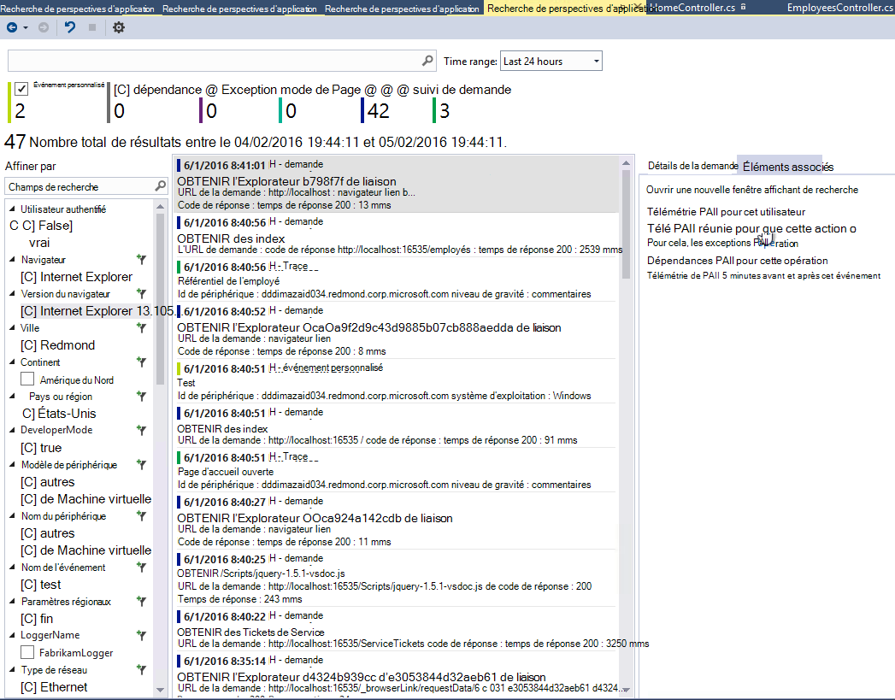

### Précédent et l’historique de recherche
Maintenant vous pouvez aller et venir entre les résultats de la recherche.

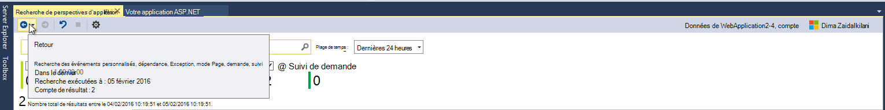

## Version 4.1
Cette version est livré avec un certain nombre de nouvelles fonctionnalités et les mises à jour. Vous devez avoir installé pour pouvoir installer cette version de mise à jour 1.

### Passer d’une exception à la méthode dans le code source
Maintenant, si vous affichez des exceptions à partir de votre application de production dans la fenêtre de recherche de perspectives d’Application, vous pouvez passer à la méthode dans votre code où l’exception est levée. Vous devez uniquement le projet approprié chargé et les perspectives d’Application s’occupe du reste ! (Pour en savoir plus sur la fenêtre de recherche de perspectives d’Application, consultez les notes de publication pour Version 4.0 dans les sections suivantes).

Comment cela fonctionne-t-il ? Vous pouvez utiliser la recherche d’idées Applications même si une solution n’est pas ouverte. La zone de trace de pile affiche un message d’information, et la plupart des éléments de la trace de la pile ne sont pas disponibles.

Si les informations de fichier sont disponibles, certains éléments peuvent être des liens, mais l’élément d’information de solution sera toujours visible.

Si vous cliquez sur le lien hypertexte, vous allez accéder à l’emplacement de la méthode sélectionnée dans votre code. Il peut y avoir une différence dans le numéro de version, mais la fonctionnalité, d’accéder à la version correcte du code, entreront dans des versions ultérieures.

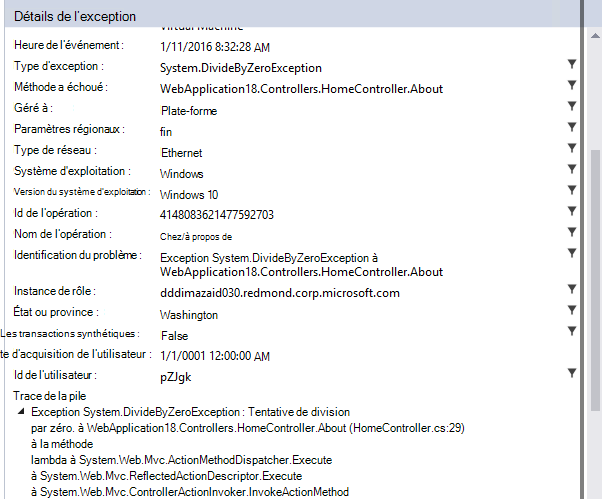

### Rencontrer de nouveaux points d’entrée pour la recherche dans l’Explorateur de solutions
Vous pouvez maintenant accéder à recherche par le biais de l’Explorateur de solutions.

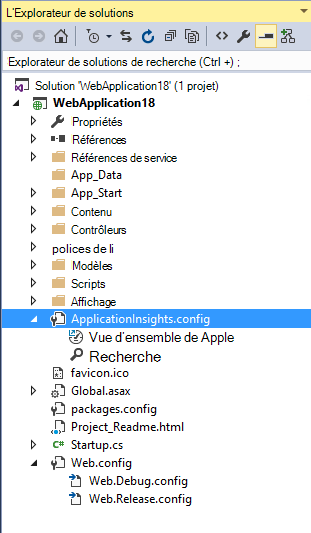

### Affiche une notification si la publication est terminée
Une boîte de dialogue s’affiche lorsque le projet est publié en ligne, de sorte que vous pouvez afficher vos données de perspectives de l’Application en production.

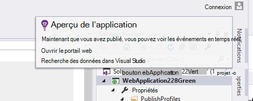

## Version 4.0

### Rechercher des données perspectives d’Application à partir de Visual Studio
Comme la fonction de recherche dans le portail d’idées d’Application, maintenant dans Visual Studio, vous pouvez filtrer et la recherche sur les types d’événements, les valeurs de propriété et le texte, puis examinez les événements individuels.

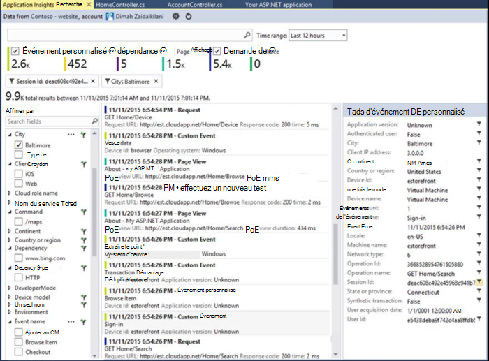

### Consultez les données provenant de votre ordinateur local dans les outils de Diagnostic

Vous pouvez afficher votre télémétrie, en plus des autres données de débogage, sur la page Outils de Diagnostic de Visual Studio. Uniquement ASP.NET 4.5 est pris en charge.

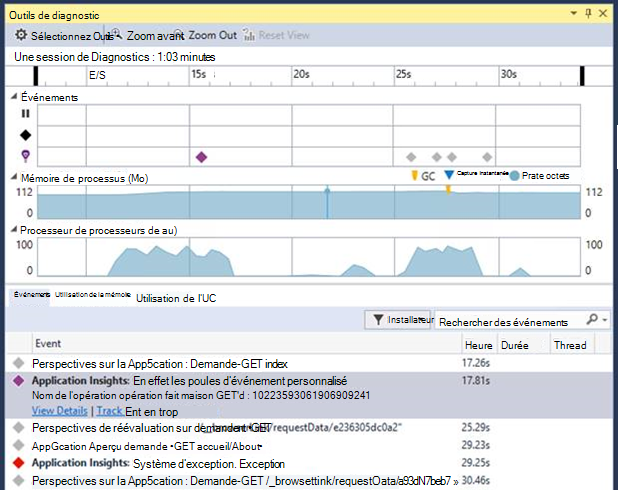

### Ajouter le Kit de développement de votre projet sans vous connecter à Azure

Vous n’avez plus à vous connecter à Azure pour ajouter des packages de perspectives de l’Application à votre projet, soit par le biais de la boîte de dialogue **Nouveau projet** dans le menu contextuel du projet. Si vous vous connectez, le Kit de développement logiciel va être installé et configuré pour envoyer des télémétrie au portail comme avant. Si vous ne vous connectez pas, le Kit de développement sera ajouté à votre projet et il générera de télémétrie pour le concentrateur de diagnostic. Vous pouvez le configurer ultérieurement si vous le souhaitez.

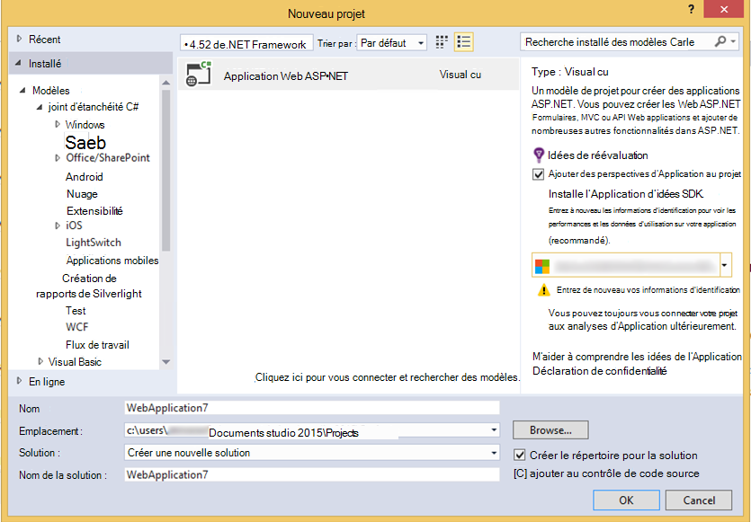

### Prise en charge de périphérique

Au niveau de la *fonction Connect() ;* 2015, nous avons [annoncé](https://azure.microsoft.com/blog/deep-diagnostics-for-web-apps-with-application-insights/) que notre expérience des développeurs mobiles pour les périphériques est HockeyApp. HockeyApp vous permet de distribuer des versions bêta pour les testeurs, collecter et analyser tous les incidents à partir de votre application et recueillir les commentaires directement à partir de vos clients.
HockeyApp prend en charge votre application sur quelle plate-forme que vous choisissez pour créer, que ce soit iOS, Android, ou Windows ou une solution multiplates-formes tels que Xamarin, Cordova ou unité.

Dans les futures versions de l’extension de l’Application aperçu, nous présenterons une expérience plus intégrée entre HockeyApp et Visual Studio. Pour le moment, vous pouvez démarrer avec HockeyApp en ajoutant simplement la référence NuGet. Consultez la [documentation](http://support.hockeyapp.net/kb/client-integration-windows-and-windows-phone) pour plus d’informations.
