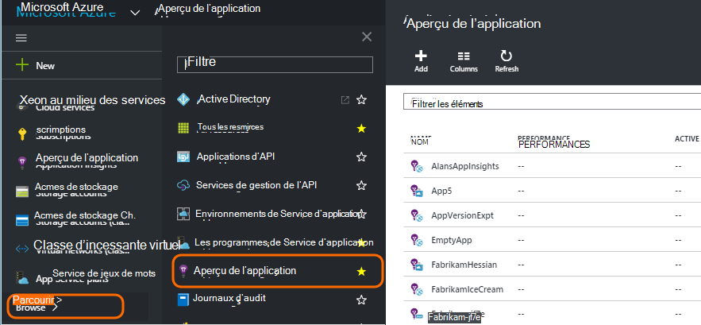
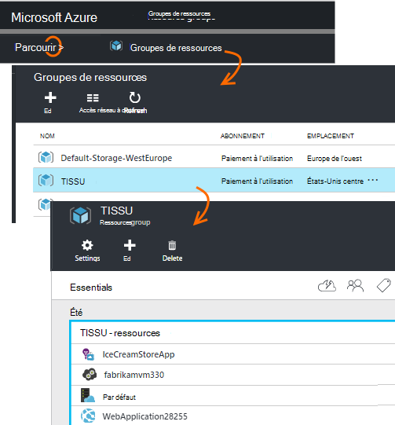
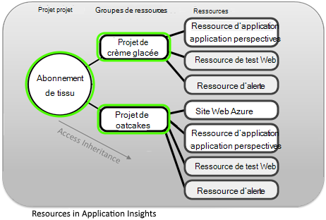
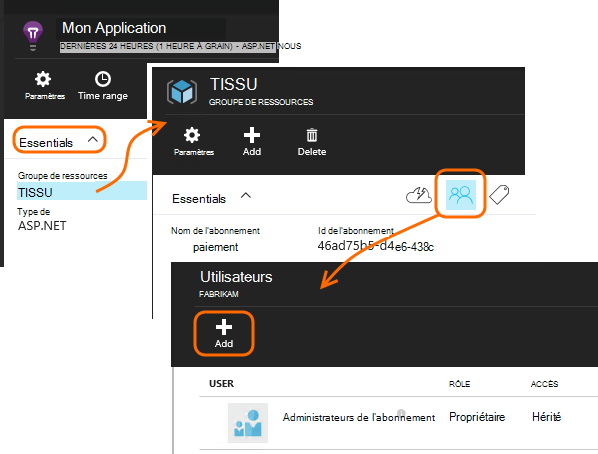
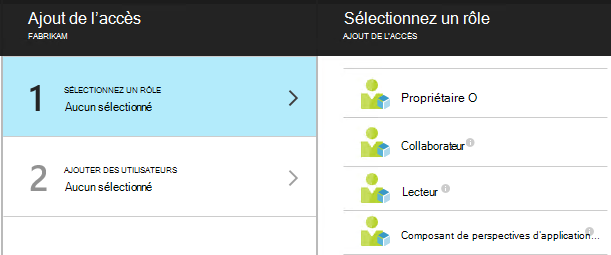
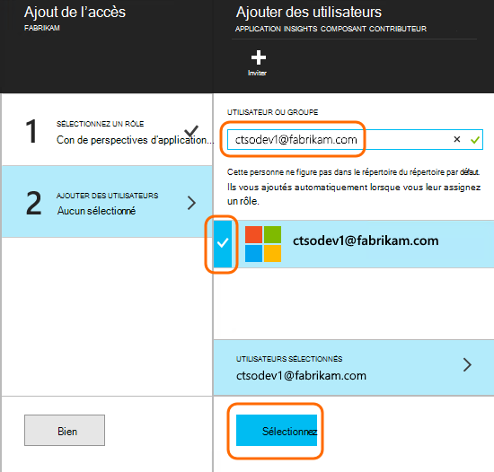

<properties
    pageTitle="Contrôle d’accès dans l’Application aperçu, les rôles et les ressources"
    description="Les propriétaires, les collaborateurs et les lecteurs de perspectives sur la de votre organisation."
    services="application-insights"
    documentationCenter=""
    authors="alancameronwills"
    manager="douge"/>

<tags
    ms.service="application-insights"
    ms.workload="tbd"
    ms.tgt_pltfrm="ibiza"
    ms.devlang="na"
    ms.topic="article"
    ms.date="05/07/2016"
    ms.author="awills"/>

# Contrôle d’accès dans l’Application aperçu, les rôles et les ressources

Vous pouvez contrôler qui a lire et mettre à jour l’accès à vos données dans Visual Studio [Application idées][start], à l’aide du [contrôle d’accès par rôle dans Microsoft Azure](../active-directory/role-based-access-control-configure.md).

> [AZURE.IMPORTANT] Attribuez l’accès aux utilisateurs dans **groupe de ressources ou d’abonnement** auquel appartient votre ressource d’application - pas dans la ressource elle-même. Affecter le rôle de **collaborateur de composant de perspectives de l’Application** . Cela garantit un contrôle uniform d’accès pour les tests web et les alertes ainsi que des ressources de votre application. [En savoir plus](#access).

## Ressources, des groupes et des abonnements

Tout d’abord, quelques définitions :

* **Ressources** - une instance d’un service Microsoft Azure. Votre ressource d’idées d’Application recueille, analyse et affiche les données de télémétrie envoyées à partir de votre application.  Autres types de ressources Azure incluent des applications web, des bases de données et des ordinateurs virtuels.

    Pour voir toutes vos ressources, cliquez sur le [Portail Azure][portal], connectez-vous et cliquez sur Parcourir.

    

* [**Groupe de ressources** ] [ group] -chaque ressource appartient à un groupe. Un groupe est un moyen pratique de gérer des ressources connexes, en particulier pour le contrôle d’accès. Par exemple, dans un groupe de ressources, vous pouvez placer une application Web, une ressource d’idées d’Application pour surveiller l’application et une ressource de stockage pour conserver les données exportées.

    

* [**Abonnement**](https://manage.windowsazure.com) - à utiliser les idées d’Application ou d’autres ressources d’Azure, vous vous connectez à un abonnement Azure. Chaque groupe de ressources appartient à un abonnement Azure, lorsque vous choisissez votre package de prix et, s’il s’agit d’un abonnement de l’organisation, sélectionnez les membres et leurs autorisations d’accès.
* [**Compte Microsoft** ] [ account] -le nom d’utilisateur et le mot de passe que vous utilisez pour vous connecter à Microsoft Azure abonnements, XBox Live, Outlook.com et autres services de Microsoft.

## Contrôle de l’accès dans le groupe de ressources

Il est important de comprendre qu’en plus de la ressource que vous avez créé pour votre application, il existe également des ressources cachées distincts pour les alertes et les tests de site web. Ils sont associés au même [groupe de ressources](#resource-group) que votre application. Vous pouvez également placer autres services Azure à cet emplacement, par exemple des sites Web ou de stockage.

Pour contrôler l’accès à ces ressources, de qu'il est par conséquent recommandé :

* Contrôle l’accès au niveau du **groupe de ressources ou d’abonnement** .
* Attribuez le rôle de **collaborateur de composant de perspectives sur l’Application** aux utilisateurs. Cela leur permet de modifier les tests web, les alertes et les ressources de perspectives de l’Application, sans fournir l’accès à tous les autres services dans le groupe.

## Pour fournir l’accès à un autre utilisateur

Vous devez disposer des droits de propriétaire sur l’abonnement ou le groupe de ressources.

L’utilisateur doit disposer d’un [Compte Microsoft][account], ou l’accès à leurs [Comptes Microsoft](..\active-directory\sign-up-organization.md). Vous pouvez fournir un accès aux individus et aux groupes d’utilisateurs définis dans Azure Active Directory.

#### Naviguez jusqu’au groupe de ressources

Ajouter l’utilisateur.

Ou bien, vous pouvez aller plus loin et ajouter l’utilisateur à l’abonnement.

#### Sélectionnez un rôle

Rôle | Dans le groupe de ressources
---|---
Propriétaire | Pouvez modifier quoi que ce soit, y compris l’accès de l’utilisateur
Collaborateur | Pouvez modifier quoi que ce soit, y compris toutes les ressources
Collaborateur de composant d’idées d’application | Modifier des ressources, les tests web et les alertes de perspectives d’Application
Lecteur | Pouvez afficher mais pas modifier quoi que ce soit

« Édition » inclut la création, de suppression et de mise à jour :

* Ressources
* Tests Web
* Alertes
* Exportation en continu

#### Sélectionnez l’utilisateur

Si l’utilisateur n’est pas dans le répertoire, vous pouvez inviter toute personne disposant d’un compte Microsoft.
(S’ils utilisent des services, tels que Outlook.com, OneDrive, Windows Phone ou XBox Live, ils disposent d’un compte Microsoft.)

## Les utilisateurs et les rôles

* [Contrôle d’accès dans Azure basée sur les rôles](../active-directory/role-based-access-control-configure.md)

<!--Link references-->

[account]: https://account.microsoft.com
[group]: ../resource-group-overview.md
[portal]: https://portal.azure.com/
[start]: app-insights-overview.md
