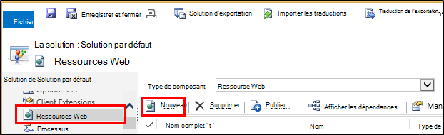
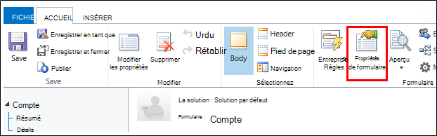

<properties 
    pageTitle="Procédure pas à pas : Surveiller Microsoft Dynamics CRM avec les informations d’Application" 
    description="Télémétrie d’obtenir à partir de Microsoft Dynamics CRM Online à l’aide des informations d’Application. Procédure pas à pas de l’installation, l’obtention de données, de visualisation et d’exportation." 
    services="application-insights" 
    documentationCenter=""
    authors="mazharmicrosoft" 
    manager="douge"/>

<tags 
    ms.service="application-insights" 
    ms.workload="tbd" 
    ms.tgt_pltfrm="ibiza" 
    ms.devlang="na" 
    ms.topic="article" 
    ms.date="11/17/2015" 
    ms.author="awills"/>
 
# Procédure pas à pas : Activation de télémétrie pour Microsoft Dynamics CRM Online à l’aide des informations d’Application

Cet article vous explique comment obtenir des données de télémétrie de [Microsoft Dynamics CRM Online](https://www.dynamics.com/) à l’aide des [Informations d’Application Visual Studio](https://azure.microsoft.com/services/application-insights/). Nous allons le processus complet de l’ajout d’un script d’idées d’Application à votre application, la capture des données et visualisation de données.

>[AZURE.NOTE] [Parcourir la solution de l’échantillon](https://dynamicsandappinsights.codeplex.com/).

## Ajouter des perspectives d’Application à l’instance de CRM Online nouvelle ou existante 

Pour analyser votre application, vous ajoutez une Application SDK de perspectives à votre application. Le Kit de développement logiciel envoie la télémétrie vers le [portail de perspectives de l’Application](https://portal.azure.com), où vous pouvez utiliser nos outils de diagnostic et d’analyse puissants, ou exporter les données vers le stockage.

### Créer une ressource d’idées d’Application dans Azure

1. Obtenir [un compte dans Microsoft Azure](http://azure.com/pricing). 
2. Connectez-vous au [portail Azure](https://portal.azure.com) et ajouter une nouvelle ressource de perspectives de l’Application. Il s’agit dans laquelle vos données seront traitées et affichées.

    

    Choisissez le type d’application ASP.NET.

3. Ouvrez l’onglet Quick Start, le script de code.

    

**Rester sur cette page de code** pendant que vous effectuez la prochaine étape dans une autre fenêtre de navigateur. Vous aurez besoin du code plus rapidement. 

### Créer une ressource web de JavaScript dans Microsoft Dynamics CRM

1. Ouvrez votre instance de CRM en ligne et l’ouverture de session avec des privilèges d’administrateur.
2. Ouvrir Microsoft Dynamics CRM paramètres, personnalisations, personnaliser le système

    
    
    

    

3. Créez une ressource JavaScript.

    

    Donnez-lui un nom, sélectionnez **Script (JScript)** et ouvrez l’éditeur de texte.

    
    
4. Copiez le code à partir de l’aperçu de l’Application. Lors de la copie Assurez-vous d’ignorer les balises de script. Consultez ci-dessous la capture d’écran :

    

    Le code inclut la clé d’instrumentation qui identifie votre ressource de perspectives d’Application.

5. Enregistrer et publier.

    

### Formulaires d’instrument

1. Dans Microsoft CRM en ligne, ouvrez le formulaire de compte

    

2. Ouvrez le formulaire de propriétés

    

3. Ajouter la ressource web JavaScript que vous avez créé

    

    

4. Enregistrez et publiez vos personnalisations de formulaire.

## Mesures capturées

Vous avez maintenant configuré la capture de télémétrie pour le formulaire. Chaque fois qu’il est utilisé, les données seront envoyées à votre ressource de perspectives de l’Application.

Voici des exemples des données que vous voyez.

#### Santé de l’application

Exceptions du navigateur :

Cliquez sur le graphique pour obtenir plus de détails :

#### Utilisation de

#### Navigateurs

#### GÉOLOCALISATION

#### Afficher la demande de page à l’intérieur

## Exemples de code

[Recherchez l’exemple de code](https://dynamicsandappinsights.codeplex.com/).

## Alimentation BI

Vous pouvez effectuer une analyse encore plus approfondie si vous [exportez les données à la puissance de Microsoft BI](app-insights-export-power-bi.md).

## Solution de l’échantillon de Microsoft Dynamics CRM

[Ici est la solution mise en œuvre de Microsoft Dynamics CRM] (https://dynamicsandappinsights.codeplex.com/).

## Pour en savoir plus

* [Ce qui est des idées d’Application ?](app-insights-overview.md)
* [Idées d’application pour les pages web](app-insights-javascript.md)
* [Plus d’exemples et procédures pas à pas](app-insights-code-samples.md)

 
