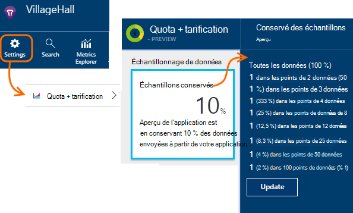

<properties 
    pageTitle="Échantillonnage de télémétrie dans les perspectives d’Application | Microsoft Azure" 
    description="Comment faire pour maintenir le volume de télémétrie sous contrôle." 
    services="application-insights" 
    documentationCenter="windows"
    authors="vgorbenko" 
    manager="douge"/>

<tags 
    ms.service="application-insights" 
    ms.workload="tbd" 
    ms.tgt_pltfrm="ibiza" 
    ms.devlang="na" 
    ms.topic="article" 
    ms.date="08/30/2016" 
    ms.author="awills"/>

#  <a name="sampling-in-application-insights"></a>Échantillonnage dans les perspectives de l’Application

*Idées d’application est en mode Aperçu.*


L’échantillonnage est qu'une fonctionnalité de [Visual Studio perspectives d’Application](app-insights-overview.md) est la méthode recommandée pour réduire le trafic de télémétrie et de stockage tout en conservant une analyse statistique correcte des données d’application. Le filtre sélectionne éléments associés de sorte que vous pouvez naviguer entre les éléments lorsque vous effectuez une enquête de diagnostic.
Lorsque la métrique nombre vous est présentés dans le portail, ils sont renormalisés pour tenir compte de l’échantillonnage, afin de minimiser tout effet sur les statistiques.

Échantillonnage réduit le trafic, vous permet de conserver au sein des contingents mensuels de données et vous permet d’éviter la limitation.

## <a name="in-brief"></a>En bref :

* L’échantillonnage conserve 1 de *n* enregistrements et ignore le reste. Par exemple, il peut conserver événements de 1/5, un taux d’échantillonnage de 20 %. 
* L’échantillonnage s’effectue automatiquement si votre application envoie un lot de télémétrie, dans les applications de serveur web ASP.NET.
* Vous pouvez également définir l’échantillonnage manuellement, soit dans le portail sur la page tarification. ou dans le Kit de développement ASP.NET dans le fichier .config, également réduire le trafic réseau.
* Si vous enregistrer des événements personnalisés et vous souhaitez vous assurer qu’un ensemble d’événements est conservé ou ignoré ensemble, assurez-vous qu’ils ont la même valeur OperationId.
* Le diviseur d’échantillonnage *n* est signalé dans chaque enregistrement de la propriété `itemCount`, qui, dans la recherche s’affiche sous le nom convivial « nombre de demande » ou le « nombre d’événements ». Lorsque l’échantillonnage n’est pas en marche, `itemCount==1`.
* Si vous écrivez des requêtes Analytique, vous devez [tenir compte de l’échantillonnage](app-insights-analytics-tour.md#counting-sampled-data). En particulier, au lieu de simplement comptage des enregistrements, vous devez utiliser `summarize sum(itemCount)`.


## <a name="types-of-sampling"></a>Types d’échantillonnage


Il existe trois méthodes d’échantillonnage de remplacement :

* **Échantillonnage adaptative** ajuste automatiquement le volume de télémétrie envoyé à partir du Kit de développement de votre application ASP.NET. Par défaut, à partir du Kit de développement logiciel v 2.0.0-beta3. Actuellement disponible pour télémétrie uniquement de ASP.NET côté serveur. 
* **Fixe-taux d’échantillonnage** réduit le volume de télémétrie envoyée du votre serveur ASP.NET et du navigateur de vos utilisateurs. Vous définissez le taux. Le client et le serveur synchronise les échantillonnages et, de recherche, vous pouvez naviguer entre les requêtes et les vues de page associé.
* **Échantillonnage de réception** réduit le volume de télémétrie conservé par le service de perspectives de l’Application, à un taux que vous avez défini. Il ne réduit pas le trafic de télémétrie, mais vous aide à conserver dans votre quota mensuel. 

Si l’échantillonnage de vitesse adaptatif ou fixe est en fonctionnement, l’échantillonnage de réception est désactivé.

## <a name="ingestion-sampling"></a>Échantillonnage de réception

Cette forme d’échantillonnage fonctionne au niveau du point où la télémétrie à partir de votre serveur web, les navigateurs et appareils atteint le point de terminaison de service informations d’Application. Bien qu’il ne réduit pas le trafic de télémétrie envoyé à partir de votre application, il réduit les traités et conservés (et facturée) par les perspectives de l’Application.

Utilisez ce type d’échantillonnage si votre application passe souvent par son quota mensuel et que vous n’avez pas la possibilité d’utiliser un des types d’échantillonnage basé sur le Kit de développement logiciel. 

Définir le taux d’échantillonnage dans le cadre des contingents et lame de tarification :



Comme d’autres types d’échantillonnage, l’algorithme conserve les éléments connexes de télémétrie. Par exemple, lorsque vous vous Inspectez la télémétrie dans la recherche, vous serez en mesure de rechercher la demande liée à une exception spécifique. Métrique de compte comme le taux de demande et taux d’exception sont conservés correctement.

Les points de données sont ignorées par échantillonnage ne sont pas disponibles dans toute fonctionnalité d’Application perspectives par exemple [Exporter Continuous](app-insights-export-telemetry.md).

Échantillonnage de réception ne fonctionne pendant basée sur le Kit de développement logiciel adaptive taux fixe d’échantillonnage ou opération. Si le taux d’échantillonnage dans le Kit de développement est inférieure à 100 %, le taux d’échantillonnage de réception que vous avez défini est ignoré.

> [AZURE.WARNING] La valeur affichée dans la fenêtre indique la valeur que vous définissez pour l’échantillonnage de l’ingestion. Il ne représente pas le taux d’échantillonnage réelle si l’échantillonnage SDK est en fonctionnement.


## <a name="adaptive-sampling-at-your-web-server"></a>D’échantillonnage adapté à votre serveur web

D’échantillonnage adapté est disponible pour le SDK de perspectives d’Application pour ASP.NET v 2.0.0-beta3 et versions ultérieures et est activé par défaut. 


Échantillonnage Adaptive affecte le volume de télémétrie envoyé à partir de votre application de serveur web pour le service informations d’Application. Le volume est automatiquement ajusté pour conserver au sein d’un taux maximal spécifié du trafic.

Il ne fonctionner de faibles volumes de télémétrie, par conséquent, une application de débogage ou un site Web avec une faible utilisation ne seront pas affecté.

Pour atteindre le volume cible, parmi la télémétrie généré est ignoré. Mais, comme d’autres types d’échantillonnage, l’algorithme conserve les éléments connexes de télémétrie. Par exemple, lorsque vous vous Inspectez la télémétrie dans la recherche, vous serez en mesure de rechercher la demande liée à une exception spécifique. 

Métrique de compte comme le taux de demande et taux d’exception sont ajustées pour compenser le taux d’échantillonnage, afin qu’ils affichent environ les valeurs correctes dans l’Explorateur de métrique.

Les packages **NuGet de votre projet de mise à jour** vers la dernière version *préliminaire* de perspectives sur les applications : droit sur le projet dans l’Explorateur de solutions, cliquez sur Gérer les Packages NuGet, cochez **inclure la version préliminaire** et recherche de Microsoft.ApplicationInsights.Web. 

Dans [ApplicationInsights.config](app-insights-configuration-with-applicationinsights-config.md), vous pouvez ajuster plusieurs paramètres dans la `AdaptiveSamplingTelemetryProcessor` nœud. Les chiffres indiqués sont les valeurs par défaut :

* `<MaxTelemetryItemsPerSecond>5</MaxTelemetryItemsPerSecond>`

    Le taux de cible qui a pour but l’algorithme adaptatif pour **sur chaque hôte du serveur**. Si votre application web s’exécute sur plusieurs hôtes, réduire cette valeur pour demeurer au sein de votre vitesse de cible du trafic sur le portail de perspectives de l’Application.

* `<EvaluationInterval>00:00:15</EvaluationInterval>` 

    L’intervalle auquel le taux actuel de télémétrie est réévalué. Évaluation est effectuée sous la forme d’une moyenne mobile. Vous pouvez souhaiter raccourcir cet intervalle si votre télémétrie est soumis à des pics soudains.

* `<SamplingPercentageDecreaseTimeout>00:02:00</SamplingPercentageDecreaseTimeout>`

    Lors de l’échantillonnage des modifications de valeur de pourcentage, combien de temps après sommes nous autorisés à réduire le pourcentage d’échantillonnage pour capturer le moins de données.

* `<SamplingPercentageIncreaseTimeout>00:15:00</SamplingPercentageIncreaseTimeout>`

    Lors de l’échantillonnage des modifications de valeur de pourcentage, combien de temps après sommes nous autorisés à augmenter le pourcentage d’échantillonnage pour capturer davantage de données.

* `<MinSamplingPercentage>0.1</MinSamplingPercentage>`

    Comme l’échantillonnage du pourcentage varie, quelle est la valeur minimale que nous sommes autorisés à définir.

* `<MaxSamplingPercentage>100.0</MaxSamplingPercentage>`

    Comme l’échantillonnage du pourcentage varie, quelle est la valeur maximale, que nous sommes autorisés à définir.

* `<MovingAverageRatio>0.25</MovingAverageRatio>` 

    Dans le calcul de la moyenne mobile, le poids affecté à la valeur la plus récente. Utilisez une valeur égale ou inférieure à 1. Des valeurs inférieures de modifier l’algorithme à soudaine.

* `<InitialSamplingPercentage>100</InitialSamplingPercentage>`

    La valeur assignée lorsque vient juste de démarrer l’application. Ne réduisez pas ceci pendant que vous déboguez. 

### <a name="alternative-configure-adaptive-sampling-in-code"></a>Autre solution : configurer d’échantillonnage adapté dans le code

Au lieu d’échantillonnage dans le fichier .config, vous pouvez utiliser le code. Cela vous permet de spécifier une fonction de rappel qui est appelée chaque fois que le taux d’échantillonnage est réévalué. Vous pouvez utiliser, par exemple, pour savoir quel est le taux d’échantillonnage est utilisé.

Supprimer le `AdaptiveSamplingTelemetryProcessor` le nœud à partir du fichier .config.


*C#*

```C#

    using Microsoft.ApplicationInsights;
    using Microsoft.ApplicationInsights.Extensibility;
    using Microsoft.ApplicationInsights.WindowsServer.Channel.Implementation;
    using Microsoft.ApplicationInsights.WindowsServer.TelemetryChannel;
    ...

    var adaptiveSamplingSettings = new SamplingPercentageEstimatorSettings();

    // Optional: here you can adjust the settings from their defaults.

    var builder = TelemetryConfiguration.Active.TelemetryProcessorChainBuilder;
    
    builder.UseAdaptiveSampling(
         adaptiveSamplingSettings,

        // Callback on rate re-evaluation:
        (double afterSamplingTelemetryItemRatePerSecond,
         double currentSamplingPercentage,
         double newSamplingPercentage,
         bool isSamplingPercentageChanged,
         SamplingPercentageEstimatorSettings s
        ) =>
        {
          if (isSamplingPercentageChanged)
          {
             // Report the sampling rate.
             telemetryClient.TrackMetric("samplingPercentage", newSamplingPercentage);
          }
      });

    // If you have other telemetry processors:
    builder.Use((next) => new AnotherProcessor(next));

    builder.Build();

```

([En savoir plus sur les processeurs de télémétrie](app-insights-api-filtering-sampling.md#filtering).)


<a name="other-web-pages"></a>
## <a name="sampling-for-web-pages-with-javascript"></a>Prélèvement d’échantillons pour les pages web avec JavaScript

Vous pouvez configurer des pages web pour l’échantillonnage de taux fixe à partir de n’importe quel serveur. 

Lorsque vous [Configurez les pages web pour les perspectives de l’Application](app-insights-javascript.md), modifier l’extrait de code que vous obtenez à partir du portail de perspectives de l’Application. (Dans les applications ASP.NET, l’extrait de code passe dans _Layout.cshtml.)  Insérer une ligne telle que `samplingPercentage: 10,` avant de la clé de l’instrumentation :

    <script>
    var appInsights= ... 
    }({ 


    // Value must be 100/N where N is an integer.
    // Valid examples: 50, 25, 20, 10, 5, 1, 0.1, ...
    samplingPercentage: 10, 

    instrumentationKey:...
    }); 
    
    window.appInsights=appInsights; 
    appInsights.trackPageView(); 
    </script> 

Le pourcentage d’échantillonnage, choisissez un pourcentage qui est proche de 100/N, où N est un entier.  L’échantillonnage actuellement ne gère pas les autres valeurs.

Si vous activez également le taux fixe l’échantillonnage au niveau du serveur, les clients et le serveur synchronise et, de recherche, vous pouvez naviguer entre les requêtes et les vues de page associé.


## <a name="fixed-rate-sampling-for-aspnet-web-sites"></a>Échantillonnage de taux fixe pour les sites web ASP.NET

Échantillonnage de taux fixe réduit le trafic envoyé à partir de votre serveur web et les navigateurs web. À la différence d’échantillonnage adapté, il réduit de télémétrie à taux fixe décidé par vous. Il synchronise également les le client et l’échantillonnage du serveur afin que les éléments associés sont conservés - par exemple, afin que si vous examinez un mode page de recherche, vous pouvez rechercher sa demande connexe.

L’algorithme d’échantillonnage conserve les éléments associés. Pour chaque demande HTTP événement, elle et ses événements connexes sont ignorées ou transmises. 

Dans l’Explorateur de mesures, les taux de nombre de demande et de l’exception sont multipliées par un facteur pour compenser le taux d’échantillonnage, afin qu’ils soient approximativement correctes.

1. **Les packages NuGet de votre projet de mise à jour** vers la dernière version *préliminaire* de perspectives de l’Application. Droit sur le projet dans l’Explorateur de solutions, cliquez sur Gérer les Packages NuGet, cochez **inclure la version préliminaire** et rechercher Microsoft.ApplicationInsights.Web. 

2. **Désactiver l’échantillonnage adaptive**: dans [ApplicationInsights.config](app-insights-configuration-with-applicationinsights-config.md), supprimez ou mettez en commentaire la `AdaptiveSamplingTelemetryProcessor` nœud.

    ```xml

    <TelemetryProcessors>
    <!-- Disabled adaptive sampling:
      <Add Type="Microsoft.ApplicationInsights.WindowsServer.TelemetryChannel.AdaptiveSamplingTelemetryProcessor, Microsoft.AI.ServerTelemetryChannel">
        <MaxTelemetryItemsPerSecond>5</MaxTelemetryItemsPerSecond>
      </Add>
    -->
    

    ```

2. **Activer le module de prélèvement de taux fixe.** Ajouter cet extrait de code à [ApplicationInsights.config](app-insights-configuration-with-applicationinsights-config.md):

    ```XML

    <TelemetryProcessors>
     <Add  Type="Microsoft.ApplicationInsights.WindowsServer.TelemetryChannel.SamplingTelemetryProcessor, Microsoft.AI.ServerTelemetryChannel">

      <!-- Set a percentage close to 100/N where N is an integer. -->
     <!-- E.g. 50 (=100/2), 33.33 (=100/3), 25 (=100/4), 20, 1 (=100/100), 0.1 (=100/1000) -->
      <SamplingPercentage>10</SamplingPercentage>
      </Add>
    </TelemetryProcessors>

    ```

> [AZURE.NOTE] Le pourcentage d’échantillonnage, choisissez un pourcentage qui est proche de 100/N, où N est un entier.  L’échantillonnage actuellement ne gère pas les autres valeurs.


### <a name="alternative-enable-fixed-rate-sampling-in-your-server-code"></a>Alternative : activer l’échantillonnage de taux fixe dans le code serveur


Au lieu de définir le paramètre d’échantillonnage dans le fichier .config, vous pouvez utiliser le code. 

*C#*

```C#

    using Microsoft.ApplicationInsights.Extensibility;
    using Microsoft.ApplicationInsights.WindowsServer.TelemetryChannel;
    ...

    var builder = TelemetryConfiguration.Active.GetTelemetryProcessorChainBuilder();
    builder.UseSampling(10.0); // percentage

    // If you have other telemetry processors:
    builder.Use((next) => new AnotherProcessor(next));

    builder.Build();

```

([En savoir plus sur les processeurs de télémétrie](app-insights-api-filtering-sampling.md#filtering).)


## <a name="when-to-use-sampling"></a>Quand utiliser le prélèvement ?

Échantillonnage adaptatif est activé automatiquement si vous utilisez la 2.0.0-beta3 de version du Kit de développement ASP.NET ou une version ultérieure. Quelle que soit la version SDK vous utilisez, vous pouvez utiliser l’échantillonnage de réception (sur notre serveur).

Vous n’avez pas besoin d’échantillonnage pour la plupart des applications de petite et moyenne taille. Les informations de diagnostic très utiles et les statistiques les plus précises sont obtenus par la collecte de données sur toutes vos activités d’utilisateur. 

 
Les principaux avantages d’échantillonnage sont :

* Application Insights service gouttes (« limite ») points de données lorsque votre application envoie un taux très élevé de télémétrie en bref intervalle. 
* Pour conserver dans le [quota](app-insights-pricing.md) de points de données pour votre niveau de tarification. 
* Pour réduire le trafic réseau à partir de la collection de télémétrie. 

### <a name="which-type-of-sampling-should-i-use"></a>Le type d’échantillonnage dois-je utiliser ?


**Utilisez l’ingestion d’échantillonnage, si :**

* Vous allez souvent par le biais de votre quota mensuel de télémétrie.
* Vous utilisez une version du Kit de développement logiciel qui ne gère pas d’échantillonnage - par exemple, Kit de développement logiciel Java ou les versions d’ASP.NET antérieures à 2.
* Vous recevez un grand nombre de télémétrie à partir de navigateurs web de vos utilisateurs.

**Utiliser le taux fixe de prélèvement si :**

* Vous utilisez le SDK de perspectives d’Application pour la version de services web ASP.NET 2.0.0 ou ultérieur, et
* Vous souhaitez échantillonnage synchronisé entre le client et le serveur, afin que, lorsque vous êtes recherches sur les événements dans la [recherche](app-insights-diagnostic-search.md), vous pouvez naviguer entre les événements connexes sur le client et le serveur, telles que les vues de page et les demandes http.
* Vous maîtrisez le pourcentage d’échantillonnage approprié pour votre application. Il doit être suffisamment élevée pour obtenir des mesures précises, mais au-dessous du taux qui dépasse votre quota de tarification et les limites de la limitation. 


**Utilisez adaptive l’échantillonnage :**

Dans le cas contraire, nous vous recommandons d’échantillonnage adapté. Cette option est activée par défaut dans le serveur ASP.NET SDK, version 2.0.0-beta3 ou une version ultérieure. Il ne réduit pas le trafic jusqu'à ce qu’un certain taux minimal, afin qu’il n’affecte pas un site peu utilisé.


## <a name="how-do-i-know-whether-sampling-is-in-operation"></a>Comment savoir si l’échantillonnage est en fonctionnement ?

Pour découvrir la fréquence d’échantillonnage réelle, quel que soit l’endroit où il a été appliqué, utilisez une [requête d’Analytique](app-insights-analytics.md) comme cela :

    requests | where timestamp > ago(1d)
  	| summarize 100/avg(itemCount) by bin(timestamp, 1h) 
  	| render areachart 

Dans chaque conservés enregistrement, `itemCount` indique le nombre d’enregistrements d’origine qu’il représente, égal à 1 + le nombre d’enregistrements ignorés précédents. 


## <a name="how-does-sampling-work"></a>Comment fonctionne le prélèvement ?

Taux fixe et échantillonnage adapté sont une fonctionnalité du SDK dans les versions d’ASP.NET de 2.0.0 et supérieur. Échantillonnage de réception est une fonctionnalité du service informations d’Application et peut être dans l’opération si le SDK n’effectue pas d’échantillonnage. 

L’algorithme d’échantillonnage décide de déplacer les éléments de télémétrie et celles que vous voulez conserver (si elle est dans le Kit de développement logiciel ou le service informations d’Application). La décision d’échantillonnage est basée sur plusieurs règles qui visent à préserver tous les points de données reliées intact, conservant une expérience dans les perspectives d’Application exploitables et fiable même avec un ensemble réduit de données de diagnostic. Par exemple, si pour une demande ayant échoué votre application envoie les articles de télémétrie supplémentaires (par exemple, l’exception et des traces enregistrées à partir de cette requête), échantillonnage ne fractionne pas cette demande et autre télémétrie. Elle conserve ou supprime les tous ensemble. En conséquence, lorsque vous consultez les détails de la demande dans les perspectives de l’Application, vous pouvez toujours voir la demande ainsi que ses éléments de télémétrie associé. 

Pour les applications qui définissent des « utilisateur » (autrement dit, des applications web plus typiques), la décision d’échantillonnage est basée sur le hachage de l’id utilisateur, ce qui signifie que tous les de télémétrie pour un utilisateur particulier est conservé ou supprimé. Pour les types d’applications que vous ne définissent pas les utilisateurs (par exemple, des services web), la décision d’échantillonnage est basée sur l’id de la demande d’opération. Enfin, pour les éléments de télémétrie ayant ni id utilisateur ni d’opération est défini (par exemple pour télémétrie signalés à partir de threads asynchrones sans contexte http) échantillonnage capture simplement un pourcentage d’éléments de télémétrie de chaque type. 

Lorsque vous présentez la télémétrie avec vous, le service informations d’Application ajuste les mesures par le même pourcentage d’échantillonnage utilisée au moment de la collection, afin de compenser les points de données manquants. Par conséquent, lorsque vous examinez la télémétrie dans les perspectives de l’Application, les utilisateurs voient approximations statistiquement correctes qui sont très proches des nombres réels.

La précision du rapprochement dépend en grande partie le pourcentage d’échantillonnage configuré. En outre, la précision augmente pour les applications qui gèrent un grand nombre de demandes généralement similaires à partir de nombreux utilisateurs. En revanche, pour les applications qui ne fonctionnent pas avec une charge importante, l’échantillonnage n’est pas nécessaire que ces applications peuvent envoyer généralement de toutes leur télémétrie tout en restant dans le quota, sans provoquer de perte de données à partir de la limitation. 

Notez que les perspectives d’Application n’échantillonne pas les types de télémétrie métriques et Sessions, depuis pour ces types, réduction de la précision peut être souhaitable. 

### <a name="adaptive-sampling"></a>Échantillonnage Adaptive

Échantillonnage Adaptive ajoute un composant qui surveille le taux actuel de transmission à partir du Kit de développement et ajuste le pourcentage d’échantillonnage pour essayer de dépasser le taux maximal de cible. L’ajustement est recalculé à intervalles réguliers et est basé sur une moyenne mobile de la vitesse de transmission sortante.

## <a name="sampling-and-the-javascript-sdk"></a>Prélèvement d’échantillons et le Kit de développement de JavaScript

Côté client (JavaScript) SDK participe à taux fixe l’échantillonnage conjointement avec le Kit de développement côté serveur. Les pages instrumentés n’envoie de télémétrie de côté client à partir des mêmes utilisateurs pour lesquels le côté serveur apportées sa décision de « sample dans ». Cette logique est conçue pour maintenir l’intégrité de la session utilisateur sur plusieurs côtés client et serveur. Par conséquent, à partir de n’importe quel élément de télémétrie particulier dans l’Application aperçu, vous pouvez trouver tous les autres éléments de télémétrie pour cet utilisateur ou la session. 

*Mon client et du côté serveur télémétrie ne présentent des exemples de coordonnée que vous décrivez ci-dessus.*

* Vérifiez que vous avez activé l’échantillonnage de taux fixe à la fois sur le serveur et le client.
* Assurez-vous que la version du Kit de développement logiciel est 2.0 ou ultérieure.
* Vérifiez que vous définissez le même pourcentage d’échantillonnage dans le client et le serveur.


## <a name="frequently-asked-questions"></a>Forum aux Questions 

*Pourquoi l’échantillonnage n’est pas un simple « collecte X % de chaque type de télémétrie » ?*

 *  Bien que cette approche d’échantillonnage offrant une très haute précision dans des approximations métriques, entraînerait la rupture de capacité à mettre en corrélation des données de diagnostic par l’utilisateur, de session et de demande, ce qui est essentiel pour les tests de diagnostic. Par conséquent, un échantillonnage fonctionne mieux avec « collecte tous les éléments de télémétrie pour X % des utilisateurs de l’application », ou « collecte tous les de télémétrie pour X % des demandes d’application » logique. Pour les articles de télémétrie non associés avec les demandes (par exemple, le traitement asynchrone d’arrière-plan), la chute de retour consiste à « collecter X % de tous les éléments pour chaque type de télémétrie. » 

*Le pourcentage d’échantillonnage peut changer avec le temps ?*

 * Oui, l’échantillonnage adaptive change progressivement le pourcentage d’échantillonnage, basé sur le volume actuellement observé de la télémétrie.

 

*Si vous utilisez le prélèvement d’échantillons de taux fixe, comment savoir échantillonnage pourcentage fonctionnera le mieux pour mon application ?*

* Une façon d’échantillonnage adaptive tout d’abord, savoir quelle règle de taux (voir la question ci-dessus) et à taux fixe échantillonnage à l’aide de ce taux. 

    Dans le cas contraire, vous devez deviner. Analyser votre utilisation actuelle de télémétrie dans AI, observez la limitation qui se produit et estimer le volume de la télémétrie recueilli. Ces trois entrées, ainsi que de votre niveau de tarification sélectionnée, suggèrent combien vous pouvez souhaiter réduire le volume de la télémétrie recueilli. Toutefois, une augmentation du nombre d’utilisateurs ou certains autre MAJ dans le volume de télémétrie peut invalider à votre estimation.

*Que se passe-t-il si je configure le pourcentage d’échantillonnage trop faible ?*

* Pourcentage d’échantillonnage excessivement faible (échantillonnage over-aggressive) réduit l’exactitude des approximations, lorsque les perspectives d’Application tente de compenser la visualisation des données pour la réduction de volume de données. En outre, expérience de diagnostic peut-être être réduite, comme certaines requêtes lentes ou peu défaillant peuvent être échantillonnées en.

*Que se passe-t-il si je configure le pourcentage d’échantillonnage trop élevé ?*

* Pourcentage d’échantillonnage trop élevé (non agressif suffisamment) de configuration entraîne une réduction du volume de la télémétrie recueilli insuffisante. Vous pouvez encore rencontrer des pertes de données télémétriques relatives à la limitation, et le coût de l’utilisation d’idées d’Application peut être plus élevé que prévu en raison de frais de limites d’âge.

*Sur quelles plates-formes puis-je utiliser d’échantillonnage ?*

* Échantillonnage de réception peut se produire automatiquement pour n’importe quel télémétrie au-dessus d’un certain volume, si le SDK n’effectue pas d’échantillonnage. Cette méthode fonctionne, par exemple, si votre application utilise un serveur Java, ou si vous utilisez une ancienne version du Kit de développement ASP.NET.

* Si vous utilisez des versions de ASP.NET SDK 2.0.0 et au-dessus (hébergé dans Azure ou sur votre propre serveur), vous obtenez adaptive d’échantillonnage par défaut, mais vous pouvez passer à taux fixe, comme décrit ci-dessus. Avec l’échantillonnage de taux fixe, le Kit de développement logiciel de navigateur synchronise automatiquement d’échantillonner des événements connexes. 

*Il existe certains événements rares que vous souhaitez toujours afficher. Comment puis-je obtenir les au-delà du module d’échantillonnage ?*

 * Initialiser une instance distincte de TelemetryClient avec une TelemetryConfiguration de nouvelle (pas par défaut actif). Qui permet d’envoyer vos événements rares.


## <a name="next-steps"></a>Étapes suivantes

* [Le filtrage](app-insights-api-filtering-sampling.md) peut fournir plus de contrôle strict qu’envoie votre Kit de développement logiciel.
