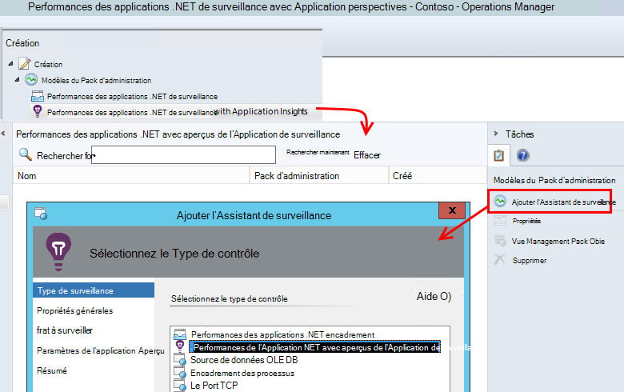
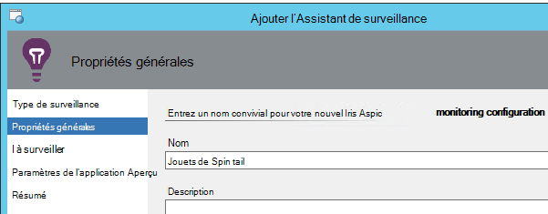
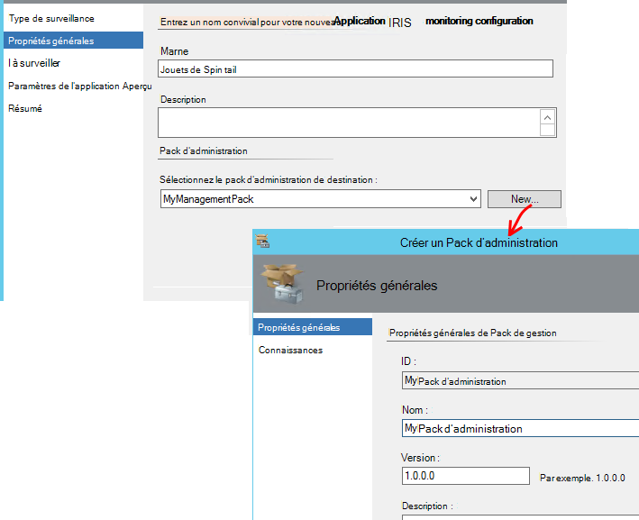
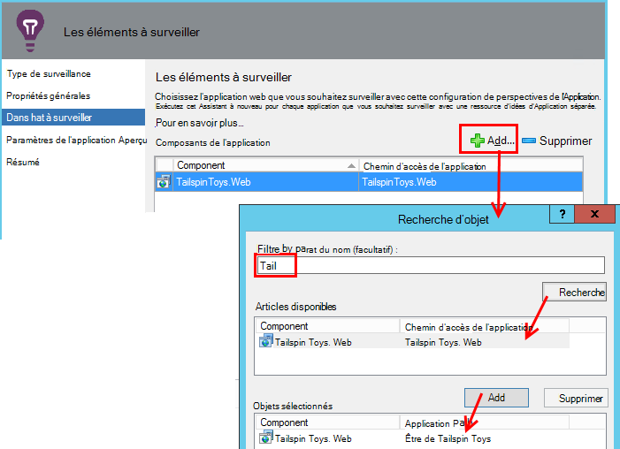
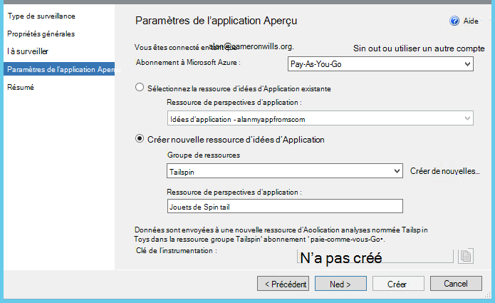
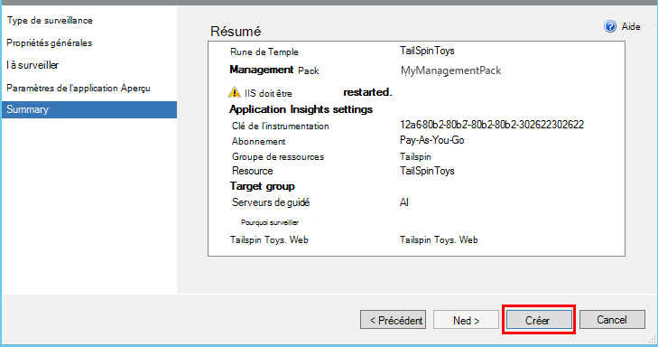
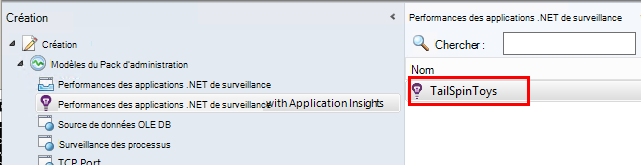
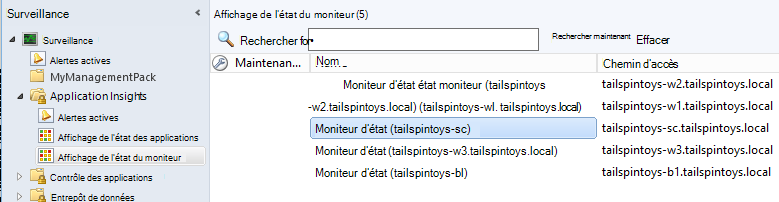

<properties 
    pageTitle="Intégration de SCOM avec les perspectives d’Application | Microsoft Azure" 
    description="Si vous êtes un utilisateur SCOM, surveiller les performances et diagnostiquer les problèmes avec les perspectives de l’Application. Les tableaux de bord complets, alertes actives, puissants outils de diagnostic et des requêtes d’analyse." 
    services="application-insights" 
    documentationCenter=""
    authors="alancameronwills" 
    manager="douge"/>

<tags 
    ms.service="application-insights" 
    ms.workload="tbd" 
    ms.tgt_pltfrm="ibiza" 
    ms.devlang="na" 
    ms.topic="article" 
    ms.date="08/12/2016" 
    ms.author="awills"/>
 
# Surveillance des performances applicatives à l’aide de perspectives de l’Application de SCOM

Si vous utilisez System Center Operations Manager (SCOM) pour gérer vos serveurs, vous pouvez surveiller les performances et diagnostiquer les problèmes de performances à l’aide des [Informations d’Application Visual Studio](app-insights-asp-net.md). Idées d’application surveille les requêtes entrantes de votre application web, sortant reste et appels SQL, exceptions et journal des traces. Il fournit des tableaux de bord graphiques métriques et les alertes actives, ainsi que recherche de diagnostic puissant et requêtes analytiques sur cette télémétrie. 

Vous pouvez basculer sur l’analyse des perspectives d’Application à l’aide d’un pack de gestion SCOM.

## Avant de commencer

Nous supposons que :

* Serveurs web, vous êtes familiarisé avec le SCOM et que vous utilisez SCOM 2012 R2 ou 2016 pour gérer votre serveur IIS.
* Vous avez déjà installé sur vos serveurs d’une application web que vous souhaitez surveiller avec aperçus de l’Application.
* App version du framework est .NET 4.5 ou version ultérieure.
* Avoir accès à un abonnement dans [Microsoft Azure](https://azure.com) et peut se connecter au [portail Azure](https://portal.azure.com). Votre organisation peut disposer d’un abonnement et pouvez ajoutez-y votre compte Microsoft.

(L’équipe de développement peut générer l' [Application SDK de perspectives](app-insights-asp-net.md) dans l’application web. Instrumentation de ce moment de la génération leur donne une plus grande flexibilité dans l’écriture de télémétrie personnalisé. Toutefois, il n’a aucune importance : vous pouvez suivre les étapes décrites ici, avec ou sans le Kit de développement logiciel intégré.)

## (Une fois) Installer le pack de gestion des perspectives d’Application

Sur l’ordinateur où vous exécutez Operations Manager :

2. Désinstallez toute ancienne version du pack d’administration :
 1. Dans Operations Manager, ouvrez l’Administration, des Packs d’administration. 
 2. Supprimer l’ancienne version.
1. Téléchargez et installez le pack d’administration à partir du catalogue.
2. Redémarrez le Gestionnaire des opérations.

## Créer un pack d’administration

1. Dans le Gestionnaire des opérations, ouvrir **Création**, **.NET... avec aperçus de l’Application**, **Assistant Ajout de contrôle**et choisissez à nouveau les **.NET... avec aperçus de l’Application**.

    

2. Nom de la configuration après votre application. (Vous devez instrumenter une application à la fois).
    
    

3. Sur la même page de l’Assistant, créez un nouveau pack d’administration, ou sélectionnez un pack que vous avez créé pour les perspectives de l’Application.

     (L' aperçu de l’Application [pack d’administration](https://technet.microsoft.com/library/cc974491.aspx) est un modèle, à partir de laquelle vous créez une instance. Vous pouvez réutiliser la même instance ultérieurement.)

    

4. Choisissez une application que vous souhaitez surveiller. La fonctionnalité de recherche recherche parmi les applications installées sur vos serveurs.

    

    Le champ de portée d’analyse facultatif peut être utilisé pour spécifier un sous-ensemble de vos serveurs, si vous ne voulez pas surveiller l’application de tous les serveurs.

5. Sur la page suivante de l’Assistant, vous devez d’abord fournir vos informations d’identification pour vous connecter à Microsoft Azure.

    Sur cette page, vous sélectionnez la ressource d’idées d’Application où vous souhaitez que les données de télémétrie pour être analysé et affiché. 

 * Si l’application a été configurée pour les perspectives de l’Application pendant le développement, sélectionnez la ressource existante.
 * Sinon, créez une nouvelle ressource appelée pour l’application. S’il existe des autres applications qui sont des composants d’un même système, placez-les dans le même groupe de ressources, pour faciliter l’accès à la télémétrie à gérer.

    Vous pouvez modifier ces paramètres ultérieurement.

    

6. Terminez l’Assistant.

    
    
Répétez cette procédure pour chaque application que vous souhaitez surveiller.

Si vous devez modifier les paramètres ultérieurement, ouvrez à nouveau les propriétés de l’écran à partir de la fenêtre de création.

## Vérifiez la surveillance

Le moniteur que vous avez installé votre application recherche sur chaque serveur. Lorsqu’elle constate l’application, il configure moniteur d’état Application perspectives pour surveiller l’application. Si nécessaire, il installe tout d’abord le moniteur d’état sur le serveur.

Vous pouvez vérifier les instances de l’application qu’il a trouvé :

## Télémétrie d’affichage dans l’aperçu de l’Application

Dans le [portail Azure](https://portal.azure.com), accédez à la ressource pour votre application. Vous [consultez graphiques montrant la télémétrie](app-insights-dashboards.md) à partir de votre application. (Si elle n’a pas apparues sur la page principale encore, cliquez sur les mesures de flux).

## Étapes suivantes

* [Configurer un tableau de bord](app-insights-dashboards.md) de réunir les graphiques plus importantes, cela et les autres applications de surveillance.
* [En savoir plus sur les mesures](app-insights-metrics-explorer.md)
* [Configurer des alertes](app-insights-alerts.md)
* [Diagnostic des problèmes de performances](app-insights-detect-triage-diagnose.md)
* [Requêtes puissantes Analytique](app-insights-analytics.md)
* [Disponibilité des tests web](app-insights-monitor-web-app-availability.md)
