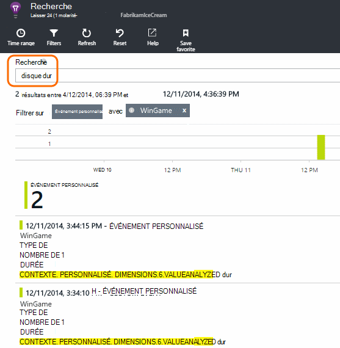

<properties 
    pageTitle="Journaux, des exceptions et des tests de diagnostic personnalisé pour ASP.NET dans l’Application aperçu" 
    description="Diagnostiquer les problèmes dans les applications web ASP.NET en recherchant les demandes, les exceptions et les journaux générés avec Trace, NLog ou Log4Net." 
    services="application-insights" 
    documentationCenter=""
    authors="alancameronwills" 
    manager="douge"/>

<tags 
    ms.service="application-insights" 
    ms.workload="tbd" 
    ms.tgt_pltfrm="ibiza" 
    ms.devlang="na" 
    ms.topic="article" 
    ms.date="04/08/2016" 
    ms.author="awills"/>
 
# Journaux, des exceptions et des tests de diagnostic personnalisé pour ASP.NET dans l’Application aperçu

[Idées d’application] [ start] inclut un puissant de [Recherche de Diagnostic] [ diagnostic] outil qui vous permet d’Explorer et d’extraire télémétrie envoyé par le SDK de perspectives d’Application à partir de votre application. De nombreux événements comme des vues de page utilisateur sont envoyés automatiquement par le Kit de développement logiciel.

Vous pouvez également écrire du code pour envoyer des événements personnalisés, des rapports d’exception et des traces. Et si vous utilisez déjà un framework de journalisation log4J, log4net, NLog ou System.Diagnostics.Trace, vous pouvez capturer les journaux et les inclure dans la recherche. Cela rend facile de faire correspondre des traces de journal des actions de l’utilisateur, les exceptions et les autres événements.

## Avant d’écrire de télémétrie personnalisé

Si vous n’avez pas encore [configuré les perspectives d’Application de votre projet][start], faire maintenant.

Lorsque vous exécutez votre application, il enverra certaines télémétrie qui s’afficheront dans la recherche de Diagnostic, y compris les requêtes reçues par le serveur, la page vues enregistrées au niveau du client et non interceptée exceptions.

Ouvrir une recherche Diagnostic pour voir la télémétrie le SDK envoie automatiquement.

Les détails varient d’une application type à l’autre. Vous pouvez cliquer sur par le biais de n’importe quel événement pour obtenir plus de détails.

## Échantillonnage 

Si votre application envoie un lot de données et que vous utilisez le Kit de développement du perspectives d’Application pour ASP.NET version 2.0.0-beta3 ou version ultérieure, la fonctionnalité d’échantillonnage adapté peut fonctionner et envoyer uniquement un pourcentage de votre télémétrie. [Pour en savoir plus sur l’échantillonnage.](app-insights-sampling.md)

##Événements personnalisés

Événements personnalisés apparaissent à la fois dans la [Recherche de Diagnostic] [ diagnostic] et dans [l’Explorateur de mesure de le][metrics]. Vous pouvez les envoyer à partir de périphériques, des pages web et des applications serveur. Il peuvent être utilisés à la fois à des fins de diagnostics et de [comprendre les modèles d’utilisation][track].

Un événement personnalisé a un nom et peut également comporter des propriétés que vous pouvez filtrer, ainsi que les mesures numériques.

JavaScript sur le client

    appInsights.trackEvent("WinGame",
         // String properties:
         {Game: currentGame.name, Difficulty: currentGame.difficulty},
         // Numeric measurements:
         {Score: currentGame.score, Opponents: currentGame.opponentCount}
         );

C# au niveau serveur

    // Set up some properties:
    var properties = new Dictionary <string, string> 
       {{"game", currentGame.Name}, {"difficulty", currentGame.Difficulty}};
    var measurements = new Dictionary <string, double>
       {{"Score", currentGame.Score}, {"Opponents", currentGame.OpponentCount}};

    // Send the event:
    telemetry.TrackEvent("WinGame", properties, measurements);

VB au niveau serveur

    ' Set up some properties:
    Dim properties = New Dictionary (Of String, String)
    properties.Add("game", currentGame.Name)
    properties.Add("difficulty", currentGame.Difficulty)

    Dim measurements = New Dictionary (Of String, Double)
    measurements.Add("Score", currentGame.Score)
    measurements.Add("Opponents", currentGame.OpponentCount)

    ' Send the event:
    telemetry.TrackEvent("WinGame", properties, measurements)

### Exécuter votre application et afficher les résultats.

Ouvrez recherche de Diagnostic.

Sélectionnez Custom Event et sélectionnez un nom d’événement particulier.

Filtrer les données plus en entrant un terme de recherche sur une valeur de propriété.  

Explorez un événement individuel pour afficher ses propriétés détaillées.

##Affichages de page

Télémétrie d’affichage de page est envoyée par l’appel de trackPageView() dans [l’extrait de code JavaScript que vous insérez dans vos pages web][usage]. Son objectif principal est de contribuer au nombre de vues de page que vous voyez sur la page de vue d’ensemble.

En général il est appelée une seule fois dans chaque page HTML, mais vous pouvez insérer plusieurs appels - par exemple, si vous avez une application de page unique et que vous souhaitez enregistrer une nouvelle page chaque fois que l’utilisateur obtient plus de données.

    appInsights.trackPageView(pageSegmentName, "http://fabrikam.com/page.htm"); 

Il est parfois utile de joindre des propriétés que vous pouvez utiliser comme filtres dans la recherche de diagnostic :

    appInsights.trackPageView(pageSegmentName, "http://fabrikam.com/page.htm",
     {Game: currentGame.name, Difficulty: currentGame.difficulty});

##Suivi de télémétrie

TELEMETRIE de trace est un code que vous insérez spécifiquement pour créer des journaux de diagnostic. 

Par exemple, vous pouvez insérer des appels comme suit :

    var telemetry = new Microsoft.ApplicationInsights.TelemetryClient();
    telemetry.TrackTrace("Slow response - database01");

####  Installez une carte pour votre infrastructure de journalisation

Vous pouvez également rechercher les journaux générés avec une infrastructure de journalisation - log4Net, NLog ou System.Diagnostics.Trace. 

1. Si vous prévoyez d’utiliser des log4Net ou NLog, installez-le dans votre projet. 
2. Dans l’Explorateur de solutions, avec le bouton droit de votre projet et sélectionnez **Manage NuGet Packages**.
3. Sélectionnez en ligne >, sélectionnez **Inclure la version préliminaire** et recherche de « Microsoft.ApplicationInsights »

    

4. Sélectionnez le package approprié - un des :
  + Microsoft.ApplicationInsights.TraceListener (pour capturer les appels System.Diagnostics.Trace)
  + Microsoft.ApplicationInsights.NLogTarget
  + Microsoft.ApplicationInsights.Log4NetAppender

Le package NuGet installe les assemblys nécessaires et modifie également le web.config ou app.config.

#### Insérer les appels de journaux de diagnostic

Si vous utilisez System.Diagnostics.Trace, un appel typique serait :

    System.Diagnostics.Trace.TraceWarning("Slow response - database01");

Si vous préférez log4net ou NLog :

    logger.Warn("Slow response - database01");

Exécutez votre application en mode débogage, ou déployer.

Vous verrez les messages de Diagnostic recherche lorsque vous sélectionnez le filtre de Trace.

### Exceptions

L’obtention de rapports d’exception dans les perspectives d’Application offre une très puissante, surtout dans la mesure où vous pouvez naviguer entre les demandes qui ont échoué et les exceptions et lire la pile d’exception.

Dans certains cas, vous devez [Insérer quelques lignes de code] [ exceptions] pour vous assurer que vos exceptions sont interceptées automatiquement.

Vous pouvez également écrire du code explicite pour envoyer de télémétrie d’exception :

JavaScript

    try 
    { ...
    }
    catch (ex)
    {
      appInsights.TrackException(ex, "handler loc",
        {Game: currentGame.Name, 
         State: currentGame.State.ToString()});
    }

C#

    var telemetry = new TelemetryClient();
    ...
    try 
    { ...
    }
    catch (Exception ex)
    {
       // Set up some properties:
       var properties = new Dictionary <string, string> 
         {{"Game", currentGame.Name}};

       var measurements = new Dictionary <string, double>
         {{"Users", currentGame.Users.Count}};

       // Send the exception telemetry:
       telemetry.TrackException(ex, properties, measurements);
    }

VB

    Dim telemetry = New TelemetryClient
    ...
    Try
      ...
    Catch ex as Exception
      ' Set up some properties:
      Dim properties = New Dictionary (Of String, String)
      properties.Add("Game", currentGame.Name)

      Dim measurements = New Dictionary (Of String, Double)
      measurements.Add("Users", currentGame.Users.Count)
  
      ' Send the exception telemetry:
      telemetry.TrackException(ex, properties, measurements)
    End Try

Les paramètres des propriétés et des mesures sont facultatifs, mais sont utiles pour le filtrage et ajouter des informations supplémentaires. Par exemple, si vous avez une application qui peut exécuter plusieurs jeux, vous pouvez rechercher tous les rapports d’exception liés à un jeu particulier. Vous pouvez ajouter autant d’éléments que vous le souhaitez à chaque dictionnaire.

#### Affichage des exceptions

Vous verrez un résumé des exceptions signalées sur la lame de vue d’ensemble, et vous pouvez cliquer sur à pour plus de détails. Par exemple :

[]

Cliquez sur n’importe quel type d’exception à voir des occurrences spécifiques :

[]

Vous pouvez également ouvrir recherche Diagnostic directement, filtrer sur les exceptions et choisissez le type d’exception que vous souhaitez afficher.

### Rapport d’exceptions non gérées

Rapports de perspectives sur l’application non gérée exceptions lorsqu’il le peut, à partir de périphériques, [navigateurs web][usage], ou les serveurs web, si instrumenté par le [Moniteur d’état] [ redfield] ou [Application Insights SDK][greenbrown]. 

Toutefois, il n’est pas toujours possible dans certains cas parce que le .NET framework intercepte les exceptions.  Pour vous assurer que vous consultez toutes les exceptions, vous devez donc écrire un gestionnaire d’exception de petit. La meilleure procédure varie en fonction de la technologie. Consultez la [télémétrie d’Exception pour ASP.NET] [ exceptions] pour plus de détails. 

### Mise en corrélation avec une génération

Lorsque vous lisez des journaux de diagnostic, il est probable que votre code source sera modifié dans la mesure où le code en direct a été déployé.

Il est donc utile de placer les informations de build, par exemple l’URL de la version actuelle, dans une propriété ainsi que chaque exception ou de la trace. 

Au lieu d’ajouter la propriété séparément pour chaque appel d’exception, vous pouvez définir les informations dans le contexte par défaut. 

    // Telemetry initializer class
    public class MyTelemetryInitializer : ITelemetryInitializer
    {
        public void Initialize (ITelemetry telemetry)
        {
            telemetry.Properties["AppVersion"] = "v2.1";
        }
    }

Dans l’initialiseur app comme Global.asax.cs :

    protected void Application_Start()
    {
        // ...
        TelemetryConfiguration.Active.TelemetryInitializers
        .Add(new MyTelemetryInitializer());
    }

###Requêtes de serveur Web

Demande de télémétrie est automatiquement envoyé lorsque vous [installer le moniteur de statut sur votre serveur web][redfield], ou lorsque vous [Ajoutez des perspectives d’Application à votre projet web][greenbrown]. Il est également le flux dans les graphiques de temps de demande et de réponse dans l’Explorateur de mesure et sur la page de vue d’ensemble.

Si vous souhaitez envoyer des événements supplémentaires, vous pouvez utiliser l’API TrackRequest().

## Q & r

### J’obtiens une erreur « clé de l’Instrumentation ne peut pas être vide »

Il semble que vous avez installé le package Nuget de carte journalisation sans installer les perspectives de l’Application.

Dans l’Explorateur de solutions, cliquez sur `ApplicationInsights.config` et choisissez les **Perspectives d’Application de mise à jour**. Vous obtiendrez une boîte de dialogue qui vous invite à vous connecter à Azure et créer une ressource d’Application Insights, ou réutilisez un existant. Qui doit le résoudre.

### La quantité de données est conservée ?

Événements jusqu'à 500 par seconde à partir de chaque application. Les événements sont conservés pendant sept jours.

### Certains des événements ou des traces ne s’affichent pas

Si votre application envoie un lot de données et que vous utilisez le Kit de développement du perspectives d’Application pour ASP.NET version 2.0.0-beta3 ou version ultérieure, la fonctionnalité d’échantillonnage adapté peut fonctionner et envoyer uniquement un pourcentage de votre télémétrie. [Pour en savoir plus sur l’échantillonnage.](app-insights-sampling.md)

## Étapes suivantes

* [Configurer les tests de la réactivité et de disponibilité][availability]
* [Résolution des problèmes][qna]

<!--Link references-->

[availability]: app-insights-monitor-web-app-availability.md
[diagnostic]: app-insights-diagnostic-search.md
[exceptions]: app-insights-asp-net-exceptions.md
[greenbrown]: app-insights-asp-net.md
[metrics]: app-insights-metrics-explorer.md
[qna]: app-insights-troubleshoot-faq.md
[redfield]: app-insights-monitor-performance-live-website-now.md
[start]: app-insights-overview.md
[track]: app-insights-api-custom-events-metrics.md
[usage]: app-insights-web-track-usage.md

 
