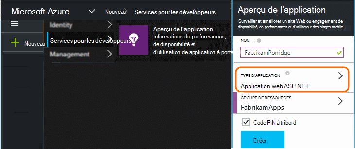
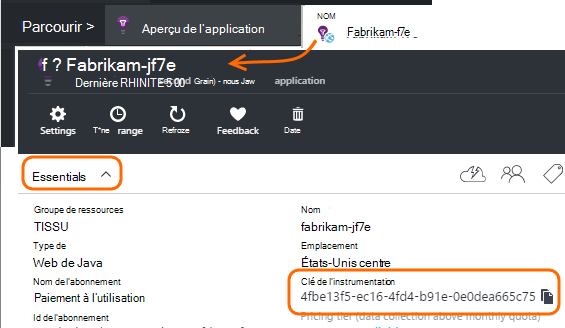

<properties 
    pageTitle="Séparer les perspectives de l’Application des ressources de développement, de test et de production" 
    description="Surveiller les performances et l’utilisation de votre application à différentes étapes du développement" 
    services="application-insights" 
    documentationCenter=""
    authors="alancameronwills" 
    manager="douge"/>

<tags 
    ms.service="application-insights" 
    ms.workload="tbd" 
    ms.tgt_pltfrm="ibiza" 
    ms.devlang="na" 
    ms.topic="article" 
    ms.date="05/04/2016" 
    ms.author="awills"/>

# Séparation des ressources de l’Application aperçu

Devant la télémétrie à partir de différents composants et versions de votre application être envoyé à différentes ressources de l’Application aperçu, ou combinée en une seule ? Cet article décrit au mieux méthodes et les techniques nécessaires.

Tout d’abord, nous allons comprendre la question. Les données reçues à partir de votre application sont stockées et traitées par les perspectives d’Application dans une *ressource*de Microsoft Azure. Chaque ressource est identifiée par une *clé d’instrumentation* (iKey). Dans votre application, la clé est fournie dans le SDK de perspectives d’Application afin qu’il puisse envoyer les données collectées à la ressource de droite. La clé peut être fournie dans le code ou dans ApplicationInsights.config. En modifiant la clé dans le Kit de développement, vous pouvez diriger les données vers différentes ressources. 

Dans un cas simple, lorsque vous créez le code d’une nouvelle application, vous créez également une nouvelle ressource dans l’Application aperçu. Dans Visual Studio, la boîte de dialogue *Nouveau projet* effectue cette opération pour vous.

S’il s’agit d’un site Web de volume élevé, il peut être déployé sur plus d’une instance de serveur.

Dans les scénarios plus complexes, vous avez un système qui est constitué de plusieurs composants - par exemple, un site web et un processeur principal. 

## Quand utiliser des iKeys distincts

Voici quelques indications générales :

* Où vous disposez d’une unité d’application pouvant être déployées de manière indépendante qui s’exécute sur un ensemble d’instances qui peuvent être mis à l’échelle vers le haut/bas indépendamment des autres composants, de serveur, puis vous devez généralement de mapper à une seule ressource - autrement dit, il aura une clé unique d’instrumentation (iKey).
* En revanche, raisons d’utiliser des iKeys distincts sont les suivantes :
 - Lire facilement des mesures distinctes à partir de composants distincts.
 - Séparer télémétrie de faible volume de gros volumes, afin que la limitation des quotas et l’échantillonnage sur un flux de données n’affectent pas l’autre.
 - Alertes distinctes, d’exportation et configurations d’élément de travail.
 - Répartir les [limites](app-insights-pricing.md#limits-summary) tels que quota de télémétrie, la limitation et web test count.
 - Le code en cours de développement et de test doit envoyer à un iKey distinct que l’horodatage de production.  

Un grand nombre d’expériences de portail de perspectives d’Application sont conçus avec ces directives à l’esprit. Par exemple, les serveurs afficher des segments sur l’instance de serveur, ce qui suppose que télémétrie sur un composant logique peut provenir de plusieurs instances de serveur.

## IKey unique

Où vous envoyez télémétrie à partir de plusieurs composants sur un seul iKey :

* Ajouter une propriété à toutes les télémétrie qui vous permet de segment et filtre sur l’identité du composant. L’ID de rôle est ajouté automatiquement à la télémétrie provenant des instances de rôle de serveur, mais dans d’autres cas que vous pouvez utiliser un [initialiseur de télémétrie](app-insights-api-filtering-sampling.md#add-properties) pour ajouter la propriété.
* Mettre à jour les kits de développement de perspectives Application dans les différents composants en même temps. Télémesure pour un iKey proviennent avec la même version du Kit de développement.

## IKeys distincte

Lorsque vous avez plusieurs iKeys pour les différents composants d’application :

* Créer un [tableau de bord](app-insights-dashboards.md) pour la vue de la télémétrie clé à partir de votre application logique, combinée à partir des composants d’application. Tableaux de bord peut être partagées, une vue système logique unique peut être utilisée par les différentes équipes.
* Organiser des [groupes de ressources](app-insights-resources-roles-access-control.md) au niveau de l’équipe. Autorisations d’accès sont affectées par le groupe de ressources, et ils incluent des autorisations pour configurer des alertes. 
* Utiliser les [modèles du Gestionnaire de ressources Azure et Powershell](app-insights-powershell.md) pour gérer des artefacts tels que les règles d’alerte et de tests web.

## IKeys distincts pour le développement/Test et de Production

Pour faciliter la modifier la clé automatiquement, lorsque votre application est libérée, figurant l’iKey dans le code, au lieu de ApplicationInsights.config.

### Clé de l’instrumentation dynamique

Définir la clé dans une méthode d’initialisation, par exemple global.aspx.cs dans un service ASP.NET :

*C#*

    protected void Application_Start()
    {
      Microsoft.ApplicationInsights.Extensibility.
        TelemetryConfiguration.Active.InstrumentationKey = 
          // - for example -
          WebConfigurationManager.AppSettings["ikey"];
      ...

Dans cet exemple, les ikeys pour les différentes ressources sont placés dans les différentes versions du fichier de configuration web. Le remplacement du fichier de configuration web - ce que vous pouvez faire dans le cadre de la version de script - inversera la ressource cible.

### Pages Web

L’iKey est également utilisé dans les pages de votre application web, dans le [script que vous avez obtenu à partir de la blade de démarrage rapide](app-insights-javascript.md). Au lieu de les coder il littéralement dans le script, vous devez le générer à partir de l’état du serveur. Par exemple, dans une application ASP.NET :

*JavaScript dans Razor*

    <script type="text/javascript">
    // Standard Application Insights web page script:
    var appInsights = window.appInsights || function(config){ ...
    // Modify this part:
    }({instrumentationKey:  
      // Generate from server property:
      "@Microsoft.ApplicationInsights.Extensibility.
         TelemetryConfiguration.Active.InstrumentationKey"
    }) // ...

## Création d’une ressource d’Application idées supplémentaire
  
Si vous souhaitez séparer de télémétrie pour les différents composants d’application ou pour différents tampons (test/dev/production) du même composant, vous devrez créer une nouvelle ressource de perspectives de l’Application.

Dans la [portal.azure.com](https://portal.azure.com), ajouter une ressource de perspectives de l’Application :

* **Type d’application** a une incidence sur ce que vous voyez sur la lame de présentation et les propriétés disponibles dans [l’Explorateur de métriques](app-insights-metrics-explorer.md). Si vous ne voyez pas votre type d’application, choisissez un des types de web pour les pages web.
* **Groupe de ressources** est pratique pour la gestion des propriétés de [contrôle d’accès](app-insights-resources-roles-access-control.md). Vous pouvez utiliser des groupes de ressources distincts pour le développement, de test et de production.
* **L’abonnement** est le compte de votre paiement dans Azure.
* **L’emplacement** est où nous conservons vos données. Actuellement il ne peut pas être modifié. 
* **Ajouter au tableau de bord** place une mosaïque d’accès rapide pour votre ressource sur votre page d’accueil d’Azure. 

Création de la ressource prend quelques secondes. Vous verrez une alerte lorsqu’il est terminé.

(Vous pouvez écrire un [script PowerShell](app-insights-powershell-script-create-resource.md) pour créer une ressource automatiquement.)

## L’obtention de la clé de l’instrumentation

La clé de l’instrumentation identifie la ressource que vous avez créé. 

Vous avez besoin des touches instrumentation de toutes les ressources auxquelles votre application envoie des données.

 
